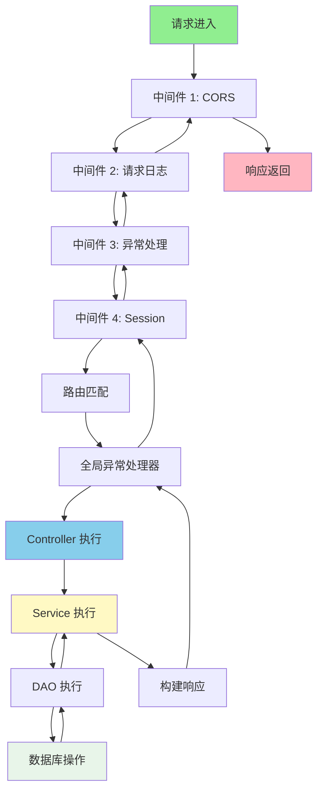
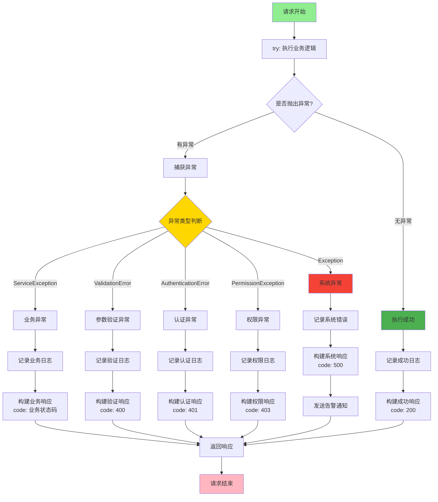
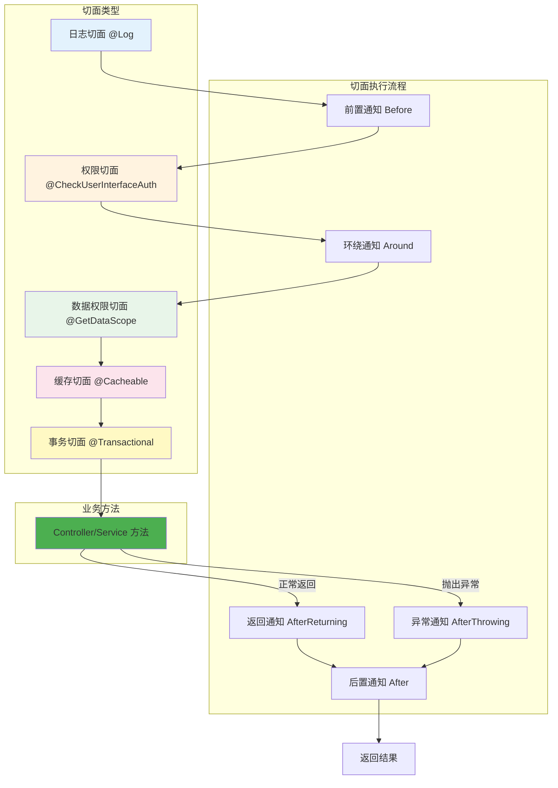
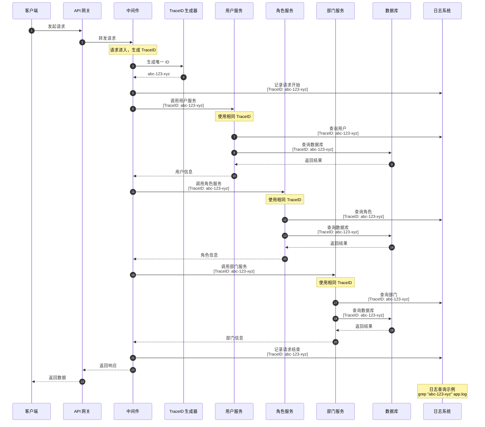
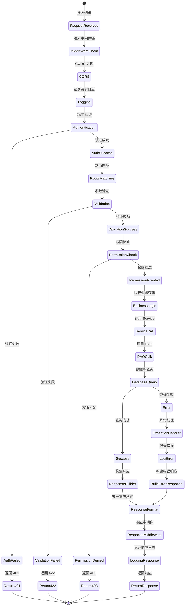
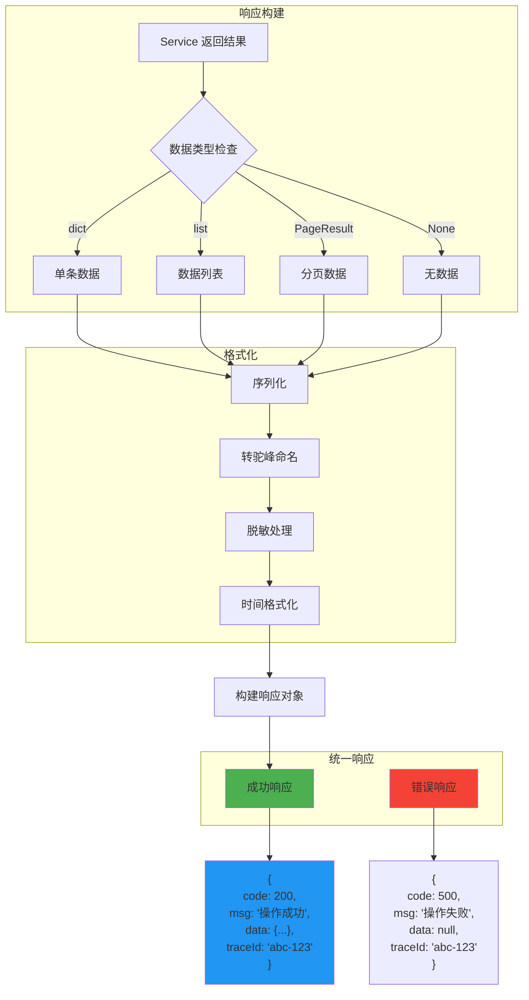

# 请求生命周期详解

## 1. 完整请求生命周期

```mermaid
sequenceDiagram
    autonumber
    participant Browser as 🌐 浏览器
    participant Frontend as 📱 Vue3 前端
    participant Vite as ⚡ Vite Dev Server
    participant Nginx as 🌐 Nginx
    participant Uvicorn as ⚡ Uvicorn
    participant FastAPI as 🚀 FastAPI
    participant Middleware as 🔧 中间件
    participant CORS as 🌍 CORS
    participant Exception as ⚠️ 异常处理
    participant Log as 📝 日志切面
    participant Auth as 🔐 认证
    participant Controller as 🎮 Controller
    participant Service as 🔧 Service
    participant DAO as 💾 DAO
    participant DB as 🗄️ 数据库
    participant Redis as 🔴 Redis
    participant Validator as ✅ 验证器
    participant Response as 📤 响应处理

    Note over Browser,DB: 请求发起阶段
    Browser->>Frontend: 用户操作（点击、输入等）
    Frontend->>Frontend: 拦截器处理
    Frontend->>Frontend: 添加 Token
    Frontend->>Vite: Axios 请求

    Note over Vite,Nginx: 开发环境代理
    Vite->>Nginx: /dev-api/api/*
    Nginx->>Uvicorn: 转发到后端

    Note over Uvicorn,Middleware: 后端接收阶段
    Uvicorn->>FastAPI: 接收请求
    FastAPI->>Middleware: 中间件链

    Middleware->>CORS: CORS 处理
    CORS-->>Middleware: 通过

    Middleware->>Log: 请求日志开始
    Log->>Log: 生成 TraceID
    Log->>Log: 记录请求信息

    Log->>Auth: JWT 认证
    Auth->>Auth: 验证 Token
    Auth-->>Log: current_user

    Note over Middleware,Controller: 路由匹配阶段
    Middleware->>Controller: 路由到 Controller

    Note over Controller,Validator: 参数验证阶段
    Controller->>Validator: Pydantic 验证
    Validator->>Validator: 类型检查
    Validator->>Validator: 格式验证
    Validator->>Validator: 业务规则验证

    alt 验证失败
        Validator-->>Exception: 422 错误
        Exception->>Response: 构建错误响应
        Response-->>Middleware: 返回错误
        Middleware-->>Uvicorn: HTTP 422
        Uvicorn-->>Nginx: 错误响应
        Nginx-->>Vite: 错误响应
        Vite-->>Frontend: 错误响应
        Frontend-->>Browser: 显示错误
    end

    Validator-->>Controller: 验证通过

    Note over Controller,Service: 业务逻辑阶段
    Controller->>Service: 调用 Service

    Service->>Redis: 查询缓存
    alt 缓存命中
        Redis-->>Service: 返回缓存数据
        Service-->>Controller: 直接返回
    end

    Service->>DAO: 查询数据库
    DAO->>DB: SQL 查询
    DB-->>DAO: 查询结果
    DAO-->>Service: 返回数据

    Service->>Service: 业务处理
    Service->>Redis: 更新缓存
    Service-->>Controller: 返回结果

    Controller->>Controller: 处理响应
    Controller-->>Log: 返回结果

    Note over Log,Response: 响应处理阶段
    Log->>Log: 记录响应日志
    Log->>Log: 计算耗时
    Log-->>Response: 完成日志

    Response->>Response: 统一响应格式
    Response->>Response: {
        code: 200,
        msg: "操作成功",
        data: {...}
    }

    Response-->>Middleware: 返回响应
    Middleware-->>Uvicorn: HTTP 200
    Uvicorn-->>Nginx: JSON 响应
    Nginx-->>Vite: JSON 响应
    Vite-->>Frontend: Axios 响应
    Frontend->>Frontend: 响应拦截器
    Frontend-->>Browser: 显示数据
```

## 2. FastAPI 中间件执行顺序



## 3. 异常处理流程



## 4. AOP 切面执行流程



## 5. 链路追踪流程



## 6. 请求状态流转



## 7. 并发请求处理

```mermaid
sequenceDiagram
    autonumber
    participant Client as 客户端
    participant Server as 服务器
    participant ThreadPool as 线程池
    worker1 as Worker 1
    worker2 as Worker 2
    worker3 as Worker 3
    participant DB as 数据库连接池
    participant Redis as Redis 连接

    Client->>Server: 并发 3 个请求

    par 请求 1
        Server->>ThreadPool: 分配 Worker 1
        ThreadPool->>worker1: 处理请求 1
        worker1->>DB: 获取连接
        worker1->>Redis: 获取连接
        worker1->>worker1: 执行业务
        worker1->>DB: 释放连接
        worker1->>Redis: 释放连接
        worker1-->>Client: 响应 1
    and 请求 2
        Server->>ThreadPool: 分配 Worker 2
        ThreadPool->>worker2: 处理请求 2
        worker2->>DB: 获取连接
        worker2->>Redis: 获取连接
        worker2->>worker2: 执行业务
        worker2->>DB: 释放连接
        worker2->>Redis: 释放连接
        worker2-->>Client: 响应 2
    and 请求 3
        Server->>ThreadPool: 分配 Worker 3
        ThreadPool->>worker3: 处理请求 3
        worker3->>DB: 获取连接
        worker3->>Redis: 获取连接
        worker3->>worker3: 执行业务
        worker3->>DB: 释放连接
        worker3->>Redis: 释放连接
        worker3-->>Client: 响应 3
    end
```

## 8. 响应构建流程



## 9. 请求生命周期时间轴

```mermaid
gantt
    title 请求处理时间轴
    dateFormat X
    axisFormat %L ms

    section 客户端
    发起请求           :0, 5
    处理响应           :195, 200

    section 网络传输
    网络延迟           :5, 15

    section 后端处理
    中间件处理         :15, 25
    路由匹配           :25, 30
    参数验证           :30, 40
    权限检查           :40, 50
    业务逻辑           :50, 150
    响应构建           :150, 160

    section 数据访问
    缓存查询           :50, 60
    数据库查询         :60, 140

    section 网络传输
    网络返回           :160, 195
```



## 10. 关键时间节点

| 阶段 | 耗时 | 说明 |
|------|------|------|
| 网络延迟 | 10ms | 客户端到服务器 |
| 中间件处理 | 10ms | CORS、日志、认证 |
| 路由匹配 | 5ms | URL 路由查找 |
| 参数验证 | 10ms | Pydantic 验证 |
| 权限检查 | 10ms | 权限验证 |
| 缓存查询 | 10ms | Redis 查询 |
| 数据库查询 | 80ms | SQL 执行 |
| 业务逻辑 | 40ms | 数据处理 |
| 响应构建 | 10ms | 序列化、格式化 |
| 网络返回 | 35ms | 服务器到客户端 |
| **总计** | **~200ms** | 端到端响应时间 |

## 关键代码位置

| 功能 | 文件路径 |
|------|---------|
| 中间件配置 | `server.py` - app.add_middleware |
| 全局异常处理 | `common/handle/GlobalExceptionHandler.py` |
| 日志切面 | `common/expend/Log.py` |
| 权限切面 | `common/expend/CheckUserInterfaceAuth.py` |
| 统一响应 | `common/response/response.py` |
| TraceID 生成 | `common/expend/TraceID.py` |
| 请求日志 | `common/log.py` |
