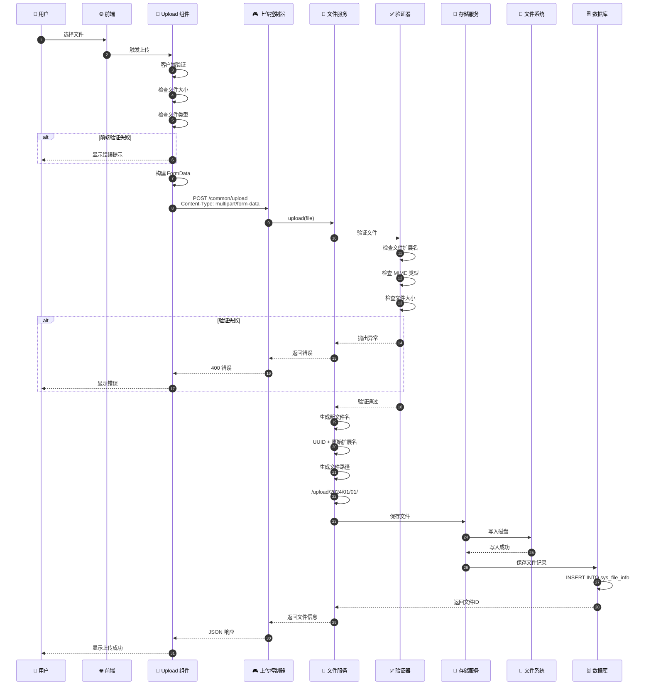
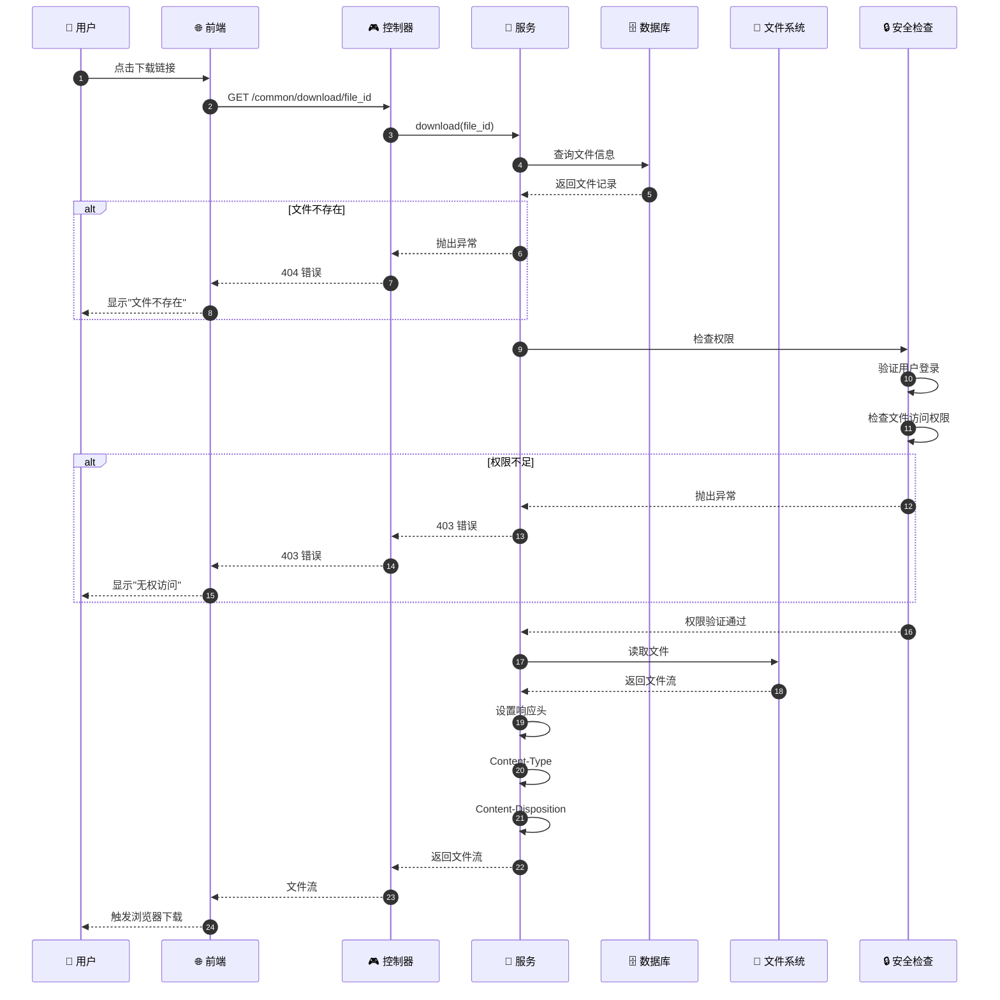
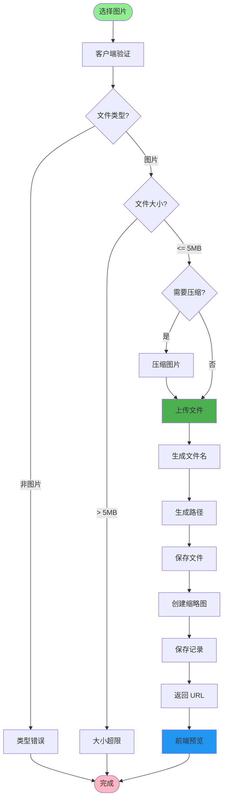
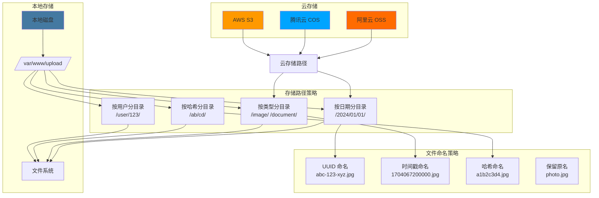
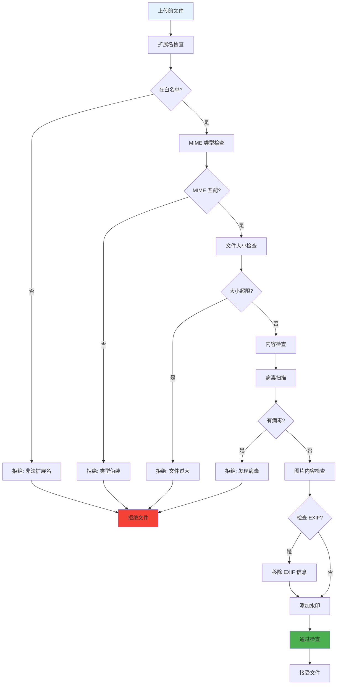
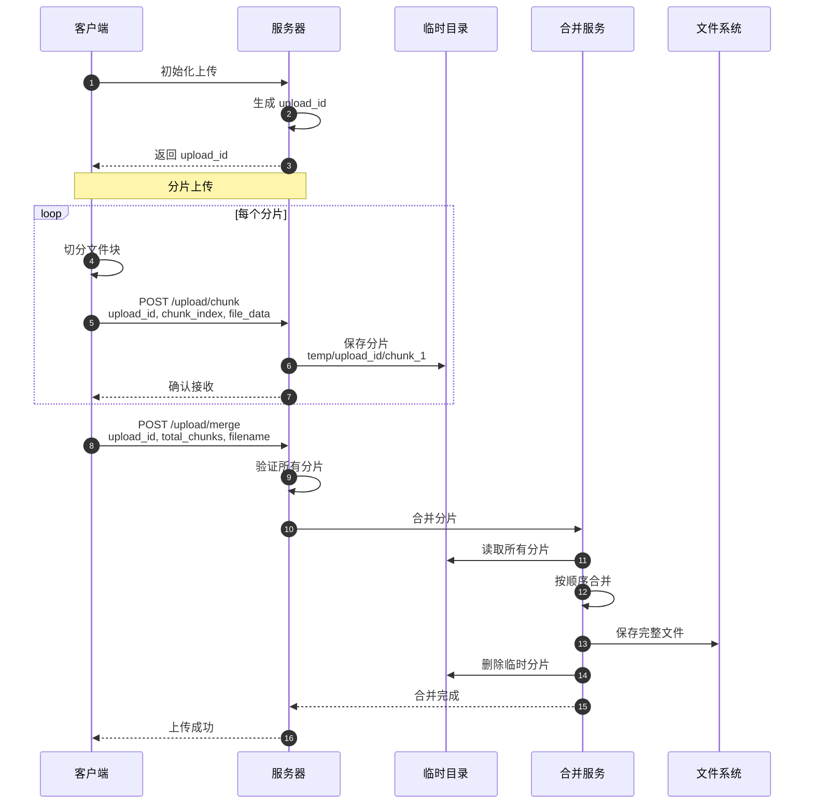
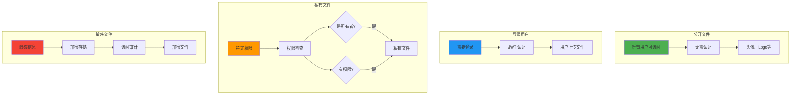
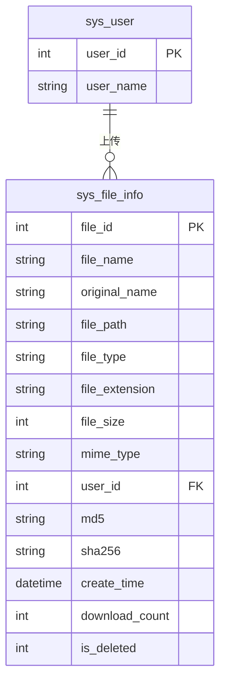
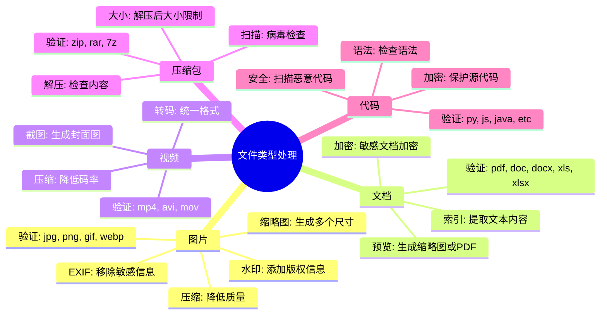
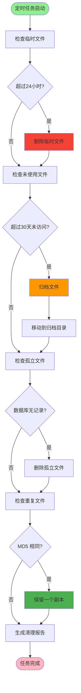

# 文件上传下载流程详解

## 1. 文件上传完整流程



## 2. 文件下载流程



## 3. 图片上传与预览



## 4. 文件存储策略



## 5. 文件安全检查



## 6. 分片上传流程



## 7. 文件权限控制



## 8. 文件记录数据库设计



## 9. 常见文件类型处理



## 10. 文件清理策略



## 关键代码位置

| 功能 | 文件路径 |
|------|---------|
| 文件上传控制器 | `module_admin/controller/common_controller.py` |
| 文件服务 | `module_admin/service/file_service.py` |
| 文件信息模型 | `module_admin/entity/do/file_info_do.py` |
| 文件验证 | `common/utils/file_validator.py` |
| 存储配置 | `config/file_config.py` |
| 临时文件清理 | `module_admin/task/file_cleanup_task.py` |

## 文件上传配置

```python
# 支持的文件类型
ALLOWED_EXTENSIONS = {
    'image': ['.jpg', '.jpeg', '.png', '.gif', '.webp'],
    'document': ['.pdf', '.doc', '.docx', '.xls', '.xlsx', '.ppt', '.pptx'],
    'video': ['.mp4', '.avi', '.mov', '.wmv'],
    'archive': ['.zip', '.rar', '.7z']
}

# 文件大小限制（字节）
MAX_FILE_SIZE = {
    'image': 5 * 1024 * 1024,      # 5MB
    'document': 10 * 1024 * 1024,  # 10MB
    'video': 100 * 1024 * 1024,    # 100MB
    'archive': 50 * 1024 * 1024     # 50MB
}

# 存储路径配置
UPLOAD_PATH = '/var/www/upload/'
TEMP_PATH = '/var/www/temp/'
ARCHIVE_PATH = '/var/www/archive/'
```
