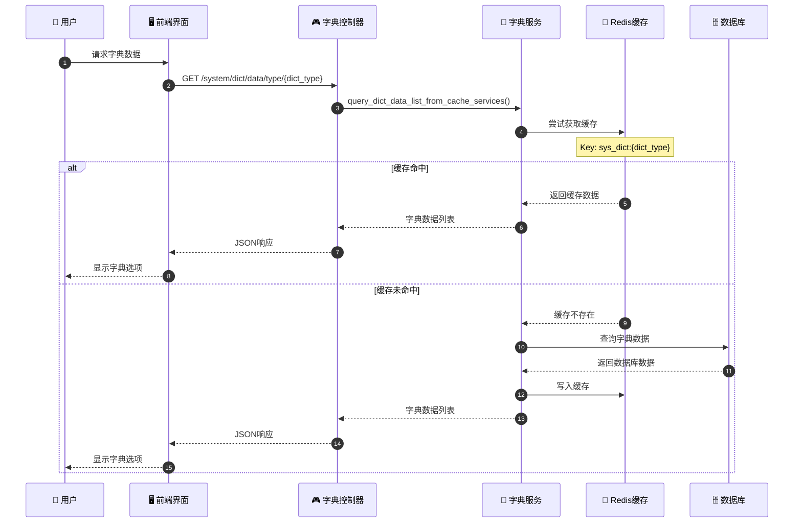
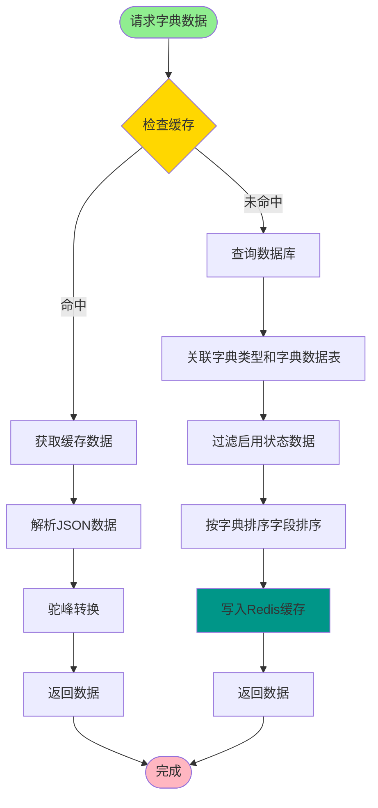
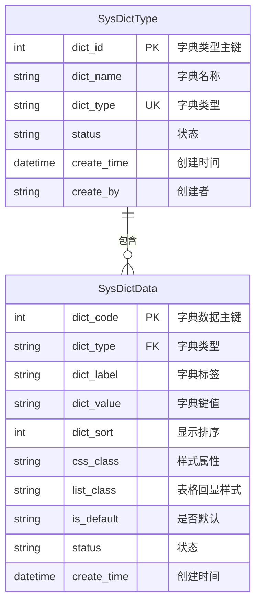
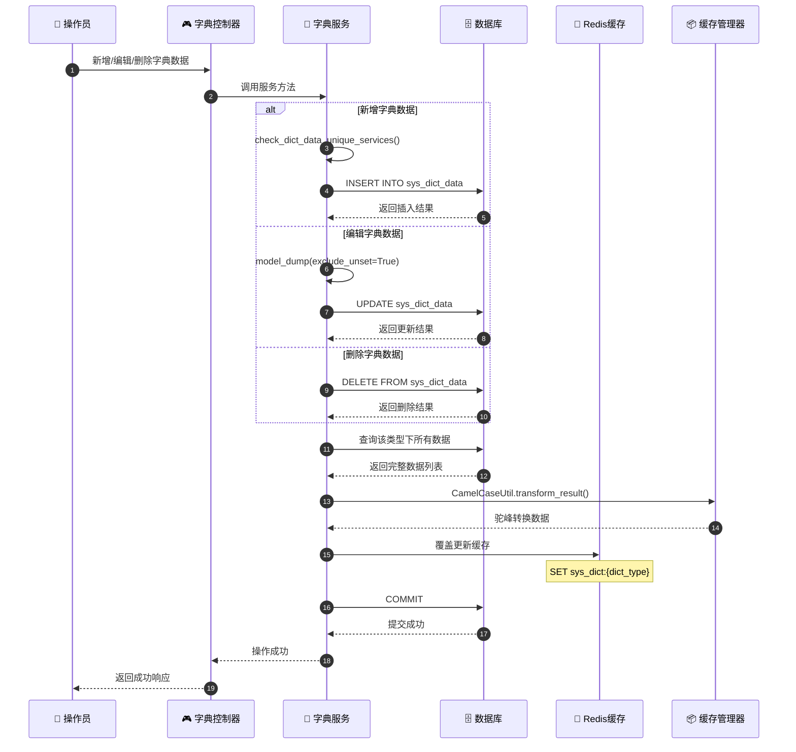
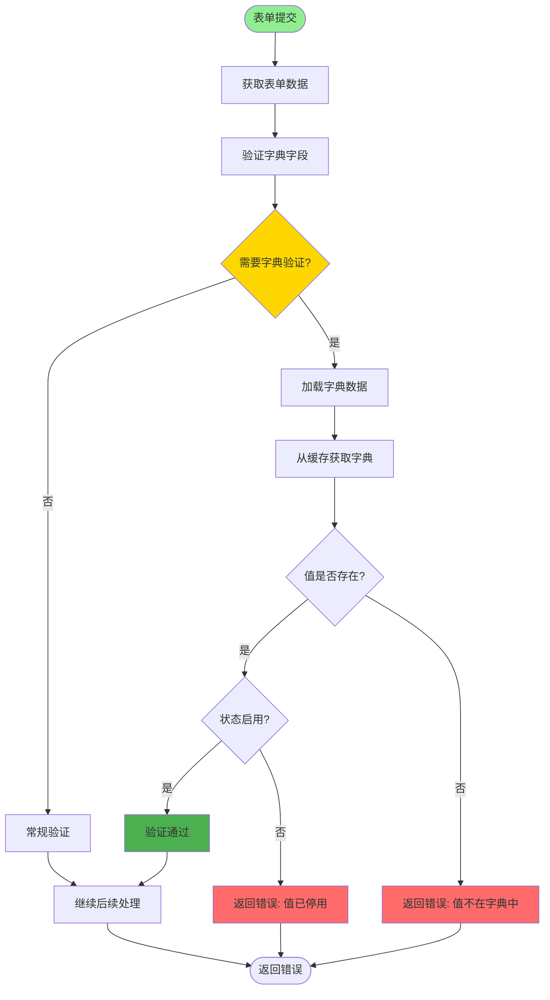
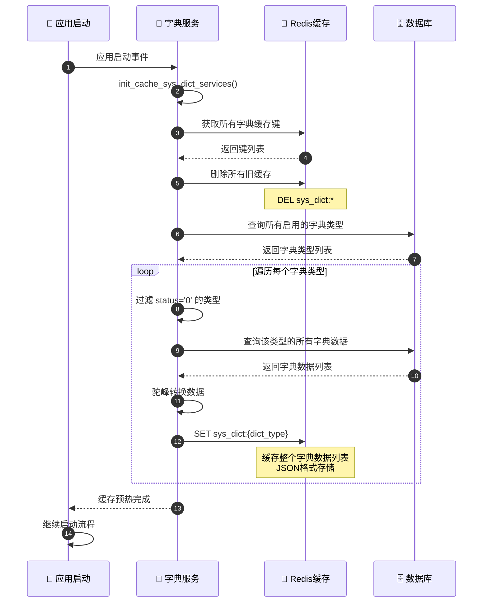
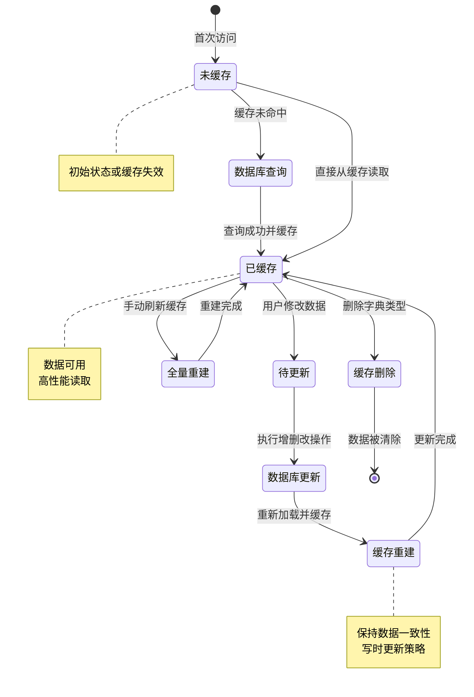
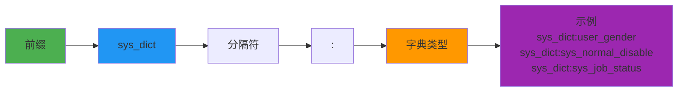

# 字典管理详解

## 1. 字典数据加载完整流程时序图



## 2. 字典缓存读写流程



## 3. 字典类型与数据关系 ER 图



## 4. 前端字典组件渲染流程

```mermaid
flowchart TD
    Start([页面加载]) --> RequestDict[请求字典数据]
    RequestDict --> API[调用 /system/dict/data/type/{dict_type}]

    API --> CacheHit{缓存命中?}

    CacheHit -->|是| GetCache[获取缓存数据]
    CacheHit -->|否| QueryDB[查询数据库并缓存]

    GetCache --> ParseData[解析字典数据]
    QueryDB --> ParseData

    ParseData --> RenderOptions[渲染下拉选项]
    RenderOptions --> CheckType{组件类型?}

    CheckType -->|Select| Select[下拉选择器]
    CheckType -->|Radio| Radio[单选按钮]
    CheckType -->|Checkbox| Checkbox[复选框]

    Select --> Display[显示组件]
    Radio --> Display
    Checkbox --> Display

    Display --> UserSelect[用户选择]
    UserSelect --> GetValue[获取选中值]
    GetValue --> Submit[提交表单]

    style Start fill:#90EE90
    style Submit fill:#4CAF50
    style CacheHit fill:#FFD700
```

## 5. 字典数据更新同步机制



## 6. 字典在表单验证中的使用



## 7. 字典缓存预热与重建



## 8. 字典管理数据流转状态图



## 关键代码位置

| 功能 | 文件路径 |
|------|---------|
| 字典控制器 | `module_admin/controller/dict_controller.py` |
| 字典服务 | `module_admin/service/dict_service.py` |
| 字典DAO | `module_admin/dao/dict_dao.py` |
| 字典模型 | `module_admin/entity/do/dict_do.py` |
| 字典VO模型 | `module_admin/entity/vo/dict_vo.py` |
| Redis配置枚举 | `config/enums.py` (RedisInitKeyConfig) |

## 缓存Key设计规范



## 字典数据结构示例

```json
// sys_dict:user_gender 的缓存内容
[
  {
    "dictCode": 1,
    "dictType": "user_gender",
    "dictLabel": "男",
    "dictValue": "0",
    "dictSort": 1,
    "cssClass": "",
    "listClass": "default",
    "isDefault": "Y",
    "status": "0"
  },
  {
    "dictCode": 2,
    "dictType": "user_gender",
    "dictLabel": "女",
    "dictValue": "1",
    "dictSort": 2,
    "cssClass": "",
    "listClass": "",
    "isDefault": "N",
    "status": "0"
  }
]
```
