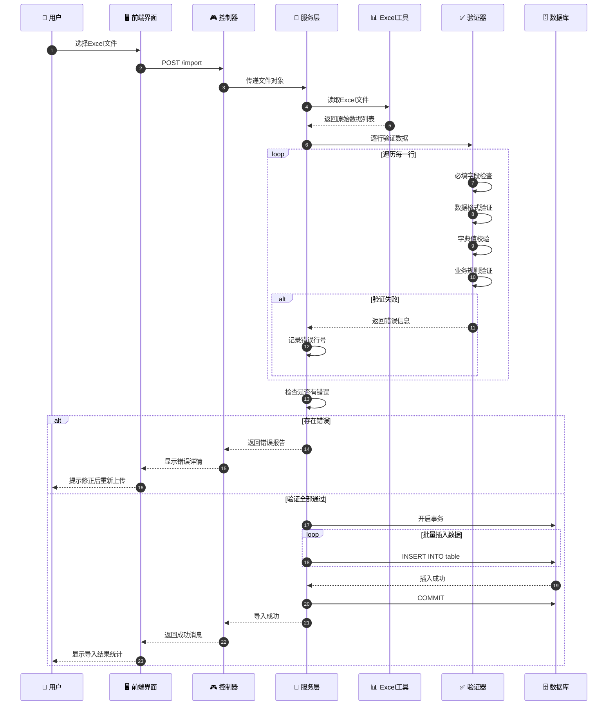
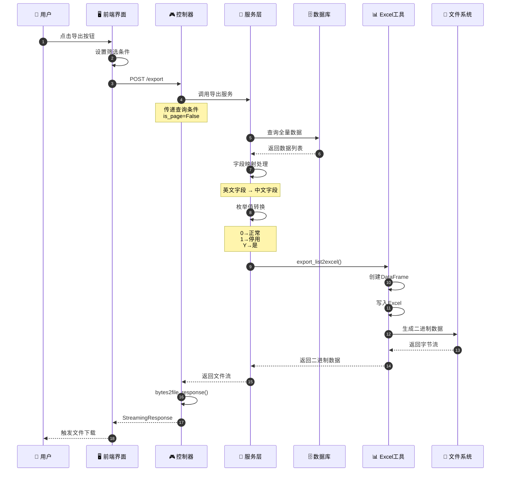
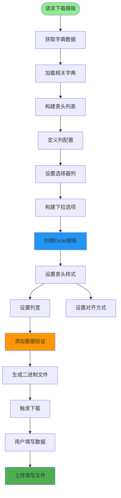
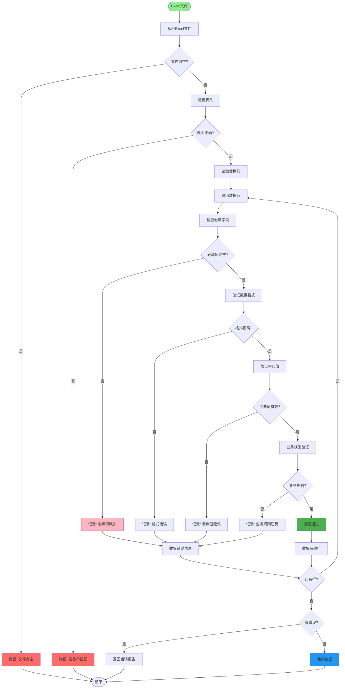
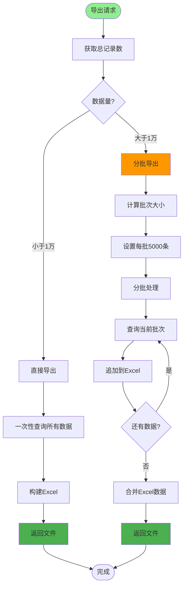
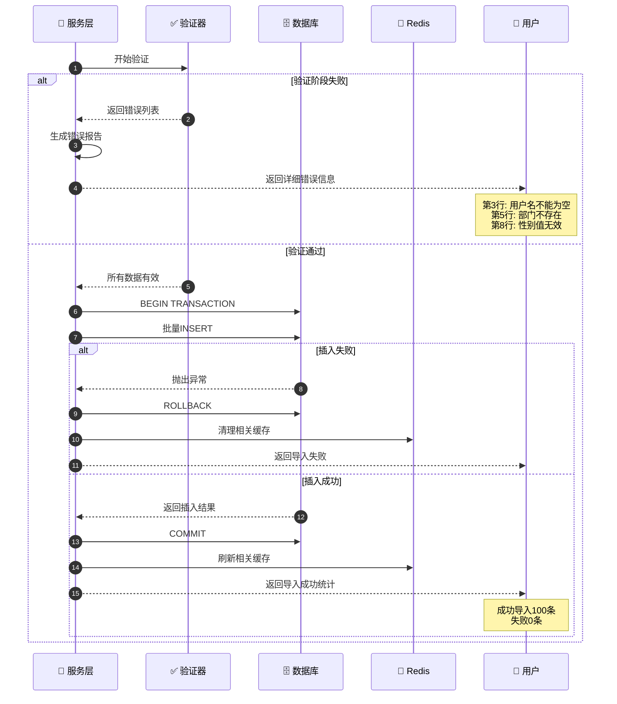
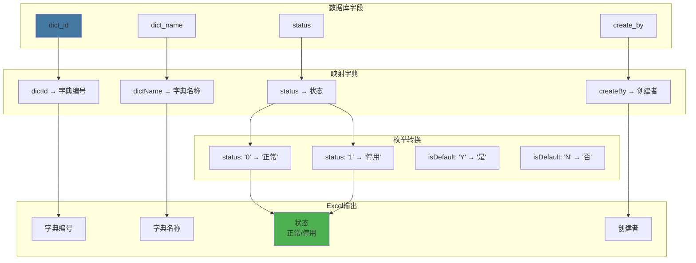
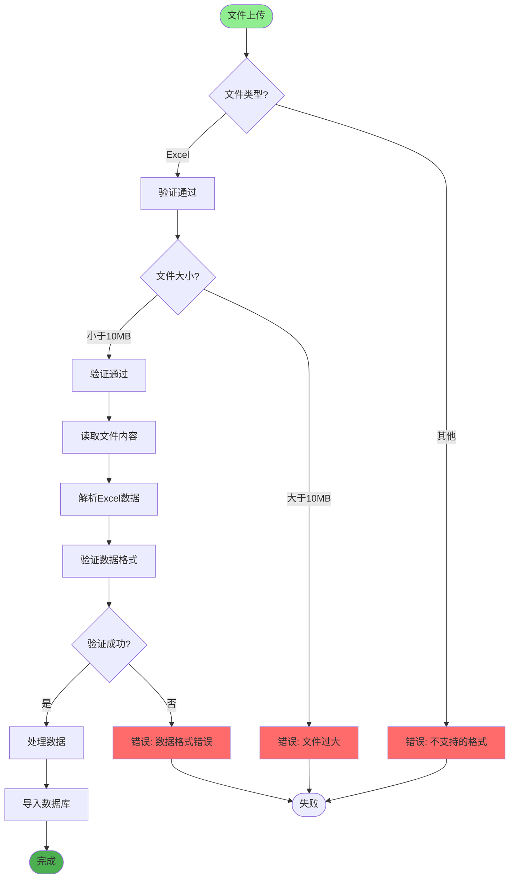
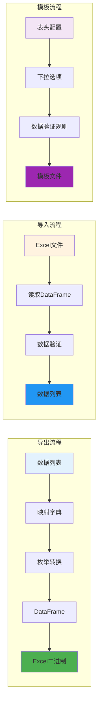
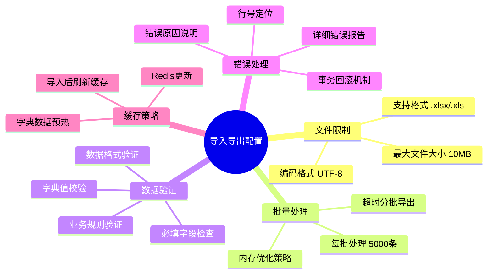

# 数据导入导出详解

## 1. Excel 导入完整流程时序图

## 2. Excel 导出完整流程时序图

## 3. 数据模板生成流程

## 4. 导入数据验证链

## 5. 大数据量分批导出策略

## 6. 导入错误处理与回滚

## 7. 字段映射与枚举转换

## 8. Excel 文件存储策略

## 9. Excel 工具类使用示例

## 关键代码位置

| 功能 | 文件路径 |
|------|---------|
| Excel工具类 | `utils/excel_util.py` |
| 文件控制器 | `module_admin/controller/file_controller.py` |
| 文件服务 | `module_admin/service/file_service.py` |
| 用户控制器 | `module_admin/controller/user_controller.py` |
| 字典控制器 | `module_admin/controller/dict_controller.py` |

## 数据导入导出配置

