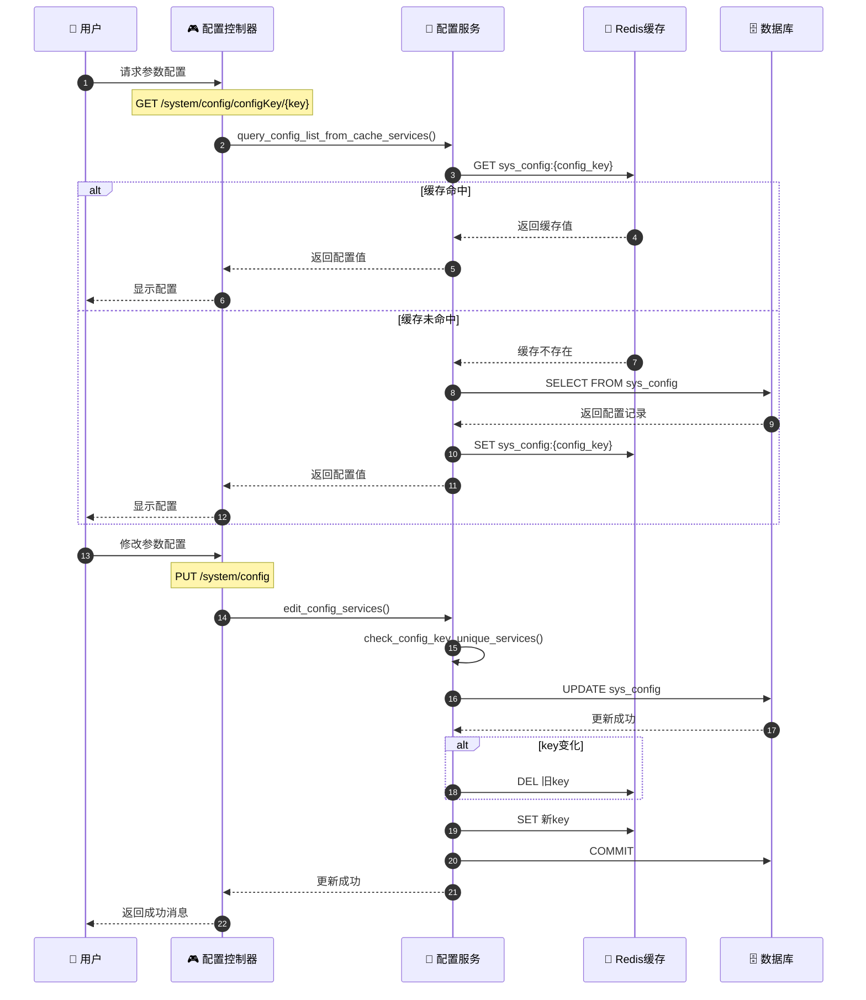
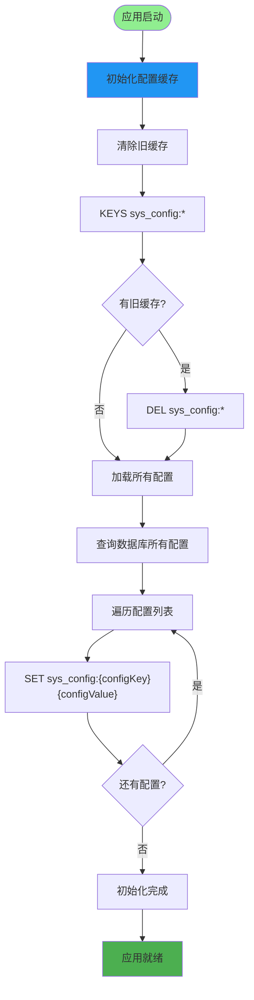
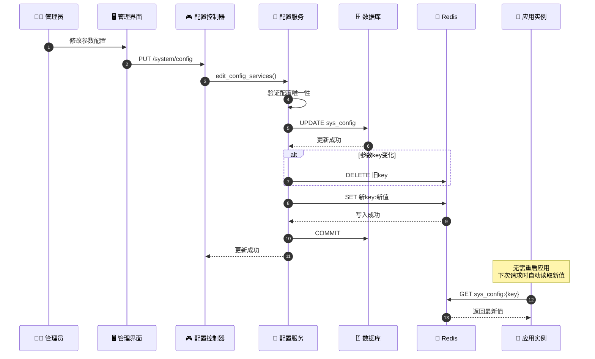
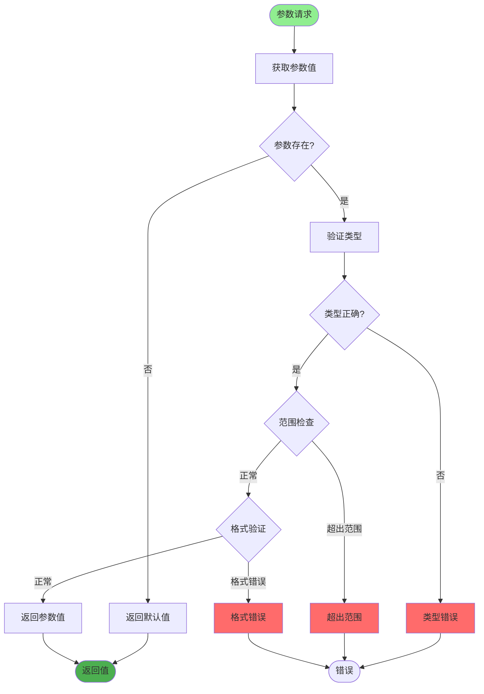
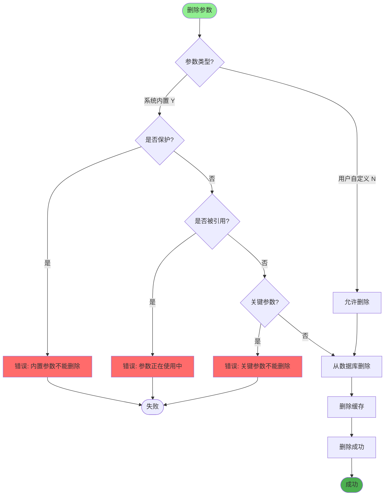
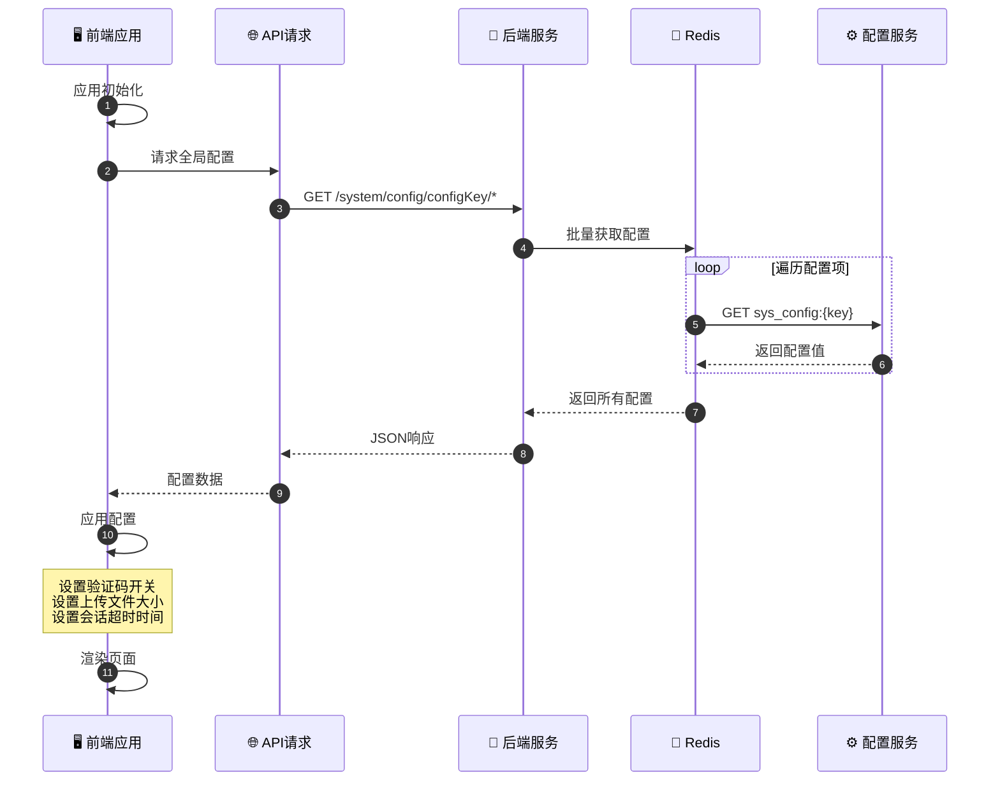
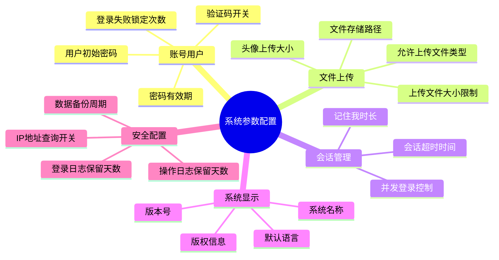
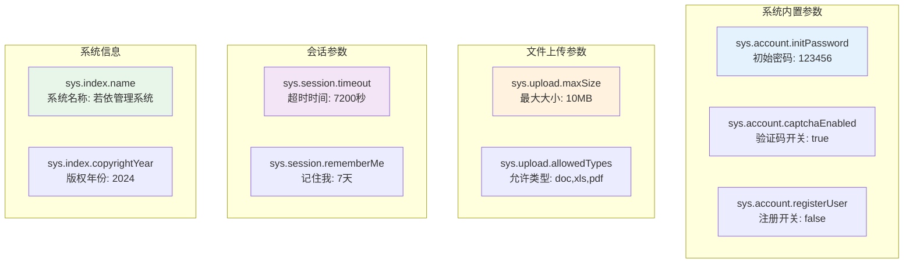
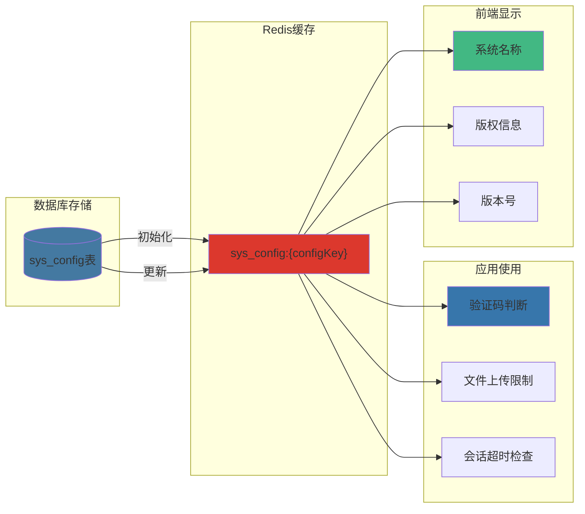
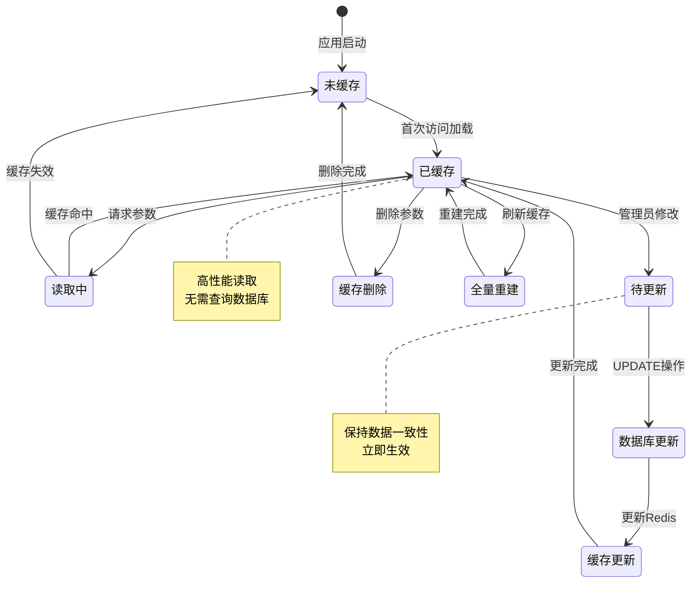

# 系统参数配置详解

## 1. 参数配置读写完整流程

## 2. 参数缓存加载与更新

## 3. 参数热更新机制

## 4. 参数验证与默认值处理

## 5. 内置参数保护机制

## 6. 前端动态配置加载

## 7. 系统参数配置分类

## 关键代码位置

| 功能 | 文件路径 |
|------|---------|
| 配置控制器 | `module_admin/controller/config_controller.py` |
| 配置服务 | `module_admin/service/config_service.py` |
| 配置DAO | `module_admin/dao/config_dao.py` |
| 配置模型 | `module_admin/entity/do/config_do.py` |
| 配置VO模型 | `module_admin/entity/vo/config_vo.py` |
| Redis配置枚举 | `config/enums.py` (RedisInitKeyConfig.SYS_CONFIG) |

## 常用系统参数示例

## 参数配置数据流转

## 参数配置缓存策略

