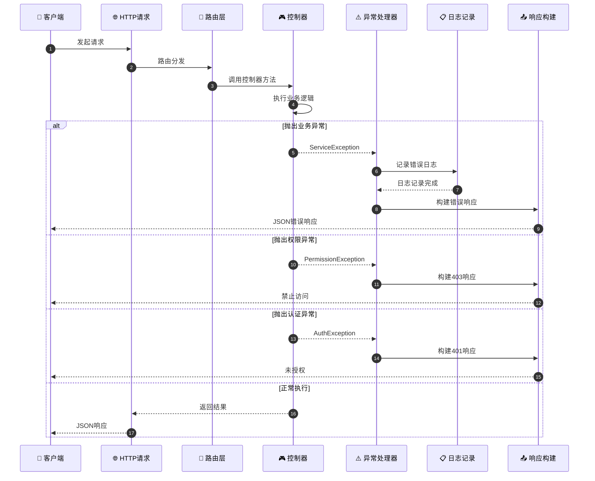
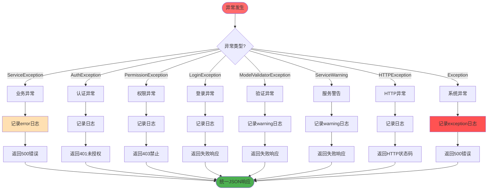
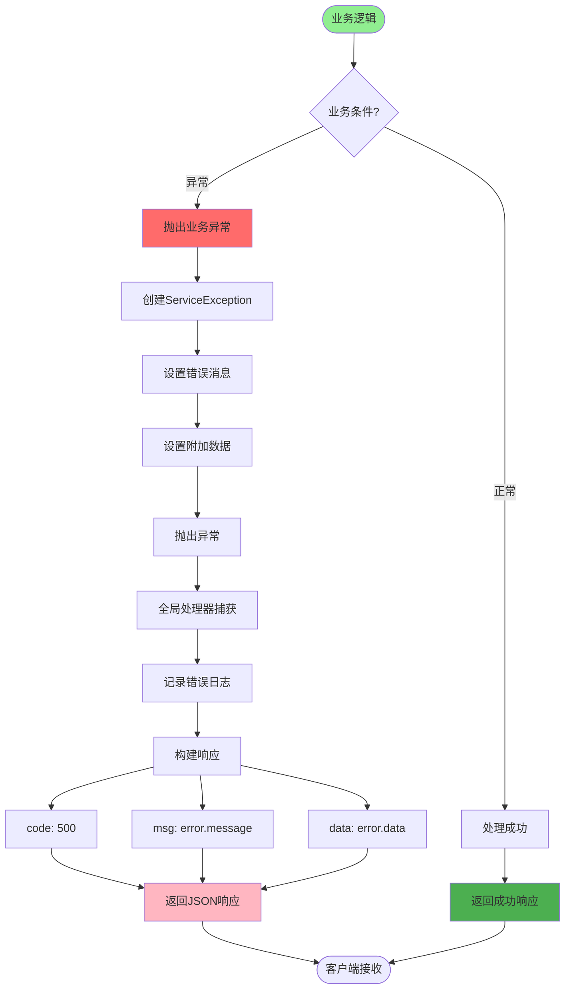
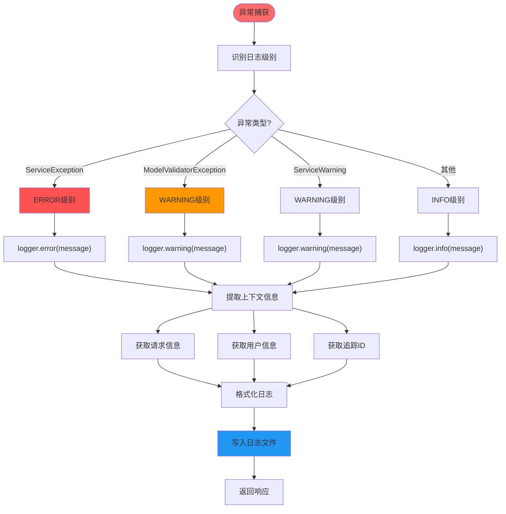
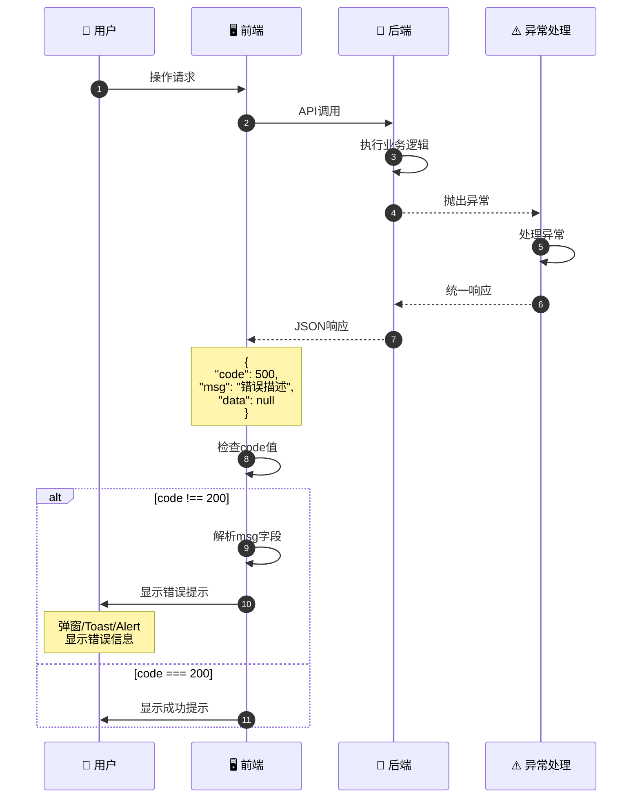
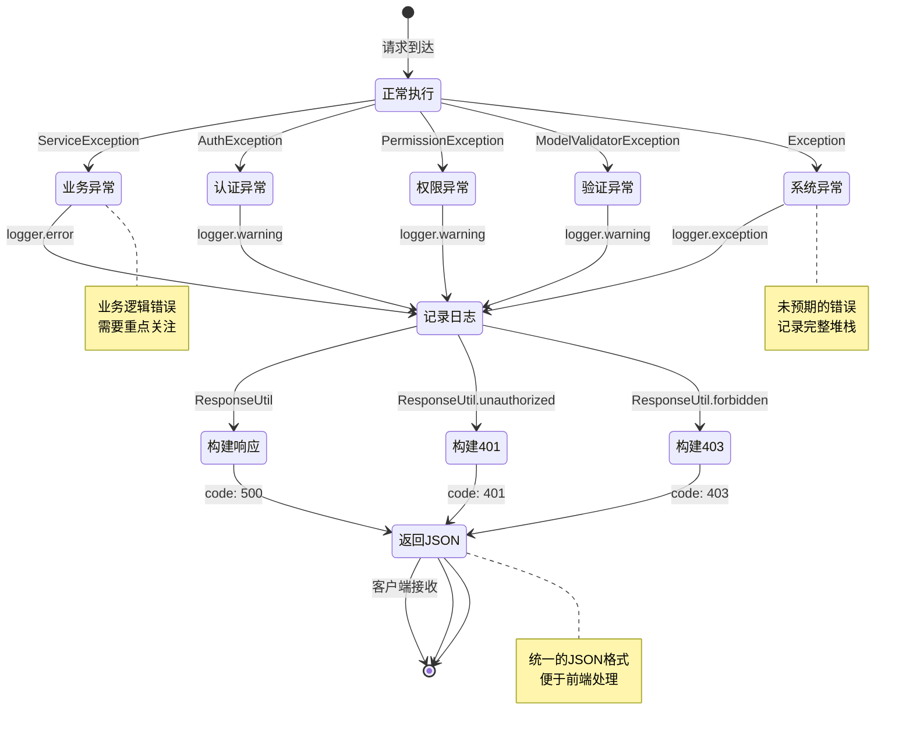
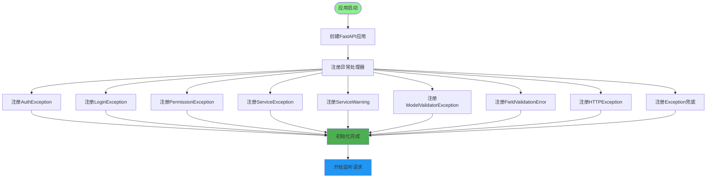
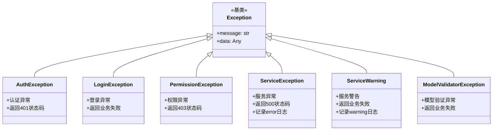
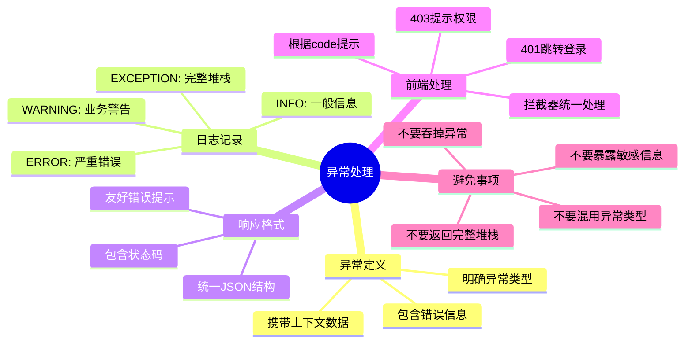
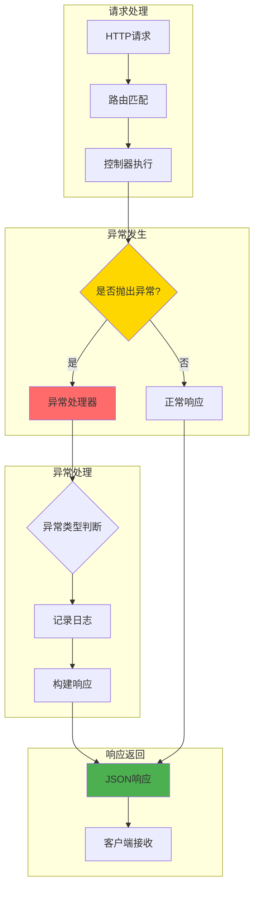

# 全局异常处理详解

## 1. 全局异常捕获机制流程

## 2. 异常分类与处理策略

## 3. 自定义业务异常处理

## 4. 异常日志记录流程

## 5. 前端错误提示渲染

## 6. 异常响应状态流转图

## 7. 异常处理器注册流程

## 异常类型继承关系

## 异常处理最佳实践

## 关键代码位置

| 功能 | 文件路径 |
|------|---------|
| 异常定义 | `exceptions/exception.py` |
| 异常处理 | `exceptions/handle.py` |
| 响应工具 | `utils/response_util.py` |
| 日志工具 | `utils/log_util.py` |
| 应用启动 | `server.py` |

## 异常处理流程图

