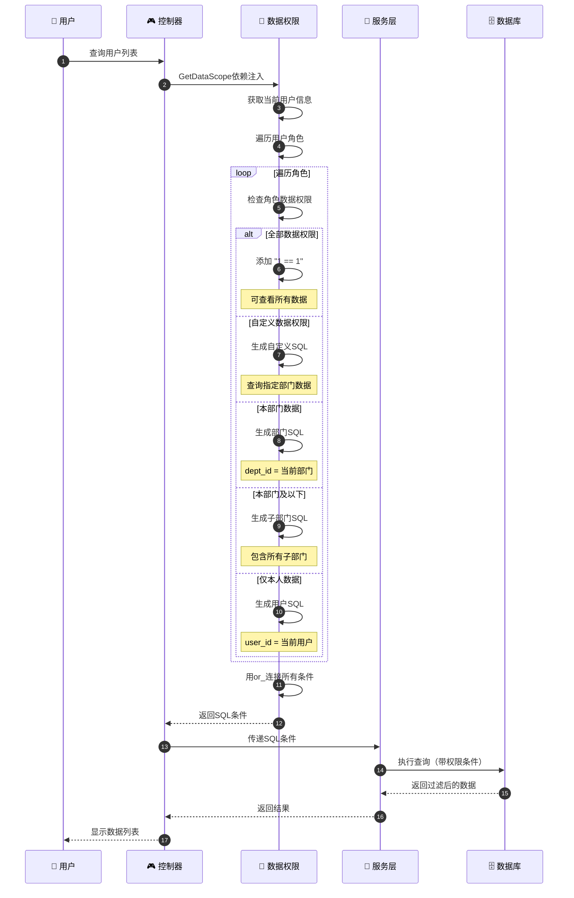
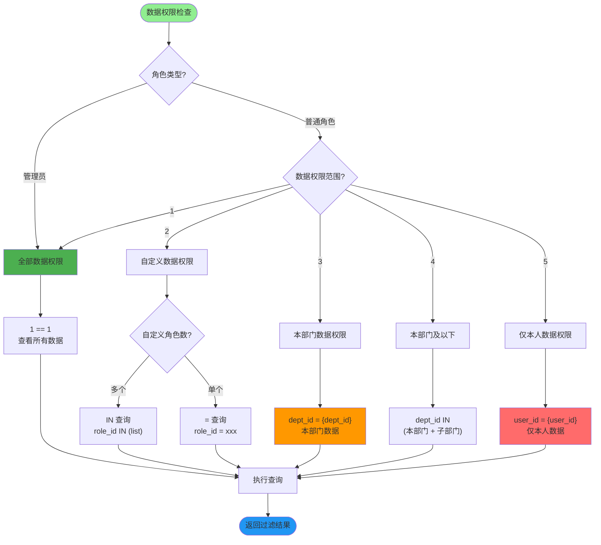
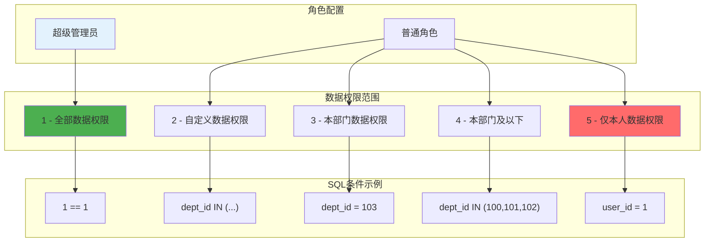
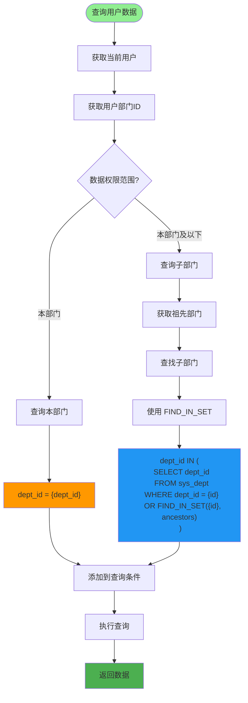
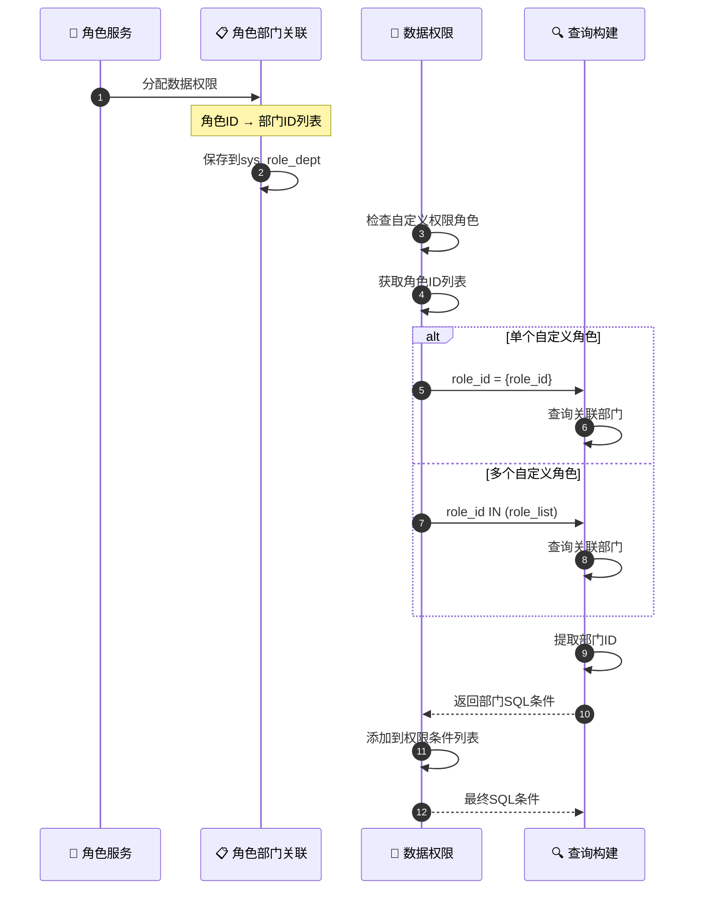
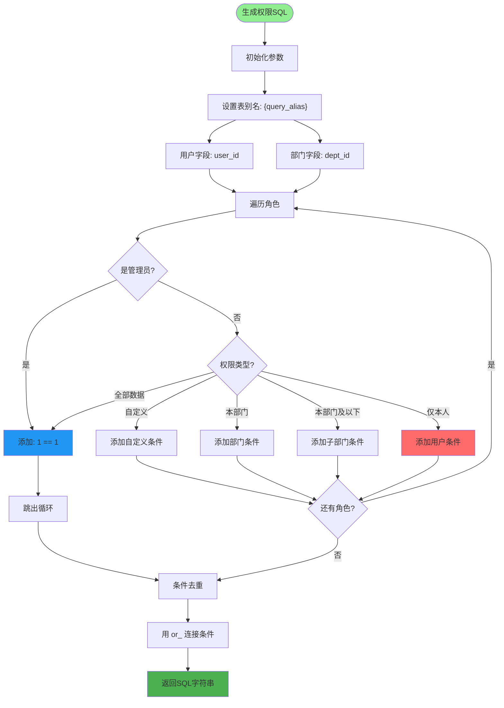
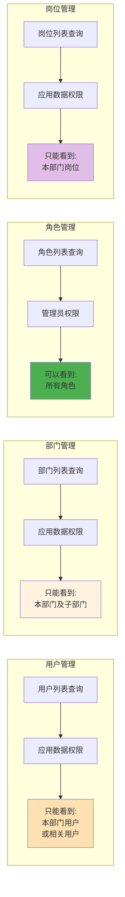
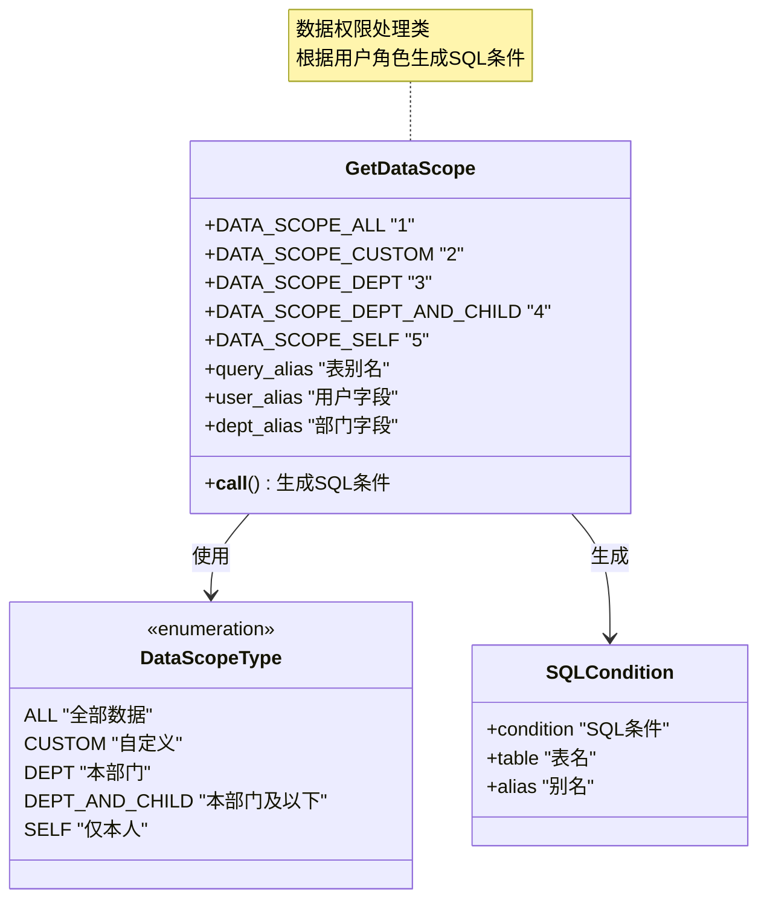
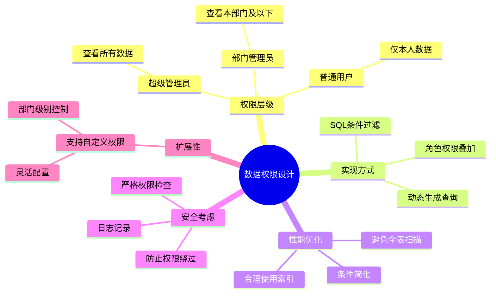

# 数据权限详解

## 1. 数据权限完整流程

## 2. 数据权限范围类型

## 3. 角色数据权限配置

## 4. 部门树形结构查询

## 5. 自定义数据权限实现

## 6. 数据权限SQL生成

## 7. 数据权限应用示例

## 8. 数据权限常量定义

## 关键代码位置

| 功能 | 文件路径 |
|------|---------|
| 数据权限切面 | `module_admin/aspect/data_scope.py` |
| 角色服务 | `module_admin/service/role_service.py` |
| 角色DAO | `module_admin/dao/role_dao.py` |
| 部门服务 | `module_admin/service/dept_service.py` |
| 部门DAO | `module_admin/dao/dept_dao.py` |

## 数据权限设计原则

