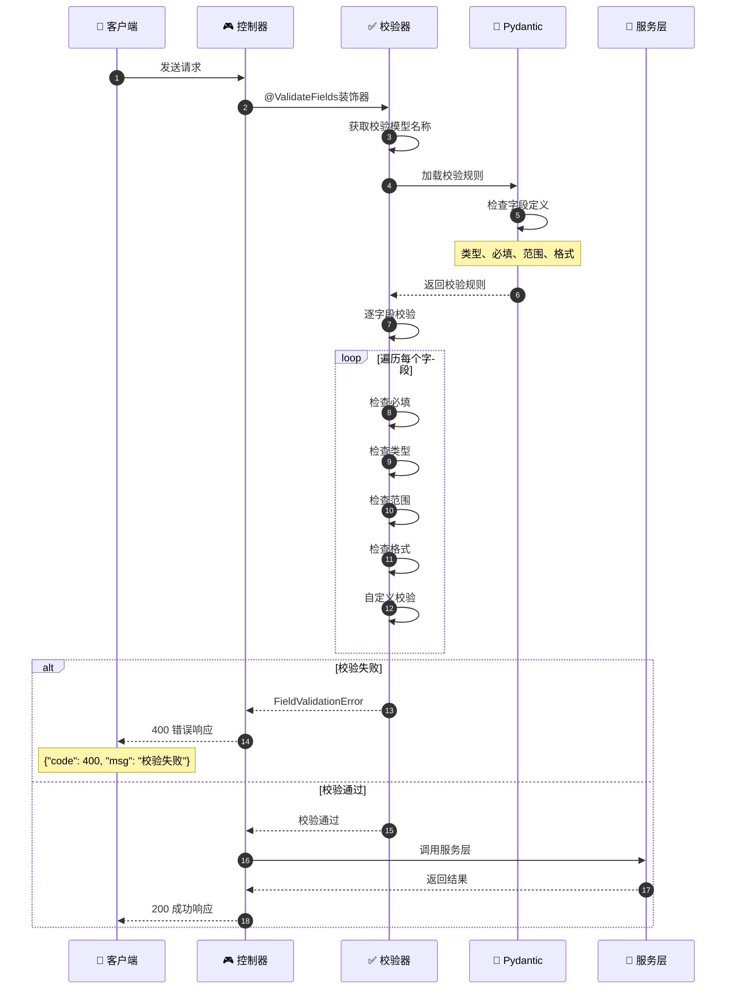
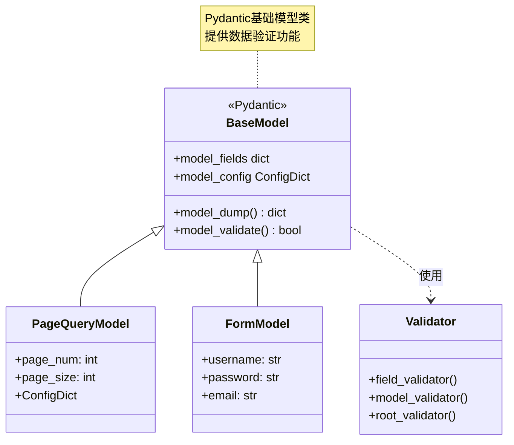
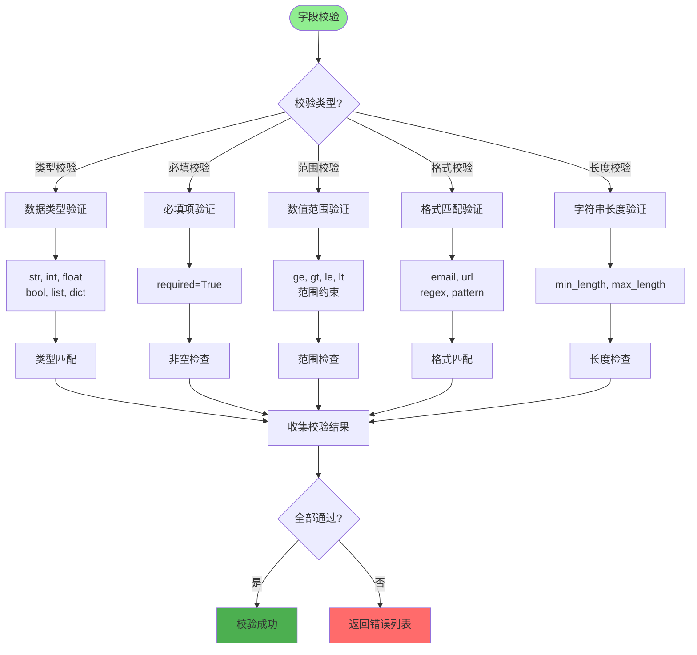
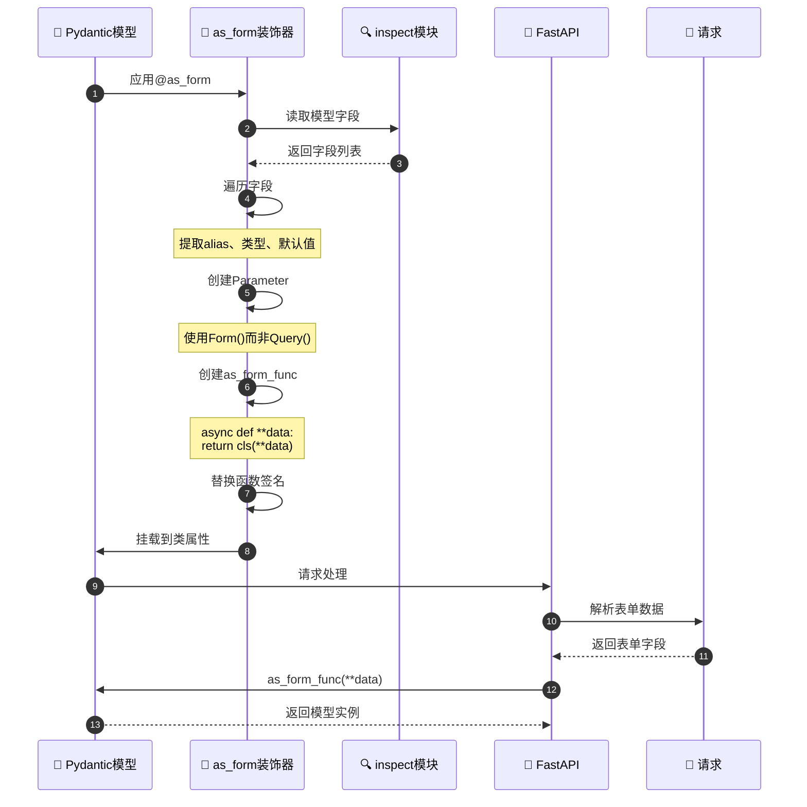
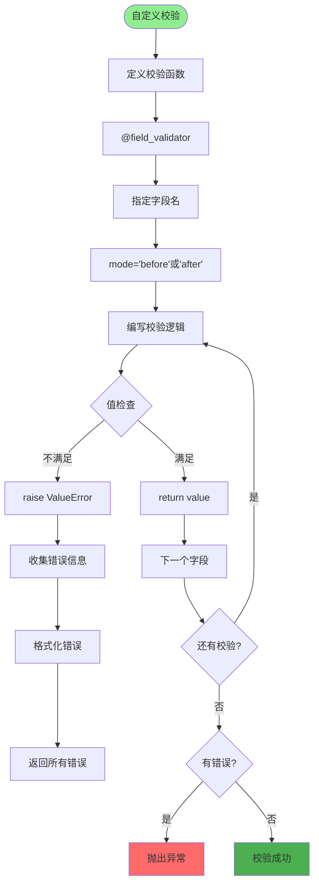
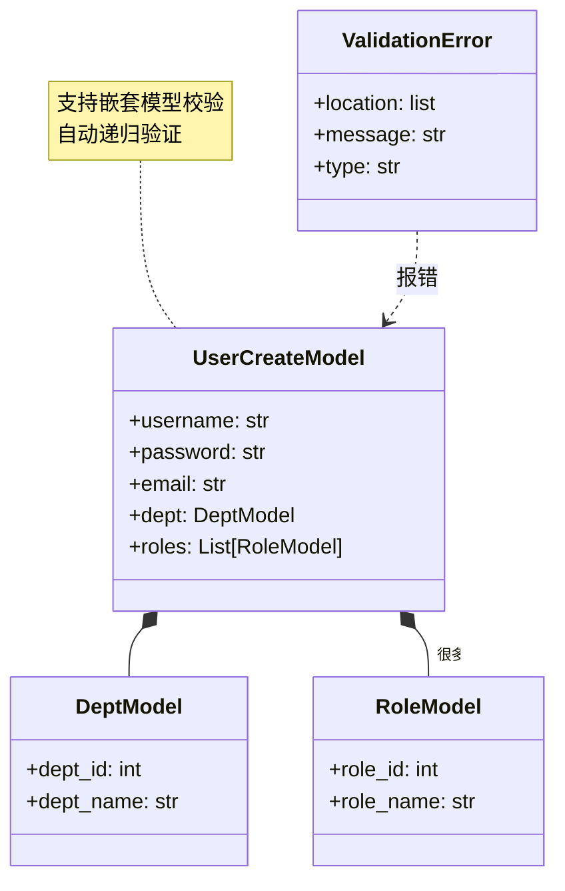
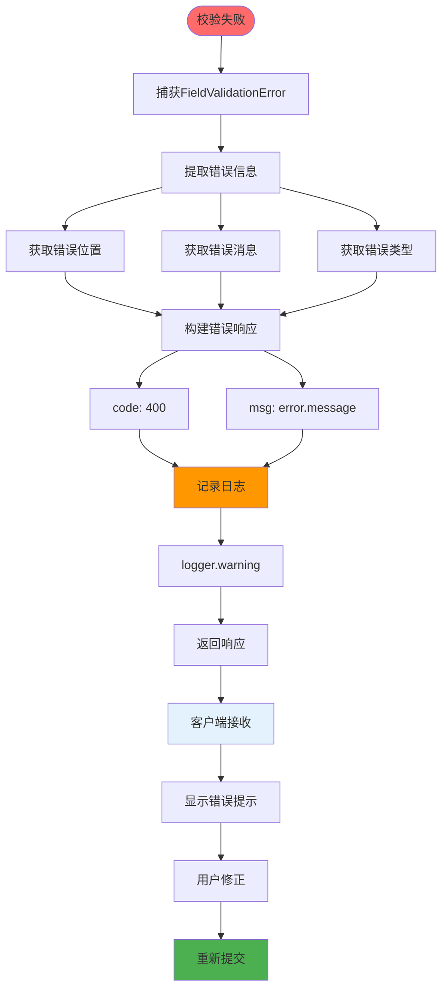
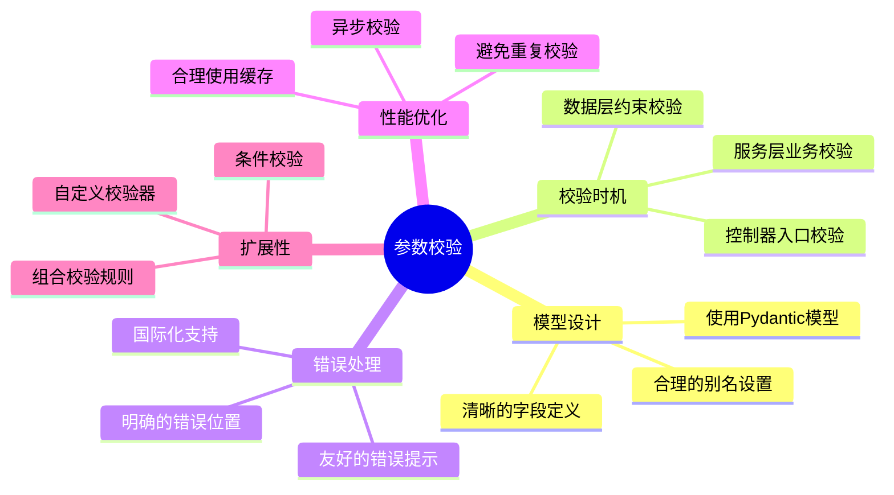

# 参数校验详解

## 1. 参数校验完整流程



## 2. Pydantic 模型定义



## 3. 字段校验类型



## 4. as_query 装饰器原理

```mermaid
flowchart TD
    Start([@as_query装饰]) --> GetFields[获取模型字段]

    GetFields --> LoopFields[遍历所有字段]

    LoopFields --> GetFieldInfo[获取字段信息]
    GetFieldInfo --> ExtractAlias[提取字段别名]

    ExtractAlias --> CheckRequired{是否必填?}

    CheckRequired -->|必填| CreateRequired[创建必填参数]
    CheckRequired -->|可选| CreateOptional[创建可选参数]

    CreateRequired --> SetQuery["使用Query()"]
    CreateOptional --> SetQuery

    SetQuery --> BuildParam[构建inspect.Parameter]
    BuildParam --> AddToList[添加到参数列表]

    AddToList --> HasMore{还有字段?}
    HasMore -->|是| LoopFields

    HasMore -->|否| CreateFunc[创建依赖函数]
    CreateFunc --> SetSignature["替换函数签名"]
    SetSignature --> MountClass["挂载到类上"]

    MountClass --> ReturnClass[返回模型类]

    style Start fill:#90EE90
    style SetQuery fill:#2196F3
    style ReturnClass fill:#4CAF50
```

## 5. as_form 装饰器原理



## 6. 自定义校验器



## 7. 嵌套模型校验



## 8. 校验错误处理



## 关键代码位置

| 功能 | 文件路径 |
|------|---------|
| Pydantic注解 | `module_admin/annotation/pydantic_annotation.py` |
| 校验装饰器 | `module_admin/annotation/pydantic_annotation.py` |
| 模型定义 | `module_admin/entity/vo/*.py` |
| 异常处理 | `exceptions/handle.py` |

## 参数校验最佳实践


