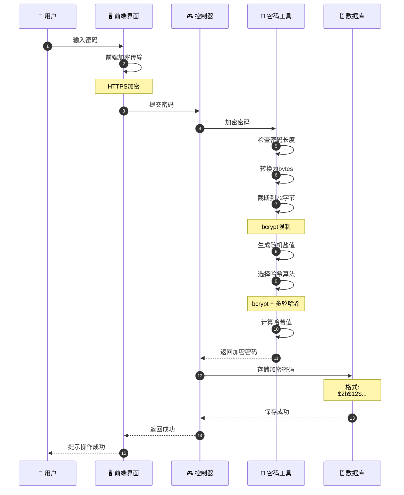
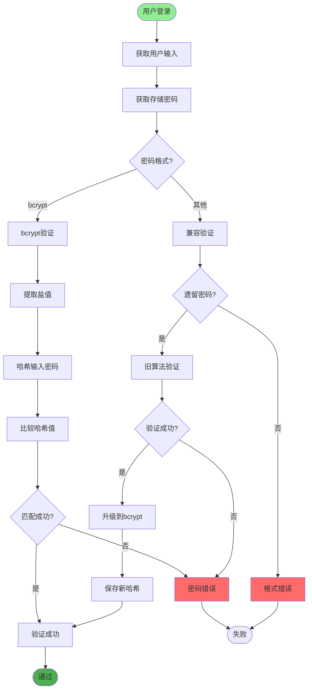
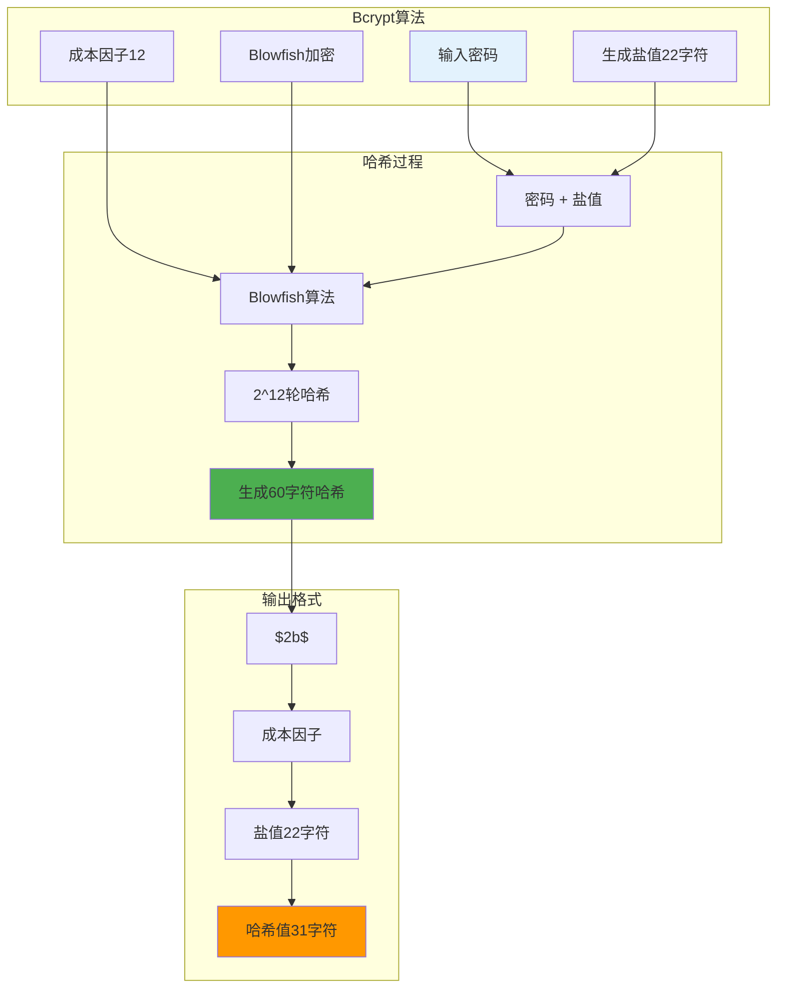
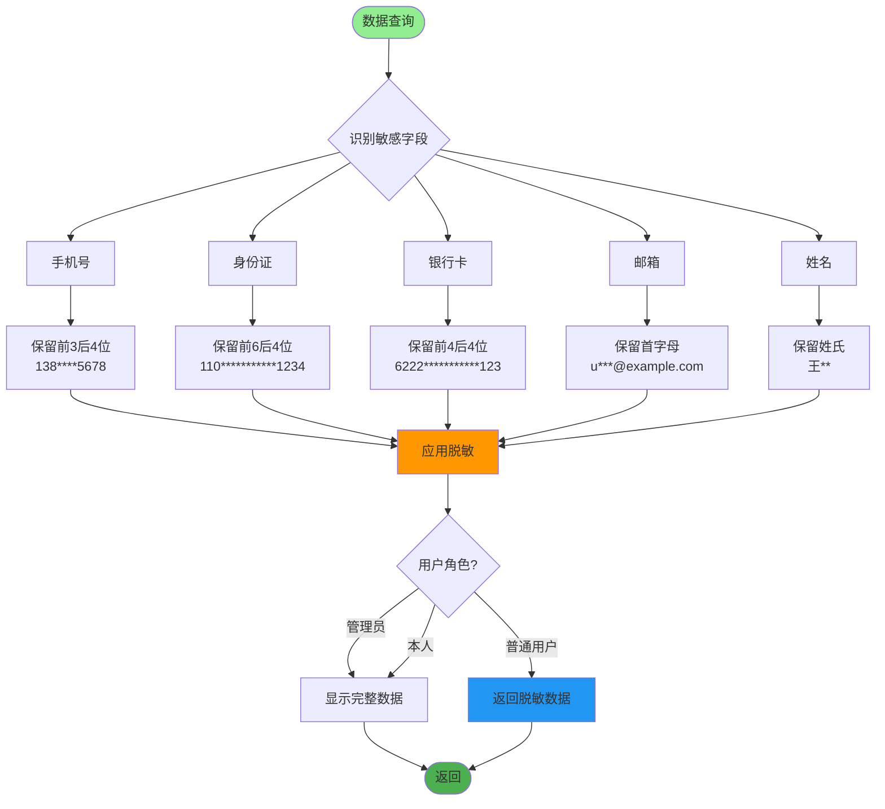
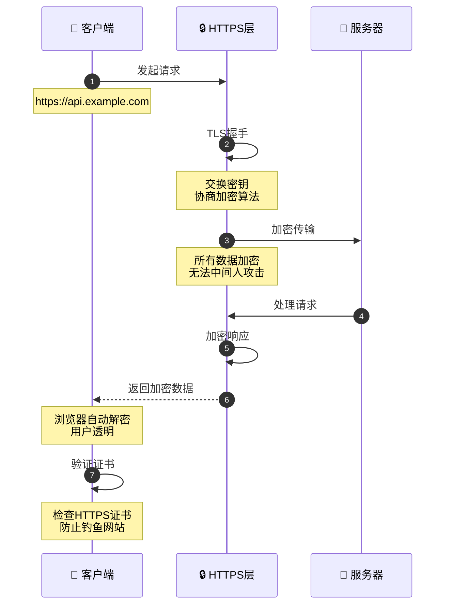
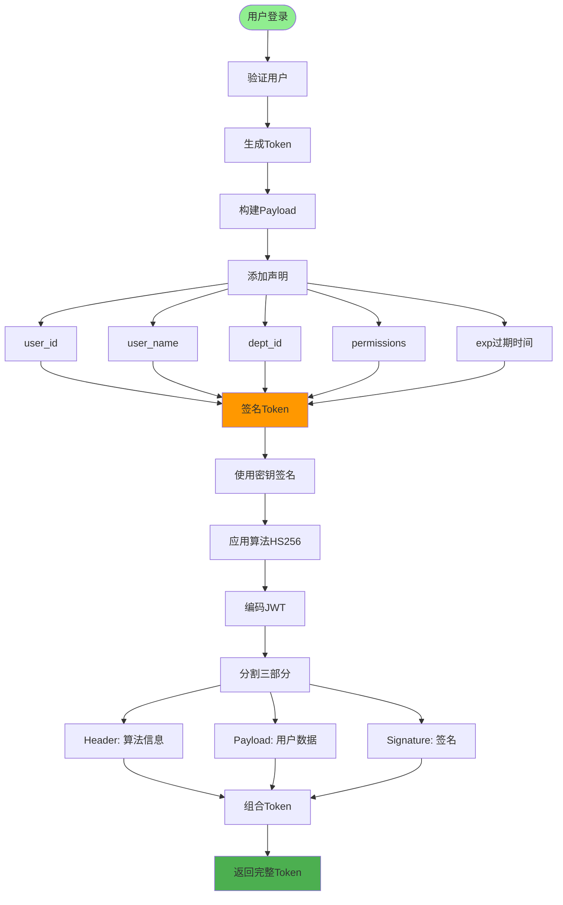
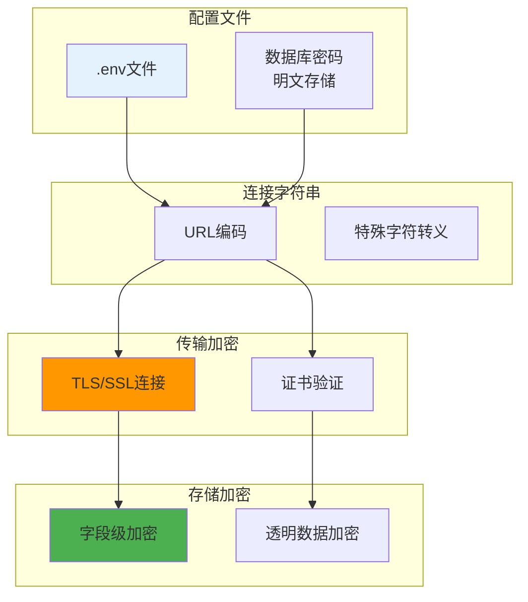
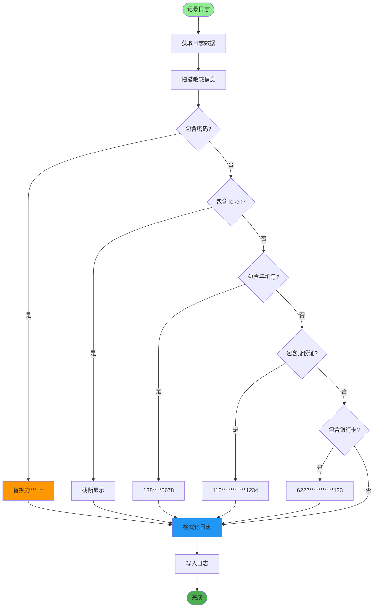
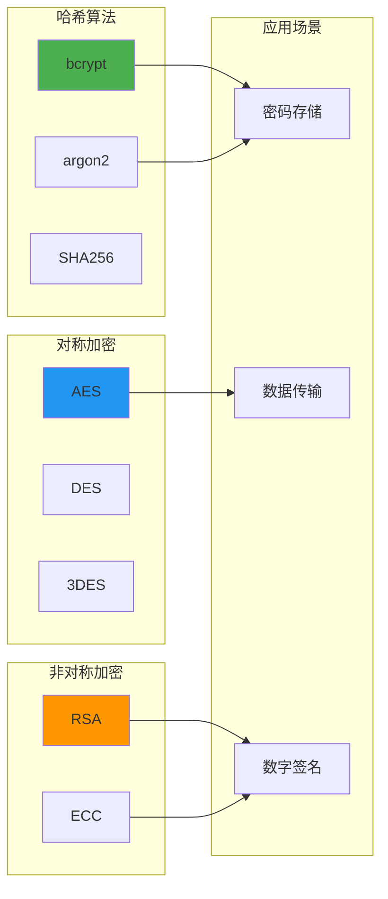

# 数据加密与脱敏详解

## 1. 密码加密完整流程

## 2. 密码验证流程

## 3. Bcrypt加密原理

## 4. 敏感数据脱敏规则

## 5. 数据传输加密

## 6. Token加密与签名

## 7. 数据库连接加密

## 8. 日志数据脱敏

## 关键代码位置

| 功能 | 文件路径 |
|------|---------|
| 密码工具 | `utils/pwd_util.py` |
| 字符串工具 | `utils/string_util.py` |
| 登录服务 | `module_admin/service/login_service.py` |
| 配置加密 | `config/env.py` |

## 加密算法对比

