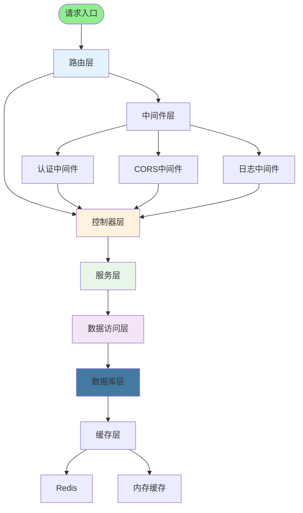
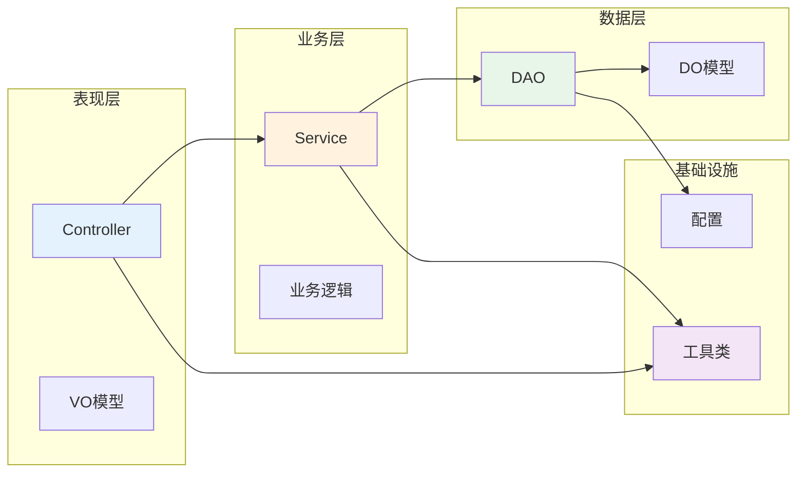
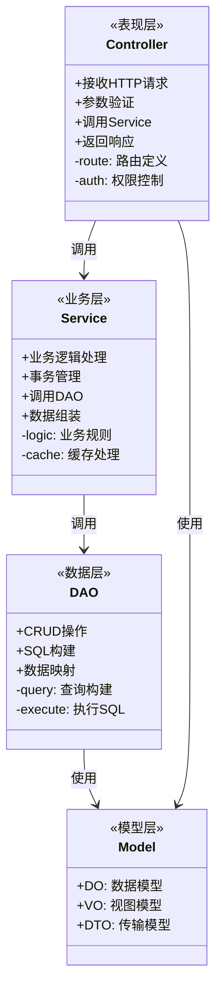
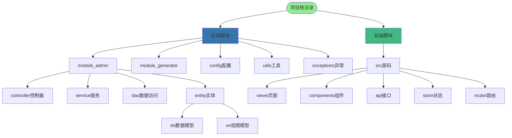
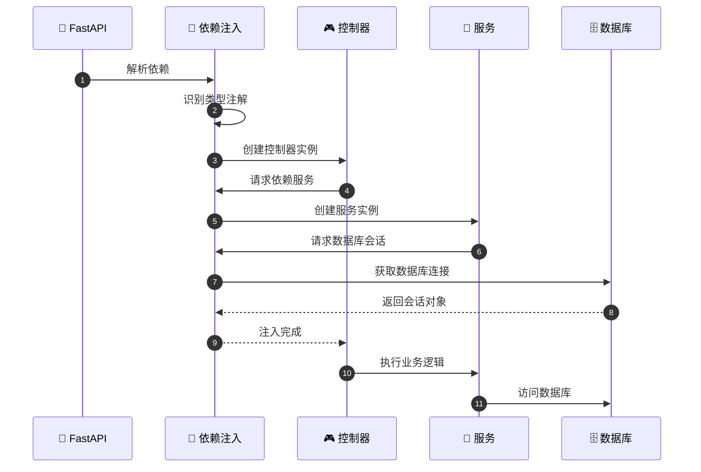
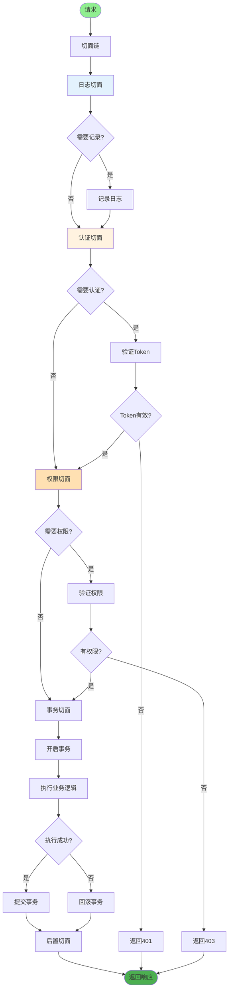
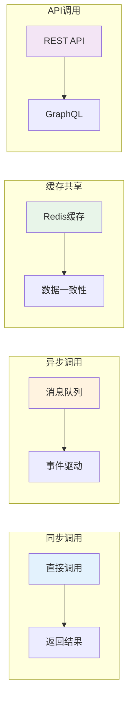
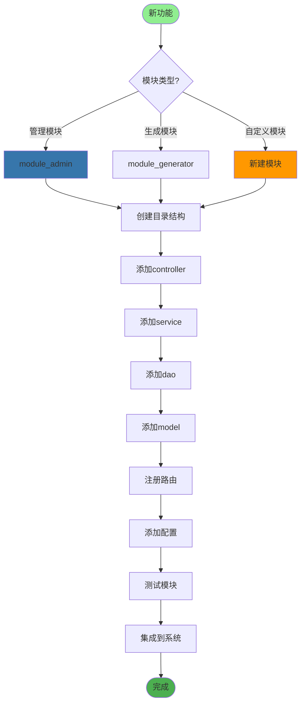
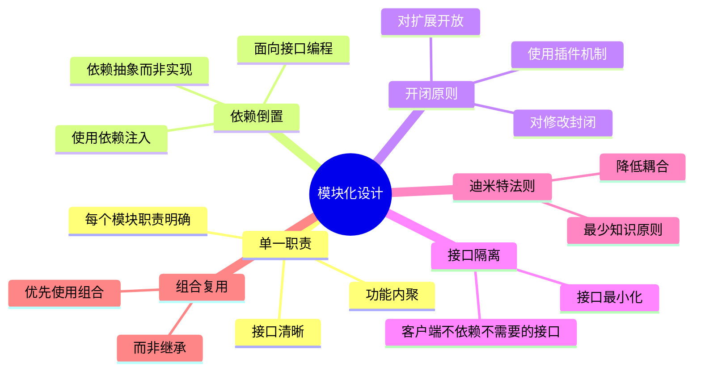

# 模块化架构设计详解

## 1. 整体架构分层

## 2. 模块依赖关系

## 3. 模块职责划分

## 4. 模块化目录结构

## 5. 依赖注入实现

## 6. AOP切面实现

## 7. 模块间通信

## 8. 模块扩展机制

## 关键代码位置

| 功能 | 文件路径 |
|------|---------|
| 应用入口 | `server.py` |
| 控制器 | `module_admin/controller/*.py` |
| 服务层 | `module_admin/service/*.py` |
| 数据层 | `module_admin/dao/*.py` |
| 切面 | `module_admin/aspect/*.py` |
| 注解 | `module_admin/annotation/*.py` |

## 模块化设计原则

