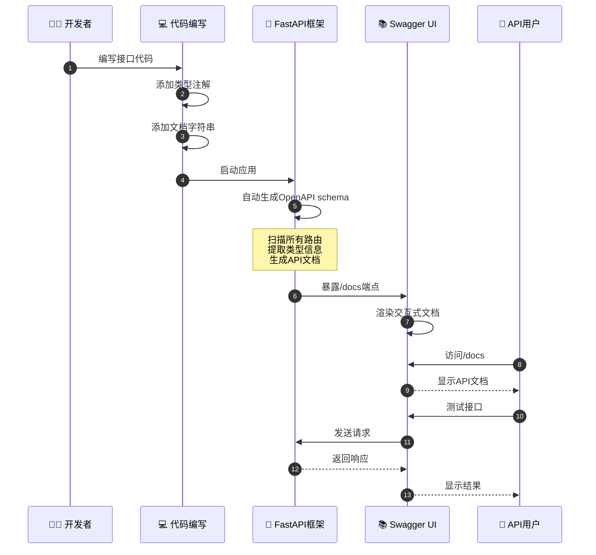
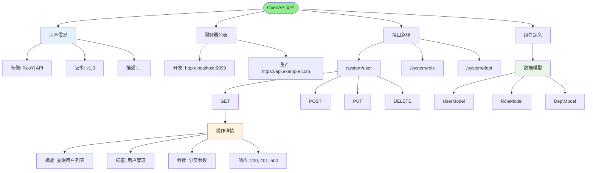
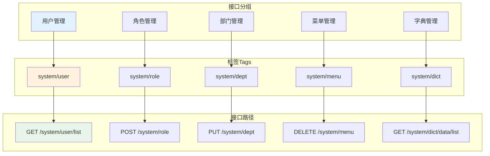
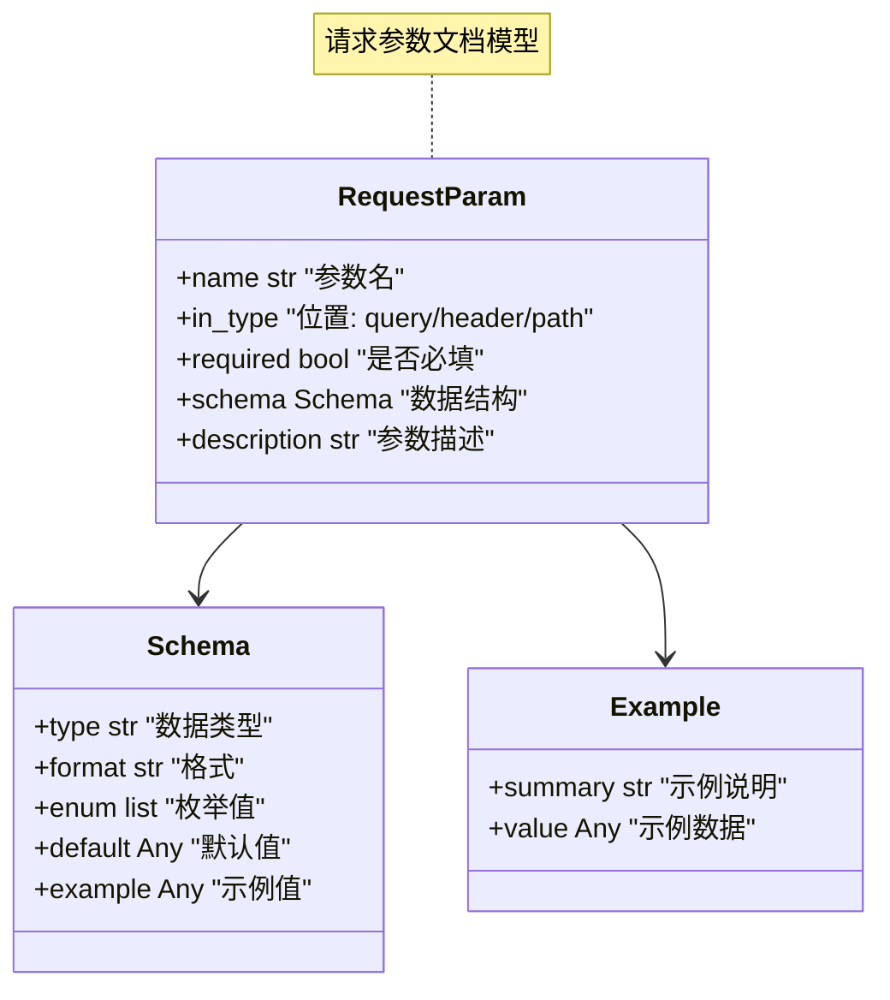
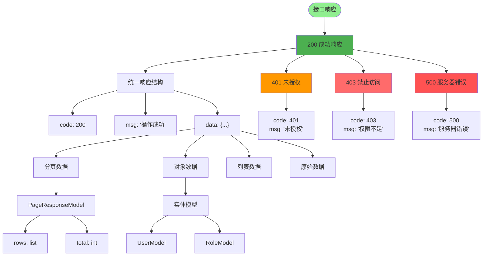
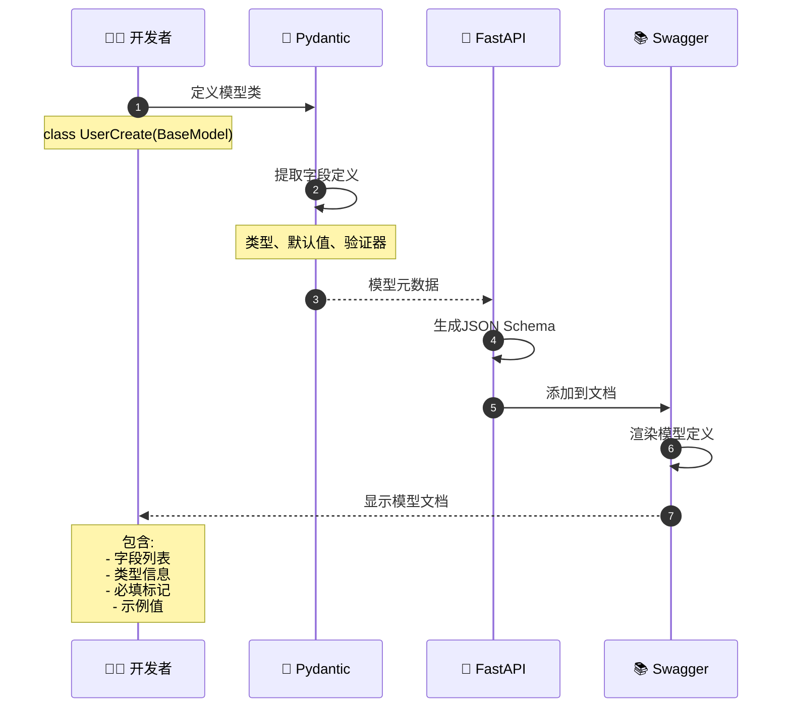
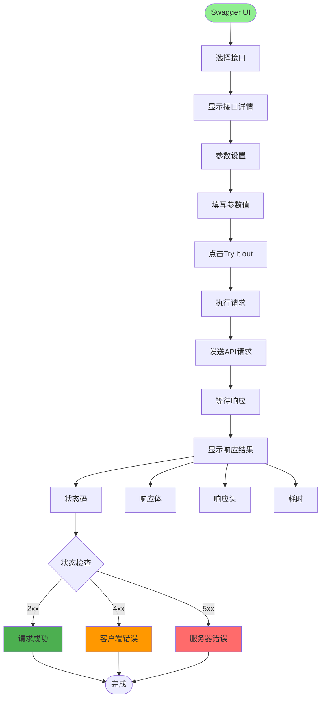
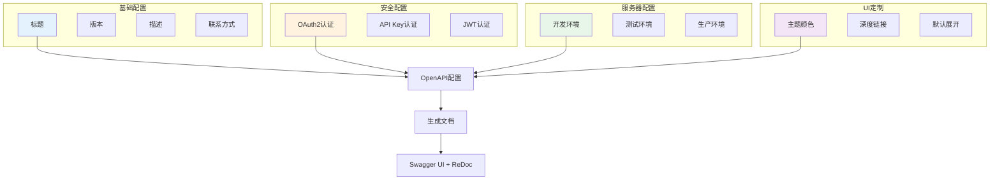
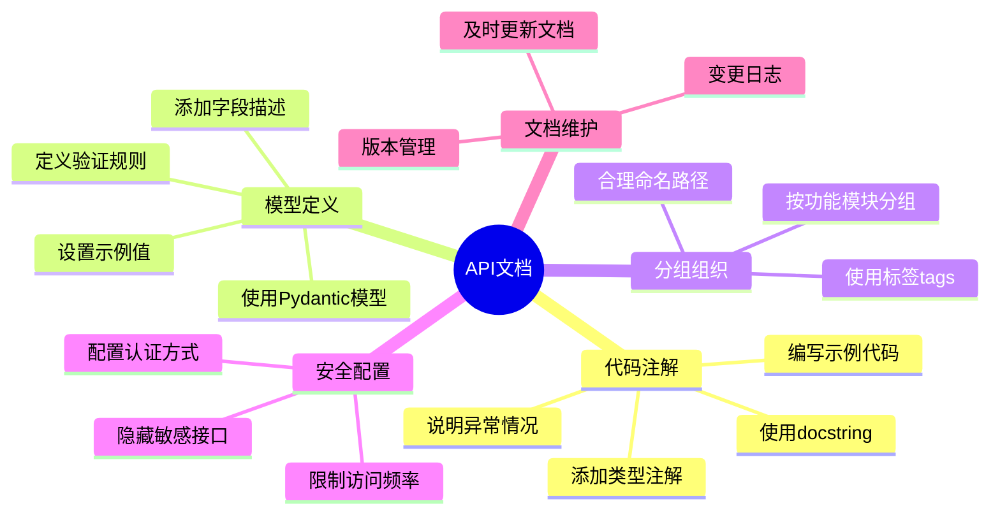

# 接口文档管理详解

## 1. Swagger/OpenAPI集成流程



## 2. 接口文档结构



## 3. 接口分组与标签



## 4. 请求参数文档



## 5. 响应模型文档



## 6. Pydantic模型自动文档



## 7. 接口测试功能



## 8. 文档配置与定制



## 关键代码位置

| 功能 | 文件路径 |
|------|---------|
| FastAPI配置 | `server.py` |
| 路由定义 | `module_admin/controller/*.py` |
| 模型定义 | `module_admin/entity/vo/*.py` |
| 依赖注入 | `config/get_db.py` |

## 文注签示例

```mermaid
codeblock
"""
@router.post("/user", summary="创建用户", tags=["用户管理"])
async def create_user(
    user: UserCreate,
    current_user: CurrentUser = Depends(get_current_user)
):
    '''
    创建新用户

    Args:
        user: 用户信息
        current_user: 当前登录用户

    Returns:
        创建的用户信息

    Raises:
        400: 参数错误
        401: 未授权
        403: 权限不足
    '''
    pass
"""
```

## 最佳实践


