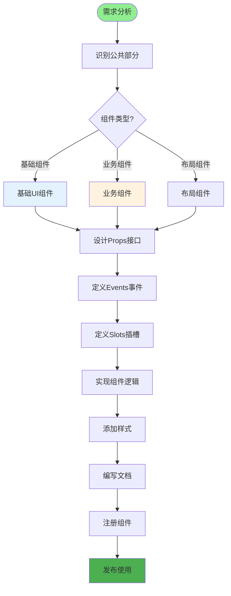
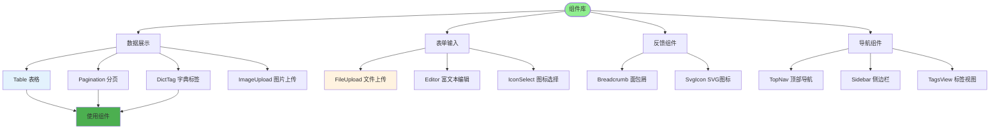
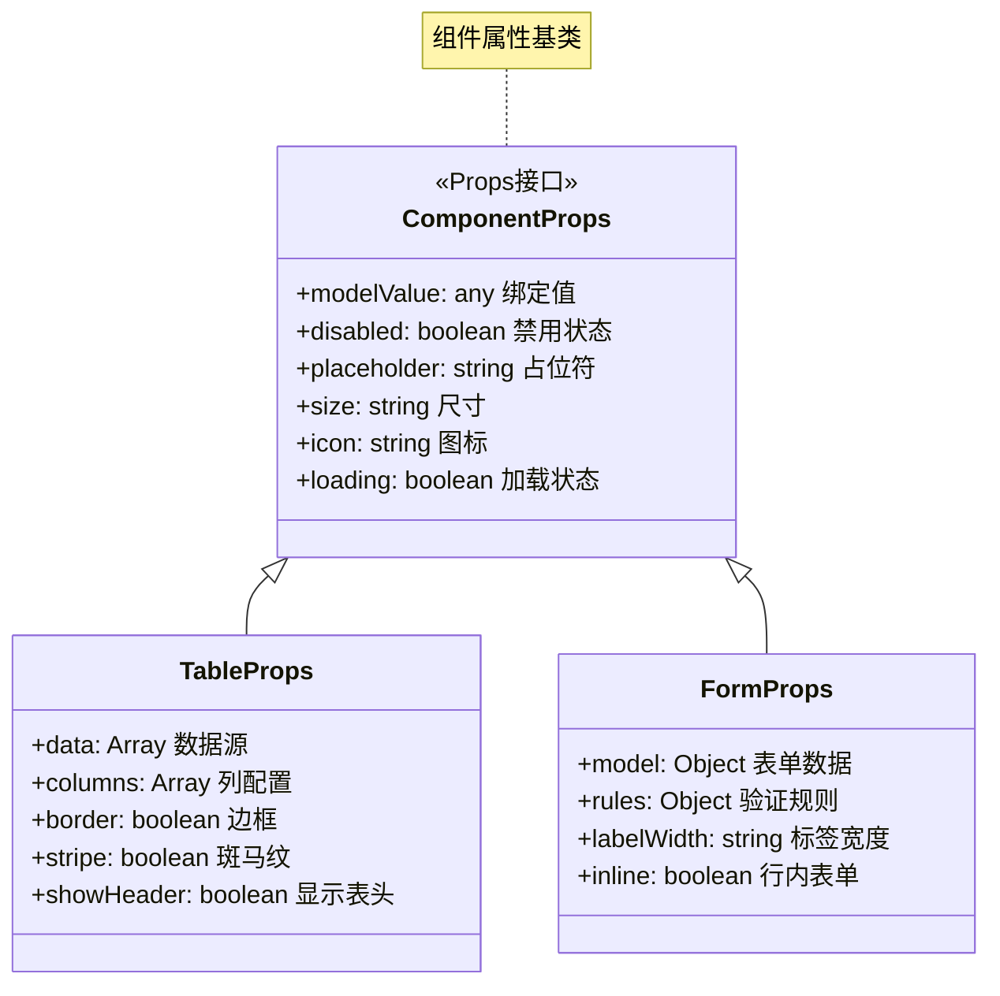
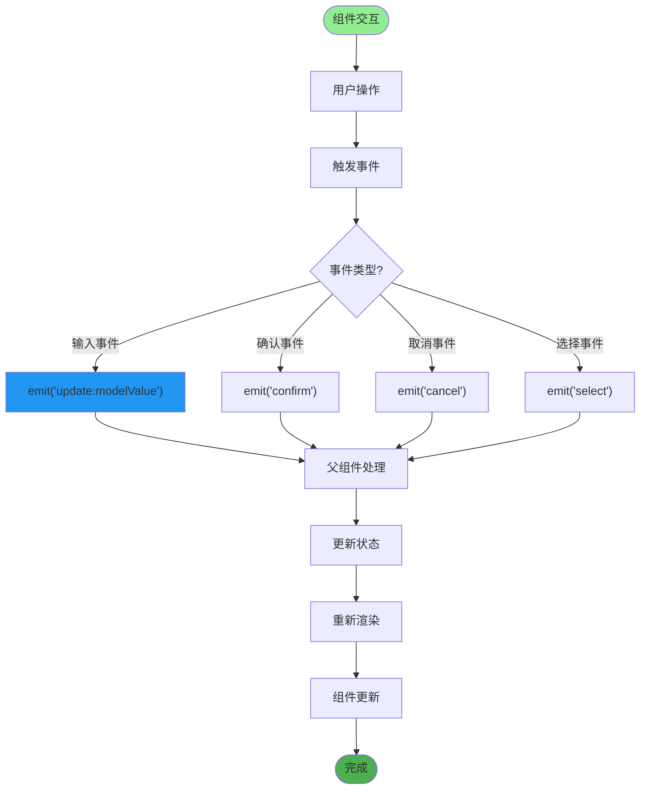
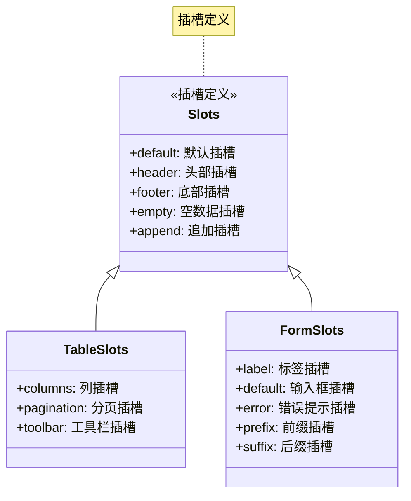
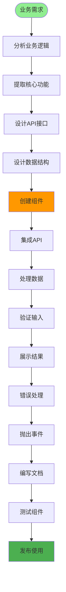
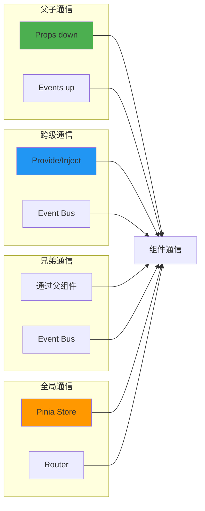
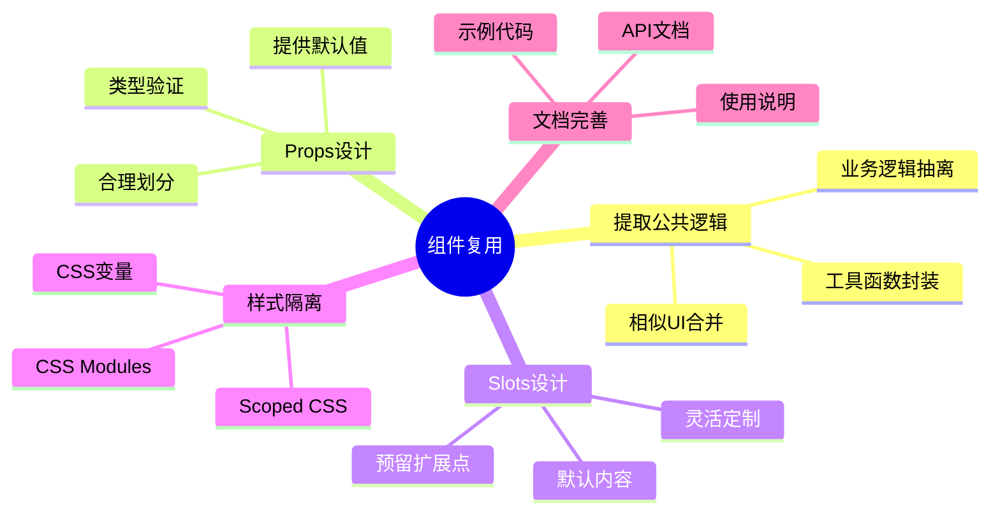

# 组件复用与封装详解

## 1. 组件封装流程



## 2. 基础组件库



## 3. 组件Props设计



## 4. 组件Events设计



## 5. 组件Slots设计



## 6. 业务组件封装



## 7. 组件通信方式



## 8. 组件复用策略



## 关键代码位置

| 类型 | 组件名 | 路径 |
|------|--------|------|
| 表格 | Table | `src/components/Table/index.vue` |
| 分页 | Pagination | `src/components/Pagination/index.vue` |
| 字典标签 | DictTag | `src/components/DictTag/index.vue` |
| 文件上传 | FileUpload | `src/components/FileUpload/index.vue` |
| 图片上传 | ImageUpload | `src/components/ImageUpload/index.vue` |
| 富文本 | Editor | `src/components/Editor/index.vue` |
| 图标选择 | IconSelect | `src/components/IconSelect/index.vue` |
| 面包屑 | Breadcrumb | `src/components/Breadcrumb/index.vue` |
| SVG图标 | SvgIcon | `src/components/SvgIcon/index.vue` |

## 组件开发规范

```mermaid
codeblock
"""
<template>
  <div class="my-component">
    <!-- 插槽使用 -->
    <slot name="header"></slot>

    <!-- 组件内容 -->
    <div v-bind="$attrs">{{ propValue }}</div>

    <!-- 默认插槽 -->
    <slot></slot>

    <!-- 作用域插槽 -->
    <slot name="item" :item="data"></slot>
  </div>
</template>

<script setup>
// Props定义
const props = defineProps({
  propValue: {
    type: String,
    required: true,
    default: ''
  }
})

// Events定义
const emit = defineEmits(['update', 'change', 'delete'])

// 响应式数据
const state = reactive({
  count: 0
})

// 计算属性
const computed = computed(() => state.count * 2)

// 方法
const handleClick = () => {
  emit('change', state.count)
}
</script>

<style scoped>
/* 组件样式 */
.my-component {
  /* 使用CSS变量 */
  color: var(--el-color-primary);
}
</style>
"""
```
