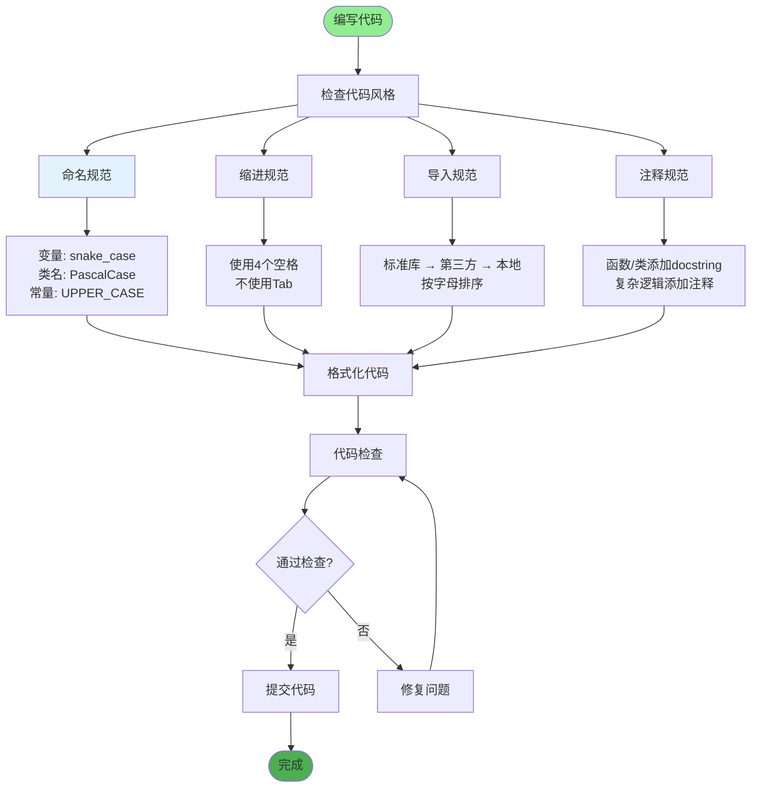
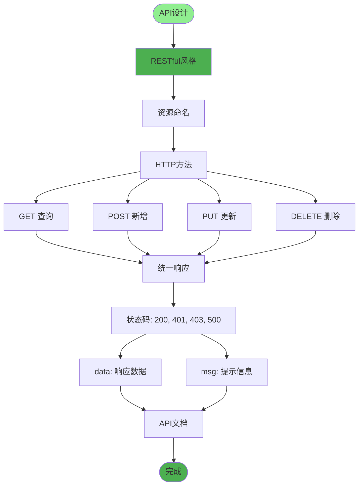
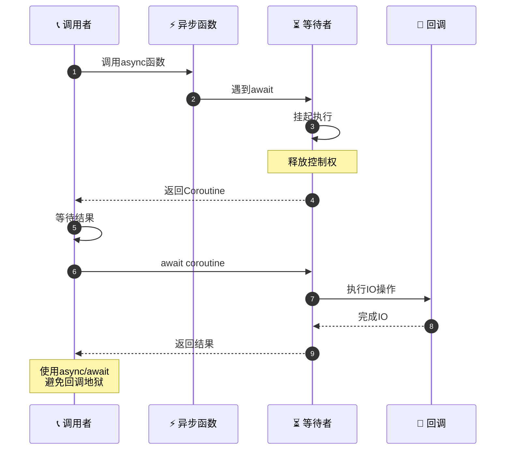
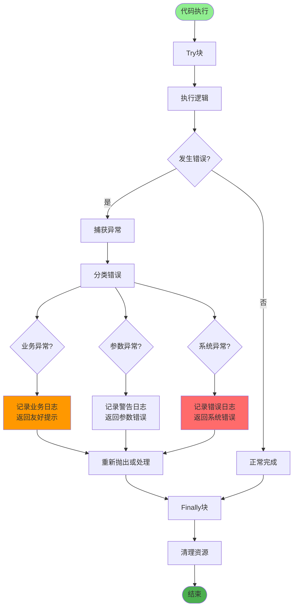
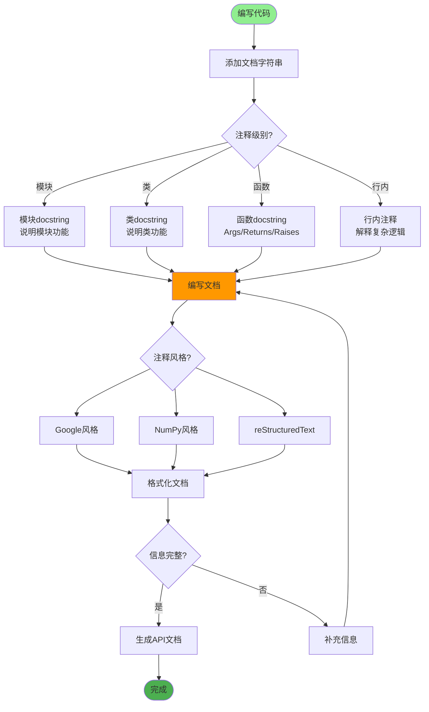
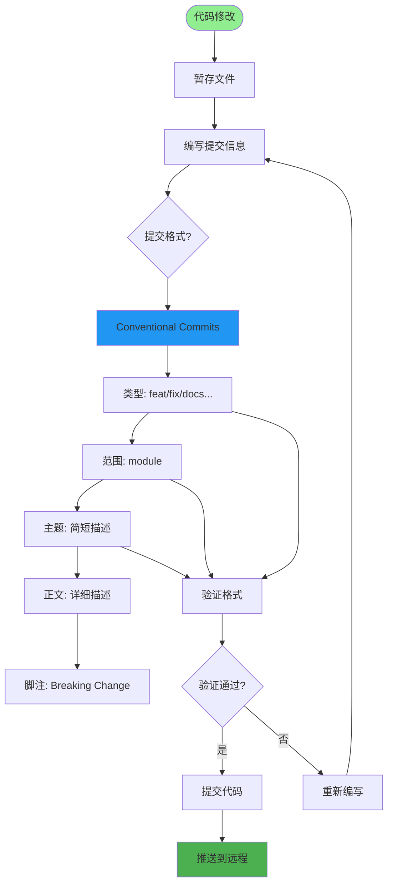
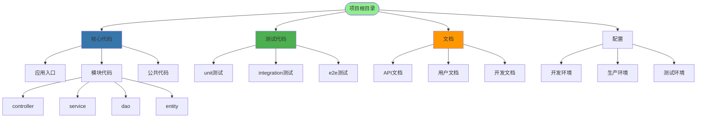
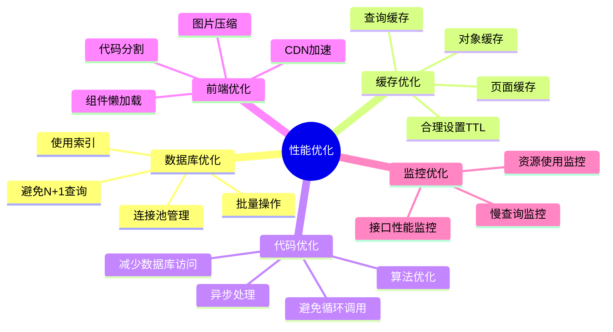
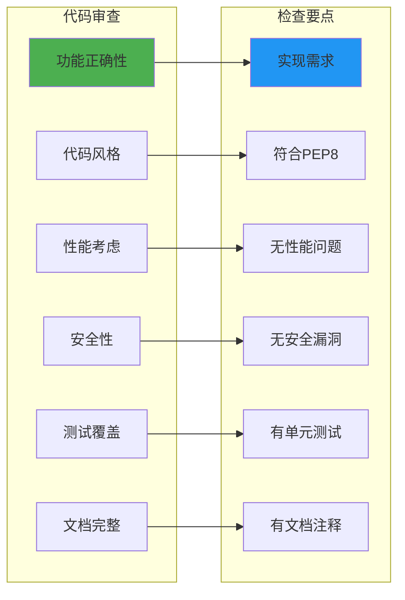

# 代码规范与最佳实践详解

## 1. Python代码规范

## 2. FastAPI最佳实践

## 3. 异步编程规范

## 4. 错误处理规范

## 5. 代码注释规范

## 6. Git提交规范

## 7. 项目结构规范

## 8. 性能优化规范

## 关键配置文件

| 文件 | 用途 | 规范 |
|------|------|------|
| `.editorconfig` | 编辑器配置 | 统一缩进风格 |
| `.pylintrc` | Pylint配置 | 代码检查规则 |
| `.gitignore` | Git忽略 | 排除文件配置 |
| `requirements.txt` | 依赖管理 | 依赖版本锁定 |
| `.env.*` | 环境变量 | 配置管理 |

## 代码审查清单

