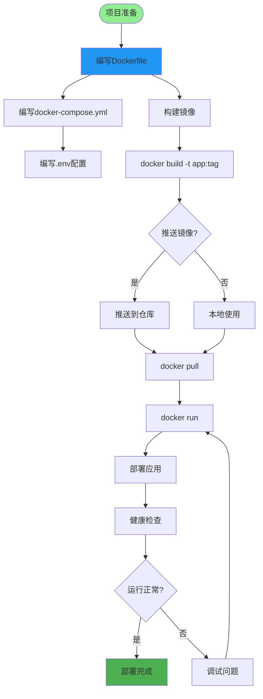
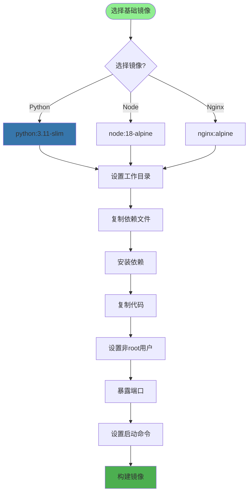
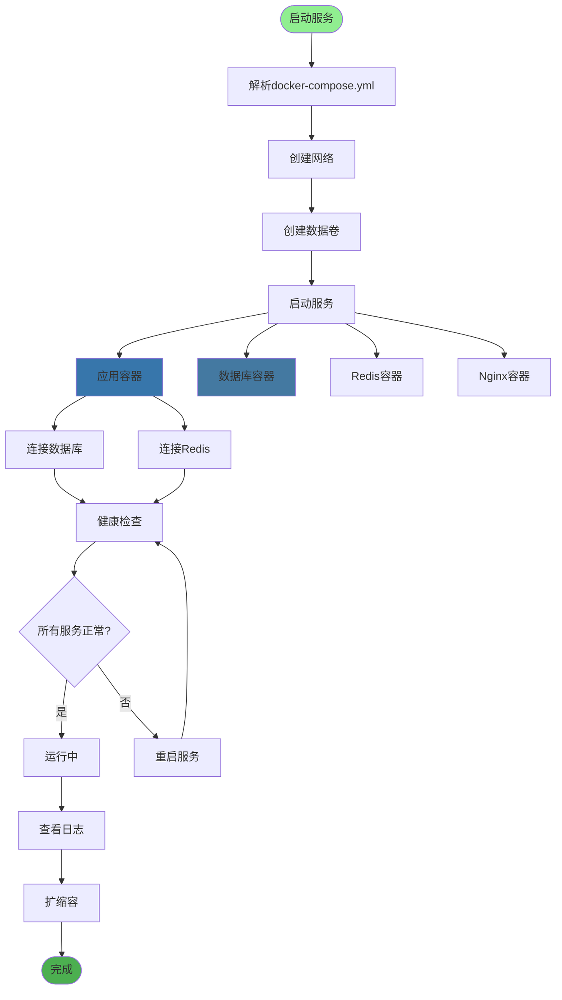
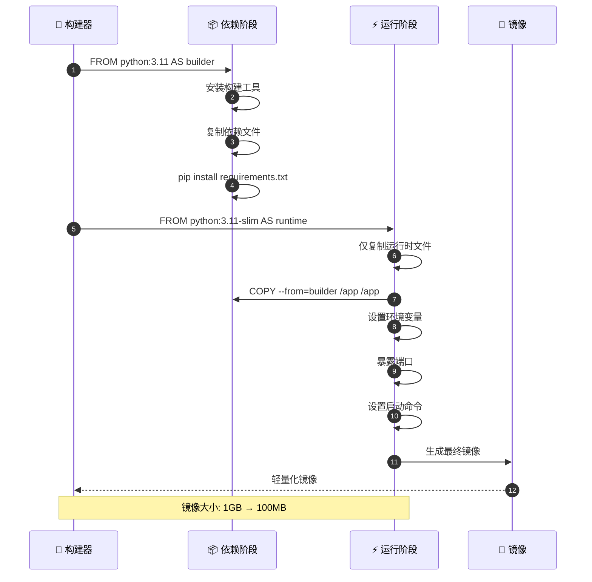
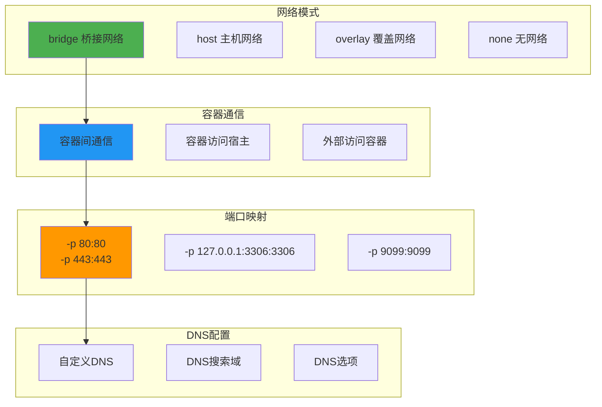
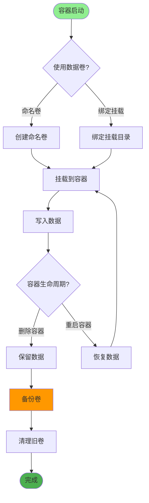
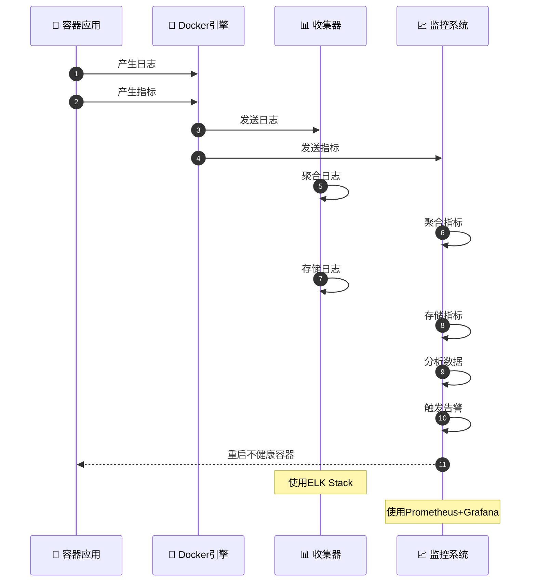
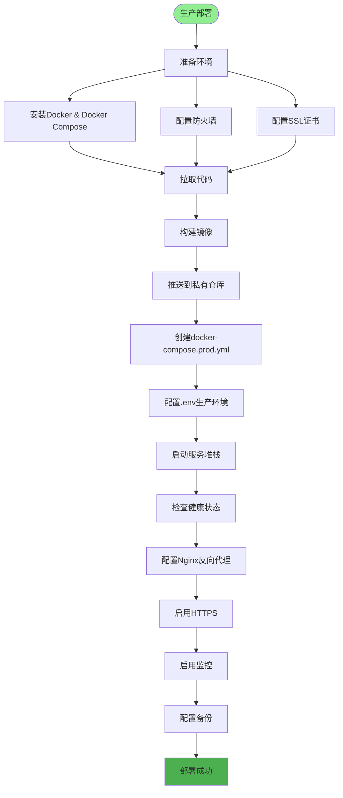
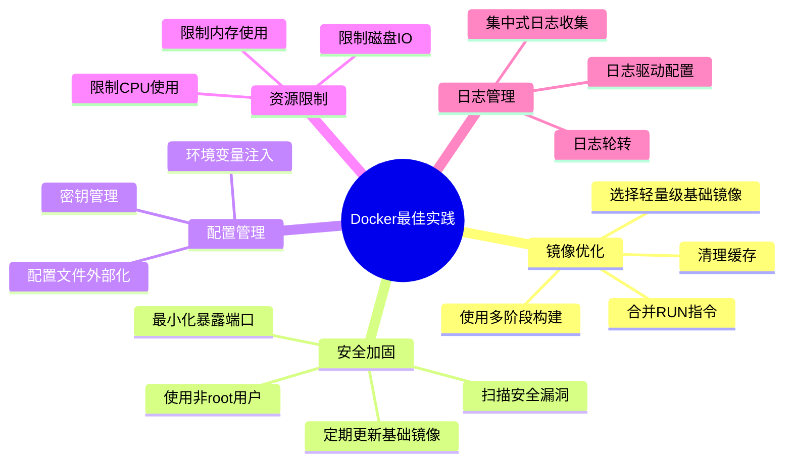

# Docker容器化部署详解

## 1. 容器化构建流程

## 2. Dockerfile最佳实践

## 3. Docker Compose编排

## 4. 多阶段构建

## 5. 容器网络配置

## 6. 数据持久化

## 7. 容器监控与日志

## 8. 生产环境部署

## 关键配置文件

| 文件 | 用途 |
|------|------|
| `Dockerfile` | 构建镜像 |
| `docker-compose.yml` | 开发环境编排 |
| `docker-compose.prod.yml` | 生产环境编排 |
| `.dockerignore` | 排除文件 |
| `.env` | 环境变量 |

## 最佳实践

