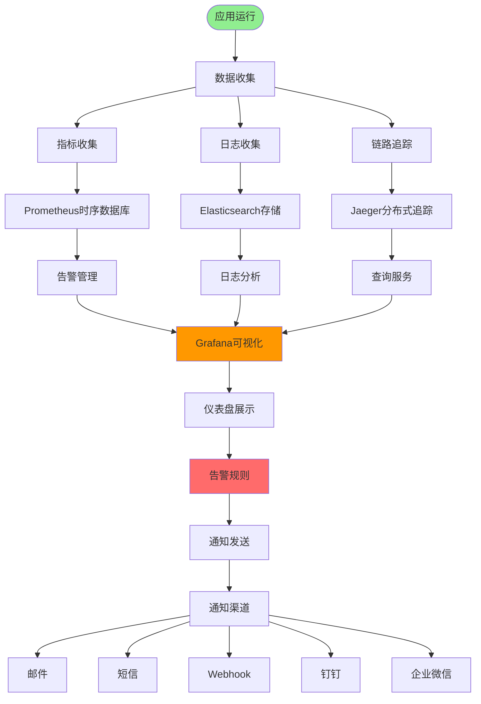
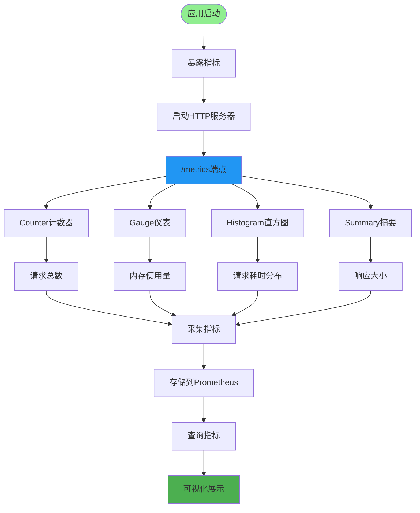
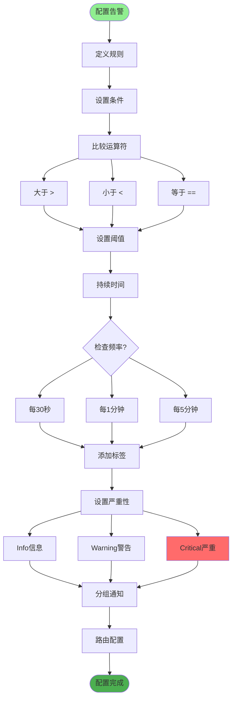
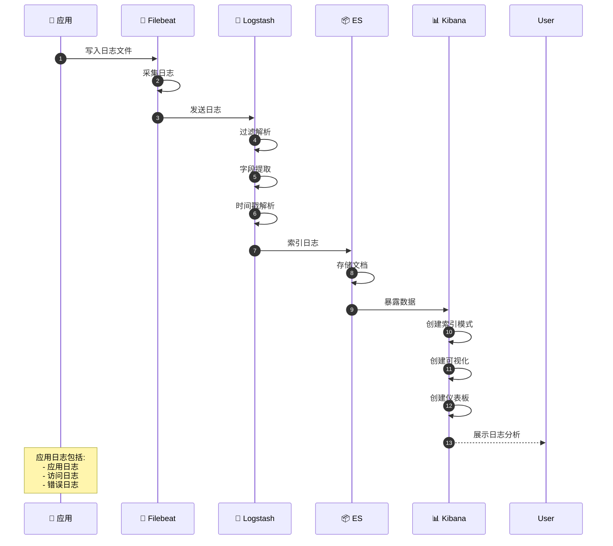
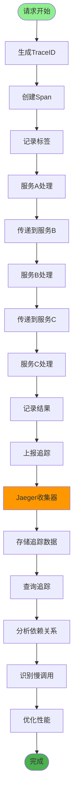
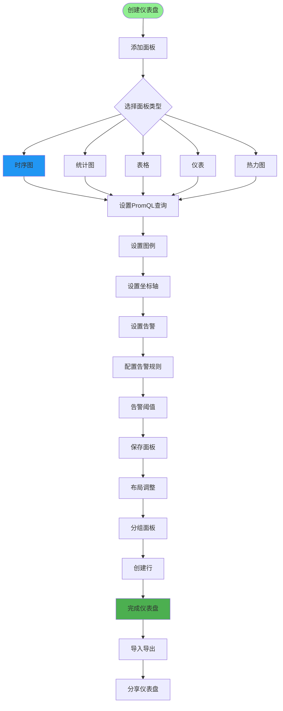
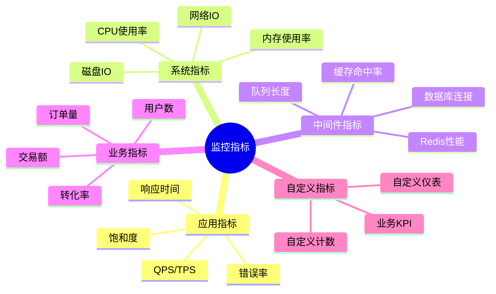
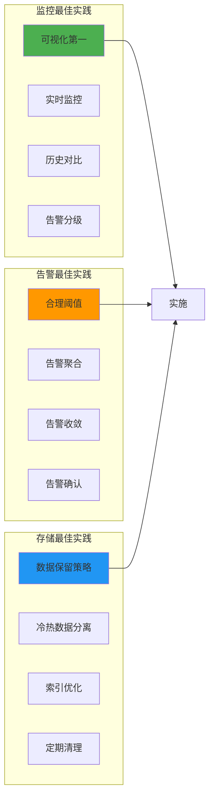

# 监控告警系统详解

## 1. 监控系统架构



## 2. 应用指标监控



## 3. 告警规则配置



## 4. 日志聚合分析



## 5. 链路追踪实现



## 6. 仪表盘设计



## 7. 监控指标分类



## 8. 告警通知流程

```mermaid
sequenceDiagram
    autonumber
    participant Monitor as 📊 监控系统
    participant AlertManager as 🚨 AlertManager
    participant Receiver as 📬 接收器
    participant Channel as 📱 通知渠道
   icipant User as 👤 用户

    Monitor->>AlertManager: 触发告警
    AlertManager->>AlertManager: 分组告警
    AlertManager->>AlertManager: 去重告警

    AlertManager->>AlertManager: 沉默告警
    AlertManager->>Receiver: 路由告警

    Receiver->>Channel: 发送通知

    alt 邮件通知
        Channel->>Channel: 发送邮件
        Channel-->>User: 邮件告警
    else 短信通知
        Channel->>Channel: 发送短信
        Channel-->>User: 短信告警
    else 钉钉通知
        Channel->>Channel: 发送钉钉
        Channel-->>User: 钉钉消息
    else 企业微信
        Channel->>Channel: 发送微信
        Channel-->>User: 微信消息
    end

    User->>Channel: 确认告警
    Channel->>Monitor: 更新告警状态

    Note over AlertManager: 告警聚合<br/>告警去重<br/>告警静默
```

## 关键配置文件

| 文件 | 用途 |
|------|------|
| `prometheus.yml` | Prometheus配置 |
| `alertmanager.yml` | 告警管理配置 |
| `filebeat.yml` | 日志采集配置 |
| `logstash.conf` | 日志处理配置 |
| `grafana/dashboards/*.json` | 仪表盘配置 |

## 最佳实践


