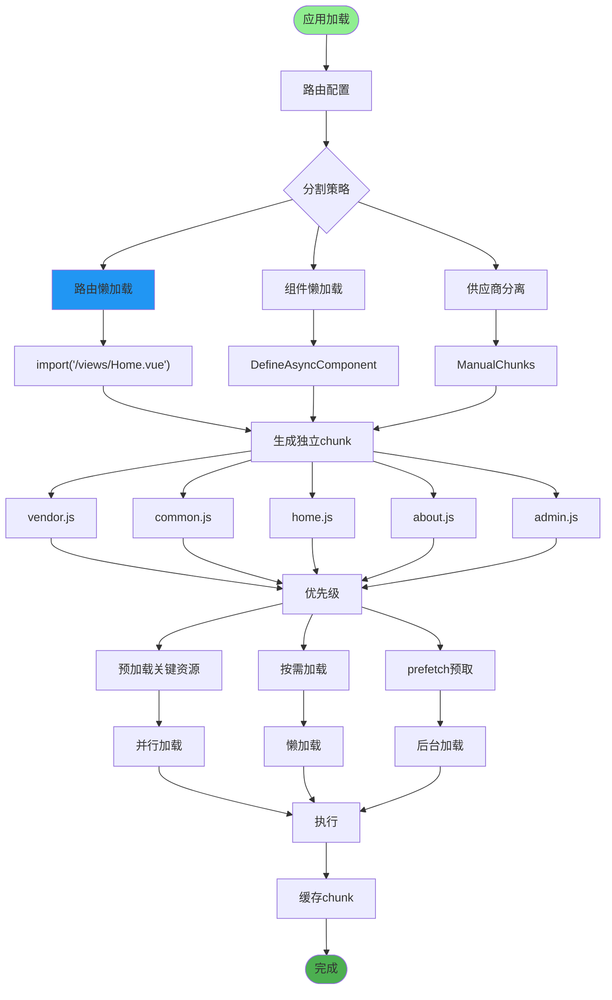
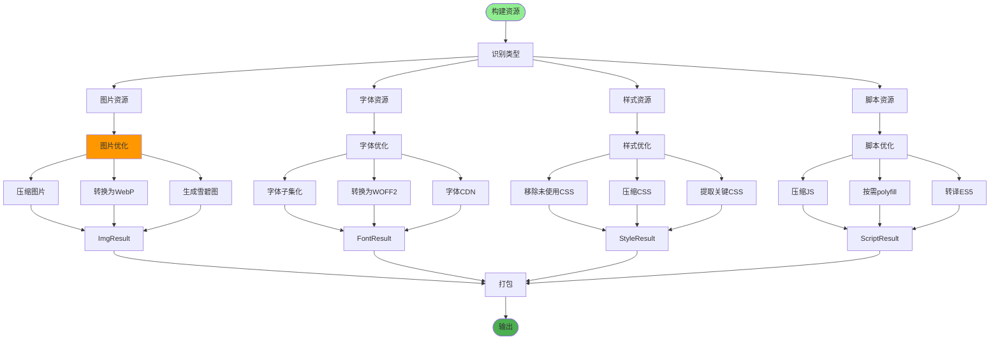
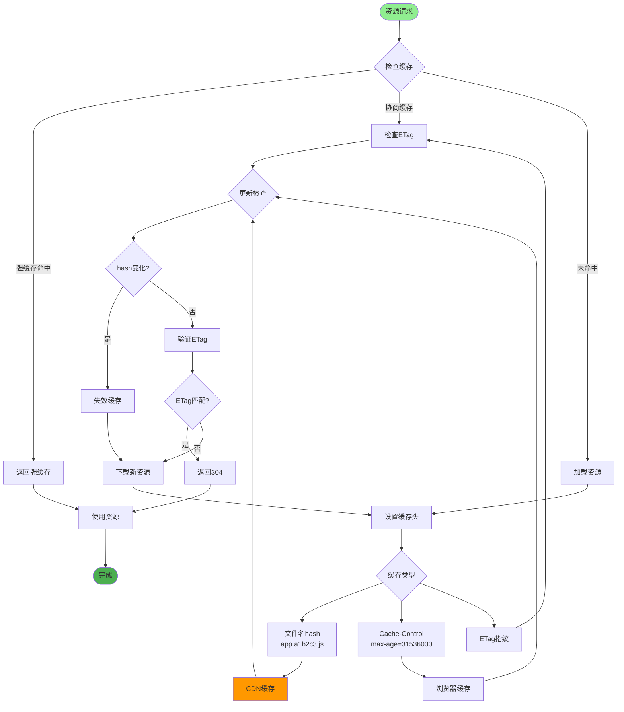
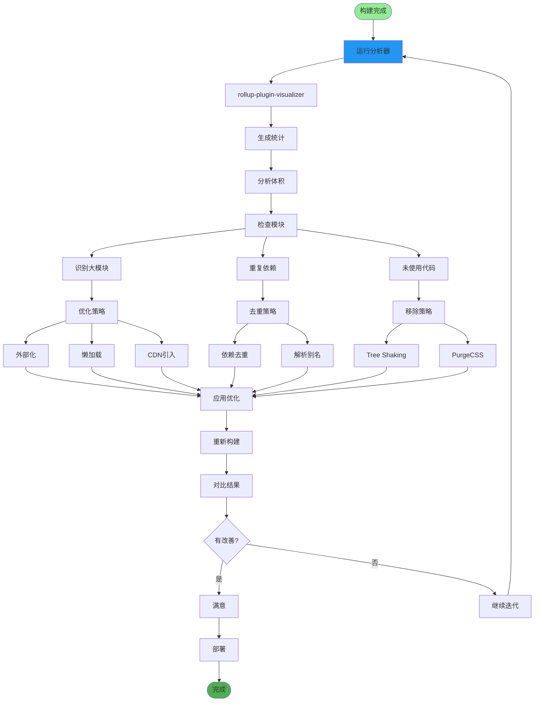
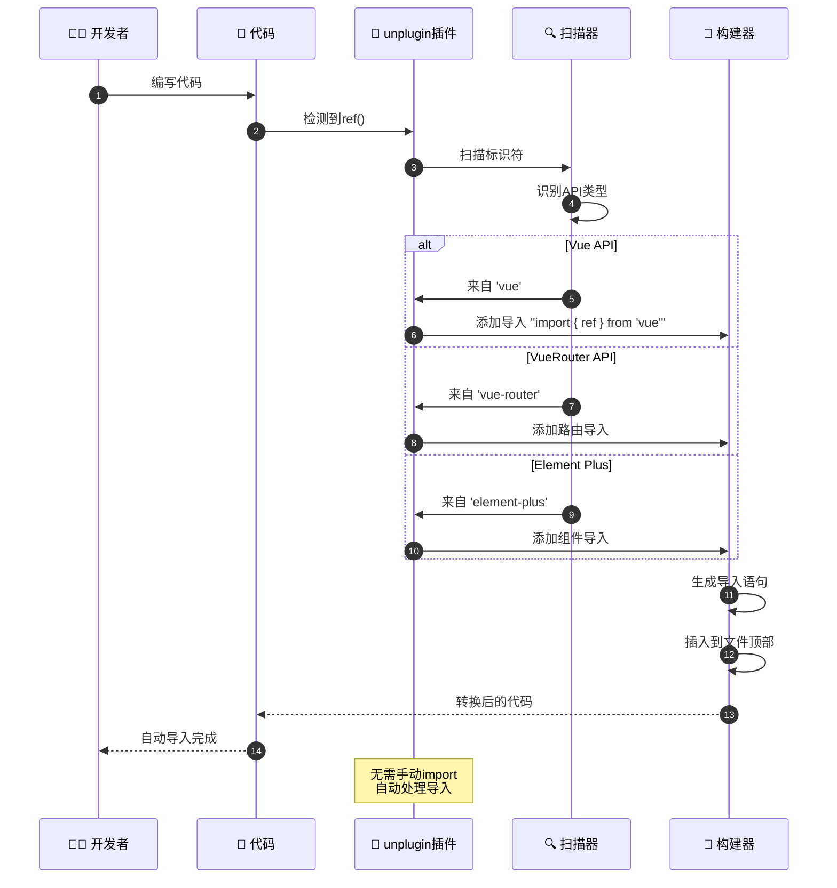
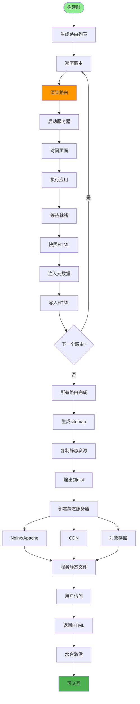
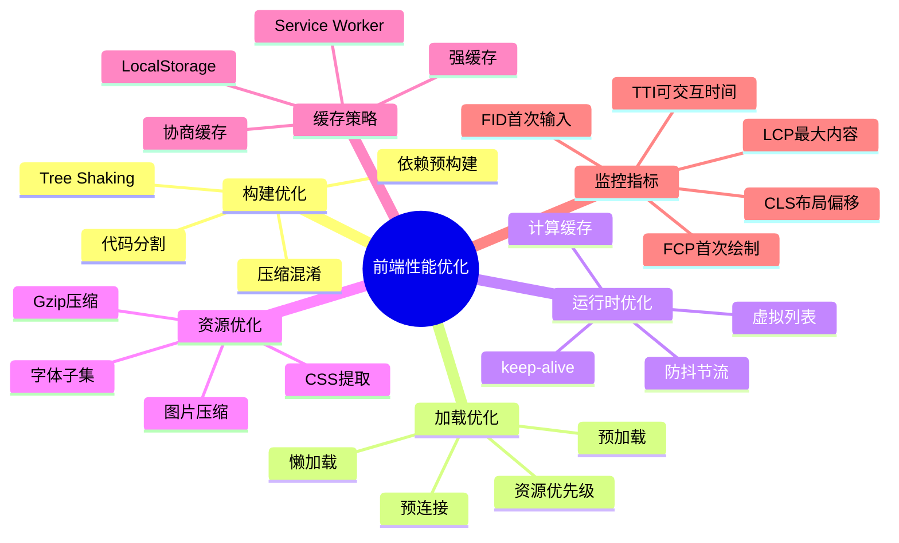
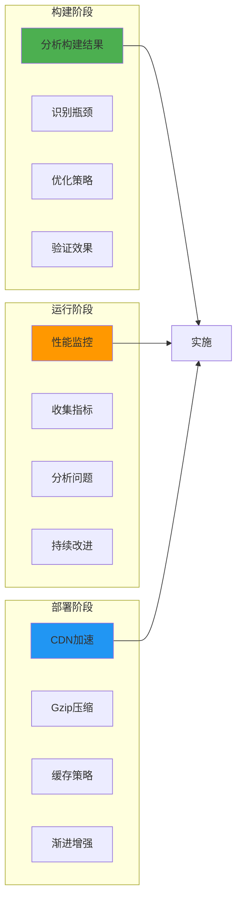

# 前端构建优化详解

## 1. Vite构建流程优化

```mermaid
flowchart TD
    Start([npm run build]) --> ViteParse[Vite解析配置]

    ViteParse --> ReadConfig[vite.config.js]
    ReadConfig --> LoadPlugins[加载插件]

    LoadPlugins --> PluginVue[@vitejs/plugin-vue]
    LoadPlugins --> PluginImport[plugin-auto-import]
    LoadPlugins --> PluginComponents[unplugin-vue-components]

    PluginVue --> DependencyPreBundle[依赖预构建]
    PluginImport --> DependencyPreBundle
    PluginComponents --> DependencyPreBundle

    DependencyPreBundle --> ScanDeps[扫描依赖]
    ScanDeps --> OptimizeDeps[优化依赖]

    OptimizeDeps --> ESBuild[esbuild转译]
    ESBuild --> BundleCode[打包代码]

    BundleCode --> CodeSplit[代码分割]
    CodeSplit --> SplitEntry[入口分割]
    CodeSplit --> SplitVendor[供应商分割]
    CodeSplit --> SplitAsync[异步分割]

    SplitEntry --> Minify[代码压缩]
    SplitVendor --> Minify
    SplitAsync --> Minify

    Minify --> Terser[Terser压缩]
    Terser --> TreeShake[Tree Shaking]

    TreeShake --> RemoveUnused[移除未使用代码]
    RemoveUnused --> GenerateAssets[生成资源]

    GenerateAssets --> Output[输出dist目录]
    Output --> Analyze[分析构建结果]

    style Start fill:#90EE90
    style Analyze fill:#4CAF50
    style DependencyPreBundle fill:#FF9800
```

## 2. 代码分割策略



## 3. 资源优化处理



## 4. 缓存策略配置



## 5. 打包分析与优化



## 6. 按需自动导入



## 7. 预渲染与SSG



## 8. 性能监控与优化



## 关键配置文件

| 文件 | 用途 |
|------|------|
| `vite.config.js` | Vite构建配置 |
| `.eslintrc.js` | ESLint代码检查 |
| `.prettierrc` | Prettier格式化 |
| `package.json` | 依赖与脚本 |
| `postcss.config.js` | PostCSS配置 |

## 最佳实践


