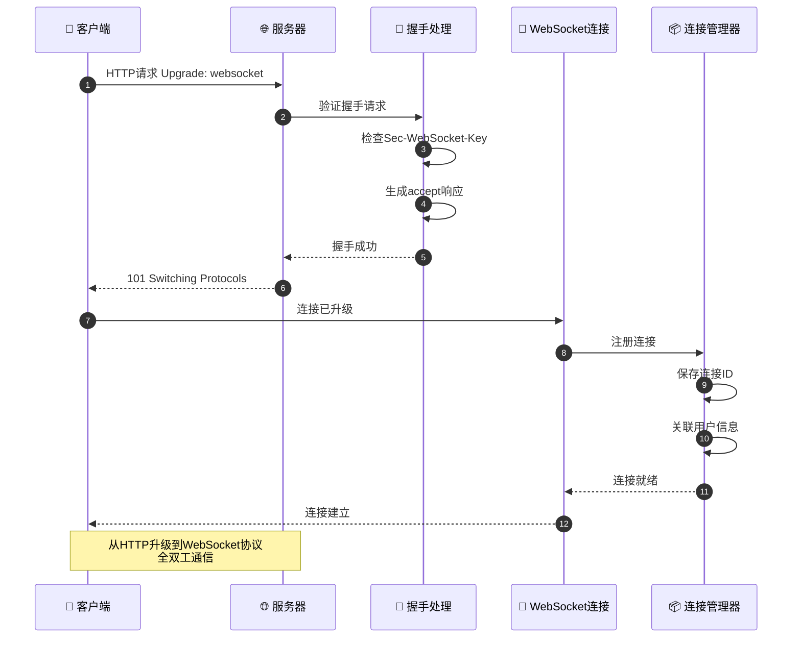
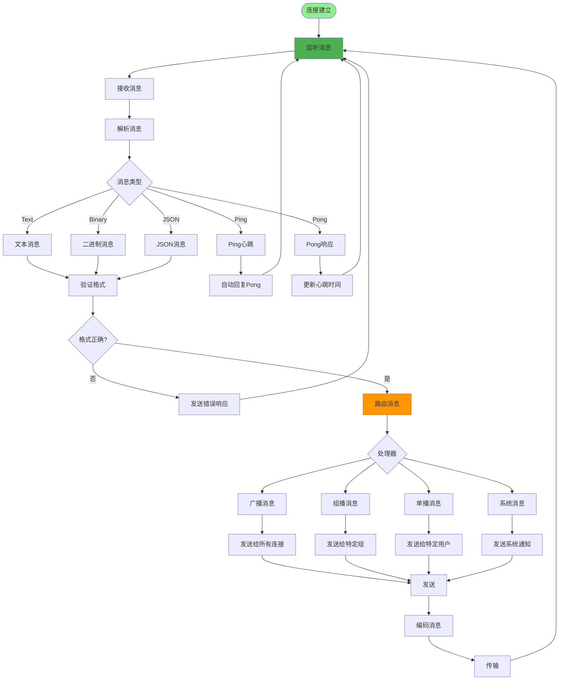
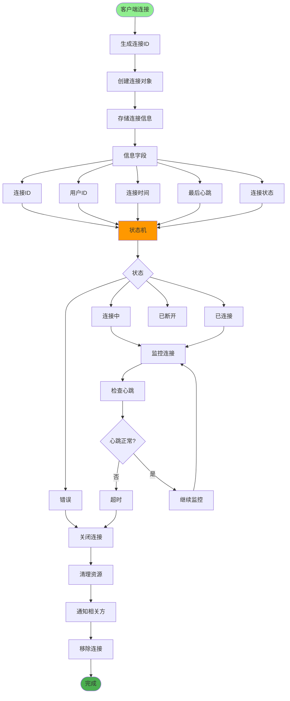
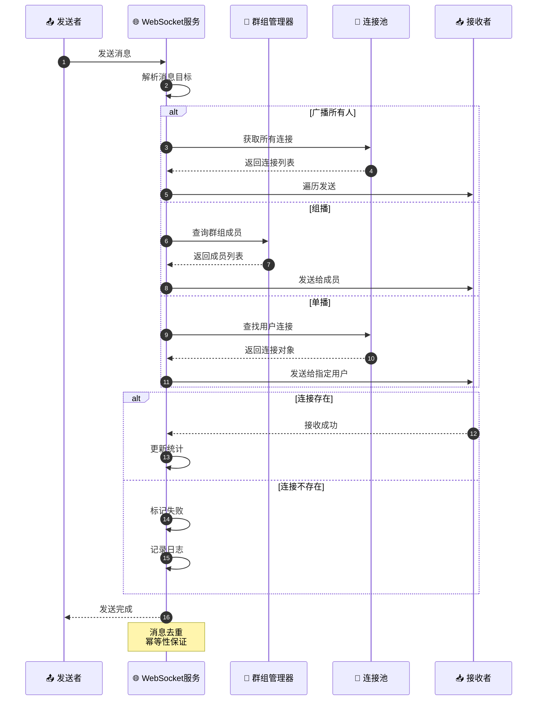
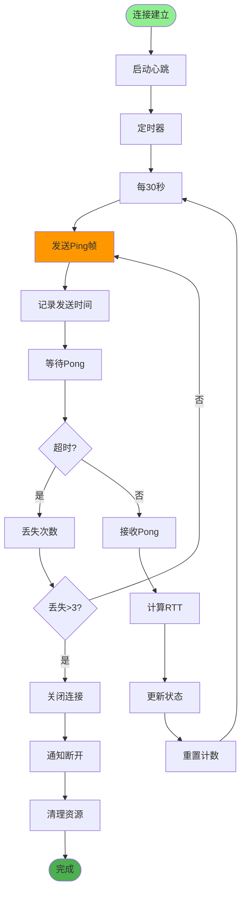
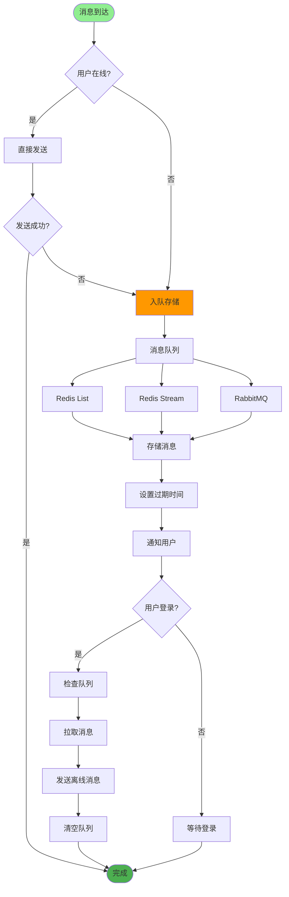
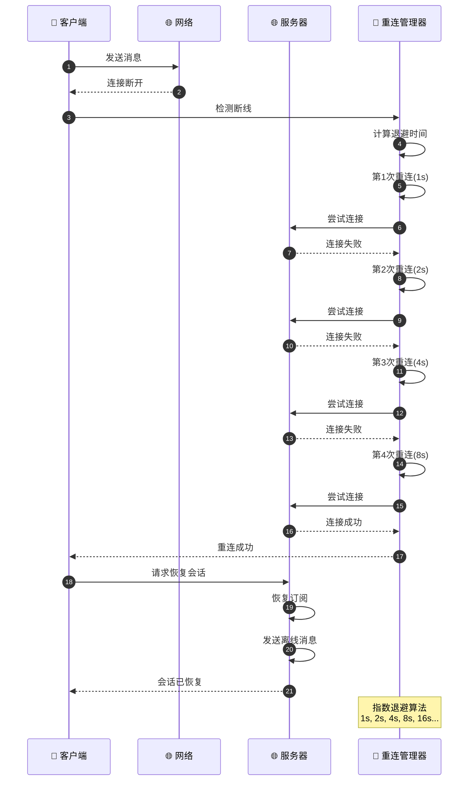
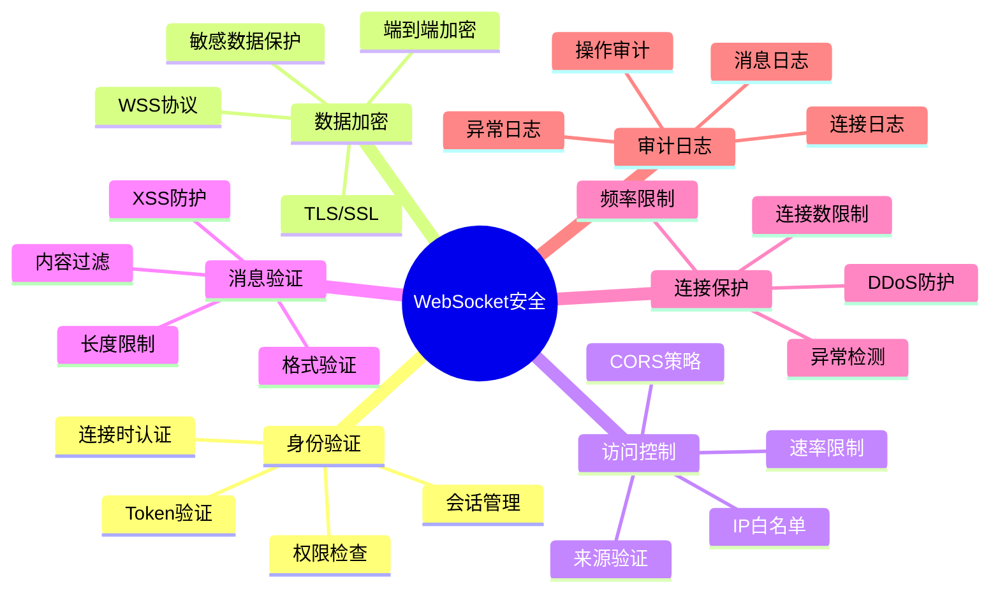
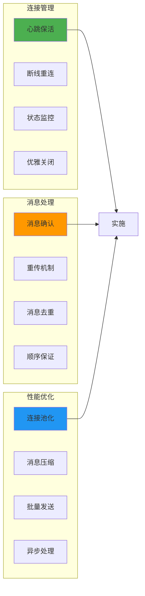

# WebSocket实时通信详解

## 1. WebSocket连接建立流程

## 2. 消息收发机制

## 3. 连接管理与状态

## 4. 广播与组播实现

## 5. 心跳保活机制

## 6. 消息队列与持久化

## 7. 断线重连机制

## 8. WebSocket安全机制

## 关键代码位置

| 功能 | 文件路径 |
|------|---------|
| WebSocket路由 | `router/websocket.py` |
| 连接管理 | `core/websocket_manager.py` |
| 消息处理 | `services/websocket_service.py` |
| 前端WebSocket | `src/utils/websocket.js` |

## 最佳实践

