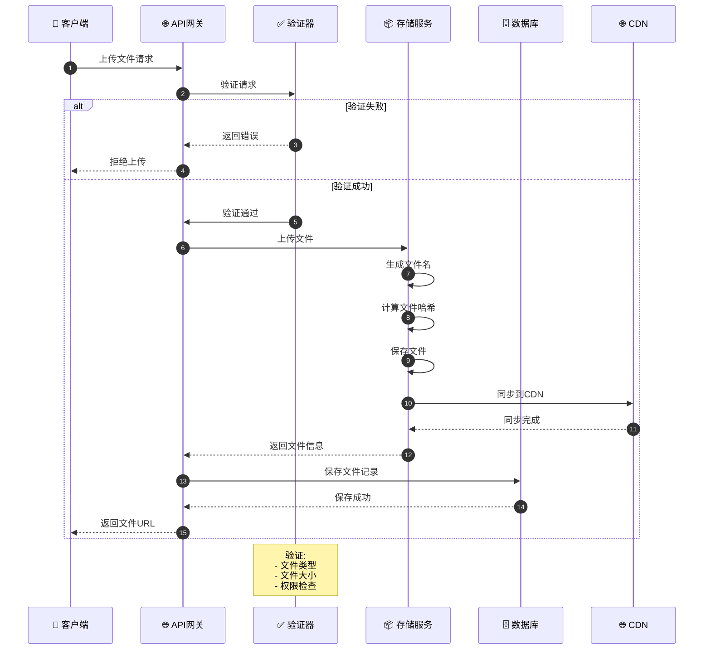
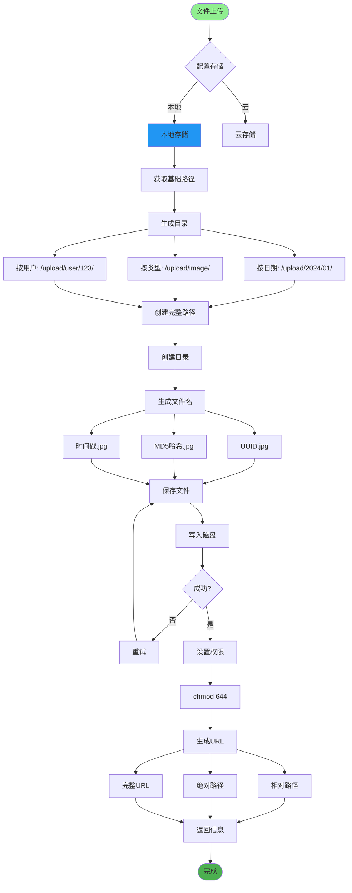
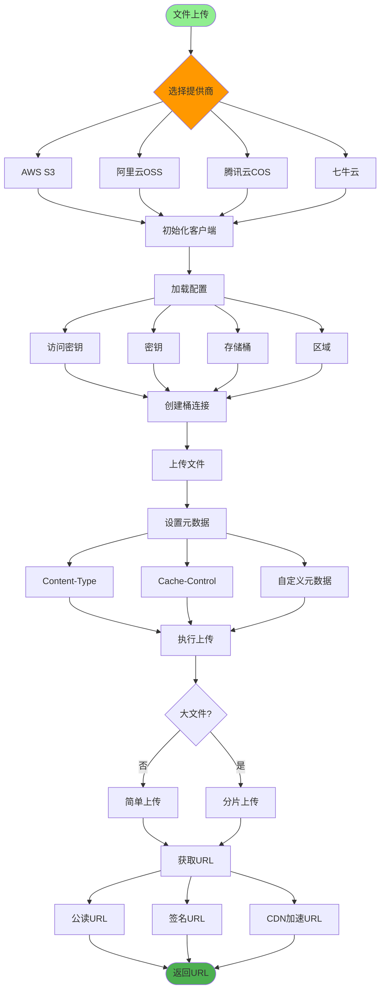
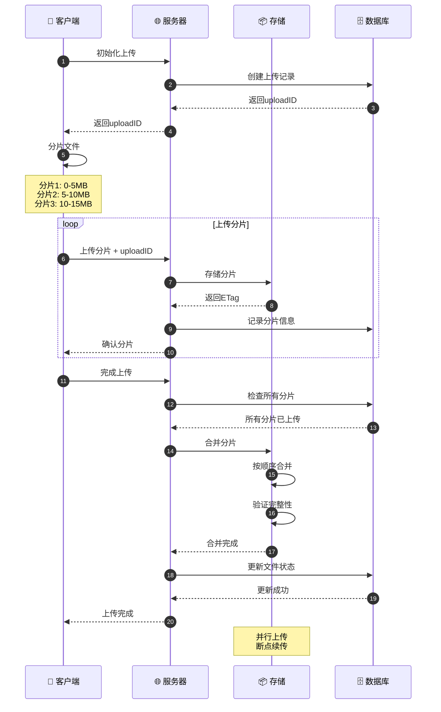
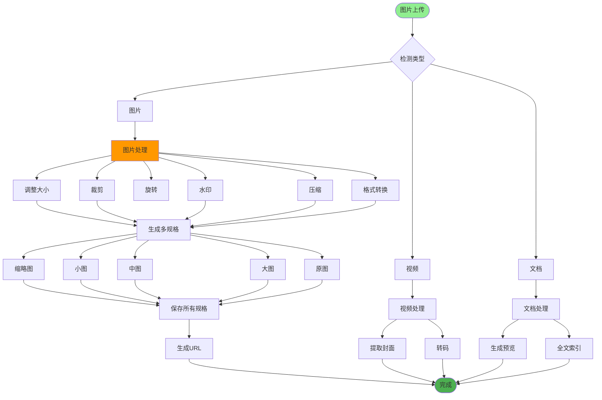
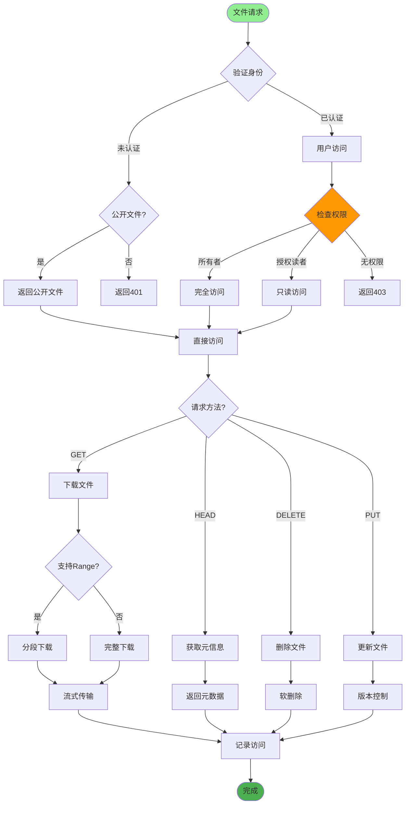
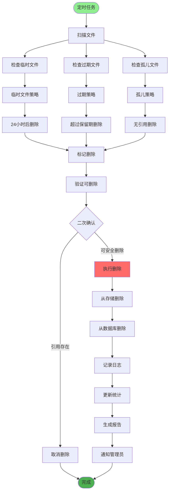
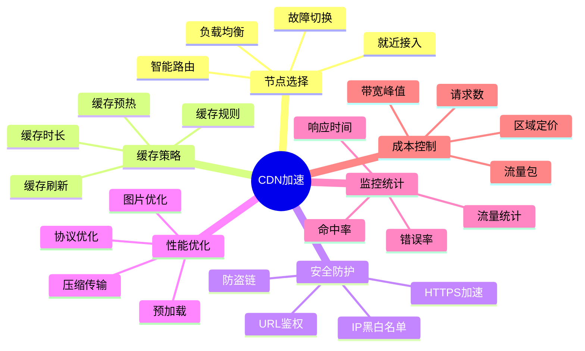
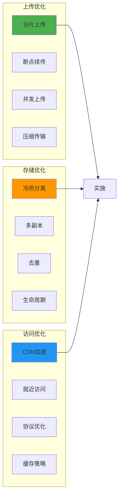

# 文件存储方案详解

## 1. 文件上传流程

## 2. 本地文件存储

## 3. 云存储集成

## 4. 文件分片上传

## 5. 图片处理服务

## 6. 文件访问控制

## 7. 文件清理策略

## 8. CDN加速配置

## 关键代码位置

| 功能 | 文件路径 |
|------|---------|
| 文件上传 | `module_admin/controller/upload_controller.py` |
| 存储服务 | `services/file_storage_service.py` |
| OSS配置 | `config/storage.py` |
| 前端上传 | `src/components/upload/` |

## 最佳实践

