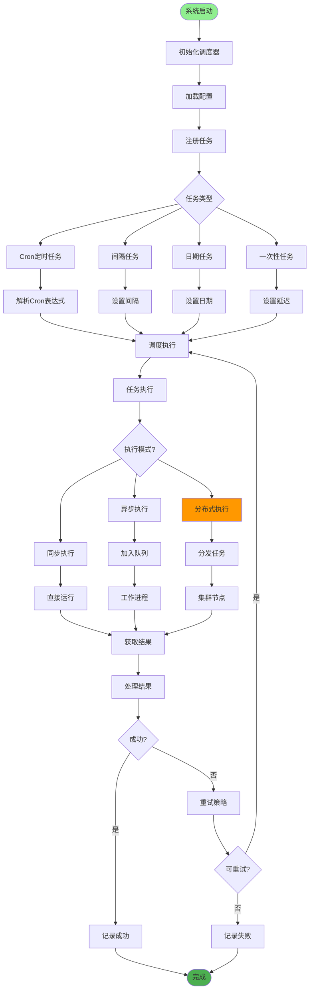
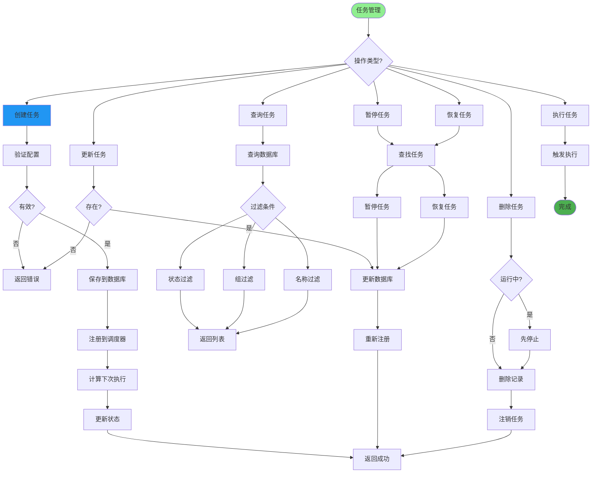
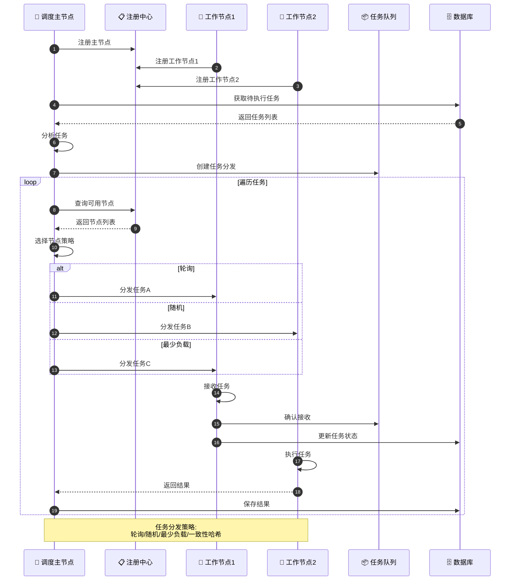
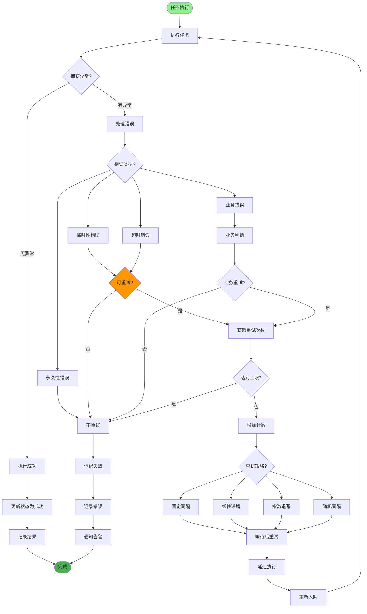
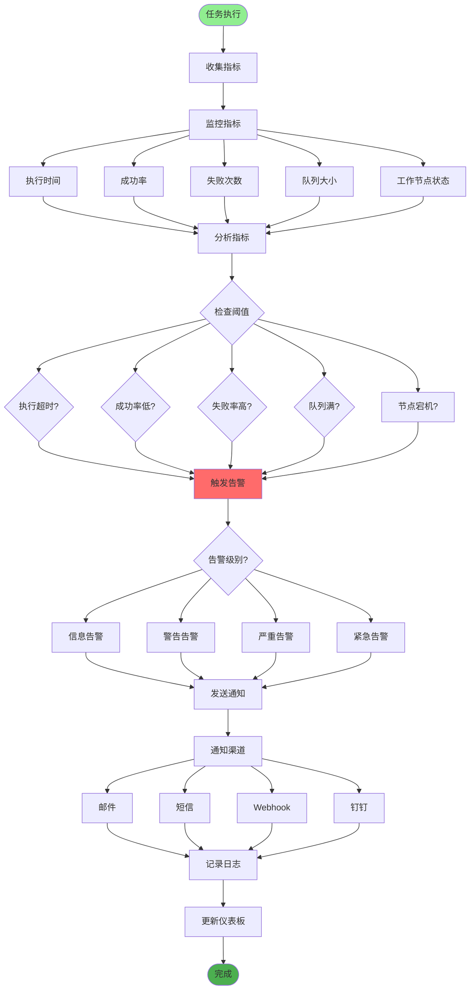
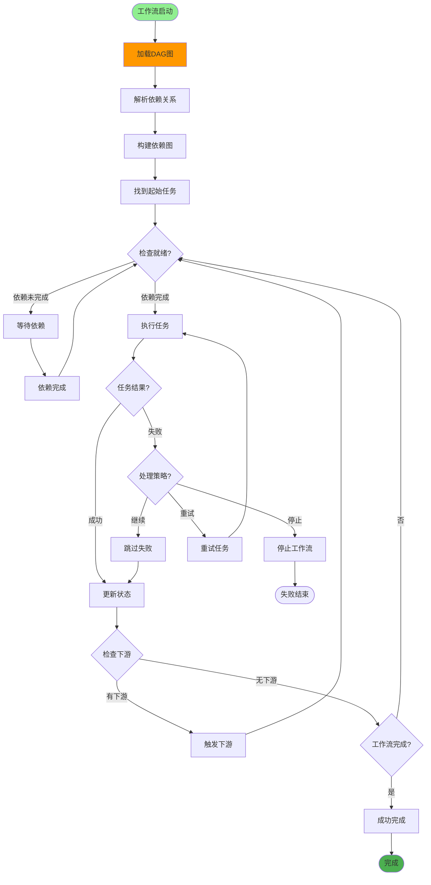
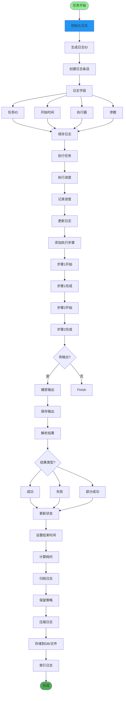
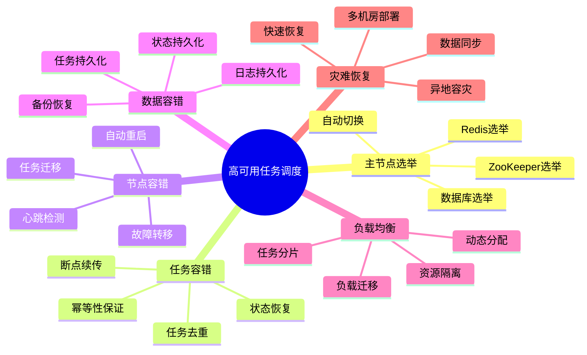
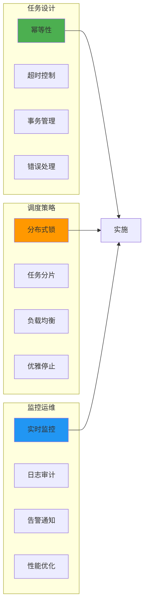

# 分布式任务调度详解

## 1. 任务调度架构

## 2. 定时任务管理

## 3. 分布式任务分发

## 4. 任务失败重试

## 5. 任务监控与告警

## 6. 任务依赖管理

## 7. 任务执行日志

## 8. 高可用与容错

## 关键代码位置

| 功能 | 文件路径 |
|------|---------|
| 任务调度 | `module_admin/controller/job_controller.py` |
| 任务服务 | `module_admin/service/job_service.py` |
| 任务执行 | `core/task_executor.py` |
| 定时配置 | `config/scheduler.py` |

## 最佳实践

