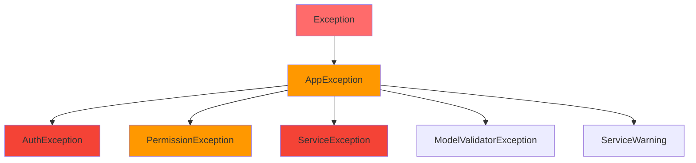
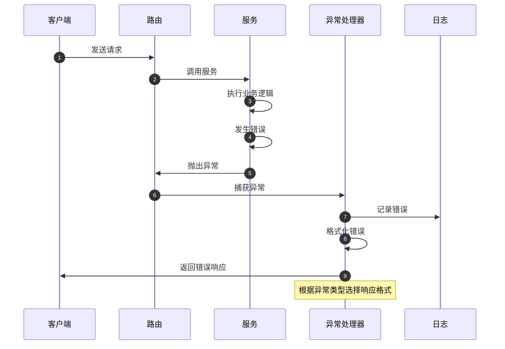

# 异常处理

## 学习目标

- 理解异常处理的重要性
- 掌握全局异常处理器
- 学习自定义异常类
- 理解异常类型和层次
- 掌握异常日志记录

## 1. 异常处理基础

### 1.1 什么是异常处理？

异常处理是指在程序执行过程中，对发生的错误进行捕获、处理和恢复的机制。

**异常处理的目的：**
- 防止程序崩溃
- 提供有意义的错误信息
- 记录错误日志便于调试
- 保证系统稳定性

### 1.2 FastAPI 异常处理

FastAPI 提供了多种异常处理机制：

```python
from fastapi import FastAPI, HTTPException

app = FastAPI()

# 1. HTTPException - 标准HTTP异常
@app.get('/items/{item_id}')
async def read_item(item_id: int):
    if item_id == 0:
        raise HTTPException(
            status_code=404,
            detail='Item not found'
        )
    return {'item_id': item_id}

# 2. 自定义异常处理器
@app.exception_handler(ValueError)
async def value_error_handler(request: Request, exc: ValueError):
    return JSONResponse(
        status_code=400,
        content={'message': str(exc)}
    )
```

## 2. 自定义异常类

### 2.1 异常基类

**文件：** `exceptions/exception.py`

```python
from typing import Any, Optional

class AppException(Exception):
    """应用异常基类"""

    def __init__(
        self,
        message: str,
        code: int = 500,
        data: Any = None
    ):
        self.message = message
        self.code = code
        self.data = data

    def __str__(self):
        return self.message

class AuthException(AppException):
    """认证异常"""

    def __init__(
        self,
        message: str = '认证失败',
        data: Any = None
    ):
        super().__init__(message=message, code=401, data=data)

class PermissionException(AppException):
    """权限异常"""

    def __init__(
        self,
        message: str = '权限不足',
        data: Any = None
    ):
        super().__init__(message=message, code=403, data=data)

class ServiceException(AppException):
    """服务异常"""

    def __init__(
        self,
        message: str = '服务错误',
        data: Any = None
    ):
        super().__init__(message=message, code=500, data=data)

class ModelValidatorException(AppException):
    """模型验证异常"""

    def __init__(
        self,
        message: str = '验证失败',
        data: Any = None
    ):
        super().__init__(message=message, code=400, data=data)
```

### 2.2 异常类层次



## 3. 全局异常处理器

### 3.1 异常处理器注册

**文件：** `exceptions/handle.py:16-108`

```python
from fastapi import FastAPI, Request
from fastapi.exceptions import HTTPException
from exceptions.exception import (
    AuthException,
    LoginException,
    ModelValidatorException,
    PermissionException,
    ServiceException,
    ServiceWarning,
)

def handle_exception(app: FastAPI):
    """
    注册全局异常处理器

    功能：
    - 拦截特定类型的异常
    - 转换为统一响应格式
    - 记录异常日志
    """

    # 1. 认证异常处理
    @app.exception_handler(AuthException)
    async def auth_exception_handler(request: Request, exc: AuthException):
        """
        认证异常处理

        业务场景：Token 过期、签名不合法、解析失败
        响应：401 Unauthorized
        """
        return ResponseUtil.unauthorized(
            data=exc.data,
            msg=exc.message
        )

    # 2. 权限异常处理
    @app.exception_handler(PermissionException)
    async def permission_exception_handler(
        request: Request,
        exc: PermissionException
    ):
        """
        权限异常处理

        业务场景：RBAC/ABAC 权限不足
        响应：403 Forbidden
        """
        return ResponseUtil.forbidden(
            data=exc.data,
            msg=exc.message
        )

    # 3. 服务异常处理
    @app.exception_handler(ServiceException)
    async def service_exception_handler(
        request: Request,
        exc: ServiceException
    ):
        """
        服务异常处理

        业务场景：可预期的服务错误
        响应：500 Internal Server Error
        日志：error（需要重点关注）
        """
        logger.error(exc.message)
        return ResponseUtil.error(
            data=exc.data,
            msg=exc.message
        )

    # 4. 模型验证异常处理
    @app.exception_handler(ModelValidatorException)
    async def model_validator_exception_handler(
        request: Request,
        exc: ModelValidatorException
    ):
        """
        模型验证异常处理

        业务场景：参数验证失败
        响应：400 Bad Request
        日志：warning
        """
        logger.warning(exc.message)
        return ResponseUtil.failure(
            msg=exc.message
        )
```

### 3.2 HTTPException 处理

```python
from fastapi.exceptions import RequestValidationError
from starlette.exceptions import HTTPException as StarletteHTTPException

@app.exception_handler(RequestValidationError)
async def validation_exception_handler(
    request: Request,
    exc: RequestValidationError
):
    """
    Pydantic 验证异常处理

    当请求参数验证失败时触发
    """
    errors = exc.errors()

    # 格式化错误信息
    formatted_errors = [
        {
            'field': '.'.join(str(loc) for loc in error['loc'][1:]),
            'message': error['msg']
        }
        for error in errors
    ]

    return JSONResponse(
        status_code=422,
        content={
            'code': 422,
            'msg': '参数验证失败',
            'data': formatted_errors
        }
    )
```

## 4. 异常处理流程

### 4.1 完整流程



### 4.2 异常分类处理

```python
try:
    # 业务逻辑
    result = await some_business_logic()
except AuthException as e:
    # 认证异常 - 401
    raise HTTPException(status_code=401, detail=str(e))
except PermissionException as e:
    # 权限异常 - 403
    raise HTTPException(status_code=403, detail=str(e))
except ServiceException as e:
    # 服务异常 - 500
    raise HTTPException(status_code=500, detail=str(e))
except Exception as e:
    # 未知异常 - 500
    logger.error(f"未知错误: {e}")
    raise HTTPException(status_code=500, detail='服务器内部错误')
```

## 5. 异常日志记录

### 5.1 日志级别

**文件：** `exceptions/handle.py:72-74`

```python
# 服务异常使用 error 级别
@app.exception_handler(ServiceException)
async def service_exception_handler(request: Request, exc: ServiceException):
    logger.error(exc.message)  # error 级别
    return ResponseUtil.error(msg=exc.message)

# 验证异常使用 warning 级别
@app.exception_handler(ModelValidatorException)
async def model_validator_exception_handler(request: Request, exc: ModelValidatorException):
    logger.warning(exc.message)  # warning 级别
    return ResponseUtil.failure(msg=exc.message)
```

### 5.2 日志格式

```python
import logging

logger = logging.getLogger(__name__)

# 格式化日志
@app.exception_handler(Exception)
async def global_exception_handler(request: Request, exc: Exception):
    """
    全局异常处理
    """
    # 提取请求信息
    method = request.method
    url = request.url.path
    client_ip = request.client.host

    # 记录详细错误
    logger.error(
        f"异常发生: {exc.__class__.__name__}",
        extra={
            'method': method,
            'url': url,
            'client_ip': client_ip,
            'traceback': traceback.format_exc()
        }
    )
```

## 6. 异常处理最佳实践

### 6.1 异常设计原则

```python
# ✅ 好的做法
class BusinessException(Exception):
    """业务异常 - 描述性消息"""
    pass

class UserNotFoundException(BusinessException):
    """用户不存在 - 特定异常"""
    pass

# 使用
if not user:
    raise UserNotFoundException(f"用户 {user_id} 不存在")

# ❌ 不好的做法
# 使用通用异常
if not user:
    raise Exception("用户不存在")  # 太通用
```

### 6.2 异常层次

```python
# 1. 系统异常（底层）
class DatabaseException(Exception):
    """数据库异常"""
    pass

# 2. 服务异常（业务层）
class ServiceException(Exception):
    """服务异常"""
    pass

# 3. API 异常（路由层）
class APIException(HTTPException):
    """API 异常"""
    pass
```

### 6.3 异常处理策略

```python
# 1. 立即失败 - 致命错误
if critical_error:
    raise CriticalException("系统无法继续运行")

# 2. 优雅降级 - 可恢复错误
try:
    result = call_external_api()
except ExternalAPIException:
    # 使用备用方案
    result = get_cached_result()

# 3. 重试机制 - 临时错误
MAX_RETRIES = 3
for attempt in range(MAX_RETRIES):
    try:
        result = retry_operation()
        break
    except TemporaryException:
        if attempt == MAX_RETRIES - 1:
            raise
        await asyncio.sleep(2 ** attempt)  # 指数退避
```

## 7. 项目实战示例

### 7.1 登录异常处理

```python
class LoginService:
    """登录服务"""

    async def login(self, username: str, password: str):
        """用户登录"""

        # 1. 验证用户是否存在
        user = await self.get_user_by_name(username)
        if not user:
            raise LoginException(message='用户不存在')

        # 2. 验证密码
        if not self.verify_password(password, user.password):
            self.record_login_attempt(username, success=False)
            raise LoginException(message='密码错误')

        # 3. 检查账号状态
        if user.status == '1':
            raise LoginException(message='账号已停用')

        # 4. 生成 Token
        token = self.create_token(user)

        return token
```

### 7.2 权限验证异常

```python
from exceptions.exception import PermissionException

def check_permission(user: UserModel, resource: str, action: str):
    """检查权限"""

    # 检查用户是否有权限
    if not user.has_permission(resource, action):
        raise PermissionException(
            message=f'无权限访问 {resource}:{action}',
            data={'resource': resource, 'action': action}
        )
```

### 7.3 数据验证异常

```python
from exceptions.exception import ModelValidatorException
from pydantic import validator

class AddUserModel(BaseModel):
    """添加用户模型"""

    @validator('email')
    def validate_email(cls, v: str) -> str:
        """验证邮箱"""
        if v and '@' not in v:
            raise ModelValidatorException(
                message='邮箱格式不正确',
                data={'field': 'email', 'value': v}
            )
        return v
```

## 8. 异常监控

### 8.1 异常统计

```python
from collections import defaultdict

# 异常统计
exception_stats = defaultdict(int)

@app.exception_handler(Exception)
async def global_exception_handler(request: Request, exc: Exception):
    """全局异常处理 + 统计"""

    # 统计异常类型
    exception_type = exc.__class__.__name__
    exception_stats[exception_type] += 1

    # 记录日志
    logger.error(
        f"[{exception_type}] {str(exc)}",
        extra={
            'exception_stats': dict(exception_stats)
        }
    )

    return JSONResponse(
        status_code=500,
        content={'message': '服务器内部错误'}
    )
```

### 8.2 异常告警

```python
@app.exception_handler(ServiceException)
async def service_exception_handler(request: Request, exc: ServiceException):
    """服务异常 - 触发告警"""

    # 记录日志
    logger.error(f"服务异常: {exc.message}")

    # 发送告警（示例）
    await send_alert(
        level='error',
        title='服务异常',
        message=exc.message,
        extra={
            'url': str(request.url),
            'method': request.method
        }
    )

    return ResponseUtil.error(msg=exc.message)
```

## 9. 总结

### 9.1 异常类型总结

| 异常类型 | 状态码 | 使用场景 | 日志级别 |
|----------|--------|----------|----------|
| `AuthException` | 401 | 认证失败 | warning |
| `PermissionException` | 403 | 权限不足 | warning |
| `ModelValidatorException` | 400 | 验证失败 | warning |
| `LoginException` | 200 | 登录失败 | info |
| `ServiceException` | 500 | 服务错误 | error |
| `HTTPException` | 4xx/5xx | HTTP 异常 | info |

### 9.2 异常处理流程

```
业务代码抛出异常
    ↓
全局异常处理器捕获
    ↓
判断异常类型
    ↓
┌───────────┬───────────┬───────────┐
│           │           │           │
认证异常   权限异常   服务异常   其他
    │           │           │
401        403        500       记录日志
    │           │           │
返回401    返回403    返回500   返回500
```

### 9.3 最佳实践

1. **明确异常类型**：自定义业务异常
2. **有意义的消息**：提供清晰的错误描述
3. **适当的日志级别**：error/warning/info
4. **结构化数据**：附加相关数据便于调试
5. **统一响应格式**：使用 ResponseUtil

## 10. 练习

1. 创建自定义业务异常类
2. 实现全局异常处理器
3. 为异常添加日志记录
4. 实现异常统计和告警
5. 编写异常处理测试用例

## 11. 下一步

完成本节学习后，继续学习：
- **[09-异步编程](./09-异步编程.md)** - 学习异步编程
