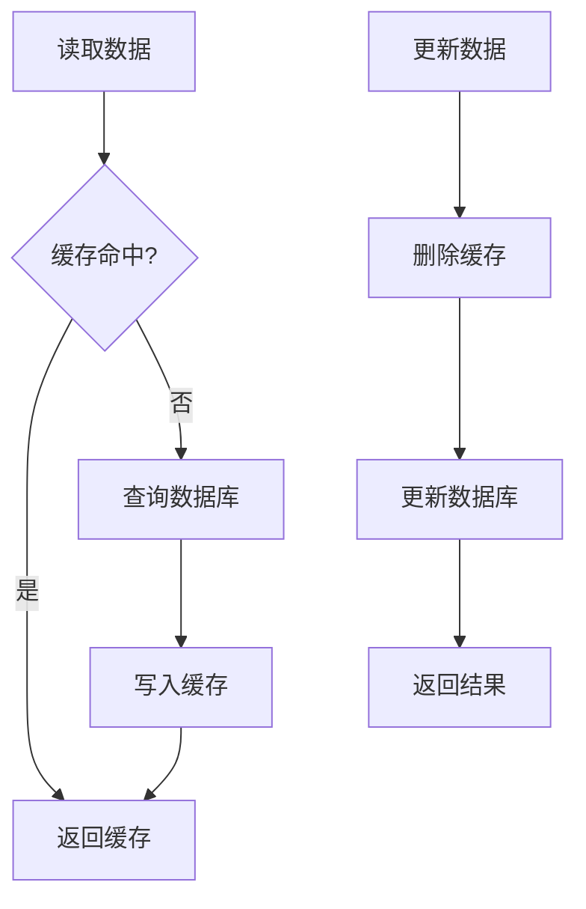

# Redis 缓存

## 学习目标

- 掌握 Redis 连接配置
- 学习缓存数据结构操作
- 理解缓存策略设计
- 掌握分布式锁实现
- 理解缓存更新机制

## 1. Redis 连接配置

### 1.1 Redis 连接池

**文件：** `config/get_redis.py`

```python
import aioredis
from config.env import AppConfig
from typing import Optional

class RedisUtil:
    """Redis 工具类"""

    @staticmethod
    async def create_redis_pool():
        """创建 Redis 连接池"""

        # 创建 Redis 连接池
        redis_pool = aioredis.from_url(
            f"redis://{AppConfig.redis_host}:"
            f"{AppConfig.redis_port}",
            db=AppConfig.redis_db,
            encoding='utf-8',
            decode_responses=True,
            max_connections=50,           # 最大连接数
            socket_keepalive=30,          # 保持连接时间
            socket_connect_timeout=5,     # 连接超时
            socket_timeout=5,             # 读写超时
        )

        return redis_pool

    @staticmethod
    async def close_redis_pool(redis):
        """关闭 Redis 连接"""
        await redis_pool.close()
```

### 1.2 连接使用

```python
from config.get_redis import RedisUtil

async def get_cache_data():
    """获取缓存数据"""
    redis_pool = await RedisUtil.create_redis_pool()

    try:
        # 使用连接池
        value = await redis_pool.get('cache_key')
        return value
    finally:
        # 关闭连接池
        await RedisUtil.close_redis_pool(redis_pool)
```

## 2. 基本缓存操作

### 2.1 字符串缓存

```python
async def cache_user_info(user_id: int, user: dict):
    """缓存用户信息"""
    redis = await get_redis_connection()

    # 设置缓存（1小时过期）
    await redis.setex(
        f'user:info:{user_id}',
        3600,
        json.dumps(user)
    )

async def get_cached_user(user_id: int):
    """获取缓存的用户信息"""
    redis = await get_redis_connection()

    value = await redis.get(f'user:info:{user_id}')

    if value:
        return json.loads(value)
    return None
```

### 2.2 列表缓存

```python
async def cache_user_list(users: list):
    """缓存用户列表"""
    redis = await get_redis_connection()

    await redis.setex(
        'user:list:all',
        1800,
        json.dumps(users)
    )

async def get_cached_user_list():
    """获取缓存的用户列表"""
    redis = await get_redis_connection()

    value = await redis.get('user:list:all')
    return json.loads(value) if value else []
```

### 2.3 Hash 缓存

```python
async def cache_user_detail(user_id: int, user: dict):
    """使用 Hash 缓存用户详情"""

    redis = await get_redis_connection()

    # 设置 Hash 字段
    await redis.hset(
        f'user:detail:{user_id}',
        mapping={
            'user_id': str(user['user_id']),
            'user_name': user['user_name'],
            'nick_name': user['nick_name'],
            'email': user['email']
        }
    )

    # 设置过期时间
    await redis.expire(f'user:detail:{user_id}', 3600)

async def get_cached_user_detail(user_id: int):
    """获取缓存的用户详情"""
    redis = await get_redis_connection()

    # 获取所有字段
    detail = await redis.hgetall(f'user:detail:{user_id}')
    return detail
```

## 3. 缓存策略

### 3.1 Cache-Aside 模式



**实现代码：**

```python
async def get_user_with_cache(user_id: int):
    """Cache-Aside 模式"""
    redis = await get_redis_connection()
    cache_key = f'user:info:{user_id}'

    # 1. 尝试从缓存获取
    cached = await redis.get(cache_key)

    if cached:
        return json.loads(cached)

    # 2. 缓存未命中，查询数据库
    user = await get_user_from_db(user_id)

    # 3. 写入缓存
    await redis.setex(
        cache_key,
        3600,  # 1小时过期
        json.dumps(user)
    )

    return user
```

### 3.2 缓存更新策略

```python
async def update_user(user_id: int, update_data: dict):
    """更新用户信息"""

    # 1. 更新数据库
    await update_user_in_db(user_id, update_data)

    # 2. 删除相关缓存
    redis = await get_redis_connection()

    # 删除单个用户缓存
    await redis.delete(f'user:info:{user_id}')

    # 删除列表缓存
    await redis.delete('user:list:all')

    # 3. 返回结果
    return {'message': '更新成功'}
```

## 4. 分布式锁

### 4.1 加锁机制

```python
import uuid

async def acquire_lock(lock_name: str, timeout: int = 10):
    """获取分布式锁"""
    redis = await get_redis_connection()

    # 生成唯一标识
    lock_value = str(uuid.uuid4())

    # 尝试获取锁
    acquired = await redis.set(
        f'lock:{lock_name}',
        lock_value,
        nx=True,       # 只在键不存在时设置
        ex=timeout    # 过期时间
    )

    return acquired, lock_value

async def release_lock(lock_name: str, lock_value: str):
    """释放分布式锁"""
    redis = await get_redis_connection()

    # 使用 Lua 脚本确保原子性
    script = """
    if redis.call('get', KEYS[1]) == ARGV[1] then
        return redis.call('del', KEYS[1])
    end
    return 0
    """

    result = await redis.eval(
        script,
        1,
        [f'lock:{lock_name}', lock_value]
    )

    return result
```

### 4.2 锁的使用

```python
async def transfer_money_with_lock(
    from_user: int,
    to_user: int,
    amount: int
):
    """带锁的转账操作"""
    lock_name = f'transfer:{from_user}:{to_user}'

    # 获取锁
    acquired, lock_value = await acquire_lock(lock_name, timeout=10)

    if not acquired:
        raise ServiceException('操作繁忙，请稍后再试')

    try:
        # 执行转账逻辑
        await deduct(from_user, amount)
        await add(to_user, amount)

    finally:
        # 释放锁
        await release_lock(lock_name, lock_value)
```

## 5. 缓存预热

### 5.1 系统启动预热

**文件：** `config/get_redis.py`

```python
class RedisUtil:
    """Redis 工具类"""

    @staticmethod
    async def init_sys_dict(redis):
        """初始化系统字典到缓存"""
    # 查询所有字典
    dict_list = await db.execute(select(SysDict))

    # 写入 Redis
    for dict_item in dict_list:
        await redis.hset(
            f'sys:dict:{dict_item.dict_code}',
            mapping={
                'dict_code': dict_item.dict_code,
                'dict_label': dict_item.dict_label,
                'dict_type': dict_item.dict_type,
                'is_default': dict_item.is_default,
                'status': dict_item.status
            }
        )

    logger.info('系统字典已加载到 Redis')
```

### 5.2 缓存更新

```python
@router.post('/dict/refresh')
async def refresh_dict_cache():
    """刷新字典缓存"""

    # 清除旧缓存
    redis = await get_redis_connection()
    keys = await redis.keys('sys:dict:*')

    if keys:
        await redis.delete(*keys)

    # 重新加载
    await RedisUtil.init_sys_dict(app.state.redis)

    return {'message': '字典缓存已刷新'}
```

## 6. 缓存穿透保护

```python
async def get_with_protection(key: str):
    """带保护的缓存获取"""

    redis = await get_redis_connection()

    # 1. 查询缓存
    cached = await redis.get(key)

    if cached:
        return json.loads(cached)

    # 2. 查询数据库
    result = await query_from_db(key)

    if result is None:
        # 3. 缓存空值，防止缓存穿透
        await redis.setex(key, 300, '')  # 5分钟过期
        return None

    # 4. 缓存结果
    await redis.setex(key, 3600, json.dumps(result))

    return result
```

## 7. 总结

### 7.1 Redis 数据结构

| 结构 | 使用场景 | 命令 |
|------|----------|------|
| **String** | 简单值缓存 | GET, SET |
| **Hash** | 对象字段缓存 | HGET, HSET |
| **List** | 列表数据 | LPUSH, LRANGE |
| **Set** | 唯一集合 | SADD, SMEMBERS |
| **ZSet** | 有序集合 | ZADD, ZRANGE |

### 7.2 缓存最佳实践

1. **设置过期时间**：避免内存溢出
2. **使用合理的数据结构**：选择合适的 Redis 类型
3. **缓存预热**：系统启动时加载热点数据
4. **缓存更新策略**：先更新数据库，再删除缓存
5. **分布式锁**：保证并发安全

## 8. 下一步

完成本节学习后，继续学习：
- **[13-文件上传处理](./13-文件上传处理.md)** - 学习文件上传
