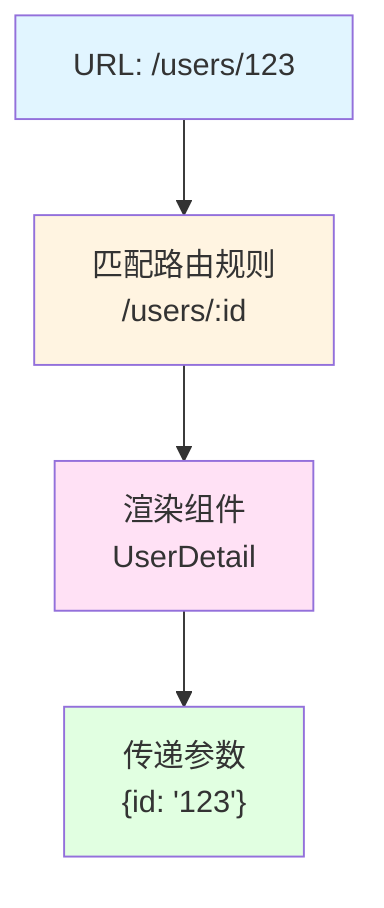
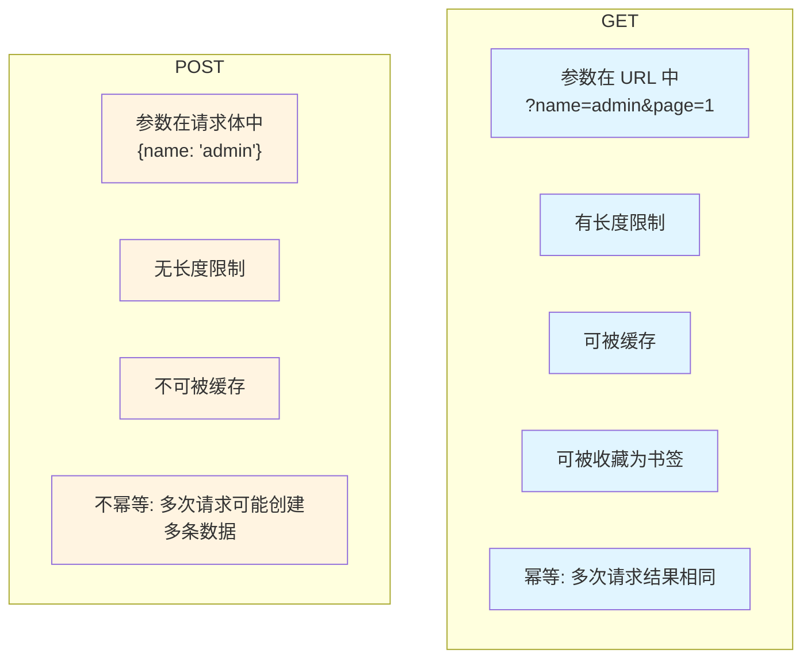
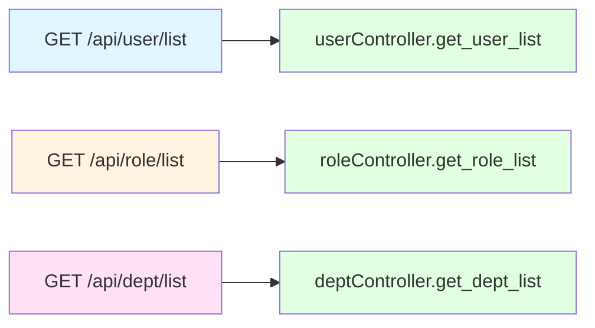

# 接口设计：函数即路由

> 前端用 Vue Router 把 URL 映射到组件，后端用路由把 URL 映射到函数。理解路由的本质，你就理解了后端接口设计。

## 前端类比：Vue Router

### 你熟悉的代码

```typescript
// 前端路由配置
const routes = [
  { path: '/users/:id', component: UserDetail },
  { path: '/users', component: UserList }
]

// 访问 /users/123 会渲染 UserDetail 组件
```

### Vue Router 的本质

**URL → 组件的映射**：



---

## 后端路由：同样的概念

### 基本路由

```python
from fastapi import APIRouter

# 创建路由组
userController = APIRouter(prefix='/user', tags=['用户管理'])

# 路由定义
@userController.get("/list")
async def get_user_list():
    return {"code": 200, "rows": []}

@userController.get("/{user_id}")
async def get_user_detail(user_id: int):
    return {"code": 200, "data": {"userId": user_id}}
```

**后端路由的本质**：

```mermaid
flowchart TB
    A[URL: /api/user/list] --> B["匹配路由规则
    GET /user/list"]
    B --> C["调用函数
    get_user_list"]
    C --> D["返回响应
    {""code"": 200, ...}"]

    style A fill:#e1f5ff
    style B fill:#fff4e1
    style C fill:#ffe1f5
    style D fill:#e1ffe1
```

---

## 核心 1：HTTP 方法的正确使用

### RESTful 风格

| 方法 | 语义 | 前端调用 | 后端路由 |
|------|------|----------|----------|
| GET | 查询 | `axios.get('/api/users')` | `@app.get("/users")` |
| POST | 创建 | `axios.post('/api/users', {...})` | `@app.post("/users")` |
| PUT | 更新 | `axios.put('/api/users/1', {...})` | `@app.put("/users/{id}")` |
| DELETE | 删除 | `axios.delete('/api/users/1')` | `@app.delete("/users/{id}")` |

### GET vs POST 的本质区别



### 项目中的约定

```python
# 列表查询用 POST（支持复杂条件）
@userController.post("/list")
async def get_user_list(query: UserQuery):
    pass

# 详情查询用 GET
@userController.get("/{user_id}")
async def get_user_detail(user_id: int):
    pass

# 创建用 POST
@userController.post("/")
async def create_user(user: UserCreate):
    pass

# 更新用 PUT
@userController.put("/{user_id}")
async def update_user(user_id: int, user: UserUpdate):
    pass

# 删除用 DELETE
@userController.delete("/{user_id}")
async def delete_user(user_id: int):
    pass
```

---

## 核心 2：路由参数的接收方式

### 路径参数

**前端**：
```typescript
// 访问 /users/123
axios.get(`/api/users/${userId}`)
```

**后端**：
```python
@userController.get("/{user_id}")
async def get_user(user_id: int):  # 自动转换为 int
    return {"userId": user_id}
```

### 查询参数

**前端**：
```typescript
// 访问 /users?page=1&size=10
axios.get('/api/users', { params: { page: 1, size: 10 } })
```

**后端**：
```python
@userController.get("/list")
async def get_user_list(
    page: int = 1,      # 默认值 1
    size: int = 10      # 默认值 10
):
    return {"page": page, "size": size}
```

### 请求体参数

**前端**：
```typescript
axios.post('/api/users', {
  userName: 'admin',
  email: 'admin@example.com'
})
```

**后端**：
```python
class UserCreate(BaseModel):
    userName: str
    email: str

@userController.post("/users")
async def create_user(user: UserCreate):
    # user.userName = 'admin'
    # user.email = 'admin@example.com'
    pass
```

### 表单参数

**前端**：
```typescript
const formData = new FormData()
formData.append('file', file)
axios.post('/api/upload', formData)
```

**后端**：
```python
@userController.post("/upload")
async def upload_file(file: UploadFile):
    # file.filename
    # file.file
    pass
```

---

## 核心 3：路由分组与模块化

### 前端路由分组

```typescript
// 前端按功能模块分组
const routes = [
  {
    path: '/system',
    children: [
      { path: 'user', component: UserList },
      { path: 'role', component: RoleList },
      { path: 'dept', component: DeptList }
    ]
  }
]
```

### 后端路由分组

```python
# module_admin/controller/user_controller.py
userController = APIRouter(prefix='/user', tags=['用户管理'])

@userController.post("/list")
async def get_user_list():
    pass

# module_admin/controller/role_controller.py
roleController = APIRouter(prefix='/role', tags=['角色管理'])

@roleController.post("/list")
async def get_role_list():
    pass

# module_admin/controller/dept_controller.py
deptController = APIRouter(prefix='/dept', tags=['部门管理'])

@deptController.post("/list")
async def get_dept_list():
    pass
```

### 路由挂载

```python
# server.py
from fastapi import FastAPI
from module_admin.controller import user_controller, role_controller

app = FastAPI()

# 挂载子应用
app.include_router(userController.router, prefix='/api')
app.include_router(roleController.router, prefix='/api')
```

**最终 URL**：



**前端类比**：
```typescript
// 前端也这样挂载
app.use('/system', systemRouter)
```

---

## 核心 4：Controller 的职责

### 单一职责原则

```python
# ❌ 错误：Controller 做了太多事
@userController.post("/login")
async def login(request_data: LoginRequest):
    # 1. 验证参数
    if not request_data.username:
        return {"code": 400, "msg": "用户名不能为空"}

    # 2. 查询数据库
    result = await db.execute(select(SysUser).where(...))
    user = result.scalar_one_or_none()

    # 3. 验证密码
    if not verify_password(request_data.password, user.password):
        return {"code": 401, "msg": "密码错误"}

    # 4. 生成 Token
    token = create_jwt(user)

    # 5. 记录日志
    await log_service.add_log(...)

    return {"code": 200, "token": token}
```

```python
# ✅ 正确：Controller 只负责接收和返回
@userController.post("/login")
async def login(
    request: Request,
    request_data: LoginRequest,
    query_db: AsyncSession = Depends(get_db)
):
    # 1. 调用 Service 处理业务逻辑
    token = await login_service.login(
        query_db,
        request_data.username,
        request_data.password,
        request.state.ip
    )

    # 2. 返回结果
    return {"code": 200, "token": token}
```

### Controller 的核心职责

| 职责 | 说明 | 示例 |
|------|------|------|
| 接收请求 | 解析参数、验证数据 | `query: UserQuery` |
| 调用 Service | 委托业务逻辑处理 | `await user_service.get_list()` |
| 返回响应 | 统一格式、状态码 | `return Resp.success(data)` |
| 处理异常 | 捕获并转换异常 | `try-except` |

### Controller 不应该做的事

❌ **不应该**：
- 直接操作数据库（应该调用 Service）
- 复杂的业务逻辑（应该在 Service）
- 密码加密等安全处理（应该在 Service）
- 详细的日志记录（可以用装饰器）

✅ **应该**：
- 接收和验证请求参数
- 调用 Service 处理业务
- 格式化返回数据
- 处理 HTTP 层面的异常

---

## 核心 5：参数校验的层级

### 第一层：Pydantic 自动校验

```python
class UserQuery(BaseModel):
    userName: str = Field(min_length=3, max_length=30)
    pageNum: int = Field(ge=1, le=100)

@userController.post("/list")
async def get_user_list(query: UserQuery):
    # 如果 userName 长度 < 3，FastAPI 自动返回 400 错误
    # 如果 pageNum > 100，FastAPI 自动返回 400 错误
    pass
```

### 第二层：业务逻辑校验

```python
@userController.post("/")
async def create_user(
    user: UserCreate,
    query_db: AsyncSession = Depends(get_db)
):
    # 检查用户名是否已存在
    existing = await user_service.get_by_username(
        query_db, user.userName
    )
    if existing:
        raise BusinessException("用户名已存在", code=400)

    # 创建用户
    new_user = await user_service.create(query_db, user)
    return Resp.success(data=new_user)
```

### 第三层：权限校验

```python
from module_admin.annotation.auth import Auth

@userController.delete("/{user_id}")
@Auth(level="system:user:remove")  # 需要删除权限
async def delete_user(
    user_id: int,
    query_db: AsyncSession = Depends(get_db)
):
    # 有权限才执行
    await user_service.delete(query_db, user_id)
    return Resp.success(msg="删除成功")
```

---

## 核心 6：接口设计的最佳实践

### 1. 统一的响应格式

```python
# module_admin/common/response.py
class Resp:
    @staticmethod
    def success(data=None, msg="操作成功"):
        return {"code": 200, "msg": msg, "rows": data}

    @staticmethod
    def error(msg="操作失败", code=500):
        return {"code": code, "msg": msg}

# 使用
@userController.get("/list")
async def get_user_list():
    users = await user_service.get_list()
    return Resp.success(data=users)  # 统一格式
```

### 2. 分页接口设计

```python
@userController.post("/list")
async def get_user_list(
    query: UserQuery,
    query_db: AsyncSession = Depends(get_db)
):
    # 查询数据
    users, total = await user_service.get_list(
        query_db,
        page_num=query.pageNum,
        page_size=query.pageSize
    )

    # 返回分页信息
    return Resp.success(data=users, msg=f"共 {total} 条")
```

**前端接收**：
```typescript
const { data } = await axios.post('/api/user/list', {
  pageNum: 1,
  pageSize: 10
})
// data = { code: 200, rows: [...], msg: "共 100 条" }
```

### 3. 批量操作接口

```python
@userController.delete("/")
async def delete_users(user_ids: List[int]):
    # 前端传递: [1, 2, 3]
    count = await user_service.delete_batch(user_ids)
    return Resp.success(msg=f"删除了 {count} 条数据")
```

### 4. 树形结构接口

```python
@deptController.get("/tree")
async def get_dept_tree(query_db: AsyncSession = Depends(get_db)):
    # 查询所有部门
    depts = await dept_service.get_all(query_db)

    # 构建树形结构
    tree = build_tree(depts)

    return Resp.success(data=tree)
```

**返回格式**：
```json
{
  "code": 200,
  "rows": [
    {
      "id": 1,
      "name": "总公司",
      "children": [
        { "id": 2, "name": "研发部", "children": [] },
        { "id": 3, "name": "市场部", "children": [] }
      ]
    }
  ]
}
```

---

## 实战：设计一个完整的 CRUD 接口

### 需求：文章管理接口

#### 1. 列表查询（分页）

```python
@articleController.post("/list")
async def get_article_list(
    query: ArticleQuery,
    query_db: AsyncSession = Depends(get_db)
):
    articles, total = await article_service.get_list(
        query_db,
        title=query.title,
        category_id=query.categoryId,
        page_num=query.pageNum,
        page_size=query.pageSize
    )
    return Resp.success(data=articles, msg=f"共 {total} 篇")
```

#### 2. 详情查询

```python
@articleController.get("/{article_id}")
async def get_article_detail(
    article_id: int,
    query_db: AsyncSession = Depends(get_db)
):
    article = await article_service.get_by_id(query_db, article_id)
    if not article:
        raise BusinessException("文章不存在", code=404)

    # 增加阅读量
    await article_service.increment_views(query_db, article_id)

    return Resp.success(data=ArticleVO.model_validate(article))
```

#### 3. 创建

```python
@articleController.post("/")
@Auth(level="system:article:add")
async def create_article(
    article: ArticleCreate,
    query_db: AsyncSession = Depends(get_db)
):
    new_article = await article_service.create(query_db, article)
    return Resp.success(data=new_article, msg="创建成功")
```

#### 4. 更新

```python
@articleController.put("/{article_id}")
@Auth(level="system:article:edit")
async def update_article(
    article_id: int,
    article: ArticleUpdate,
    query_db: AsyncSession = Depends(get_db)
):
    # 检查是否存在
    existing = await article_service.get_by_id(query_db, article_id)
    if not existing:
        raise BusinessException("文章不存在", code=404)

    # 更新
    await article_service.update(query_db, article_id, article)
    return Resp.success(msg="更新成功")
```

#### 5. 删除

```python
@articleController.delete("/{article_id}")
@Auth(level="system:article:remove")
async def delete_article(
    article_id: int,
    query_db: AsyncSession = Depends(get_db)
):
    await article_service.delete(query_db, article_id)
    return Resp.success(msg="删除成功")
```

#### 6. 批量删除

```python
@articleController.delete("/")
@Auth(level="system:article:remove")
async def delete_articles(
    article_ids: List[int],
    query_db: AsyncSession = Depends(get_db)
):
    count = await article_service.delete_batch(query_db, article_ids)
    return Resp.success(msg=f"删除了 {count} 篇文章")
```

---

## 本质总结

### 路由的本质

```
URL → 路由匹配 → 函数调用 → 返回响应
```

### Controller 的本质

```
接收请求 → 调用 Service → 返回响应
```

### 接口设计的核心原则

1. **RESTful 风格**：正确使用 HTTP 方法
2. **统一格式**：响应格式一致
3. **单一职责**：Controller 只负责接收和返回
4. **参数验证**：多层验证确保数据安全
5. **权限控制**：使用装饰器实现权限校验

---

## 检查清单

理解了本节内容，你应该能回答：

- [ ] 后端路由和前端路由的异同点是什么？
- [ ] GET 和 POST 的本质区别是什么？
- [ ] 路径参数、查询参数、请求体参数的区别是什么？
- [ ] Controller 的职责是什么？不应该做什么？
- [ ] 如何设计一个符合 RESTful 风格的 CRUD 接口？
- [ ] 如何实现路由分组和模块化？

**下一步**：学习 [依赖管理：比 Hooks 更强大](./04-依赖管理-比hooks更强大.md)
