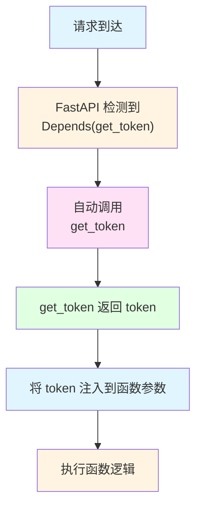
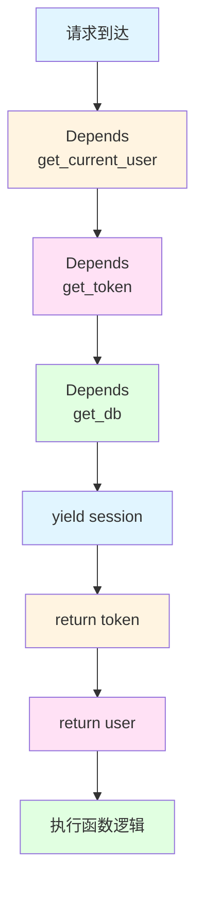

# 依赖管理：比 Hooks 更强大

> React Hooks 让组件复用逻辑，FastAPI 的依赖注入让函数复用逻辑。理解依赖注入，你就理解了后端的解耦艺术。

## 前端类比：React Hooks

### 你熟悉的代码

```typescript
// 前端：用 Hooks 复用逻辑
function useUserInfo() {
  const [user, setUser] = useState(null)
  const [loading, setLoading] = useState(false)

  useEffect(() => {
    fetchUserInfo().then(setUser)
  }, [])

  return { user, loading }
}

// 在组件中使用
function UserProfile() {
  const { user, loading } = useUserInfo()  // 注入依赖

  if (loading) return <div>Loading...</div>
  return <div>{user.name}</div>
}
```

### Hooks 的作用

1. **逻辑复用**：把通用逻辑提取成 Hook
2. **自动执行**：组件渲染时自动调用 Hook
3. **解耦组件**：组件不需要知道如何获取数据

---

## 后端：依赖注入 (Dependency Injection)

### 基本概念

**依赖注入 = 函数的参数自动管理**

```python
# 没有依赖注入（手动管理）
@app.get("/users")
async def get_users():
    # 手动创建数据库连接
    db = AsyncSessionLocal()
    try:
        users = await db.execute(select(SysUser))
        return users
    finally:
        await db.close()  # 手动关闭

# 有依赖注入（自动管理）
async def get_db():
    async with AsyncSessionLocal() as session:
        yield session  # 提供给函数使用
    # 自动关闭

@app.get("/users")
async def get_users(db: AsyncSession = Depends(get_db)):
    # FastAPI 自动调用 get_db()
    # 并将结果注入到 db 参数
    users = await db.execute(select(SysUser))
    return users
```

---

## 核心 1：Depends 的本质

### 前端类比

```typescript
// 前端：函数参数
function getUserInfo(userId: number, token: string) {
  // userId 和 token 由调用者提供
  return fetch(`/api/users/${userId}`, {
    headers: { Authorization: token }
  })
}

// 调用时必须传参
getUserInfo(1, 'xxx')
```

### 后端：Depends

```python
# 后端：依赖注入
def get_token(request: Request):
    # 从请求头提取 token
    auth = request.headers.get('Authorization')
    return auth.replace('Bearer ', '')

@app.get("/users/{user_id}")
async def get_user(
    user_id: int,
    token: str = Depends(get_token)  # 自动注入
):
    # FastAPI 自动调用 get_token(request)
    # 并将返回值注入到 token 参数
    pass
```

### Depends 的工作流程



---

## 核心 2：依赖注入的价值

### 价值 1：自动资源管理

```python
# 方案 A：手动管理（容易出错）
@app.get("/users")
async def get_users():
    db = AsyncSessionLocal()
    # 忘记关闭会导致连接泄漏
    users = await db.execute(select(SysUser))
    await db.close()
    return users

# 方案 B：依赖注入（自动管理）
async def get_db():
    async with AsyncSessionLocal() as session:
        yield session
    # 自动关闭，即使发生异常

@app.get("/users")
async def get_users(db: AsyncSession = Depends(get_db)):
    users = await db.execute(select(SysUser))
    return users
```

**前端类比**：
```typescript
// 前端也用 useEffect 自动管理资源
useEffect(() => {
  const timer = setInterval(() => {}, 1000)
  return () => clearInterval(timer)  // 自动清理
}, [])
```

### 价值 2：逻辑复用

```python
# 提取通用逻辑：获取当前用户
async def get_current_user(
    token: str = Depends(get_token),
    db: AsyncSession = Depends(get_db)
):
    # 根据 token 查询用户
    payload = decode_jwt(token)
    user = await db.get(SysUser, payload['user_id'])
    return user

# 在多个接口中复用
@app.get("/profile")
async def get_profile(user: SysUser = Depends(get_current_user)):
    return user  # 当前登录用户

@app.put("/profile")
async def update_profile(
    data: ProfileUpdate,
    user: SysUser = Depends(get_current_user)
):
    # user 已经是当前登录用户
    await update_user(user, data)
    return user
```

**前端类比**：
```typescript
// 前端也用 Hooks 复用逻辑
function useCurrentUser() {
  const [user, setUser] = useState(null)
  // 获取当前用户逻辑
  return { user }
}

// 在多个组件中复用
function Profile() {
  const { user } = useCurrentUser()
  return <div>{user.name}</div>
}
```

### 价值 3：代码解耦

```python
# ❌ 耦合：每个函数都重复代码
@app.get("/users")
async def get_users(request: Request):
    # 重复：提取 token
    auth = request.headers.get('Authorization')
    token = auth.replace('Bearer ', '')

    # 重复：验证 token
    payload = decode_jwt(token)

    # 业务逻辑
    pass

# ✅ 解耦：用依赖注入
def get_token(request: Request):
    auth = request.headers.get('Authorization')
    return auth.replace('Bearer ', '')

@app.get("/users")
async def get_users(token: str = Depends(get_token)):
    # token 已经提取好
    payload = decode_jwt(token)
    pass
```

---

## 核心 3：依赖的嵌套

### 前端类比

```typescript
// Hook 可以调用其他 Hook
function useAuth() {
  const [token, setToken] = useState(null)
  return { token }
}

function useUser() {
  const { token } = useAuth()  // 嵌套调用
  const [user, setUser] = useState(null)
  // 用 token 获取用户
  return { user }
}
```

### 后端：依赖链

```python
# 依赖 1：获取数据库会话
async def get_db():
    async with AsyncSessionLocal() as session:
        yield session

# 依赖 2：获取 token（依赖 1）
async def get_token(
    request: Request,
    db: AsyncSession = Depends(get_db)  # 嵌套依赖
):
    auth = request.headers.get('Authorization')
    token = auth.replace('Bearer ', '')

    # 用 db 验证 token 是否有效
    if not await validate_token(db, token):
        raise HTTPException(401, "Invalid token")

    return token

# 依赖 3：获取当前用户（依赖 2）
async def get_current_user(
    token: str = Depends(get_token),  # 嵌套依赖
    db: AsyncSession = Depends(get_db)
):
    payload = decode_jwt(token)
    return await db.get(SysUser, payload['user_id'])

# 使用：自动执行整个依赖链
@app.get("/profile")
async def get_profile(
    user: SysUser = Depends(get_current_user)  # 最终依赖
):
    return user
```

### 依赖链的执行顺序



---

## 核心 4：类依赖

### 前端类比

```typescript
// 前端：用类封装逻辑
class UserService {
  constructor(private api: ApiClient) {}

  async getUser(id: number) {
    return this.api.get(`/users/${id}`)
  }
}

// 使用
const service = new UserService(new ApiClient())
const user = await service.getUser(1)
```

### 后端：类依赖

```python
# service 层通常用类实现
class UserService:
    def __init__(self, db: AsyncSession):
        self.db = db

    async def get_user(self, user_id: int):
        result = await self.db.execute(
            select(SysUser).where(SysUser.user_id == user_id)
        )
        return result.scalar_one_or_none()

# 依赖注入：自动创建实例
def get_user_service(db: AsyncSession = Depends(get_db)):
    return UserService(db)  # 自动注入 db

# 使用
@app.get("/users/{user_id}")
async def get_user(
    user_id: int,
    service: UserService = Depends(get_user_service)
):
    # service 已经创建好，db 已经注入
    return await service.get_user(user_id)
```

---

## 核心 5：全局依赖

### 前端类比

```typescript
// 前端：全局拦截器
axios.interceptors.request.use(config => {
  // 每个请求都自动添加 token
  config.headers.Authorization = `Bearer ${getToken()}`
  return config
})
```

### 后端：全局依赖

```python
# 为所有路由添加依赖
app = FastAPI(dependencies=[Depends(verify_token)])

# 或者为特定路由组添加
userController = APIRouter(
    prefix="/user",
    dependencies=[Depends(log_request)]  # 全局依赖
)

@userController.get("/list")
async def get_user_list():
    # 自动执行 log_request
    pass
```

---

## 项目中的实际应用

### 应用 1：数据库会话管理

```python
# module_admin/common/database.py

async def get_db():
    """
    数据库会话依赖
    每个请求自动创建会话，处理完自动关闭
    """
    async with async_session_maker() as session:
        try:
            yield session
            await session.commit()
        except Exception:
            await session.rollback()
            raise

# 使用
@userController.post("/list")
async def get_user_list(
    query_db: AsyncSession = Depends(get_db)  # 自动注入
):
    users = await query_db.execute(select(SysUser))
    return users
# 请求处理完自动关闭会话
```

### 应用 2：获取当前用户

```python
# module_admin/common/security.py

async def get_current_user(
    request: Request,
    token: str = Depends(get_token),
    query_db: AsyncSession = Depends(get_db)
):
    """
    获取当前登录用户
    """
    # 解析 token
    try:
        payload = decode_jwt(token)
        user_id = payload.get('user_id')
    except JWTError:
        raise BusinessException("Token 无效", code=401)

    # 查询用户
    user = await user_service.get_by_id(query_db, user_id)
    if not user:
        raise BusinessException("用户不存在", code=401)

    # 保存到 request state
    request.state.user = user

    return user

# 使用
@userController.get("/profile")
async def get_profile(
    current_user: SysUser = Depends(get_current_user)
):
    # current_user 就是当前登录用户
    return current_user
```

### 应用 3：权限验证

```python
# module_admin/annotation/auth.py

class Auth:
    def __init__(self, level: str):
        self.level = level  # 需要的权限等级

    def __call__(
        self,
        current_user: SysUser = Depends(get_current_user)
    ):
        """
        权限验证依赖
        """
        # 检查用户是否有权限
        if not has_permission(current_user, self.level):
            raise BusinessException("无权限", code=403)

        return current_user

# 使用
@userController.delete("/{user_id}")
async def delete_user(
    user_id: int,
    current_user: SysUser = Depends(Auth("system:user:remove"))
):
    # 只有有 system:user:remove 权限的用户才能执行
    await user_service.delete(user_id)
    return Resp.success(msg="删除成功")
```

### 应用 4：日志记录

```python
# module_admin/annotation/log.py

class Log:
    def __init__(self, title: str, business_type: int):
        self.title = title
        self.business_type = business_type

    async def __call__(
        self,
        request: Request,
        response: Response,
        current_user: SysUser = Depends(get_current_user)
    ):
        """
        操作日志依赖
        """
        # 记录操作日志
        await add_log(
            user_id=current_user.user_id,
            title=self.title,
            business_type=self.business_type,
            method=request.method,
            url=str(request.url),
            ip=request.state.ip
        )
        return current_user

# 使用
@userController.post("/add")
@Log(title="用户管理", business_type=1)
async def add_user(
    user: UserCreate,
    query_db: AsyncSession = Depends(get_db)
):
    # 执行完后自动记录日志
    await user_service.create(query_db, user)
    return Resp.success(msg="创建成功")
```

---

## 依赖注入 vs 手动管理

### 对比

| 维度 | 手动管理 | 依赖注入 |
|------|----------|----------|
| 代码复用 | 每个函数重复写 | 提取成依赖 |
| 资源管理 | 手动关闭，容易泄漏 | 自动管理 |
| 测试 | 难以 mock | 易于替换 |
| 维护性 | 修改需要改多处 | 修改一处即可 |

### 示例对比

```python
# ❌ 手动管理
@app.get("/users")
async def get_users(request: Request):
    # 手动获取 token
    auth = request.headers.get('Authorization')
    token = auth.replace('Bearer ', '')

    # 手动创建会话
    db = AsyncSessionLocal()

    try:
        # 手动验证
        payload = decode_jwt(token)
        user = await db.get(SysUser, payload['user_id'])

        # 业务逻辑
        users = await db.execute(select(SysUser))

        return users
    finally:
        # 手动关闭
        await db.close()

# ✅ 依赖注入
@app.get("/users")
async def get_users(
    user: SysUser = Depends(get_current_user),  # 自动获取用户
    db: AsyncSession = Depends(get_db)  # 自动管理会话
):
    # 直接使用
    users = await db.execute(select(SysUser))
    return users
# 自动关闭会话
```

---

## 本质总结

### 依赖注入的核心思想

```
不要在函数内部创建依赖，而是从外部注入
```

### 前端类比

```typescript
// 前端也这样做
function Profile() {
  const { user, loading } = useUser()  // 注入依赖
  // 不需要在组件内部获取用户
}
```

### 后端实现

```python
@app.get("/profile")
async def get_profile(user: SysUser = Depends(get_current_user)):
    # 不需要在函数内部获取用户
    return user
```

### 依赖注入的价值

1. **解耦**：函数不依赖具体的实现
2. **复用**：通用逻辑可以复用
3. **测试**：容易替换依赖进行测试
4. **自动化**：资源管理自动化

---

## 检查清单

理解了本节内容，你应该能回答：

- [ ] 依赖注入的本质是什么？
- [ ] Depends 和 React Hooks 的异同点是什么？
- [ ] 为什么需要依赖注入？它解决了什么问题？
- [ ] 依赖链是如何执行的？
- [ ] 如何使用依赖注入实现权限验证？
- [ ] 依赖注入如何帮助资源管理？

**下一步**：学习 [异步编程：比 Promise 更优雅](./05-异步编程-比Promise更优雅.md)
