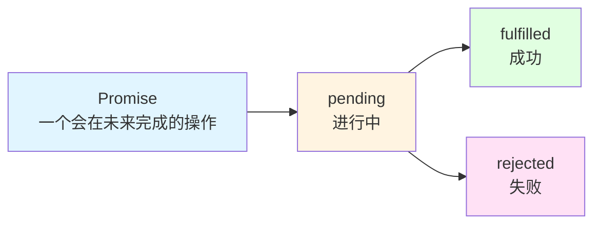
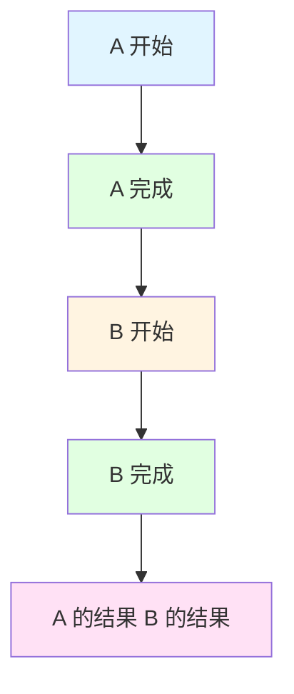

# 异步编程：比 Promise 更优雅

> 你熟悉 JavaScript 的 Promise 和 async/await，Python 的异步编程是同样的概念，只是语法略有不同。

## 前端类比：Promise 和 async/await

### 你熟悉的代码

```typescript
// 前端：异步请求
const getUsers = async () => {
  // await 等待异步操作完成
  const response = await axios.get('/api/users')
  const data = response.data
  return data
}

// 调用
getUsers().then(users => {
  console.log(users)
})
```

### Promise 的本质



---

## 后端：async/await 的本质

### 基本语法

```python
import asyncio

# 定义异步函数
async def fetch_data():
    # 模拟异步操作
    await asyncio.sleep(1)  # 等待 1 秒
    return "数据"

# 调用异步函数
async def main():
    data = await fetch_data()  # 等待结果
    print(data)

# 运行
asyncio.run(main())
```

### async/await 的作用

```
async def = 定义异步函数
await = 等待异步操作完成（不阻塞）
```

**对比前端**：
```typescript
// 前端
async function fetchData() {
  const response = await axios.get('/api/data')
  return response.data
}

// 后端
async def fetch_data():
    result = await db.execute(select(SysUser))
    return result
```

---

## 核心 1：为什么需要异步

### 同步模式的问题

```python
# 同步：每个请求阻塞线程
@app.get("/users")
def get_users():  # 没有 async
    users = db.query()  # 阻塞 100ms
    return users

# 问题：
# 请求 1 来了，阻塞 100ms
# 请求 2 来了，必须等待请求 1 完成
# 并发能力差
```

### 异步模式的优势

```python
# 异步：等待时不阻塞
@app.get("/users")
async def get_users():  # 有 async
    users = await db.execute(...)  # 等待时可以处理其他请求
    return users

# 优势：
# 请求 1 等待数据库时
# 请求 2 可以同时处理
# 并发能力强
```

### 并发 vs 并行

```
并发 (Concurrency):
交替执行多个任务
A 任务等 I/O 时，处理 B 任务

并行 (Parallelism):
同时执行多个任务
需要多核 CPU

异步编程 = 并发处理 I/O 密集型任务
```

---

## 核心 2：async/await 的执行流程

### 基本流程

```python
import asyncio

async def task_a():
    print("A 开始")
    await asyncio.sleep(1)  # 暂停，让出控制权
    print("A 完成")
    return "A 的结果"

async def task_b():
    print("B 开始")
    await asyncio.sleep(1)  # 暂停，让出控制权
    print("B 完成")
    return "B 的结果"

async def main():
    # 串行执行
    result_a = await task_a()  # 等待 A 完成
    result_b = await task_b()  # 等待 B 完成
    print(result_a, result_b)

asyncio.run(main())
```

**执行顺序**：



**前端类比**：
```typescript
// 前端：Promise.all
const results = await Promise.all([taskA(), taskB()])
```

---

## 核心 3：项目中的异步应用

### 应用 1：数据库查询

```python
# 同步方式（阻塞）
def get_user(db, user_id):
    result = db.execute(select(SysUser).where(...))  # 阻塞
    return result.scalar_one_or_none()

# 异步方式（不阻塞）
async def get_user(db: AsyncSession, user_id: int):
    result = await db.execute(
        select(SysUser).where(SysUser.user_id == user_id)
    )
    return result.scalar_one_or_none()
```

### 应用 2：并发查询

```python
@userController.get("/detail/{user_id}")
async def get_user_detail(
    user_id: int,
    query_db: AsyncSession = Depends(get_db)
):
    # 并发查询用户信息和角色信息
    user_result, role_result = await asyncio.gather(
        query_db.execute(select(SysUser).where(SysUser.user_id == user_id)),
        query_db.execute(select(SysRole).join(sys_user_role))
    )

    user = user_result.scalar_one_or_none()
    roles = role_result.scalars().all()

    return {"user": user, "roles": roles}
```

**前端类比**：
```typescript
// 前端：并发请求
const [userRes, rolesRes] = await Promise.all([
  axios.get(`/api/users/${userId}`),
  axios.get(`/api/users/${userId}/roles`)
])
```

### 应用 3：异步文件操作

```python
import aiofiles

@userController.post("/export")
async def export_users(
    query: UserQuery,
    query_db: AsyncSession = Depends(get_db)
):
    # 查询数据
    users = await user_service.get_list(query_db, query)

    # 异步写入文件
    async with aiofiles.open('users.xlsx', 'wb') as f:
        await f.write(generate_excel(users))

    return Resp.success(msg="导出成功")
```

---

## 核心 4：异步上下文管理器

### 前端类比

```typescript
// 前端：try-finally
let connection
try {
  connection = await createConnection()
  // 使用 connection
} finally {
  connection?.close()  // 确保关闭
}
```

### 后端：async with

```python
# async with = 异步上下文管理器
async def get_db():
    async with AsyncSessionLocal() as session:
        yield session  # 提供给路由使用
    # 退出 with 块时自动关闭会话

# 使用
@app.get("/users")
async def get_users(db: AsyncSession = Depends(get_db)):
    users = await db.execute(select(SysUser))
    return users
# 自动关闭会话
```

### 创建异步上下文管理器

```python
from contextlib import asynccontextmanager

@asynccontextmanager
async def database_transaction():
    async with AsyncSessionLocal() as session:
        try:
            yield session
            await session.commit()  # 成功则提交
        except Exception:
            await session.rollback()  # 失败则回滚
            raise

# 使用
@userController.post("/add")
async def add_user(
    user: UserCreate,
    db: AsyncSession = Depends(database_transaction)
):
    # 自动提交或回滚
    await db.add(user)
    return Resp.success(msg="创建成功")
```

---

## 核心 5：FastAPI 的异步优势

### 天然支持异步

```python
@app.get("/users")
async def get_users(db: AsyncSession = Depends(get_db)):
    # 函数有 async，FastAPI 会异步执行
    users = await db.execute(select(SysUser))
    return users
# 等待数据库时，可以处理其他请求
```

### 混合同步和异步

```python
@app.get("/sync")
def sync_endpoint():  # 没有 async
    # 同步函数，阻塞执行
    time.sleep(1)
    return {"status": "done"}

@app.get("/async")
async def async_endpoint():  # 有 async
    # 异步函数，不阻塞
    await asyncio.sleep(1)
    return {"status": "done"}
```

**推荐**：
- I/O 密集型用 `async`（数据库、API 调用）
- CPU 密集型用普通函数（如果必须阻塞）

---

## 前端 vs 后端：异步对比

### Promise vs Future

| 前端 (JavaScript) | 后端 (Python) | 说明 |
|-------------------|---------------|------|
| `Promise` | `Future` / `Task` | 异步操作的容器 |
| `async function` | `async def` | 定义异步函数 |
| `await` | `await` | 等待异步完成 |
| `Promise.all()` | `asyncio.gather()` | 并发执行多个 |
| `try-catch` | `try-except` | 错误处理 |

### 代码对比

```typescript
// 前端
async function getUsers() {
  try {
    const response = await axios.get('/api/users')
    return response.data
  } catch (error) {
    console.error(error)
    throw error
  }
}
```

```python
# 后端
async def get_users():
    try:
        result = await db.execute(select(SysUser))
        return result.scalars().all()
    except Exception as e:
        logger.error(e)
        raise e
```

---

## 实战：异步最佳实践

### 1. 数据库操作全部异步

```python
# ✅ 正确：异步查询
async def get_user(db: AsyncSession, user_id: int):
    result = await db.execute(
        select(SysUser).where(SysUser.user_id == user_id)
    )
    return result.scalar_one_or_none()

# ❌ 错误：同步查询（阻塞）
def get_user(db, user_id):
    return db.query(SysUser).filter_by(user_id=user_id).first()
```

### 2. 并发执行独立任务

```python
# ✅ 正确：并发执行
async def get_user_detail(user_id: int):
    user, roles, permissions = await asyncio.gather(
        get_user(user_id),
        get_user_roles(user_id),
        get_user_permissions(user_id)
    )
    return { "user": user, "roles": roles, "permissions": permissions }

# ❌ 错误：串行执行（慢）
async def get_user_detail(user_id: int):
    user = await get_user(user_id)
    roles = await get_user_roles(user_id)
    permissions = await get_user_permissions(user_id)
    return { "user": user, "roles": roles, "permissions": permissions }
```

### 3. 正确处理异常

```python
@userController.get("/{user_id}")
async def get_user(user_id: int, db: AsyncSession = Depends(get_db)):
    try:
        user = await user_service.get_by_id(db, user_id)
        if not user:
            raise BusinessException("用户不存在", code=404)
        return Resp.success(data=user)
    except BusinessException as e:
        raise e
    except Exception as e:
        logger.error(f"查询用户失败: {e}")
        raise BusinessException("系统错误", code=500)
```

### 4. 使用超时控制

```python
import asyncio

@userController.get("/external-api")
async def call_external_api():
    try:
        # 设置 5 秒超时
        result = await asyncio.wait_for(
            external_api_call(),
            timeout=5.0
        )
        return Resp.success(data=result)
    except asyncio.TimeoutError:
        raise BusinessException("请求超时", code=504)
```

---

## 本质总结

### async/await 的本质

```
async = 这个函数可以暂停
await = 在这里暂停，等待完成
```

### 异步的优势

1. **高并发**：等待时可以处理其他请求
2. **资源高效**：不需要为每个请求创建线程
3. **代码清晰**：用同步的方式写异步代码

### 前端类比

```
前端：await axios.get()  →  等待 API 响应
后端：await db.execute()  →  等待数据库查询

本质相同：等待 I/O 操作完成
```

---

## 检查清单

理解了本节内容，你应该能回答：

- [ ] 为什么需要异步编程？
- [ ] async 和 await 的作用是什么？
- [ ] 异步和同步的区别是什么？
- [ ] 如何并发执行多个异步任务？
- [ ] async with 的作用是什么？
- [ ] 前端 Promise 和后端 Future 的异同点是什么？

**下一步**：学习 [数据持久化：状态管理的本质](./06-数据持久化-状态管理的本质.md)
