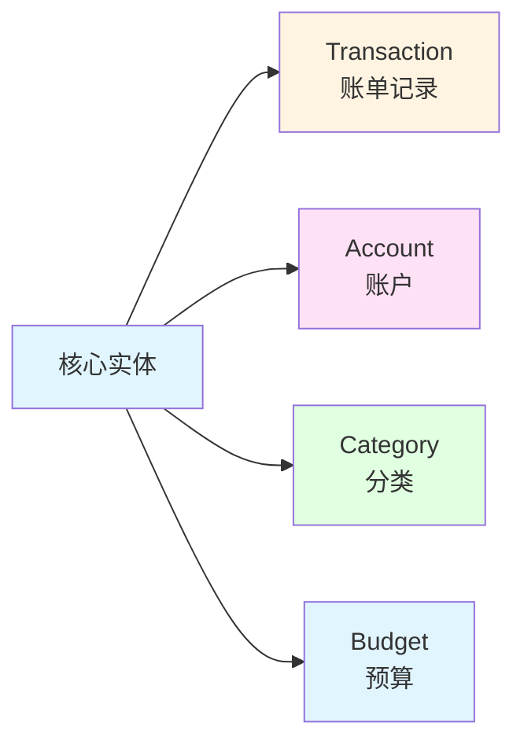
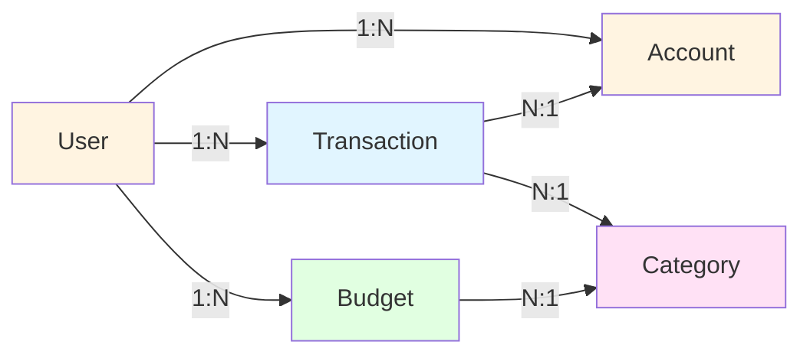
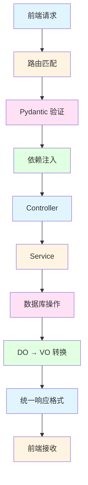

# 实战项目：个人记账应用

> 把前面学到的知识串联起来，从零构建一个完整的记账后端 API。

## 项目目标

构建一个"个人记账"API，包含以下功能：

1. 收支记录管理（收入/支出）
2. 账户管理（现金、银行卡、支付宝等）
3. 分类管理（餐饮、交通、工资等）
4. 统计报表（月度统计、分类统计）
5. 预算管理

---

## 第 1 步：数据建模

### 识别实体



### 设计关系



### 定义 DO（数据库模型）

```python
# module_admin/entity/do/finance_do.py
from sqlalchemy import Column, Integer, String, DateTime, ForeignKey, Numeric, Text
from sqlalchemy.orm import relationship
from datetime import datetime

class Transaction(Base):
    """收支记录"""
    __tablename__ = 'tb_transaction'

    # 主键
    transaction_id = Column(Integer, primary_key=True, autoincrement=True)

    # 基本信息
    amount = Column(Numeric(10, 2), nullable=False, comment='金额')
    type = Column(String(1), nullable=False, comment='类型：1支出 2收入')
    transaction_date = Column(DateTime, nullable=False, comment='交易日期')
    note = Column(Text, comment='备注')

    # 图片凭证（支持多张，逗号分隔）
    images = Column(String(1000), comment='图片地址')

    # 外键
    user_id = Column(Integer, ForeignKey('sys_user.user_id'))
    account_id = Column(Integer, ForeignKey('tb_account.account_id'))
    category_id = Column(Integer, ForeignKey('tb_category.category_id'))

    # 删除标记
    del_flag = Column(String(1), default='0')

    # 时间
    create_time = Column(DateTime, default=datetime.now)
    update_time = Column(DateTime, onupdate=datetime.now)

    # 关系
    account = relationship("Account", back_populates="transactions")
    category = relationship("Category", back_populates="transactions")

class Account(Base):
    """账户"""
    __tablename__ = 'tb_account'

    account_id = Column(Integer, primary_key=True, autoincrement=True)
    account_name = Column(String(50), nullable=False, comment='账户名称')
    account_type = Column(String(1), nullable=False, comment='类型：1现金 2银行卡 3支付宝 4微信')
    balance = Column(Numeric(10, 2), default=0, comment='当前余额')
    initial_balance = Column(Numeric(10, 2), default=0, comment='初始余额')
    icon = Column(String(100), comment='图标')
    color = Column(String(20), comment='颜色')
    is_default = Column(String(1), default='0', comment='是否默认账户')

    # 外键
    user_id = Column(Integer, ForeignKey('sys_user.user_id'))

    # 删除标记
    del_flag = Column(String(1), default='0')

    # 时间
    create_time = Column(DateTime, default=datetime.now)

    # 关系
    transactions = relationship("Transaction", back_populates="account")

class Category(Base):
    """分类"""
    __tablename__ = 'tb_category'

    category_id = Column(Integer, primary_key=True, autoincrement=True)
    category_name = Column(String(50), nullable=False, comment='分类名称')
    category_type = Column(String(1), nullable=False, comment='类型：1支出 2收入')
    icon = Column(String(100), comment='图标')
    color = Column(String(20), comment='颜色')
    sort_order = Column(Integer, default=0, comment='排序')
    is_default = Column(String(1), default='0', comment='是否系统默认')

    # 外键
    user_id = Column(Integer, ForeignKey('sys_user.user_id'))

    # 删除标记
    del_flag = Column(String(1), default='0')

    # 时间
    create_time = Column(DateTime, default=datetime.now)

    # 关系
    transactions = relationship("Transaction", back_populates="category")
    budgets = relationship("Budget", back_populates="category")

class Budget(Base):
    """预算"""
    __tablename__ = 'tb_budget'

    budget_id = Column(Integer, primary_key=True, autoincrement=True)
    amount = Column(Numeric(10, 2), nullable=False, comment='预算金额')
    year = Column(Integer, nullable=False, comment='年份')
    month = Column(Integer, nullable=False, comment='月份')
    alert_threshold = Column(Numeric(5, 2), default=80, comment='预警阈值（百分比）')

    # 外键
    user_id = Column(Integer, ForeignKey('sys_user.user_id'))
    category_id = Column(Integer, ForeignKey('tb_category.category_id'))

    # 删除标记
    del_flag = Column(String(1), default='0')

    # 时间
    create_time = Column(DateTime, default=datetime.now)

    # 关系
    category = relationship("Category", back_populates="budgets")
```

---

## 第 2 步：定义 VO 和 Query Model

### 查询模型

```python
# module_admin/entity/query/finance_query.py
from pydantic import BaseModel, Field, field_validator
from typing import Optional
from datetime import datetime

class TransactionQuery(BaseModel):
    """账单查询条件"""
    type: Optional[str] = Field(default=None, description="类型：1支出 2收入")
    categoryId: Optional[int] = Field(default=None, alias="categoryId", description="分类ID")
    accountId: Optional[int] = Field(default=None, alias="accountId", description="账户ID")
    startDate: Optional[str] = Field(default=None, alias="startDate", description="开始日期")
    endDate: Optional[str] = Field(default=None, alias="endDate", description="结束日期")
    keyword: Optional[str] = Field(default=None, description="关键词（备注）")
    pageNum: int = Field(default=1, ge=1, alias="pageNum")
    pageSize: int = Field(default=10, ge=1, le=100, alias="pageSize")

    class Config:
        populate_by_name = True

class TransactionCreate(BaseModel):
    """创建账单"""
    amount: float = Field(gt=0, description="金额")
    type: str = Field(pattern=r'^[12]$', description="类型：1支出 2收入")
    transactionDate: str = Field(alias="transactionDate", description="交易日期")
    accountId: int = Field(alias="accountId", description="账户ID")
    categoryId: int = Field(alias="categoryId", description="分类ID")
    note: Optional[str] = Field(default=None, max_length=500, description="备注")
    images: Optional[str] = Field(default=None, max_length=1000, description="图片地址")

    @field_validator('transactionDate')
    def parse_date(cls, v):
        return datetime.strptime(v, '%Y-%m-%d')

    class Config:
        populate_by_name = True

class TransactionUpdate(BaseModel):
    """更新账单"""
    transactionId: int = Field(alias="transactionId", description="账单ID")
    amount: Optional[float] = Field(default=None, gt=0)
    type: Optional[str] = Field(default=None, pattern=r'^[12]$')
    transactionDate: Optional[str] = Field(default=None, alias="transactionDate")
    accountId: Optional[int] = Field(default=None, alias="accountId")
    categoryId: Optional[int] = Field(default=None, alias="categoryId")
    note: Optional[str] = Field(default=None)
    images: Optional[str] = Field(default=None)

    class Config:
        populate_by_name = True

class AccountCreate(BaseModel):
    """创建账户"""
    accountName: str = Field(min_length=1, max_length=50, alias="accountName")
    accountType: str = Field(pattern=r'^[1234]$', alias="accountType", description="类型：1现金 2银行卡 3支付宝 4微信")
    initialBalance: float = Field(default=0, ge=0, alias="initialBalance")
    icon: Optional[str] = Field(default=None)
    color: Optional[str] = Field(default=None)

    class Config:
        populate_by_name = True

class CategoryCreate(BaseModel):
    """创建分类"""
    categoryName: str = Field(min_length=1, max_length=50, alias="categoryName")
    categoryType: str = Field(pattern=r'^[12]$', alias="categoryType", description="类型：1支出 2收入")
    icon: Optional[str] = Field(default=None)
    color: Optional[str] = Field(default=None)

    class Config:
        populate_by_name = True

class BudgetCreate(BaseModel):
    """创建预算"""
    categoryId: int = Field(alias="categoryId", description="分类ID")
    amount: float = Field(gt=0, description="预算金额")
    year: int = Field(ge=2020, le=2100, description="年份")
    month: int = Field(ge=1, le=12, description="月份")
    alertThreshold: float = Field(default=80, ge=0, le=100, alias="alertThreshold")

    class Config:
        populate_by_name = True
```

### 视图模型

```python
# module_admin/entity/vo/finance_vo.py
from pydantic import BaseModel, Field
from typing import Optional, List
from decimal import Decimal

class TransactionVO(BaseModel):
    """账单视图模型"""
    transactionId: int = Field(alias="transactionId")
    amount: float
    type: str
    transactionDate: str = Field(alias="transactionDate")
    note: Optional[str]
    images: Optional[str]
    accountId: int = Field(alias="accountId")
    accountName: Optional[str] = Field(default=None, alias="accountName")
    accountType: Optional[str] = Field(default=None, alias="accountType")
    categoryId: int = Field(alias="categoryId")
    categoryName: Optional[str] = Field(default=None, alias="categoryName")
    categoryIcon: Optional[str] = Field(default=None, alias="categoryIcon")
    categoryColor: Optional[str] = Field(default=None, alias="categoryColor")
    createTime: str = Field(alias="createTime")

    class Config:
        from_attributes = True
        populate_by_name = True

class AccountVO(BaseModel):
    """账户视图模型"""
    accountId: int = Field(alias="accountId")
    accountName: str = Field(alias="accountName")
    accountType: str = Field(alias="accountType")
    balance: float
    initialBalance: float = Field(alias="initialBalance")
    icon: Optional[str]
    color: Optional[str]
    isDefault: str = Field(alias="isDefault")
    createTime: str = Field(alias="createTime")

    class Config:
        from_attributes = True
        populate_by_name = True

class CategoryVO(BaseModel):
    """分类视图模型"""
    categoryId: int = Field(alias="categoryId")
    categoryName: str = Field(alias="categoryName")
    categoryType: str = Field(alias="categoryType")
    icon: Optional[str]
    color: Optional[str]
    sortOrder: int = Field(alias="sortOrder")
    isDefault: str = Field(alias="isDefault")

    class Config:
        from_attributes = True
        populate_by_name = True

class StatisticsVO(BaseModel):
    """统计视图模型"""
    totalIncome: float = Field(alias="totalIncome")
    totalExpense: float = Field(alias="totalExpense")
    balance: float
    transactionCount: int = Field(alias="transactionCount")

    class Config:
        populate_by_name = True

class CategoryStatisticsVO(BaseModel):
    """分类统计视图模型"""
    categoryId: int = Field(alias="categoryId")
    categoryName: str = Field(alias="categoryName")
    categoryIcon: Optional[str] = Field(alias="categoryIcon")
    categoryColor: Optional[str] = Field(alias="categoryColor")
    amount: float
    percentage: float
    count: int = Field(alias="transactionCount")

    class Config:
        from_attributes = True
        populate_by_name = True

class BudgetVO(BaseModel):
    """预算视图模型"""
    budgetId: int = Field(alias="budgetId")
    categoryId: int = Field(alias="categoryId")
    categoryName: str = Field(alias="categoryName")
    amount: float
    used: float
    remaining: float
    percentage: float
    year: int
    month: int
    alertThreshold: float = Field(alias="alertThreshold")
    isOverBudget: bool = Field(alias="isOverBudget")

    class Config:
        from_attributes = True
        populate_by_name = True
```

---

## 第 3 步：实现 Service 层

```python
# module_admin/service/finance_service.py
from sqlalchemy.ext.asyncio import AsyncSession
from sqlalchemy import select, func, update, delete, and_, or_
from decimal import Decimal
from datetime import datetime
from module_admin.entity.do.finance_do import Transaction, Account, Category, Budget
from module_admin.entity.vo.finance_vo import StatisticsVO, CategoryStatisticsVO

class TransactionService:

    @classmethod
    async def get_list(
        cls,
        db: AsyncSession,
        user_id: int,
        query: TransactionQuery
    ) -> tuple[list[Transaction], int]:
        """
        查询账单列表
        返回: (账单列表, 总数)
        """
        # 构建查询
        stmt = select(Transaction).where(
            Transaction.user_id == user_id,
            Transaction.del_flag == '0'
        )

        # 动态条件
        if query.type:
            stmt = stmt.where(Transaction.type == query.type)
        if query.categoryId:
            stmt = stmt.where(Transaction.category_id == query.categoryId)
        if query.accountId:
            stmt = stmt.where(Transaction.account_id == query.accountId)
        if query.keyword:
            stmt = stmt.where(Transaction.note.like(f'%{query.keyword}%'))
        if query.startDate:
            start_date = datetime.strptime(query.startDate, '%Y-%m-%d')
            stmt = stmt.where(Transaction.transaction_date >= start_date)
        if query.endDate:
            end_date = datetime.strptime(query.endDate, '%Y-%m-%d')
            stmt = stmt.where(Transaction.transaction_date <= end_date)

        # 查询总数
        count_stmt = select(func.count()).select_from(stmt.subquery())
        total = (await db.execute(count_stmt)).scalar()

        # 分页查询
        stmt = stmt.order_by(Transaction.transaction_date.desc())
        stmt = stmt.offset((query.pageNum - 1) * query.pageSize)
        stmt = stmt.limit(query.pageSize)

        result = await db.execute(stmt)
        transactions = result.scalars().all()

        return transactions, total

    @classmethod
    async def create(
        cls,
        db: AsyncSession,
        user_id: int,
        data: TransactionCreate
    ) -> Transaction:
        """创建账单"""
        # 创建账单
        transaction = Transaction(
            amount=Decimal(str(data.amount)),
            type=data.type,
            transaction_date=data.transactionDate,
            note=data.note,
            images=data.images,
            account_id=data.accountId,
            category_id=data.categoryId,
            user_id=user_id
        )
        db.add(transaction)
        await db.flush()

        # 更新账户余额
        account = await db.get(Account, data.accountId)
        if account:
            if data.type == '1':  # 支出
                account.balance -= Decimal(str(data.amount))
            else:  # 收入
                account.balance += Decimal(str(data.amount))

        await db.commit()
        await db.refresh(transaction)
        return transaction

    @classmethod
    async def update(
        cls,
        db: AsyncSession,
        user_id: int,
        data: TransactionUpdate
    ) -> bool:
        """更新账单"""
        transaction = await db.get(Transaction, data.transactionId)
        if not transaction or transaction.user_id != user_id:
            return False

        # 保存原始数据，用于回退账户余额
        old_amount = transaction.amount
        old_type = transaction.type
        old_account_id = transaction.account_id

        # 更新字段
        if data.amount is not None:
            transaction.amount = Decimal(str(data.amount))
        if data.type is not None:
            transaction.type = data.type
        if data.transactionDate is not None:
            transaction.transaction_date = data.transactionDate
        if data.accountId is not None:
            transaction.account_id = data.accountId
        if data.categoryId is not None:
            transaction.category_id = data.categoryId
        if data.note is not None:
            transaction.note = data.note
        if data.images is not None:
            transaction.images = data.images

        # 更新账户余额
        # 1. 先回退原账户的余额
        old_account = await db.get(Account, old_account_id)
        if old_account:
            if old_type == '1':
                old_account.balance += old_amount
            else:
                old_account.balance -= old_amount

        # 2. 再扣减新账户的余额
        new_amount = data.amount if data.amount is not None else old_amount
        new_type = data.type if data.type is not None else old_type
        new_account_id = data.accountId if data.accountId is not None else old_account_id

        new_account = await db.get(Account, new_account_id)
        if new_account:
            if new_type == '1':
                new_account.balance -= Decimal(str(new_amount))
            else:
                new_account.balance += Decimal(str(new_amount))

        await db.commit()
        return True

    @classmethod
    async def delete(
        cls,
        db: AsyncSession,
        user_id: int,
        transaction_id: int
    ) -> bool:
        """删除账单（软删除）"""
        transaction = await db.get(Transaction, transaction_id)
        if not transaction or transaction.user_id != user_id:
            return False

        # 回退账户余额
        account = await db.get(Account, transaction.account_id)
        if account:
            if transaction.type == '1':  # 支出，需要加回
                account.balance += transaction.amount
            else:  # 收入，需要减去
                account.balance -= transaction.amount

        # 软删除
        transaction.del_flag = '1'
        await db.commit()
        return True

    @classmethod
    async def get_statistics(
        cls,
        db: AsyncSession,
        user_id: int,
        start_date: datetime,
        end_date: datetime
    ) -> StatisticsVO:
        """获取统计数据"""
        # 总收入
        income_result = await db.execute(
            select(func.coalesce(func.sum(Transaction.amount), 0)).where(
                and_(
                    Transaction.user_id == user_id,
                    Transaction.type == '2',
                    Transaction.del_flag == '0',
                    Transaction.transaction_date >= start_date,
                    Transaction.transaction_date <= end_date
                )
            )
        )
        total_income = float(income_result.scalar() or 0)

        # 总支出
        expense_result = await db.execute(
            select(func.coalesce(func.sum(Transaction.amount), 0)).where(
                and_(
                    Transaction.user_id == user_id,
                    Transaction.type == '1',
                    Transaction.del_flag == '0',
                    Transaction.transaction_date >= start_date,
                    Transaction.transaction_date <= end_date
                )
            )
        )
        total_expense = float(expense_result.scalar() or 0)

        # 交易次数
        count_result = await db.execute(
            select(func.count(Transaction.transaction_id)).where(
                and_(
                    Transaction.user_id == user_id,
                    Transaction.del_flag == '0',
                    Transaction.transaction_date >= start_date,
                    Transaction.transaction_date <= end_date
                )
            )
        )
        count = count_result.scalar() or 0

        return StatisticsVO(
            totalIncome=total_income,
            totalExpense=total_expense,
            balance=total_income - total_expense,
            transactionCount=count
        )

    @classmethod
    async def get_category_statistics(
        cls,
        db: AsyncSession,
        user_id: int,
        start_date: datetime,
        end_date: datetime,
        expense_type: str
    ) -> list[CategoryStatisticsVO]:
        """获取分类统计"""
        # 查询各分类的金额和次数
        result = await db.execute(
            select(
                Category.category_id,
                Category.category_name,
                Category.icon,
                Category.color,
                func.coalesce(func.sum(Transaction.amount), 0).label('amount'),
                func.count(Transaction.transaction_id).label('count')
            )
            .outerjoin(Transaction, and_(
                Transaction.category_id == Category.category_id,
                Transaction.user_id == user_id,
                Transaction.type == expense_type,
                Transaction.del_flag == '0',
                Transaction.transaction_date >= start_date,
                Transaction.transaction_date <= end_date
            ))
            .where(
                Category.user_id == user_id,
                Category.category_type == expense_type,
                Category.del_flag == '0'
            )
            .group_by(Category.category_id)
            .order_by(func.sum(Transaction.amount).desc())
        )

        rows = result.all()

        # 计算总额
        total = sum(row.amount or 0 for row in rows)

        # 组装结果
        statistics = []
        for row in rows:
            amount = float(row.amount or 0)
            statistics.append(CategoryStatisticsVO(
                categoryId=row.category_id,
                categoryName=row.category_name,
                categoryIcon=row.icon,
                categoryColor=row.color,
                amount=amount,
                percentage=round(amount / total * 100, 2) if total > 0 else 0,
                count=row.count
            ))

        return statistics


class AccountService:

    @classmethod
    async def get_list(
        cls,
        db: AsyncSession,
        user_id: int
    ) -> list[Account]:
        """查询账户列表"""
        result = await db.execute(
            select(Account).where(
                Account.user_id == user_id,
                Account.del_flag == '0'
            ).order_by(Account.is_default.desc(), Account.create_time.desc())
        )
        return result.scalars().all()

    @classmethod
    async def create(
        cls,
        db: AsyncSession,
        user_id: int,
        data: AccountCreate
    ) -> Account:
        """创建账户"""
        account = Account(
            account_name=data.accountName,
            account_type=data.accountType,
            initial_balance=Decimal(str(data.initialBalance)),
            balance=Decimal(str(data.initialBalance)),
            icon=data.icon,
            color=data.color,
            user_id=user_id
        )
        db.add(account)
        await db.commit()
        await db.refresh(account)
        return account

    @classmethod
    async def delete(
        cls,
        db: AsyncSession,
        user_id: int,
        account_id: int
    ) -> bool:
        """删除账户"""
        account = await db.get(Account, account_id)
        if not account or account.user_id != user_id:
            return False

        # 检查是否有关联的交易
        transaction_result = await db.execute(
            select(func.count(Transaction.transaction_id)).where(
                Transaction.account_id == account_id,
                Transaction.del_flag == '0'
            )
        )
        count = transaction_result.scalar()

        if count > 0:
            raise BusinessException("该账户存在交易记录，无法删除")

        account.del_flag = '1'
        await db.commit()
        return True


class BudgetService:

    @classmethod
    async def get_list(
        cls,
        db: AsyncSession,
        user_id: int,
        year: int,
        month: int
    ) -> list[Budget]:
        """查询预算列表"""
        result = await db.execute(
            select(Budget).where(
                Budget.user_id == user_id,
                Budget.year == year,
                Budget.month == month,
                Budget.del_flag == '0'
            )
        )
        return result.scalars().all()

    @classmethod
    async def create_or_update(
        cls,
        db: AsyncSession,
        user_id: int,
        data: BudgetCreate
    ) -> Budget:
        """创建或更新预算"""
        # 查询是否已存在
        result = await db.execute(
            select(Budget).where(
                Budget.user_id == user_id,
                Budget.category_id == data.categoryId,
                Budget.year == data.year,
                Budget.month == data.month,
                Budget.del_flag == '0'
            )
        )
        budget = result.scalar_one_or_none()

        if budget:
            # 更新
            budget.amount = Decimal(str(data.amount))
            budget.alert_threshold = Decimal(str(data.alertThreshold))
        else:
            # 创建
            budget = Budget(
                user_id=user_id,
                category_id=data.categoryId,
                amount=Decimal(str(data.amount)),
                year=data.year,
                month=data.month,
                alert_threshold=Decimal(str(data.alertThreshold))
            )
            db.add(budget)

        await db.commit()
        await db.refresh(budget)
        return budget

    @classmethod
    async def get_with_used(
        cls,
        db: AsyncSession,
        user_id: int,
        year: int,
        month: int
    ) -> list:
        """获取预算及使用情况"""
        # 查询预算
        budgets = await cls.get_list(db, user_id, year, month)

        # 计算每月的起止日期
        start_date = datetime(year, month, 1)
        if month == 12:
            end_date = datetime(year + 1, 1, 1)  # 下一年1月1日
        else:
            end_date = datetime(year, month + 1, 1)  # 下一月1日

        result = []

        for budget in budgets:
            # 查询该分类的实际支出
            used_result = await db.execute(
                select(func.coalesce(func.sum(Transaction.amount), 0)).where(
                    and_(
                        Transaction.user_id == user_id,
                        Transaction.category_id == budget.category_id,
                        Transaction.type == '1',
                        Transaction.del_flag == '0',
                        Transaction.transaction_date >= start_date,
                        Transaction.transaction_date < end_date
                    )
                )
            )
            used = float(used_result.scalar() or 0)
            amount = float(budget.amount)

            # 获取分类信息
            category = await db.get(Category, budget.category_id)

            percentage = round(used / amount * 100, 2) if amount > 0 else 0

            result.append(BudgetVO(
                budgetId=budget.budget_id,
                categoryId=budget.category_id,
                categoryName=category.category_name if category else '',
                amount=amount,
                used=used,
                remaining=amount - used,
                percentage=percentage,
                year=budget.year,
                month=budget.month,
                alertThreshold=float(budget.alert_threshold),
                isOverBudget=percentage > float(budget.alert_threshold)
            ))

        return result
```

---

## 第 4 步：实现 Controller 层

```python
# module_admin/controller/finance_controller.py
from fastapi import APIRouter, Depends, Query
from sqlalchemy.ext.asyncio import AsyncSession
from datetime import datetime
from module_admin.common.database import get_db
from module_admin.common.security import get_current_user
from module_admin.common.response import Resp
from module_admin.entity.do.user_do import SysUser
from module_admin.entity.query.finance_query import (
    TransactionQuery, TransactionCreate, TransactionUpdate,
    AccountCreate, CategoryCreate, BudgetCreate
)
from module_admin.entity.vo.finance_vo import (
    TransactionVO, AccountVO, StatisticsVO, CategoryStatisticsVO
)
from module_admin.service.finance_service import (
    TransactionService, AccountService, BudgetService
)
from module_admin.entity.do.finance_do import Transaction, Account, Category

financeController = APIRouter(prefix='/finance', tags=['财务管理'])

# ========== 账单管理 ==========

@financeController.post("/transaction/list")
async def get_transaction_list(
    query: TransactionQuery,
    current_user: SysUser = Depends(get_current_user),
    query_db: AsyncSession = Depends(get_db)
):
    """查询账单列表"""
    transactions, total = await TransactionService.get_list(
        query_db, current_user.user_id, query
    )

    # 组合数据
    transaction_list = []
    for t in transactions:
        account = await query_db.get(Account, t.account_id)
        category = await query_db.get(Category, t.category_id)

        transaction_dict = {
            'transactionId': t.transaction_id,
            'amount': float(t.amount),
            'type': t.type,
            'transactionDate': t.transaction_date.strftime('%Y-%m-%d'),
            'note': t.note,
            'images': t.images,
            'accountId': t.account_id,
            'accountName': account.account_name if account else None,
            'accountType': account.account_type if account else None,
            'categoryId': t.category_id,
            'categoryName': category.category_name if category else None,
            'categoryIcon': category.icon if category else None,
            'categoryColor': category.color if category else None,
            'createTime': t.create_time.strftime('%Y-%m-%d %H:%M:%S')
        }
        transaction_list.append(TransactionVO(**transaction_dict))

    return Resp.success(data=transaction_list, msg=f"共 {total} 条")

@financeController.post("/transaction")
async def create_transaction(
    data: TransactionCreate,
    current_user: SysUser = Depends(get_current_user),
    query_db: AsyncSession = Depends(get_db)
):
    """创建账单"""
    transaction = await TransactionService.create(
        query_db, current_user.user_id, data
    )
    return Resp.success(msg="记账成功")

@financeController.put("/transaction")
async def update_transaction(
    data: TransactionUpdate,
    current_user: SysUser = Depends(get_current_user),
    query_db: AsyncSession = Depends(get_db)
):
    """更新账单"""
    success = await TransactionService.update(
        query_db, current_user.user_id, data
    )
    if not success:
        raise BusinessException("账单不存在", code=404)

    return Resp.success(msg="更新成功")

@financeController.delete("/transaction/{transaction_id}")
async def delete_transaction(
    transaction_id: int,
    current_user: SysUser = Depends(get_current_user),
    query_db: AsyncSession = Depends(get_db)
):
    """删除账单"""
    success = await TransactionService.delete(
        query_db, current_user.user_id, transaction_id
    )
    if not success:
        raise BusinessException("账单不存在", code=404)

    return Resp.success(msg="删除成功")

# ========== 统计分析 ==========

@financeController.get("/statistics/overview")
async def get_statistics(
    startDate: str = Query(..., alias="startDate", description="开始日期"),
    endDate: str = Query(..., alias="endDate", description="结束日期"),
    current_user: SysUser = Depends(get_current_user),
    query_db: AsyncSession = Depends(get_db)
):
    """获取统计数据"""
    start_date = datetime.strptime(startDate, '%Y-%m-%d')
    end_date = datetime.strptime(endDate, '%Y-%m-%d')

    statistics = await TransactionService.get_statistics(
        query_db, current_user.user_id, start_date, end_date
    )

    return Resp.success(data=statistics)

@financeController.get("/statistics/category")
async def get_category_statistics(
    startDate: str = Query(..., alias="startDate"),
    endDate: str = Query(..., alias="endDate"),
    type: str = Query(..., description="类型：1支出 2收入"),
    current_user: SysUser = Depends(get_current_user),
    query_db: AsyncSession = Depends(get_db)
):
    """获取分类统计"""
    start_date = datetime.strptime(startDate, '%Y-%m-%d')
    end_date = datetime.strptime(endDate, '%Y-%m-%d')

    statistics = await TransactionService.get_category_statistics(
        query_db, current_user.user_id, start_date, end_date, type
    )

    return Resp.success(data=statistics)

# ========== 账户管理 ==========

@financeController.get("/account/list")
async def get_account_list(
    current_user: SysUser = Depends(get_current_user),
    query_db: AsyncSession = Depends(get_db)
):
    """查询账户列表"""
    accounts = await AccountService.get_list(query_db, current_user.user_id)

    account_list = [
        AccountVO(
            accountId=a.account_id,
            accountName=a.account_name,
            accountType=a.account_type,
            balance=float(a.balance),
            initialBalance=float(a.initial_balance),
            icon=a.icon,
            color=a.color,
            isDefault=a.is_default,
            createTime=a.create_time.strftime('%Y-%m-%d %H:%M:%S')
        )
        for a in accounts
    ]

    return Resp.success(data=account_list)

@financeController.post("/account")
async def create_account(
    data: AccountCreate,
    current_user: SysUser = Depends(get_current_user),
    query_db: AsyncSession = Depends(get_db)
):
    """创建账户"""
    account = await AccountService.create(
        query_db, current_user.user_id, data
    )
    return Resp.success(msg="创建成功")

@financeController.delete("/account/{account_id}")
async def delete_account(
    account_id: int,
    current_user: SysUser = Depends(get_current_user),
    query_db: AsyncSession = Depends(get_db)
):
    """删除账户"""
    success = await AccountService.delete(
        query_db, current_user.user_id, account_id
    )
    if not success:
        raise BusinessException("账户不存在", code=404)

    return Resp.success(msg="删除成功")

# ========== 预算管理 ==========

@financeController.get("/budget/list")
async def get_budget_list(
    year: int = Query(..., description="年份"),
    month: int = Query(..., ge=1, le=12, description="月份"),
    current_user: SysUser = Depends(get_current_user),
    query_db: AsyncSession = Depends(get_db)
):
    """查询预算列表"""
    budgets = await BudgetService.get_with_used(
        query_db, current_user.user_id, year, month
    )

    return Resp.success(data=budgets)

@financeController.post("/budget")
async def create_or_update_budget(
    data: BudgetCreate,
    current_user: SysUser = Depends(get_current_user),
    query_db: AsyncSession = Depends(get_db)
):
    """创建或更新预算"""
    budget = await BudgetService.create_or_update(
        query_db, current_user.user_id, data
    )
    return Resp.success(msg="保存成功")
```

---

## 第 5 步：挂载路由

```python
# server.py
from fastapi import FastAPI
from module_admin.controller import finance_controller

app = FastAPI()

# 挂载财务管理路由
app.include_router(finance_controller.router, prefix='/api')
```

---

## 测试 API

### 1. 创建账户

```bash
POST /api/finance/account
Authorization: Bearer <token>
Content-Type: application/json

{
  "accountName": "招商银行卡",
  "accountType": "2",
  "initialBalance": 10000,
  "icon": "bank",
  "color": "#1890ff"
}
```

### 2. 创建分类

```bash
POST /api/finance/category
Authorization: Bearer <token>
Content-Type: application/json

{
  "categoryName": "餐饮",
  "categoryType": "1",
  "icon": "food",
  "color": "#ff6b6b"
}
```

### 3. 记一笔账

```bash
POST /api/finance/transaction
Authorization: Bearer <token>
Content-Type: application/json

{
  "amount": 58.50,
  "type": "1",
  "transactionDate": "2026-02-02",
  "accountId": 1,
  "categoryId": 1,
  "note": "午餐",
  "images": ""
}
```

### 4. 查询账单列表

```bash
POST /api/finance/transaction/list
Authorization: Bearer <token>
Content-Type: application/json

{
  "type": "1",
  "categoryId": null,
  "accountId": null,
  "startDate": "2026-02-01",
  "endDate": "2026-02-28",
  "keyword": "",
  "pageNum": 1,
  "pageSize": 20
}
```

### 5. 获取统计数据

```bash
GET /api/finance/statistics/overview?startDate=2026-02-01&endDate=2026-02-28
Authorization: Bearer <token>
```

### 6. 获取分类统计

```bash
GET /api/finance/statistics/category?startDate=2026-02-01&endDate=2026-02-28&type=1
Authorization: Bearer <token>
```

### 7. 设置预算

```bash
POST /api/finance/budget
Authorization: Bearer <token>
Content-Type: application/json

{
  "categoryId": 1,
  "amount": 2000,
  "year": 2026,
  "month": 2,
  "alertThreshold": 80
}
```

---

## 前端调用示例

```typescript
// api/finance.ts
import request from '@/utils/request'

// 查询账单列表
export function getTransactionList(params: TransactionQuery) {
  return request({
    url: '/api/finance/transaction/list',
    method: 'post',
    data: params
  })
}

// 记账
export function createTransaction(data: TransactionCreate) {
  return request({
    url: '/api/finance/transaction',
    method: 'post',
    data
  })
}

// 获取统计概览
export function getStatistics(startDate: string, endDate: string) {
  return request({
    url: '/api/finance/statistics/overview',
    method: 'get',
    params: { startDate, endDate }
  })
}

// 获取分类统计
export function getCategoryStatistics(startDate: string, endDate: string, type: string) {
  return request({
    url: '/api/finance/statistics/category',
    method: 'get',
    params: { startDate, endDate, type }
  })
}

// 查询账户列表
export function getAccountList() {
  return request({
    url: '/api/finance/account/list',
    method: 'get'
  })
}

// 创建账户
export function createAccount(data: AccountCreate) {
  return request({
    url: '/api/finance/account',
    method: 'post',
    data
  })
}

// 查询预算
export function getBudgetList(year: number, month: number) {
  return request({
    url: '/api/finance/budget/list',
    method: 'get',
    params: { year, month }
  })
}

// 设置预算
export function saveBudget(data: BudgetCreate) {
  return request({
    url: '/api/finance/budget',
    method: 'post',
    data
  })
}
```

---

## 本质总结

### 完整的数据流



### 核心要点

1. **事务处理**：记账时需要同时操作账单和账户余额，确保数据一致性
2. **余额联动**：创建、更新、删除账单时自动更新账户余额
3. **聚合查询**：使用 `func.sum()`、`func.count()` 进行统计
4. **日期范围查询**：处理月度统计数据
5. **预算预警**：计算已用金额占预算的百分比，判断是否超预算

---

## 学习检查清单

完成本实战后，你应该能够：

- [ ] 设计记账应用的数据库表结构
- [ ] 处理账户余额与账单的联动
- [ ] 实现日期范围查询
- [ ] 使用聚合函数进行统计
- [ ] 处理复杂的业务逻辑（如余额回退）
- [ ] 实现预算预警功能
- [ ] 正确使用事务确保数据一致性
- [ ] 实现多维度统计分析

---

## 拓展功能

基础功能完成后，可以继续添加：

1. **图表展示**：
   - 折线图：每日收支趋势
   - 饼图：分类占比
   - 柱状图：月度对比

2. **高级功能**：
   - 账单导入导出（Excel、CSV）
   - 定期账单（如房租、工资）
   - 多账本管理
   - 账单分享

3. **数据分析**：
   - 消费习惯分析
   - 收入来源分析
   - 节省建议

---

**恭喜你完成学习！** 你已经具备独立开发记账应用后端 API 的能力。
