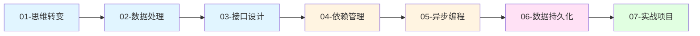

# 前端开发者的后端入门

> 专为前端开发者设计的后端入门指南。不讲废话，只讲核心本质，让你快速理解后端开发的底层逻辑。

## 你已经会后端了，只是不知道

作为前端开发者，你每天都在使用后端 API。你熟悉：
- ✅ HTTP 请求和响应
- ✅ JSON 数据格式
- ✅ 异步编程（Promise、async/await）
- ✅ 状态管理（Pinia、Redux）
- ✅ 路由和拦截器

后端开发就是把这些概念**反向理解**：从"消费者"变成"生产者"。

## 学习路径



## 核心内容

| 文档 | 核心概念 | 前端类比 | 学习收获 |
|------|----------|----------|----------|
| [01-思维转变](./01-思维转变-从请求到响应.md) | HTTP 本质 | `fetch`/`axios` | 理解请求-响应模型 |
| [02-数据处理](./02-数据处理-模型即代码.md) | ORM & 类型 | TypeScript 接口 | 理解数据如何流动 |
| [03-接口设计](./03-接口设计-函数即路由.md) | 路由 & 控制器 | Vue Router | 理解 URL 如何映射到代码 |
| [04-依赖管理](./04-依赖管理-比hooks更强大.md) | 依赖注入 | React Hooks | 理解代码解耦的艺术 |
| [05-异步编程](./05-异步编程-比Promise更优雅.md) | async/await | Promise | 理解并发处理 |
| [06-数据持久化](./06-数据持久化-状态管理的本质.md) | 数据库 & 事务 | Pinia Store | 理解数据如何存储 |
| [07-实战项目](./07-实战项目-从零到一.md) | 完整流程 | 全栈项目 | 从零构建一个 API |

## 学习方式

### 1. 对比学习

每个概念都有前端类比，让你快速建立认知：

```
前端：axios.get('/api/users')  →  后端：@app.get('/users')
前端：useState()               →  后端：Depends(get_db)
前端：await Promise            →  后端：await db.execute()
```

### 2. 本质优先

不教 API 调用，教底层原理：

- ❌ 不是：如何使用 FastAPI 的 Depends
- ✅ 而是：为什么需要依赖注入？它解决了什么问题？

### 3. 实践验证

每个概念都有代码示例，边看边练：

```bash
# 启动项目
python app.py --env=dev

# 访问 API 文档
# http://localhost:9099/docs
```

## 为什么这套课程不同

### 传统教程的问题

| 问题 | 传统教程 | 本课程 |
|------|----------|--------|
| 内容零散 | 零散堆砌知识点 | 按思维主线串联 |
| 缺少类比 | 从零开始讲 Python | 用前端知识类比 |
| 关注表面 | 教如何用框架 | 讲为什么这样设计 |
| 难以迁移 | 学完只会这个框架 | 掌握本质，举一反三 |

### 学习成果

学完这套课程，你将：

1. **理解本质**：不只知其然，更知其所以然
2. **举一反三**：FastAPI、Express、NestJS 都能快速上手
3. **思维升级**：用全栈视角思考问题
4. **实战能力**：能独立开发完整的后端 API

## 前置要求

- 熟悉 Vue.js 或 React
- 了解 TypeScript 类型
- 使用过 Promise/async-await
- 会用 axios 调用 API

> 不需要 Python 基础，文档会用类比让你快速理解 Python 语法

## 开始学习

准备好了吗？让我们从 [思维转变](./01-思维转变-从请求到响应.md) 开始！
