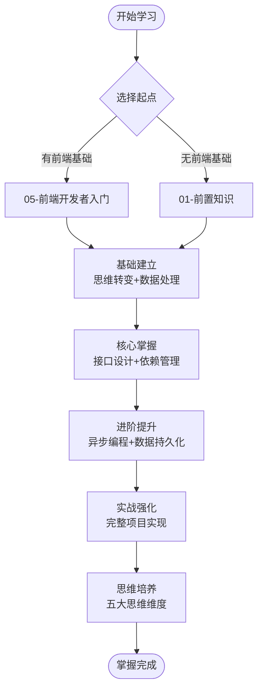
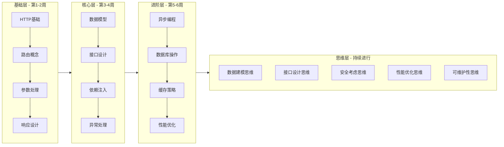
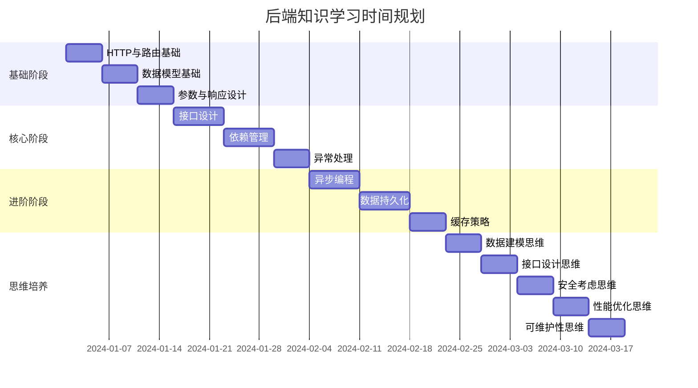
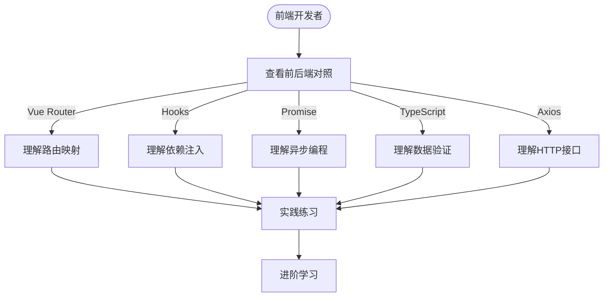

# 学习路径规划

## 三阶段学习路径

## 知识点学习顺序

## 学习时间规划

## 分阶段学习

### 第一阶段：基础建立（1-2周）

| 学习内容 | 核心要点 |
|---------|---------|
| 思维转变 | HTTP请求-响应模型、路由、参数、响应、状态码 |
| 数据处理 | DO/VO/Query Model、ORM本质、类型系统 |

**检查点**：HTTP流程、路由映射、参数类型、三种模型区别

### 第二阶段：核心掌握（3-4周）

| 学习内容 | 核心要点 |
|---------|---------|
| 接口设计 | RESTful风格、HTTP方法、参数校验、Controller职责 |
| 依赖管理 | 依赖注入、Depends机制、依赖链、资源管理 |
| 接口设计思维 | 设计原则、URI规范、响应设计、版本管理 |

**检查点**：RESTful接口、依赖注入价值、Controller职责、三层校验

### 第三阶段：进阶提升（5-6周）

| 学习内容 | 核心要点 |
|---------|---------|
| 异步编程 | async/await、并发vs并行、异步上下文、asyncio.gather |
| 数据持久化 | CRUD操作、事务ACID、ORM查询、软删除、Redis缓存 |
| 数据建模思维 | 三层建模、范式理论、关系设计、索引设计 |

**检查点**：异步原理、异步数据库、事务使用、表结构设计

### 第四阶段：实战强化（7-8周）

| 学习内容 | 核心要点 |
|---------|---------|
| 实战项目 | 数据库设计、CRUD接口、业务逻辑、统计查询 |
| 性能优化思维 | 应用层、数据库层、网络层优化、监控分析 |
| 安全考虑思维 | 输入验证、认证授权、权限控制、攻击防护 |

**检查点**：独立完成项目、性能优化方法、安全防护措施

### 第五阶段：思维培养（持续）

| 学习内容 | 核心要点 |
|---------|---------|
| 可维护性思维 | 分层架构、命名规范、注释文档、测试策略、配置管理 |
| 持续改进 | 代码审查、性能监控、安全审计、技术债务管理 |

**检查点**：可维护代码、编码习惯、代码质量、代码审查

## 前端开发者路径

## 学习资源

| 类型 | 文档 |
|-----|------|
| 核心文档 | [00-知识体系全景图](./00-知识体系全景图.md)、[05-前端开发者的后端入门](../05-前端开发者的后端入门)、[03-后端思维培养](../03-后端思维培养) |
| 专题深入 | [07-数据建模](./07-数据建模专题.md)、[08-接口设计](./08-接口设计专题.md)、[09-性能优化](./09-性能优化专题.md)、[10-安全防护](./10-安全防护专题.md)、[11-异步编程](./11-异步编程专题.md)、[12-数据持久化](./12-数据持久化专题.md) |
| 能力评估 | [04-技术能力矩阵](./04-技术能力矩阵.md)、[05-知识点依赖图](./05-知识点依赖图.md)、[13-实战能力路线](./13-实战能力路线.md) |

## 学习建议

- **制定计划**：根据时间安排制定合理学习计划
- **边学边练**：理论结合实践，学完就练
- **做好笔记**：记录理解和问题
- **定期复习**：巩固已学内容

遇到困难时：回到基础、查看[02-核心概念关联图](./02-核心概念关联图.md)、参考源码、寻求帮助
