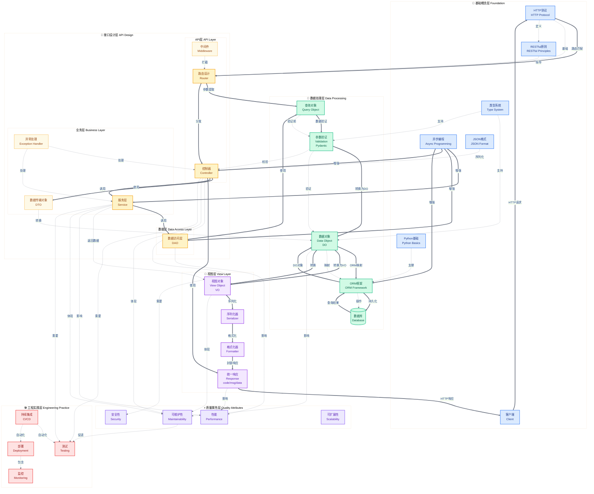
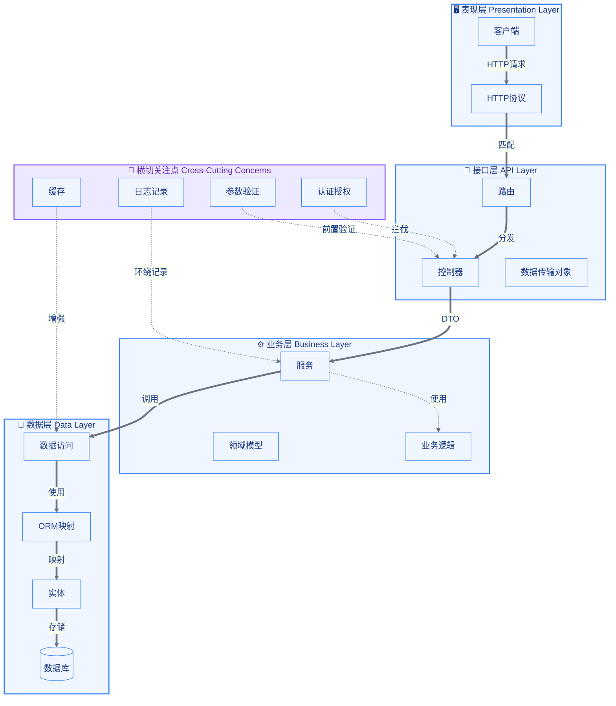
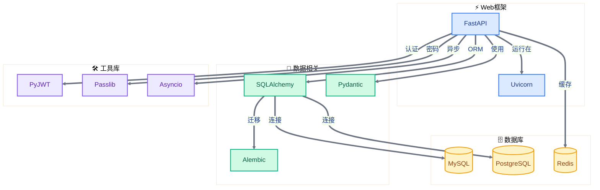

# 核心概念关联图

## 核心概念关系网络

## 概念依赖路径

```mermaid
%%{init: {'theme': 'base', 'themeVariables': {
  'primaryColor': '#EFF6FF',
  'primaryTextColor': '#1e3a8a',
  'primaryBorderColor': '#3B82F6',
  'lineColor': '#6B7280',
  'flowchart': {
    'nodeSpacing': 30,
    'rankSpacing': 50
  }
}}}%%
graph LR
    %% 第一行：业务路径
    subgraph Row1[" "]
        B1[HTTP请求] ==> B2[路由匹配] ==> B3[Controller]
    end

    %% 第二行：数据路径
    subgraph Row2[" "]
        A1[请求参数] ==> A2[Query Model] ==> A3[Pydantic验证]
    end

    %% 第三行：业务逻辑路径
    subgraph Row3[" "]
        B4[依赖注入] ==> B5[Service层] ==> B6[业务逻辑]
    end

    %% 第四行：数据转换路径
    subgraph Row4[" "]
        A4[DO转换] ==> A5[ORM操作] ==> A6[(数据库)]
    end

    %% 第五行：响应路径
    subgraph Row5[" "]
        C1[业务结果] ==> C2[VO转换] ==> C3[JSON序列化] ==> C4[HTTP响应]
    end

    %% 蛇形连接
    B1 -.->|发起请求| A1
    B3 ==>|调用| B4
    B3 ==>|验证| A1
    A3 ==>|转换为| A4
    B6 ==>|返回| C1
    A4 ==>|持久化| A6
    A6 ==>|查询结果| C1

    classDef dataPath fill:#DBEAFE,stroke:#3B82F6,stroke-width:2px,color:#1e3a8a
    classDef businessPath fill:#D1FAE5,stroke:#10B981,stroke-width:2px,color:#065f46
    classDef responsePath fill:#FEF3C7,stroke:#F59E0B,stroke-width:2px,color:#92400e

    class A1,A2,A3,A4,A5,A6 dataPath
    class B1,B2,B3,B4,B5,B6 businessPath
    class C1,C2,C3,C4 responsePath
```

## 分层架构关系

## 技术栈关系图

## 概念说明

### 基础概念层

| 概念 | 说明 | 关联内容 |
|-----|------|---------|
| HTTP协议 | 后端通信的基础 | 路由设计、响应设计 |
| 异步编程 | 提高并发处理能力 | 服务层、数据访问层 |
| 类型系统 | 提供类型安全和数据验证 | 数据模型、参数验证 |
| Python基础 | 编程语言基础 | 所有技术的基础 |

### 数据处理层

| 概念 | 说明 | 关联内容 |
|-----|------|---------|
| ORM框架 | 对象关系映射，简化数据库操作 | SQLAlchemy、数据库 |
| 数据模型 | DO/VO/Query三种模型 | 类型系统、参数验证 |
| 参数验证 | 确保输入数据的正确性 | Pydantic、类型系统 |
| 数据库 | 数据持久化存储 | ORM、数据访问层 |

### 接口设计层

| 概念 | 说明 | 关联内容 |
|-----|------|---------|
| 路由设计 | URL到处理函数的映射 | HTTP协议、控制器 |
| 控制器 | 处理HTTP请求的入口 | 参数验证、服务层 |
| 服务层 | 业务逻辑处理 | 数据访问层、异步编程 |
| 数据访问层 | 数据库操作的抽象 | ORM、数据库 |

### 质量属性层

| 概念 | 说明 | 关联内容 |
|-----|------|---------|
| 安全性 | 保护系统和数据安全 | 认证授权、输入验证 |
| 性能 | 系统响应速度和吞吐量 | 异步编程、缓存 |
| 可维护性 | 代码易于理解和修改 | 代码组织、命名规范 |

## 关联类型

| 类型 | 说明 | 示例 |
|-----|------|------|
| 依赖关系 | A依赖于B才能工作 | 控制器→路由设计、ORM→数据库 |
| 组合关系 | A包含B作为组成部分 | 分层架构→接口层/业务层/数据层 |
| 增强关系 | A增强B的功能 | 异步编程→服务层性能、缓存→DAO性能 |
| 转换关系 | 数据在概念间流转 | 请求参数→Query Model→DO→数据库 |

## 学习建议

**学习顺序**：基础概念层（HTTP/Python/类型系统）→ 数据处理层（DO/VO/Query/ORM/验证）→ 接口设计层（路由/Controller/Service/DAO）→ 质量属性层（安全/性能/可维护性）

**关键理解**：
- 路由依赖HTTP协议
- 控制器使用参数验证和服务层
- 数据模型与ORM和类型系统的关系
- 追踪HTTP请求的完整处理流程
- 观察数据在各层之间的转换过程
