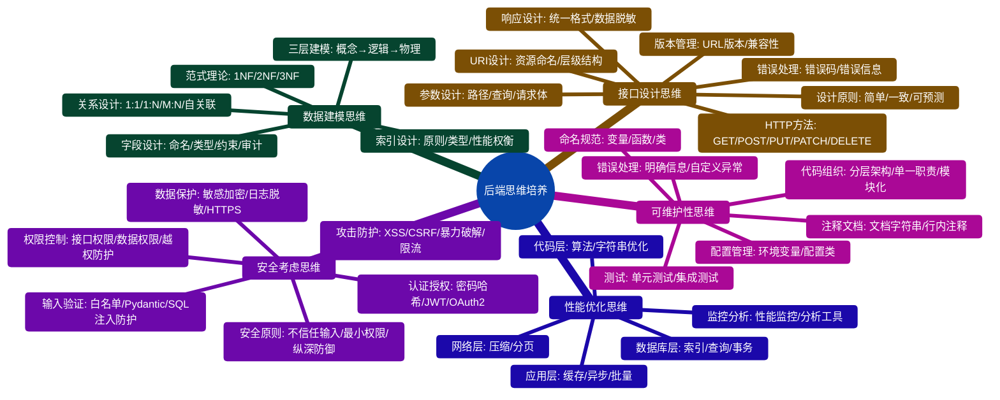
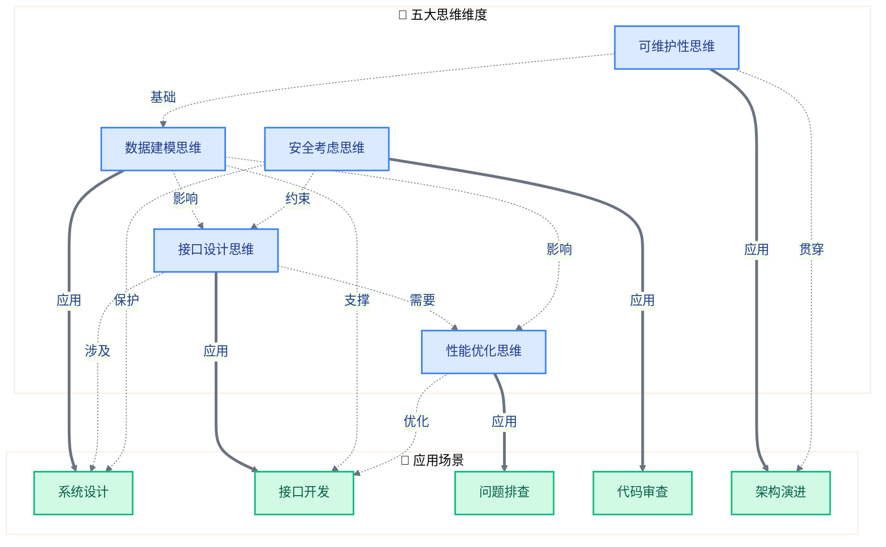
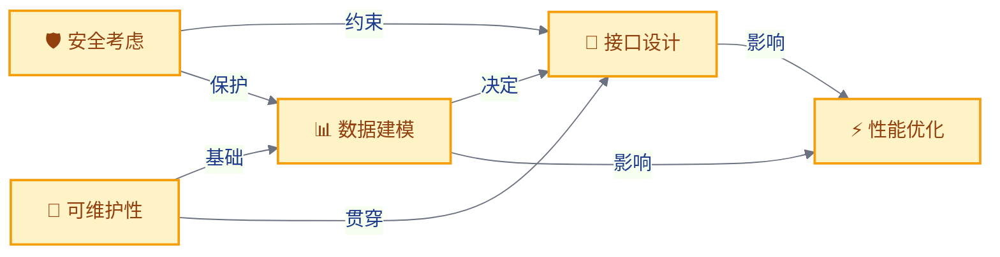
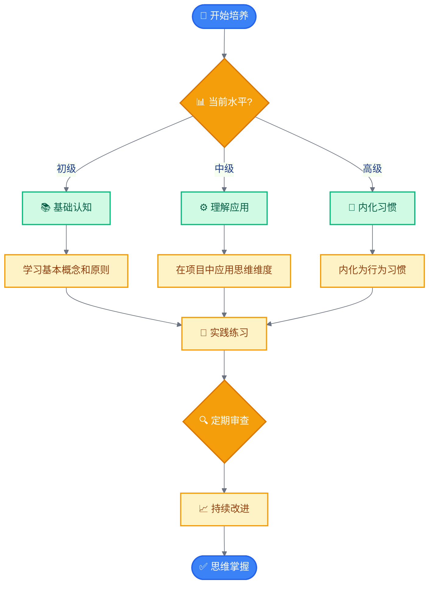
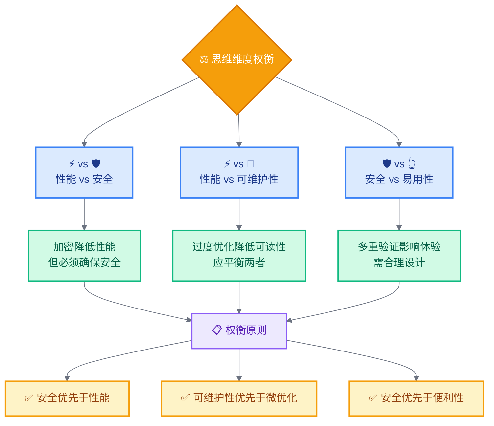

# 思维培养体系

## 五大思维维度总览

## 思维维度关系网络

## 思维维度详解

### 1. 数据建模思维

**核心理念**：将现实业务抽象为数据结构

| 要点 | 说明 |
|-----|------|
| 三层建模 | 概念 → 逻辑 → 物理 |
| 范式权衡 | 范式与反范式的选择 |
| 关系设计 | 1:1、1:N、M:N的正确选择 |
| 索引设计 | 性能影响考虑 |

**应用场景**：数据库设计、性能优化、数据迁移

**常见错误**：过度范式化、忽略查询模式、缺少审计字段、忽略软删除

### 2. 接口设计思维

**核心理念**：设计优雅、易用、可维护的API

| 要点 | 说明 |
|-----|------|
| RESTful风格 | 合理应用RESTful原则 |
| 统一响应 | 标准响应格式 |
| 错误码设计 | 清晰的错误信息 |
| 版本管理 | 接口演进策略 |

**应用场景**：API设计、接口重构、文档编写

**常见错误**：URI不规范、HTTP方法不当、缺少版本管理、错误不明确

### 3. 性能优化思维

**核心理念**：在满足功能前提下提升性能

| 要点 | 说明 |
|-----|------|
| 测量优先 | 先测量再优化 |
| 分层优化 | 应用/数据库/网络层 |
| 缓存时机 | 合理使用缓存 |
| 异步处理 | 恰当应用异步 |

**应用场景**：系统优化、慢接口优化、查询优化

**常见错误**：过早优化、缺乏测量、过度缓存、忽略可读性

### 4. 安全考虑思维

**核心理念**：每个环节都考虑安全性

| 要点 | 说明 |
|-----|------|
| 永不信任 | 不信任输入和客户端 |
| 纵深防御 | 多层防护策略 |
| 最小权限 | 仅授予必需权限 |
| 安全左移 | 设计阶段考虑安全 |

**应用场景**：接口安全、数据保护、安全审计

**常见错误**：只验证前端、硬编码敏感信息、忽略权限检查、日志泄露

### 5. 可维护性思维

**核心理念**：编写易于理解、修改、扩展的代码

| 要点 | 说明 |
|-----|------|
| 分层架构 | 清晰的分层结构 |
| 命名规范 | 准确一致的命名 |
| 注释恰当 | 适度的注释 |
| 错误处理 | 完善的错误处理 |

**应用场景**：代码审查、重构决策、架构设计

**常见错误**：过度设计、注释过多/过少、忽略错误处理、命名不规范

## 思维维度关系

**关系说明**：
- 数据建模 → 接口设计：数据模型决定API结构
- 接口设计 → 性能优化：设计直接影响性能
- 安全考虑 → 接口设计：接口必须考虑权限
- 可维护性 → 数据建模：良好建模是可维护基础
- 数据建模 → 性能优化：索引影响查询性能

## 思维培养路径

## 思维维度权衡

## 应用场景映射

| 场景 | 主要思维维度 | 次要思维维度 |
|-----|------------|-------------|
| 新系统设计 | 数据建模、接口设计 | 性能优化、安全考虑 |
| 接口开发 | 接口设计、安全考虑 | 可维护性 |
| 性能优化 | 性能优化、数据建模 | 可维护性 |
| 代码重构 | 可维护性、接口设计 | 性能优化 |
| 安全加固 | 安全考虑、接口设计 | 可维护性 |
| 数据库优化 | 数据建模、性能优化 | 可维护性 |

## 相关文档

- [00-知识体系全景图](./00-知识体系全景图.md) - 查看完整知识体系
- [01-学习路径规划](./01-学习路径规划.md) - 学习路径建议
- [07-数据建模专题](./07-数据建模专题.md) - 数据建模深入
- [08-接口设计专题](./08-接口设计专题.md) - 接口设计深入
- [09-性能优化专题](./09-性能优化专题.md) - 性能优化深入
- [10-安全防护专题](./10-安全防护专题.md) - 安全防护深入
