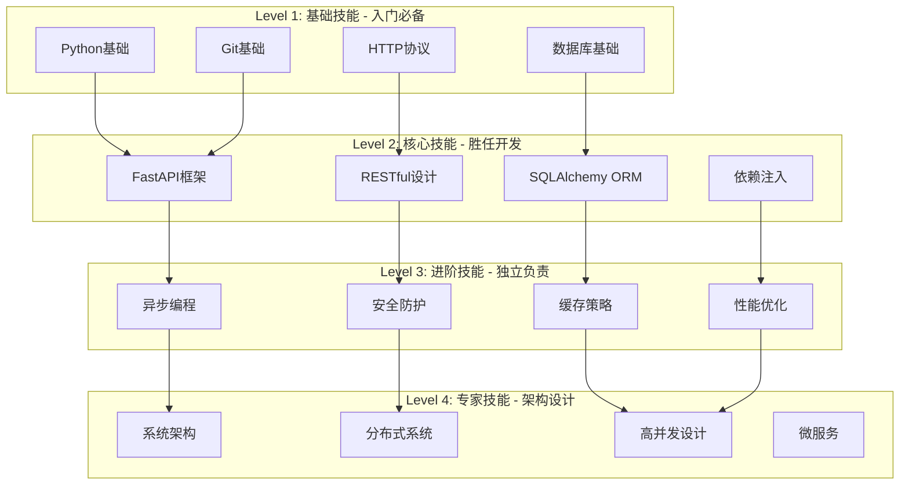
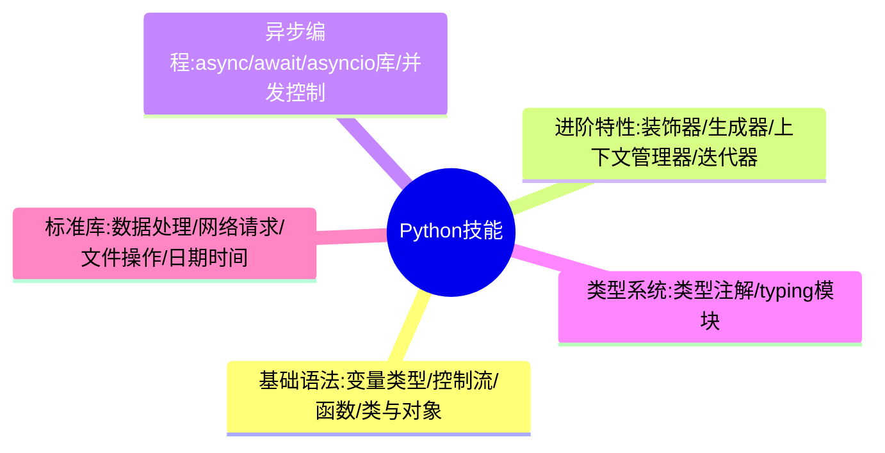
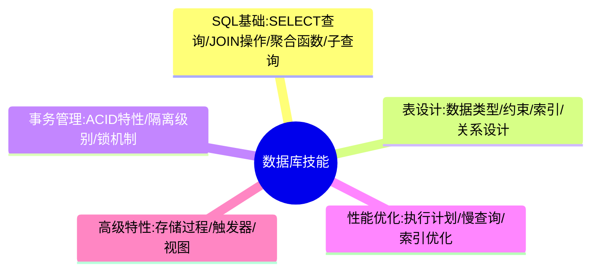
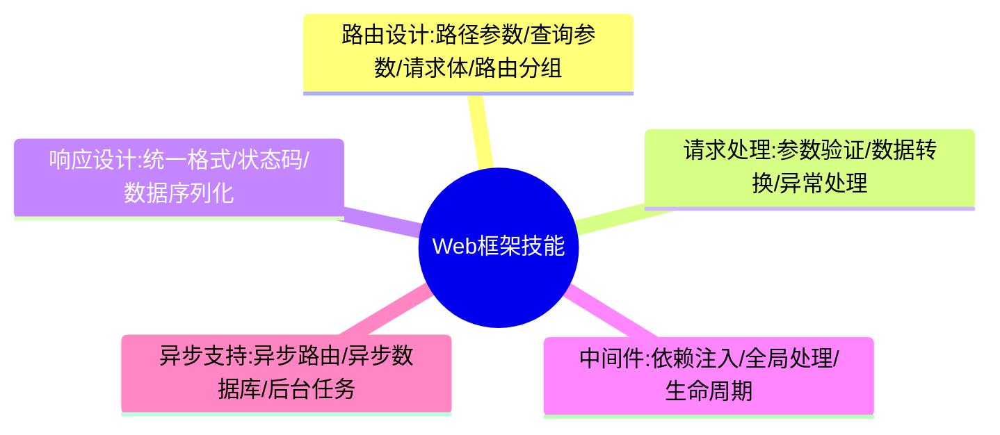
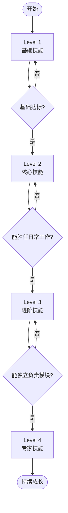

# 技术能力矩阵

## 技能层级总览

## Level 1: 基础技能（入门必备）

| 技能 | 掌握标准 | 学习时间 |
|-----|---------|---------|
| Python基础 | 变量、函数、类、装饰器、异常处理 | 1周 |
| HTTP协议 | 请求方法、状态码、请求头、响应头 | 3天 |
| 数据库基础 | SQL基础、表、索引、事务 | 1周 |
| Git基础 | clone、add、commit、push、pull | 2天 |

**检查点**：Python类函数、HTTP结构、SQL查询、Git操作

**预计时间**：2-4周

## Level 2: 核心技能（胜任开发）

| 技能 | 掌握标准 | 学习时间 |
|-----|---------|---------|
| FastAPI框架 | 路由、参数验证、响应模型、依赖注入 | 2周 |
| SQLAlchemy ORM | 模型定义、基本CRUD、关联查询 | 2周 |
| RESTful设计 | 资源命名、HTTP方法、统一响应 | 2周 |
| 依赖注入 | Depends使用、依赖链、资源管理 | 1周 |

**检查点**：FastAPI接口、SQLAlchemy操作、RESTful接口、依赖注入理解

**预计时间**：6-8周

## Level 3: 进阶技能（独立负责）

| 技能 | 掌握标准 | 学习时间 |
|-----|---------|---------|
| 异步编程 | async/await、并发处理、异步IO | 2周 |
| 缓存策略 | Redis使用、缓存穿透/雪崩、缓存更新 | 2周 |
| 性能优化 | 查询优化、索引优化、监控分析 | 3周 |
| 安全防护 | 认证授权、权限控制、攻击防护 | 3周 |

**检查点**：异步数据库、缓存策略、性能优化、认证授权

**预计时间**：8-12周

## Level 4: 专家技能（架构设计）

| 技能 | 掌握标准 | 学习时间 |
|-----|---------|---------|
| 系统架构 | 分层架构、设计模式、架构权衡 | 持续 |
| 分布式系统 | CAP理论、分布式事务、消息队列 | 持续 |
| 高并发设计 | 负载均衡、限流降级、服务治理 | 持续 |
| 微服务 | 服务拆分、服务发现、配置中心 | 持续 |

**检查点**：架构设计、分布式理解、高并发设计、微服务实施

**预计时间**：1-2年实践经验

## 技能详细展开

### Python 技能树

### 数据库技能树

### Web框架技能树

## 技能成长路径

## 学习建议

### 按层级渐进
1. 掌握Level 1：扎实基础
2. 突破Level 2：日常工作技能
3. 提升Level 3：实践中积累经验
4. 学习Level 4：大量实践和总结

### 针对性学习

| 身份 | 已掌握 | 重点学习 | 参考文档 |
|-----|--------|---------|---------|
| 前端开发者 | HTTP协议 | Python基础、FastAPI、SQLAlchemy | [06-前端后端对照](./06-前端后端对照.md) |
| 后端初学者 | - | Python→HTTP→数据库→FastAPI→ORM | [01-学习路径规划](./01-学习路径规划.md) |
| 有经验开发者 | - | 异步编程、性能优化、安全防护 | [03-思维培养体系](./03-思维培养体系.md) |

### 实践建议
- 边学边练：每学一个技能就动手实践
- 项目驱动：通过实际项目巩固技能
- 代码审查：通过审查他人代码提升认识
- 技术分享：通过分享加深理解

## 相关文档

- [01-学习路径规划](./01-学习路径规划.md) - 详细的学习路径
- [05-知识点依赖图](./05-知识点依赖图.md) - 技能之间的依赖关系
- [13-实战能力路线](./13-实战能力路线.md) - 实战项目成长路径
