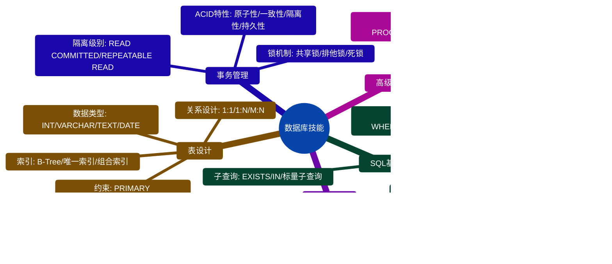

# 技术能力矩阵

## 技能层级总览

## Level 1: 基础技能（入门必备）

| 技能 | 掌握标准 | 学习时间 | 实践项目 |
|-----|---------|---------|---------|
| Python基础 | 变量、函数、类、装饰器、异常处理、类型注解 | 1-2周 | 编写CLI工具、数据处理脚本 |
| HTTP协议 | 请求方法、状态码、请求头、响应头、Cookie/Session | 3-5天 | 使用Postman/curl测试API |
| 数据库基础 | SQL基础、表设计、索引、事务、关联查询 | 1-2周 | 设计博客系统数据库 |
| Git基础 | clone、add、commit、push、pull、branch、merge | 2-3天 | 完成一次完整的PR流程 |

**检查点**：
- ✅ 能独立编写Python类和函数
- ✅ 理解HTTP请求响应完整流程
- ✅ 能编写复杂SQL查询（JOIN/子查询）
- ✅ 熟练使用Git进行版本控制

**预计时间**：3-4周

**前置知识**：无（适合零基础）

## Level 2: 核心技能（胜任开发）

| 技能 | 掌握标准 | 学习时间 | 实践项目 |
|-----|---------|---------|---------|
| FastAPI框架 | 路由设计、参数验证（Pydantic）、响应模型、依赖注入、异常处理 | 2-3周 | 完成用户管理CRUD系统 |
| SQLAlchemy ORM | 模型定义、基本CRUD、关联查询（1:1/1:N/M:N）、事务管理 | 2-3周 | 实现多表关联查询功能 |
| RESTful设计 | 资源命名规范、HTTP方法语义、统一响应格式、错误码设计 | 2周 | 重构项目为RESTful风格 |
| 依赖注入 | Depends使用、依赖链管理、数据库会话管理、资源自动释放 | 1-2周 | 实现数据库会话自动管理 |

**检查点**：
- ✅ 能独立设计和实现RESTful API
- ✅ 熟练使用ORM进行数据库操作
- ✅ 理解依赖注入原理并能应用
- ✅ 能编写可复用的依赖函数
- ✅ 能处理常见的异常情况

**预计时间**：7-11周

**前置要求**：Level 1全部达标

## Level 3: 进阶技能（独立负责）

| 技能 | 掌握标准 | 学习时间 | 实践项目 |
|-----|---------|---------|---------|
| 异步编程 | async/await语法、asyncio库、异步数据库操作、并发控制、超时处理 | 2-3周 | 改造同步接口为异步 |
| 缓存策略 | Redis基础操作、缓存穿透/击穿/雪崩、缓存更新策略、分布式锁 | 2-3周 | 实现多级缓存系统 |
| 性能优化 | SQL查询优化、索引设计、N+1问题、批量操作、性能监控工具 | 3-4周 | 优化慢接口至毫秒级 |
| 安全防护 | JWT认证、RBAC权限控制、SQL注入防护、XSS/CSRF防护、数据脱敏 | 3-4周 | 实现完整的认证授权系统 |

**检查点**：
- ✅ 能正确使用async/await编写异步代码
- ✅ 能设计合理的缓存架构
- ✅ 能独立分析和解决性能问题
- ✅ 能设计和实现安全的认证授权系统
- ✅ 理解常见Web攻击及防护方法

**预计时间**：10-14周

**前置要求**：Level 2全部达标 + 至少2个完整项目经验

## Level 4: 专家技能（架构设计）

| 技能 | 掌握标准 | 实践经验 | 应用场景 |
|-----|---------|---------|---------|
| 系统架构 | 分层架构、DDD、设计模式、架构权衡、技术选型 | 1-2年 | 设计中大型系统架构 |
| 分布式系统 | CAP理论、分布式事务（Saga/TCC）、消息队列（RabbitMQ/Kafka）、服务治理 | 1-2年 | 高可用分布式系统 |
| 高并发设计 | 负载均衡、限流降级熔断、缓存架构、数据库分库分表、CDN加速 | 1-2年 | 秒杀/高并发场景 |
| 微服务 | 服务拆分、服务发现（Nacos/Consul）、配置中心、API网关、链路追踪 | 2-3年 | 微服务架构改造 |

**检查点**：
- ✅ 能进行技术架构设计和选型
- ✅ 理解分布式系统的一致性和可用性权衡
- ✅ 能设计支持高并发的系统架构
- ✅ 能主导微服务架构的拆分和实施
- ✅ 能进行容量规划和性能预测

**预计时间**：2-3年持续实践

**前置要求**：Level 3全部达标 + 参与过至少3个中大型项目

## 技能详细展开

### Python 技能树

### 数据库技能树

### Web框架技能树

## 技能成长路径

## 学习建议

### 按层级渐进
1. 掌握Level 1：扎实基础
2. 突破Level 2：日常工作技能
3. 提升Level 3：实践中积累经验
4. 学习Level 4：大量实践和总结

### 针对性学习路径

| 身份 | 已掌握 | 重点学习路径 | 预计时间 | 参考文档 |
|-----|--------|------------|---------|---------|
| **前端开发者** | HTTP、TypeScript、Promise | Python基础（1周）→ FastAPI（2周）→ SQLAlchemy（2周）→ 依赖注入（1周） | 6周 | [06-前端后端对照](./06-前端后端对照.md) |
| **后端初学者** | - | Python（2周）→ HTTP（1周）→ 数据库（2周）→ FastAPI（3周）→ ORM（2周）→ RESTful（2周） | 12周 | [01-学习路径规划](./01-学习路径规划.md) |
| **有经验开发者** | 其他语言后端框架 | FastAPI特性（1周）→ 异步编程（2周）→ Pydantic（1周）→ 性能优化（3周） | 7周 | [03-思维培养体系](./03-思维培养体系.md) |
| **全栈开发者** | 前后端基础 | 接口设计（2周）→ 安全认证（2周）→ 性能优化（3周）→ 架构设计（持续） | 7周+ | [02-核心概念关联图](./02-核心概念关联图.md) |

### 实践建议
- 边学边练：每学一个技能就动手实践
- 项目驱动：通过实际项目巩固技能
- 代码审查：通过审查他人代码提升认识
- 技术分享：通过分享加深理解

## 技能自我评估标准

### Level 1 自检清单
- [ ] 能独立编写包含类和函数的Python脚本
- [ ] 理解HTTP请求的完整流程（DNS → TCP → HTTP）
- [ ] 能编写包含JOIN和多表查询的SQL语句
- [ ] 能使用Git完成代码提交和PR流程
- [ ] 理解装饰器的基本原理

### Level 2 自检清单
- [ ] 能独立设计和实现完整的CRUD接口
- [ ] 能使用Pydantic进行数据验证
- [ ] 理解RESTful API设计原则并能应用
- [ ] 能使用Depends实现依赖注入
- [ ] 能处理常见的HTTP异常（400/401/404/500）
- [ ] 理解DO/VO/Query的区别和使用场景

### Level 3 自检清单
- [ ] 能编写异步函数和协程
- [ ] 能使用asyncio.gather实现并发
- [ ] 能设计合理的缓存架构
- [ ] 理解缓存穿透/击穿/雪崩及解决方案
- [ ] 能使用EXPLAIN分析SQL性能
- [ ] 能实现JWT认证和RBAC权限控制
- [ ] 理解常见Web攻击（XSS/CSRF/SQL注入）及防护

### Level 4 自检清单
- [ ] 能进行技术选型和架构设计
- [ ] 理解CAP定理和BASE理论
- [ ] 能设计高可用、高并发的系统架构
- [ ] 能进行容量规划和性能预测
- [ ] 理解微服务的优缺点及适用场景
- [ ] 能主导技术难题的攻关
- [ ] 能指导初中级工程师成长

## 技能成长里程碑

| 阶段 | 标志性成就 | 能力描述 |
|-----|----------|---------|
| **新手入门** | 完成第一个CRUD接口 | 能按文档实现基本功能 |
| **初级开发** | 独立负责一个小模块 | 能解决常规问题，需少量指导 |
| **中级开发** | 独立设计和实现功能模块 | 能独立完成需求，代码质量良好 |
| **高级开发** | 主导技术方案设计 | 能解决复杂问题，指导他人 |
| **技术专家** | 架构设计和重大决策 | 能把握技术方向，解决架构级问题 |

## 相关文档

- [01-学习路径规划](./01-学习路径规划.md) - 详细的学习路径
- [05-知识点依赖图](./05-知识点依赖图.md) - 技能之间的依赖关系
- [13-实战能力路线](./13-实战能力路线.md) - 实战项目成长路径
