# 数据建模专题

> 本文档深入探讨数据建模的核心概念，帮助你理解如何设计合理的数据库结构。

## 三层建模流程

```mermaid
%%{init: {'theme': 'base', 'themeVariables': {
  'primaryColor': '#EFF6FF',
  'primaryTextColor': '#1e3a8a',
  'primaryBorderColor': '#3B82F6',
  'lineColor': '#6B7280'
}}}%%
flowchart TB
    Start([业务需求]) ==> Concept[💡 概念模型<br/>Conceptual Model]

    Concept ==> C1[识别核心实体]
    Concept ==> C2[定义实体关系]
    Concept ==> C3[确定业务规则]

    C1 --> Logical[📐 逻辑模型<br/>Logical Model]
    C2 --> Logical
    C3 --> Logical

    Logical ==> L1[设计属性]
    Logical ==> L2[应用范式]
    Logical ==> L3[细化约束]

    L1 --> Physical[💾 物理模型<br/>Physical Model]
    L2 --> Physical
    L3 --> Physical

    Physical ==> P1[选择数据类型]
    Physical ==> P2[设计索引]
    Physical ==> P3[添加约束]

    P1 --> Database[(数据库表结构)]
    P2 --> Database
    P3 --> Database

    classDef startEnd fill:#3B82F6,stroke:#2563EB,color:#fff,stroke-width:2px
    classDef phase fill:#D1FAE5,stroke:#10B981,stroke-width:2px,color:#065f46
    classDef action fill:#fff,stroke:#60A5FA,stroke-width:1px,color:#1e3a8a
    classDef database fill:#FEF3C7,stroke:#F59E0B,stroke-width:2px,color:#92400e

    class Start startEnd
    class Concept,Logical,Physical phase
    class C1,C2,C3,L1,L2,L3,P1,P2,P3 action
    class Database database
```



## 实体关系图

```mermaid
%%{init: {'theme': 'base', 'themeVariables': {
  'primaryColor': '#EFF6FF',
  'primaryTextColor': '#1e3a8a',
  'primaryBorderColor': '#3B82F6',
  'lineColor': '#6B7280'
}}}%%
graph TB
    subgraph 核心实体["📦 核心实体"]
        User[👤 User 用户]
        Order[🛒 Order 订单]
        Product[📦 Product 商品]
        Category[📂 Category 分类]
        Address[📍 Address 地址]
    end

    User ==>|1:N 下单| Order
    User ==>|1:N 拥有| Address
    Order ==>|N:1 属于| User
    Order ==>|N:M 包含| Product
    Product ==>|N:1 归属| Category
    Product ==>|N:M 被包含| Order

    User -.->|自关联| Manager[👔 上级管理员]

    classDef entityStyle fill:#DBEAFE,stroke:#3B82F6,stroke-width:2px,color:#1e3a8a
    classDef relationStyle fill:#FEF3C7,stroke:#F59E0B,stroke-width:2px,color:#92400e

    class User,Order,Product,Category,Address entityStyle
    class Manager relationStyle
```

### 关系类型说明

| 关系类型 | 符号 | 说明 | 示例 |
|---------|------|------|------|
| 一对一 | 1:1 | 一个实体对应另一个实体 | 用户 ↔ 详细资料 |
| 一对多 | 1:N | 一个实体对应多个实体 | 用户 → 订单 |
| 多对多 | M:N | 多个实体对应多个实体 | 订单 ←→ 商品 |
| 自关联 | 1:N | 实体引用自身 | 员工 → 上级 |

## 数据状态流转

```mermaid
stateDiagram-v2
    [*] --> 草稿: 创建
    草稿 --> 待审核: 提交审核
    待审核 --> 已发布: 审核通过
    待审核 --> 草稿: 审核拒绝
    已发布 --> 已下架: 下架
    已下架 --> 已发布: 重新上架
    已发布 --> [*]: 物理删除
    草稿 --> [*]: 删除
    待审核 --> [*]: 删除

    note right of 草稿
        只有创建者可见
        可以编辑
    end note

    note right of 已发布
        所有人可见
        不能修改
    end note
```



## 字段设计规范

```mermaid
mindmap
  root((字段设计))
    命名规范
      小写字母
      下划线分隔
      见名知意
      避免保留字
    类型选择
      精确优先
          整数: INT/BIGINT
          小数: DECIMAL
      性能优先
          字符串: VARCHAR
          文本: TEXT
          日期: DATETIME
    约束设计
      NOT NULL
          业务必填
      DEFAULT
          默认值
      UNIQUE
          唯一标识
      CHECK
          业务规则
    审计字段
      id
          主键
      create_time
          创建时间
      update_time
          更新时间
      create_by
          创建人
      update_by
          更新人
      del_flag
          删除标记
```



## 索引设计策略

```mermaid
flowchart TB
    Start([需要索引?]) --> Q1{频繁查询?}

    Q1 -->|否| NoIndex[不创建索引]
    Q1 -->|是| Q2{区分度高?}

    Q2 -->|否| NoIndex
    Q2 -->|是| Q3{字段类型?}

    Q3 -->|字符串| Prefix[前缀索引]
    Q3 -->|多列| Composite[复合索引]
    Q3 -->|单列| Single[单列索引]

    Composite --> C1[遵循最左前缀]
    Composite --> C2[高频列在前]

    Single --> S1{唯一性?}
    S1 -->|是| Unique[唯一索引]
    S1 -->|否| Normal[普通索引]

```



### 索引设计原则

| 场景 | 索引策略 | 说明 |
|-----|---------|------|
| 主键 | 必须索引 | 主键自动创建唯一索引 |
| 唯一标识 | 唯一索引 | 如用户名、邮箱 |
| 外键 | 建议索引 | 加速关联查询 |
| 频繁查询 WHERE | 单列索引 | 加速条件过滤 |
| 多列组合查询 | 复合索引 | 注意最左前缀 |
| 排序 ORDER BY | 索引 | 利用索引有序性 |
| 大文本 | 不索引 | 全文索引考虑其他方案 |

## 范式理论与实践

```mermaid
graph LR
    subgraph 1NF[第一范式 1NF]
        A1[消除重复组]
        A2[原子性]
    end

    subgraph 2NF[第二范式 2NF]
        B1[满足1NF]
        B2[消除部分依赖]
    end

    subgraph 3NF[第三范式 3NF]
        C1[满足2NF]
        C2[消除传递依赖]
    end

    subgraph 反范式[反范式化]
        D1[有意违反范式]
        D2[提升查询性能]
    end

    1NF --> 2NF
    2NF --> 3NF
    3NF -->|权衡| 反范式

```

### 范式与反范式的权衡

| 场景 | 推荐方案 | 原因 |
|-----|---------|------|
| OLTP 事务系统 | 高度范式化 | 减少数据冗余，保证一致性 |
| OLAP 分析系统 | 适度反范式 | 减少表连接，提升查询性能 |
| 读多写少 | 反范式 | 优化读取性能 |
| 写多读少 | 范式化 | 保证写入效率和数据一致性 |
| 报表统计 | 反范式 | 预计算，避免复杂查询 |

## 常见建模模式

### 1. 审计模式

```mermaid
graph TB
    MainTable[主表] --> AuditTable[审计表]

    MainTable -->|业务数据| MainData[业务字段]
    MainTable -->|审计字段| AuditFields[审计字段]

    AuditFields --> AF1[create_time]
    AuditFields --> AF2[update_time]
    AuditFields --> AF3[create_by]
    AuditFields --> AF4[update_by]

```



### 2. 软删除模式

```mermaid
stateDiagram-v2
    [*] --> Active: 插入记录
    Active --> Deleted: 逻辑删除 del_flag=1
    Deleted --> Active: 恢复 del_flag=0
    Active --> [*]: 物理删除(管理员)

    note right of Active
        正常使用状态
        del_flag = 0
        可被查询
    end note

    note right of Deleted
        已删除状态
        del_flag = 1
        不被普通查询
        可恢复
    end note
```



### 3. 多态关联模式 

```mermaid
graph LR
    Comment[评论表] -->|target_type| Type[类型标识]
    Comment -->|target_id| ID[目标ID]

    Type --> T1[Post]
    Type --> T2[Video]
    Type --> T3[Product]

    ID --> P1[Post.ID]
    ID --> V1[Video.ID]
    ID --> PR1[Product.ID]
```



## 数据建模检查清单

### 设计阶段

- [ ] **概念模型**
  - [ ] 识别所有核心实体
  - [ ] 定义实体间的关系
  - [ ] 明确业务规则和约束

- [ ] **逻辑模型**
  - [ ] 为每个实体设计属性
  - [ ] 确定主键策略
  - [ ] 应用适当范式（通常3NF）

- [ ] **物理模型**
  - [ ] 选择合适的数据类型
  - [ ] 设计必要的索引
  - [ ] 添加约束（NOT NULL, DEFAULT等）
  - [ ] 添加审计字段

### 验证阶段

- [ ] **功能验证**
  - [ ] 能满足所有业务需求
  - [ ] 支持所有预期查询
  - [ ] 约束能防止非法数据

- [ ] **性能验证**
  - [ ] 关键查询有索引支持
  - [ ] 表连接数量合理
  - [ ] 数据字段大小合适

- [ ] **扩展性验证**
  - [ ] 预留扩展字段
  - [ ] 考虑未来可能的关联
  - [ ] 支持数据分区或分表

## 常见错误与避免

### 错误 1：过度范式化

```mermaid
graph TB
    Bad[过度范式化] --> Problem1[大量表连接]
    Bad --> Problem2[查询性能差]
    Bad --> Problem3[代码复杂]

    Good[适度范式] --> Solution1[合理冗余]
    Good --> Solution2[性能优化]
    Good --> Solution3[代码简洁]

```



## 常见错误与避免

| 错误类型 | 问题 | 建议 |
|---------|-----|------|
| 过度范式化 | 大量表连接，查询性能差 | OLTP 系统 3NF 足够 |
| 忽略查询模式 | 设计后才考虑查询 | 先分析查询模式再设计 |
| 缺少审计字段 | 无法追踪变更，无法定位责任人 | 所有业务表包含审计字段 |
| 忽略软删除 | 数据无法恢复，破坏完整性 | 使用 `del_flag` 实现软删除

## 实战案例：订单系统设计

### 核心实体

```mermaid
graph TB
    User[用户]
    Order[订单]
    OrderItem[订单明细]
    Product[商品]
    Address[收货地址]

    User -->|下单| Order
    Order -->|包含| OrderItem
    OrderItem -->|引用| Product
    Order -->|配送到| Address
    User -->|拥有| Address

    
    class User,Order,OrderItem,Product,Address coreStyle
```



### 表结构设计

#### 订单表 (sys_order)

| 字段名 | 类型 | 说明 | 约束 |
|-------|------|------|------|
| id | BIGINT | 主键 | PK, AUTO |
| order_no | VARCHAR(32) | 订单号 | UNIQUE, NOT NULL |
| user_id | BIGINT | 用户ID | FK, NOT NULL |
| total_amount | DECIMAL(10,2) | 总金额 | NOT NULL |
| status | TINYINT | 订单状态 | NOT NULL, DEFAULT 0 |
| address_id | BIGINT | 收货地址 | FK |
| create_time | DATETIME | 创建时间 | NOT NULL |
| update_time | DATETIME | 更新时间 | |

#### 订单明细表 (sys_order_item)

| 字段名 | 类型 | 说明 | 约束 |
|-------|------|------|------|
| id | BIGINT | 主键 | PK, AUTO |
| order_id | BIGINT | 订单ID | FK, NOT NULL |
| product_id | BIGINT | 商品ID | FK, NOT NULL |
| quantity | INT | 数量 | NOT NULL |
| price | DECIMAL(10,2) | 单价 | NOT NULL |
| subtotal | DECIMAL(10,2) | 小计 | NOT NULL |

### 索引设计

```sql
-- 订单表索引
CREATE INDEX idx_user_id ON sys_order(user_id);
CREATE INDEX idx_create_time ON sys_order(create_time);
CREATE INDEX idx_status ON sys_order(status);

-- 订单明细表索引
CREATE INDEX idx_order_id ON sys_order_item(order_id);
CREATE INDEX idx_product_id ON sys_order_item(product_id);

-- 复合索引（用户订单查询）
CREATE INDEX idx_user_status ON sys_order(user_id, status, create_time);
```

## 相关文档

- [03-后端思维培养/01-数据建模思维.md](../03-后端思维培养/01-数据建模思维.md) - 数据建模思维详细讲解
- [05-前端开发者的后端入门/02-数据处理-模型即代码.md](../05-前端开发者的后端入门/02-数据处理-模型即代码.md) - 三种模型 (DO/VO/Query)
- [12-数据持久化专题.md](./12-数据持久化专题.md) - 数据库操作和事务管理
