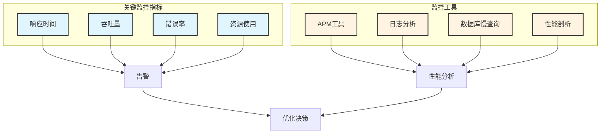
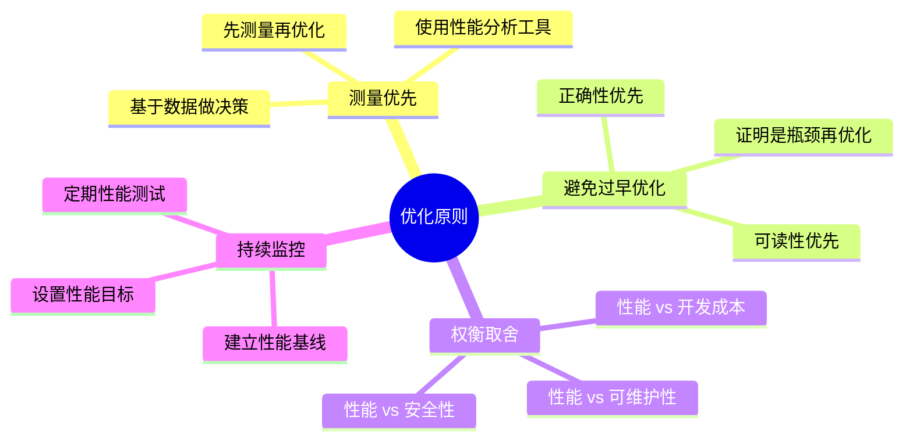
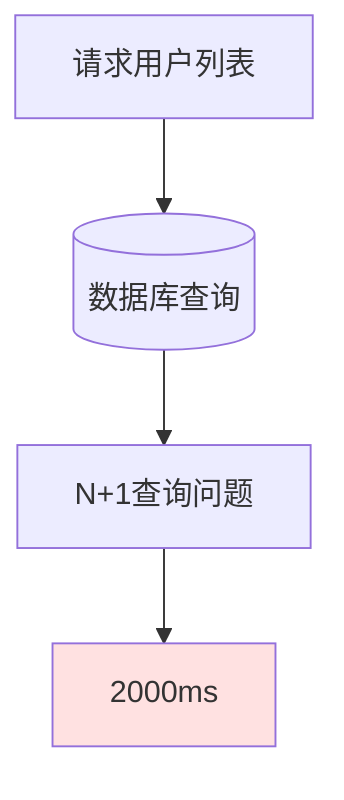
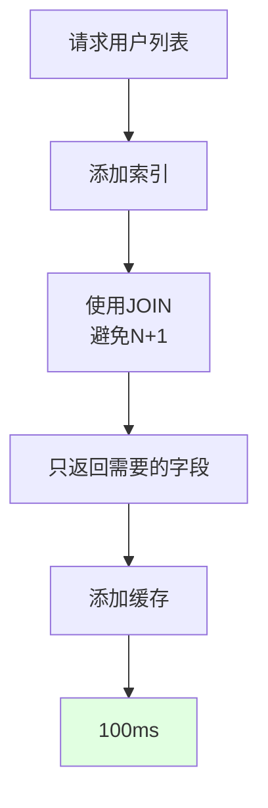

# 性能优化专题

> 本文档深入探讨后端性能优化的策略和方法，帮助你构建高性能的应用。

## 性能优化决策树

```mermaid
flowchart TB
    Start([性能问题]) --> Measure{先测量}

    Measure --> Monitor[监控系统]
    Monitor --> Identify[识别瓶颈]

    Identify --> Bottleneck{瓶颈在哪?}

    Bottleneck -->|数据库| DB[数据库优化]
    Bottleneck -->|应用逻辑| App[应用优化]
    Bottleneck -->|网络| Net[网络优化]
    Bottleneck -->|代码| Code[代码优化]

    DB --> D1[索引优化]
    DB --> D2[查询优化]
    DB --> D3[连接池]

    App --> A1[缓存策略]
    App --> A2[异步处理]
    App --> A3[批量操作]

    Net --> N1[减少请求]
    Net --> N2[数据压缩]
    Net --> N3[CDN加速]

    Code --> C1[算法优化]
    Code --> C2[字符串优化]

    D1 --> Test[测试验证]
    D2 --> Test
    D3 --> Test
    A1 --> Test
    A2 --> Test
    A3 --> Test
    N1 --> Test
    N2 --> Test
    N3 --> Test
    C1 --> Test
    C2 --> Test

    Test --> Improve{有效?}
    Improve -->|是| Deploy[部署上线]
    Improve -->|否| Measure

    Deploy --> Monitor2[持续监控]

    ```

## 优化层次关系

```mermaid
graph TB
    subgraph 应用层[应用层优化]
        A1[缓存策略]
        A2[异步处理]
        A3[批量操作]
    end

    subgraph 数据库层[数据库层优化]
        D1[索引优化]
        D2[查询优化]
        D3[事务优化]
    end

    subgraph 网络层[网络层优化]
        N1[减少请求]
        N2[数据压缩]
        N3[连接复用]
    end

    A1 --> Performance[性能提升]
    A2 --> Performance
    A3 --> Performance

    D1 --> Performance
    D2 --> Performance
    D3 --> Performance

    N1 --> Performance
    N2 --> Performance
    N3 --> Performance

    ```

## 性能瓶颈分布

```mermaid
pie title 性能瓶颈典型分布
    "数据库查询" : 45
    "网络IO" : 25
    "应用逻辑" : 20
    "代码效率" : 10
```

## 应用层优化

### 1. 缓存策略

```mermaid
flowchart TB
    Request[请求] --> Check{缓存存在?}

    Check -->|是| Return[返回缓存]
    Check -->|否| DB[查询数据库]

    DB --> SetCache[写入缓存]
    SetCache --> Return2[返回数据]

    Return --> Response[响应]
    Return2 --> Response

    ```

#### 缓存模式对比

| 模式 | 优点 | 缺点 | 适用场景 |
|-----|------|------|---------|
| Cache-Aside | 简单灵活 | 首次查询慢 | 通用场景 |
| Read-Through | 统一管理 | 代码复杂 | 高频读取 |
| Write-Through | 强一致性 | 写入慢 | 数据一致性要求高 |
| Write-Behind | 写入快 | 可能丢数据 | 允许短时不一致 |

### 2. 异步处理

```mermaid
sequenceDiagram
    participant Client as 客户端
    participant API as API接口
    participant Queue as 消息队列
    participant Worker as 后台任务
    participant DB as 数据库

    Client->>API: 提交任务
    API->>Queue: 发送消息
    API-->>Client: 立即返回任务ID

    Queue->>Worker: 消费消息
    Worker->>DB: 执行耗时操作
    Worker->>DB: 更新任务状态

    Client->>API: 查询任务状态
    API->>DB: 查询状态
    API-->>Client: 返回进度
```

### 3. 批量操作

```mermaid
flowchart LR
    Input[N个请求] --> Batch{批量处理?}

    Batch -->|否| Loop[循环处理]
    Loop --> L1[N次网络IO]
    L1 --> Slow[慢]

    Batch -->|是| Bulk[批量操作]
    Bulk --> B1[1次网络IO]
    B1 --> Fast[快]

    ```

## 数据库层优化

### 1. 索引优化

```mermaid
flowchart TB
    Query[SQL查询] --> Analyze[分析查询计划]

    Analyze --> Type{查询类型}

    Type -->|等值查询| Single[单列索引<br/>WHERE col = value]
    Type -->|范围查询| Range[范围索引<br/>WHERE col > value]
    Type -->|多列查询| Composite[复合索引<br/>WHERE col1 AND col2]
    Type -->|排序| Sort[排序索引<br/>ORDER BY col]
    Type -->|全文搜索| FullText[全文索引<br/>WHERE MATCH]

    Single --> Result[提升查询性能]
    Range --> Result
    Composite --> Result
    Sort --> Result
    FullText --> Result

    ```

### 2. 查询优化

```mermaid
mindmap
  root((查询优化))
    避免SELECT *
      只查询需要的字段
      减少数据传输
    合理使用LIMIT
      分页查询
      限制结果集
    优化JOIN
      小表驱动大表
      避免过多关联
      使用索引字段
    子查询优化
      改写为JOIN
      避免相关子查询
    批量插入
      使用批量语句
      减少事务次数
    EXISTS vs IN
      子表小用IN
      子表大用EXISTS
```

### 3. 事务优化

```mermaid
flowchart TB
    Start([开始事务]) --> Quick{快速完成?}

    Quick -->|是| Short[短事务<br/>立即提交]
    Quick -->|否| Long[长事务风险]

    Long --> Problem1[锁等待]
    Long --> Problem2[死锁]
    Long --> Problem3[资源占用]

    Problem1 --> Optimize[优化策略]
    Problem2 --> Optimize
    Problem3 --> Optimize

    Optimize --> O1[减少事务范围]
    Optimize --> O2[降低隔离级别]
    Optimize --> O3[拆分大事务]

    O1 --> Best[最佳实践]
    O2 --> Best
    O3 --> Best

    Best --> End([提交事务])

    ```

## 网络层优化

### 1. 请求优化

```mermaid
flowchart LR
    Multiple[多次请求] --> Strategy{优化策略}

    Strategy -->|合并| Merge[请求合并]
    Strategy -->|批量| Batch[批量接口]
    Strategy -->|GraphQL| GQL[GraphQL]

    Merge --> Single[单次请求]
    Batch --> Single
    GQL --> Single

    Single --> Benefit[减少网络开销<br/>降低延迟]

    ```

### 2. 数据压缩

```mermaid
flowchart TB
    Response[原始响应] --> Compress{启用压缩?}

    Compress -->|是| GZip[GZip压缩]
    Compress -->|否| Raw[原始数据]

    GZip --> Small[小体积数据]
    Raw --> Large[大体积数据]

    Small --> Transfer[网络传输]
    Large --> Transfer

    Transfer --> Client[客户端解压]

    ```

### 3. 分页优化

```mermaid
flowchart TB
    Page[传统分页] --> Limit[OFFSET/LIMIT]

    Limit --> Problem1[OFFSET扫描]
    Limit --> Problem2[深分页慢]

    Problem1 --> Cursor[游标分页]
    Problem2 --> Cursor

    Cursor --> C1[基于唯一ID]
    Cursor --> C2[基于时间戳]
    Cursor --> C3[基于位置]

    C1 --> Better[性能优化]
    C2 --> Better
    C3 --> Better

    ```

## 代码优化

### 1. 算法优化

```mermaid
flowchart LR
    Input[数据输入] --> Algo{算法选择}

    Algo -->|O[n²]| Slow[慢算法<br/>嵌套循环]
    Algo -->|O[n log n]| Medium[中速算法<br/>快速排序]
    Algo -->|O[n]| Fast[快算法<br/>单次遍历]

    Slow --> S1[小数据可用]
    Medium --> M1[通用场景]
    Fast --> F1[大数据首选]

    S1 --> Result[根据规模选择]
    M1 --> Result
    F1 --> Result

    ```

### 2. 字符串处理

```mermaid
mindmap
  root((字符串优化))
    拼接优化
      小字符串
        使用 + 或 join
      大字符串
        使用 StringIO
      循环拼接
        预分配列表
    查找优化
      简单查找
        find / index
      复杂匹配
        使用正则
        编译正则
    编码处理
      统一编码
        UTF-8
      避免重复编码
```

## 性能监控



## 优化原则



## 性能优化检查清单

### 应用层
- 缓存策略
- 异步处理
- 批量操作
- 连接池管理
- 避免不必要计算

### 数据库层
- 索引优化
- 慢查询优化
- 避免SELECT *
- 合理分页
- 避免长事务
- 批量操作

### 网络层
- 请求合并
- GZip压缩
- CDN加速
- 资源优化
- HTTP/2

### 代码层
- 算法优化
- 字符串优化
- 避免重复计算
- 使用生成器
- 内存管理

## 实战案例：优化慢接口

### 问题分析

**原始接口**：查询用户列表，响应时间 2000ms



**问题识别**：
1. 没有使用索引
2. 存在 N+1 查询问题
3. 返回了不必要的字段

### 优化方案



**优化结果**：响应时间从 2000ms 降至 100ms

## 相关文档

- [03-后端思维培养/03-性能优化思维.md](../03-后端思维培养/03-性能优化思维.md) - 性能优化思维
- [11-异步编程专题.md](./11-异步编程专题.md) - 异步编程深入
- [12-数据持久化专题.md](./12-数据持久化专题.md) - 数据库优化
