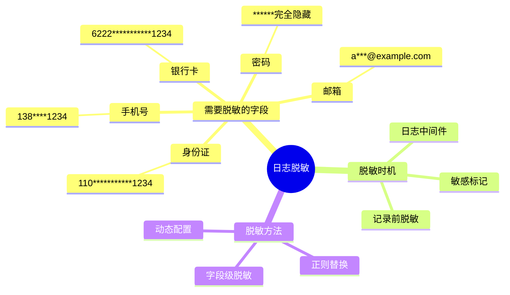
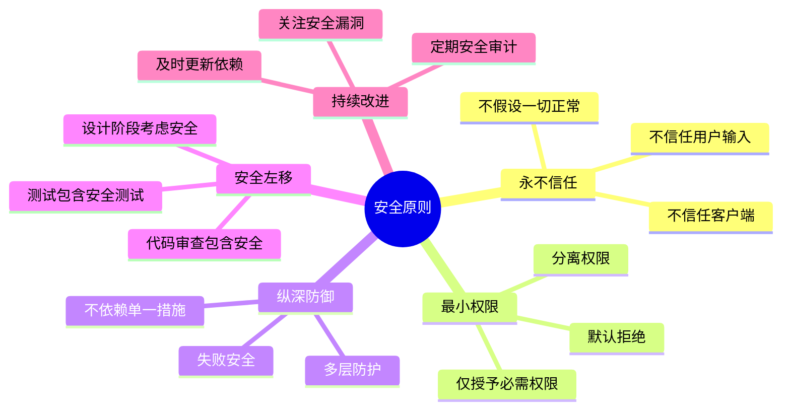

# 安全防护专题

> 本文档深入探讨后端安全防护的核心策略和方法，帮助你构建安全可靠的应用。

## 安全防护层次

```mermaid
flowchart TB
    subgraph 边缘层[边缘防护层]
        E1[防火墙]
        E2[DDoS防护]
        E3[CDN]
    end

    subgraph 接入层[接入防护层]
        A1[HTTPS/TLS]
        A2[限流]
        A3[黑名单]
    end

    subgraph 认证层[认证授权层]
        Au1[身份认证]
        Au2[权限控制]
        Au3[会话管理]
    end

    subgraph 应用层[应用防护层]
        App1[输入验证]
        App2[输出编码]
        App3[业务逻辑]
    end

    subgraph 数据层[数据防护层]
        D1[加密存储]
        D2[访问控制]
        D3[审计日志]
    end

    E1 --> A1
    E2 --> A2
    E3 --> A3

    A1 --> Au1
    A2 --> Au2
    A3 --> Au3

    Au1 --> App1
    Au2 --> App2
    Au3 --> App3

    App1 --> D1
    App2 --> D2
    App3 --> D3

    ```

## 认证授权流程

```mermaid
sequenceDiagram
    participant C as 客户端
    participant A as 认证服务
    participant R as 资源服务
    participant DB as 数据库

    C->>A: 1. POST /auth/login<br/>{username, password}
    A->>DB: 2. 查询用户
    DB-->>A: 3. 用户信息
    A->>A: 4. 验证密码<br/>bcrypt.compare()
    A->>A: 5. 生成JWT Token
    A-->>C: 6. 返回Token

    C->>R: 7. GET /api/users<br/>Header: Authorization: Bearer {token}
    R->>R: 8. 验证Token签名
    R->>R: 9. 检查Token过期
    R->>R: 10. 提取用户信息
    R->>R: 11. 检查权限
    R-->>C: 12. 返回数据
```

## 威胁与防护映射

```mermaid
graph TB
    subgraph 威胁[安全威胁]
        T1[SQL注入]
        T2[XSS攻击]
        T3[CSRF攻击]
        T4[暴力破解]
        T5[越权访问]
        T6[敏感数据泄露]
    end

    subgraph 防护[防护措施]
        P1[参数化查询]
        P2[输出转义]
        P3[CSRF Token]
        P4[限流与锁定]
        P5[权限验证]
        P6[数据加密]
    end

    T1 --> P1
    T2 --> P2
    T3 --> P3
    T4 --> P4
    T5 --> P5
    T6 --> P6

    ```

## 输入验证

```mermaid
flowchart TB
    Input[用户输入] --> Type{类型验证}

    Type -->|字符串| Str[字符串验证]
    Type -->|数字| Num[数字验证]
    Type -->|日期| Date[日期验证]
    Type -->|文件| File[文件验证]

    Str --> S1[长度检查]
    Str --> S2[格式检查]
    Str --> S3[白名单过滤]

    Num --> N1[范围检查]
    Num --> N2[类型检查]

    Date --> D1[格式检查]
    Date --> D2[合理性检查]

    File --> F1[文件类型]
    File --> F2[文件大小]
    File --> F3[病毒扫描]

    S1 --> Clean[清理输入]
    S2 --> Clean
    S3 --> Clean
    N1 --> Clean
    N2 --> Clean
    D1 --> Clean
    D2 --> Clean
    F1 --> Clean
    F2 --> Clean
    F3 --> Clean

    Clean --> Pydantic[Pydantic验证]
    Pydantic --> Business[业务验证]
    Business --> Valid[验证通过]

    ```

## 密码安全

```mermaid
flowchart LR
    Password[用户密码] --> Hash{哈希处理}

    Hash -->|不要| Plain[明文存储<br/>❌ 严禁]
    Hash -->|不要| MD5[MD5/SHA1<br/>❌ 不安全]
    Hash -->|推荐| Bcrypt[bcrypt/argon2<br/>✅ 安全]

    Bcrypt --> Salt[自动加盐]
    Salt --> Rounds[多轮迭代]
    Rounds --> Secure[安全存储]

    ```

### 密码策略

| 策略 | 说明 | 推荐值 |
|-----|------|-------|
| 最小长度 | 密码最小长度 | ≥ 8 字符 |
| 复杂度要求 | 包含字符类型 | 大小写+数字+符号 |
| 哈希算法 | 哈希算法选择 | bcrypt / argon2 |
| 迭代次数 | 哈希迭代次数 | ≥ 10 轮 |
| 加盐 | 每个密码唯一盐 | 自动加盐 |

## JWT 安全

```mermaid
flowchart TB
    Login[用户登录] --> Verify[验证身份]
    Verify --> Generate[生成JWT]

    Generate --> Header[Header<br/>alg: HS256<br/>typ: JWT]
    Generate --> Payload[Payload<br/>user_id<br/>exp: 过期时间<br/>iat: 签发时间]
    Generate --> Signature[Signature<br/>HMACSHA256<br/>(secret)]

    Header --> Token[JWT Token]
    Payload --> Token
    Signature --> Token

    Token --> Client[客户端存储]

    Client --> Request[后续请求]
    Request --> Header2[Authorization Header<br/>Bearer {token}]

    Header2 --> Verify2[服务端验证]
    Verify2 --> V1[验证签名]
    Verify2 --> V2[检查过期]
    Verify2 --> V3[提取信息]

    V1 --> Valid[验证通过]
    V2 --> Valid
    V3 --> Valid

    ```

## 权限控制

```mermaid
flowchart TB
    Request[请求] --> Auth{已认证?}

    Auth -->|否| Login[返回401<br/>要求登录]
    Auth -->|是| Perm{有权限?}

    Perm -->|否| Forbidden[返回403<br/>权限不足]
    Perm -->|是| Data{数据权限?}

    Data -->|否| Process[处理请求]
    Data -->|是| Filter[添加数据过滤]

    Filter --> Process

    Process --> Response[返回响应]

    ```

### 权限控制层次

| 层次 | 说明 | 示例 |
|-----|------|------|
| 接口权限 | 能否访问接口 | POST /api/users 需要 admin 角色 |
| 数据权限 | 能访问哪些数据 | 用户只能查看自己的订单 |
| 字段权限 | 能看到哪些字段 | 普通用户不能看到手机号 |
| 操作权限 | 能执行哪些操作 | 只有作者可以编辑文章 |

## 攻击防护

### 1. SQL 注入防护

```mermaid
flowchart TB
    Input[用户输入] --> Build{构建SQL}

    Build -->|危险| Concat[字符串拼接<br/>❌ 易受注入]
    Build -->|安全| Param[参数化查询<br/>✅ 安全]

    Concat --> Attack[SQL注入攻击]
    Param --> Protect[自动转义]

    Attack --> Damage[数据泄露/破坏]
    Protect --> Safe[安全执行]

    ```

**防护措施**：
1. 使用 ORM 框架（SQLAlchemy）
2. 参数化查询
3. 输入验证
4. 最小权限原则

### 2. XSS 攻击防护

```mermaid
flowchart LR
    Input[用户输入] --> Store{存储?}

    Store -->|存储型| SDB[存入数据库]
    Store -->|反射型| URL[URL参数]

    SDB --> Output[输出到HTML]
    URL --> Output

    Output --> Escape{HTML转义?}

    Escape -->|否| Attack[XSS攻击<br/>执行恶意脚本]
    Escape -->|是| Safe[转义特殊字符<br/>< → &lt;<br/>> → &gt;<br/>" → &quot;]

    Attack --> Damage[窃取Cookie/重定向]
    Safe --> Display[正常显示]

    ```

**防护措施**：
1. 输出转义 HTML 特殊字符
2. Content-Type: application/json（避免 HTML）
3. CSP（内容安全策略）
4. HttpOnly Cookie

### 3. CSRF 攻击防护

```mermaid
sequenceDiagram
    participant User as 用户浏览器
    participant Site as 受信任网站
    participant Evil as 恶意网站

    User->>Site: 1. 访问登录页面
    Site-->>User: 2. 返回页面+CSRF Token
    Note over User: Token存储在表单中

    User->>Site: 3. 提交表单+Token
    Site->>Site: 4. 验证Token
    Site-->>User: 5. 处理成功

    Evil->>User: 6. 诱导点击恶意链接
    User->>Site: 7. 跨域请求（无Token）
    Site->>Site: 8. Token验证失败
    Site-->>User: 9. 拒绝请求
```

**防护措施**：
1. CSRF Token
2. SameSite Cookie 属性
3. 验证 Origin / Referer
4. 重要操作使用 POST

### 4. 暴力破解防护

```mermaid
flowchart TB
    Login[登录请求] --> Check{检查尝试次数}

    Check -->|< 5次| Normal[正常处理]
    Check -->|≥ 5次| Block[触发防护]

    Normal --> Verify{验证密码}
    Verify -->|成功| Reset[重置计数]
    Verify -->|失败| Count[计数+1]

    Block --> Strategy{防护策略}

    Strategy --> Delay[延迟响应]
    Strategy --> Captcha[验证码]
    Strategy --> Lock[临时锁定]

    Delay --> Wait[等待5秒]
    Wait --> Verify2{验证密码}

    Captcha --> Human[验证通过]
    Human --> Verify2

    Lock --> Time[等待30分钟]
    Time --> Unlock[自动解锁]

    Reset --> Success[登录成功]
    Verify2 --> Success
    Verify2 --> Fail[登录失败]

    ```

## 数据保护

### 敏感数据加密

```mermaid
flowchart TB
    Data[敏感数据] --> Classify{数据分类}

    Classify -->|密码| Hash[哈希存储<br/>不可逆]
    Classify -->|个人信息| Symmetric[对称加密<br/>AES]
    Classify -->|传输数据| TLS[HTTPS/TLS]

    Hash --> bcrypt[bcrypt/argon2]
    Symmetric --> AES[AES-256]
    TLS --> Certificate[SSL证书]

    bcrypt --> Secure[安全存储]
    AES --> Secure
    Certificate --> Secure

    style Secure fill:#e1ffe1
```

### 日志脱敏



## 安全检查清单

### 认证授权
- 密码使用 bcrypt/argon2 哈希
- JWT 使用强密钥签名
- Token 有过期时间
- 实现刷新 Token 机制
- 敏感接口需要认证
- 实施权限控制

### 输入验证
- 使用 Pydantic 验证输入
- 验证数据类型和范围
- 过滤危险字符
- 限制文件上传类型和大小
- 使用白名单而非黑名单

### 输出编码
- HTML 输出转义
- JSON 输出设置正确 Content-Type
- 敏感数据脱敏
- 不返回内部错误详情

### 防护措施
- 使用参数化查询（ORM）
- 实施 CSRF 防护
- 配置 CSP
- 实施限流
- 防止暴力破解

### 数据安全
- 敏感数据加密存储
- 日志脱敏
- 使用 HTTPS
- 数据库访问控制
- 定期备份

## 安全原则



## 相关文档

- [03-后端思维培养/04-安全考虑思维.md](../03-后端思维培养/04-安全考虑思维.md) - 安全思维
- [05-前端开发者的后端入门/01-思维转变-从请求到响应.md](../05-前端开发者的后端入门/01-思维转变-从请求到响应.md) - 数据验证和脱敏
