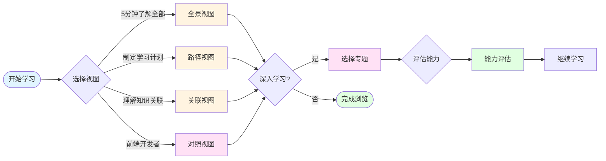

# 后端知识地图

> 整合 [03-后端思维培养](../03-后端思维培养) 和 [05-前端开发者的后端入门](../05-前端开发者的后端入门) 的完整知识体系，通过 Mermaid 图表提供可视化的学习导航。

## 简介

本知识地图将后端开发的核心知识点以可视化的方式呈现，帮助你：

- 快速了解后端开发的知识体系
- 找到适合自己的学习路径
- 理解知识点之间的关联关系
- 评估自己的技能水平

## 快速导航

### 视图选择

| 视图类型 | 文档 | 说明 |
|---------|------|------|
| [全景视图](00-知识体系全景图.md) | 00-知识体系全景图.md | 一图掌握全部知识，MindMap 思维导图 |
| [路径视图](01-学习路径规划.md) | 01-学习路径规划.md | 按学习顺序浏览，FlowChart + Gantt 图表 |
| [关联视图](02-核心概念关联图.md) | 02-核心概念关联图.md | 查看概念关系，Graph 关系网络图 |
| [对照视图](06-前端后端对照.md) | 06-前端后端对照.md | 前后端概念对照，适合前端开发者 |

### 能力评估

| 评估类型 | 文档 | 说明 |
|---------|------|------|
| [思维培养体系](03-思维培养体系.md) | 03-思维培养体系.md | 评估思维维度，来自 03-后端思维培养 |
| [技术能力矩阵](04-技术能力矩阵.md) | 04-技术能力矩阵.md | 评估技能水平，四层级技能树 |
| [知识点依赖图](05-知识点依赖图.md) | 05-知识点依赖图.md | 查看学习前置条件，依赖关系图 |
| [实战能力路线](13-实战能力路线.md) | 13-实战能力路线.md | 评估实战能力，Level 1-7 成长路径 |

### 专题深入

| 专题 | 文档 | 核心内容 |
|-----|------|---------|
| 数据建模 | [07-数据建模专题.md](07-数据建模专题.md) | 概念模型、逻辑模型、物理模型、ORM |
| 接口设计 | [08-接口设计专题.md](08-接口设计专题.md) | RESTful、路由设计、参数处理、响应设计 |
| 性能优化 | [09-性能优化专题.md](09-性能优化专题.md) | 缓存策略、查询优化、异步处理、监控分析 |
| 安全防护 | [10-安全防护专题.md](10-安全防护专题.md) | 认证授权、权限控制、数据保护、攻击防护 |
| 异步编程 | [11-异步编程专题.md](11-异步编程专题.md) | async/await、并发处理、异步上下文管理 |
| 数据持久化 | [12-数据持久化专题.md](12-数据持久化专题.md) | CRUD 操作、事务管理、ORM 查询、缓存策略 |

## 导航流程



## 使用建议

### 学习路径建议

1. **前端开发者入门**
   1. 阅读 [06-前端后端对照.md](06-前端后端对照.md)，建立概念映射
   2. 查看 [01-学习路径规划.md](01-学习路径规划.md)，制定学习计划
   3. 按路径学习 [05-前端开发者的后端入门](../05-前端开发者的后端入门) 中的内容
   4. 定期使用 [04-技术能力矩阵.md](04-技术能力矩阵.md) 评估进度

2. **后端思维培养**
   1. 阅读 [00-知识体系全景图.md](00-知识体系全景图.md)，了解全局
   2. 深入 [03-思维培养体系.md](03-思维培养体系.md)，理解五大思维维度
   3. 选择感兴趣的专题深入学习（07-12）
   4. 实践项目中应用 [13-实战能力路线.md](13-实战能力路线.md)

3. **查漏补缺**
   1. 查看 [02-核心概念关联图.md](02-核心概念关联图.md)，找出知识盲区
   2. 使用 [05-知识点依赖图.md](05-知识点依赖图.md)，规划学习顺序
   3. 针对性学习相关专题

### 图表类型说明

| 图表类型 | 适用场景 | 渲染支持 |
|---------|---------|---------|
| mindmap | 整体架构、层级关系 | GitHub, VS Code, 在线渲染器 |
| flowchart | 流程、路径、决策 | 所有主流平台 |
| graph | 网络关系、概念关联 | 所有主流平台 |
| sequenceDiagram | 时序流程、交互过程 | 所有主流平台 |
| stateDiagram | 状态变化、生命周期 | 所有主流平台 |
| gantt | 时间规划、里程碑 | GitHub, VS Code |
| pie | 分布占比、统计 | GitHub, 在线渲染器 |

### 推荐学习顺序

```
第一周：建立认知
├── 阅读全景视图，了解全局
├── 查看路径视图，制定计划
└── 阅读对照视图，建立概念映射

第二周：基础知识
├── 学习 HTTP 和路由基础
├── 理解数据模型（DO/VO/Query）
└── 掌握接口设计基础

第三周：核心技能
├── 依赖注入机制
├── 异步编程基础
└── 数据持久化操作

第四周：思维培养
├── 数据建模思维
├── 接口设计思维
└── 安全考虑思维

第五周及以后：专题深入
├── 选择感兴趣的专题深入学习
├── 实践项目巩固
└── 持续评估和改进
```

## 知识来源

本知识地图整合了以下两个系列的内容：

- **[03-后端思维培养](../03-后端思维培养)**：从思维方式层面培养后端开发能力
  - 数据建模思维
  - 接口设计思维
  - 性能优化思维
  - 安全考虑思维
  - 可维护性思维

- **[05-前端开发者的后端入门](../05-前端开发者的后端入门)**：从前端开发者视角入门后端
  - 思维转变（从请求到响应）
  - 数据处理（模型即代码）
  - 接口设计（函数即路由）
  - 依赖管理（比 hooks 更强大）
  - 异步编程（比 Promise 更优雅）
  - 数据持久化（状态管理的本质）
  - 实战项目（从零到一）

## 贡献指南

如果你发现知识地图有遗漏或错误，欢迎：

1. 直接修改相关文档
2. 提交 Issue 或 PR
3. 分享你的学习经验

## 许可证

本项目采用与主项目相同的许可证。
