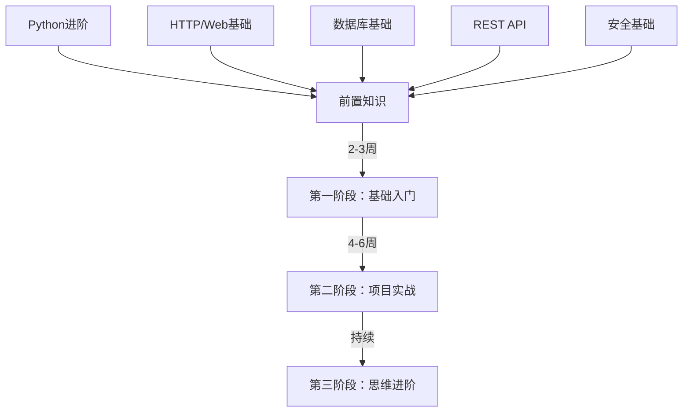

# RuoYi-Vue3-FastAPI 学习路线图

> 本学习路线面向零基础或基础薄弱的开发者，帮助你系统掌握企业级 FastAPI 后端开发。

## 学习目标

完成本学习路线后，你将能够：

- ✅ 理解企业级后端项目的架构设计
- ✅ 掌握 FastAPI 框架的核心用法
- ✅ 具备后端开发思维（数据建模、接口设计、安全意识）
- ✅ 能够独立开发 REST API
- ✅ 理解异步编程、数据库连接池、缓存等后端核心技术

## 学习路线总览



## 三阶段学习计划

### 第一阶段：基础入门（2-3周）

**目标**：掌握必要的前置知识，能够理解项目代码

| 周次 | 内容 | 文档 |
|------|------|------|
| Week 1 | Python 进阶特性、HTTP/Web 基础 | `01-前置知识/` |
| Week 2 | 数据库基础、REST API 设计 | `01-前置知识/` |
| Week 3 | Web 安全基础、FastAPI 入门 | `01-前置知识/` + 官方文档 |

**输出检验**：
- 能理解 Python 装饰器、async/await 代码
- 能看懂 HTTP 请求和响应的结构
- 能写基本的 SQL 查询
- 能使用 FastAPI 写一个简单接口

### 第二阶段：项目实战（4-6周）

**目标**：深入理解项目架构和核心功能实现

| 周次 | 内容 | 项目文档 |
|------|------|----------|
| Week 1-2 | 理解架构、依赖注入、异步编程 | `start/` + `public/` |
| Week 3-4 | 核心功能：登录、权限、异常处理 | `function/` + `feature/` |
| Week 5-6 | 深入细节：链路追踪、并发控制 | `start/` + `public/` |

**输出检验**：
- 能画出项目的分层架构图
- 能解释登录功能的完整流程
- 能理解数据权限控制的实现原理
- 能自己添加一个新的 API 接口

### 第三阶段：思维进阶（持续）

**目标**：培养后端开发思维

| 思维维度 | 训练方法 | 文档 |
|----------|----------|------|
| 数据建模 | 分析 entity 设计，思考表结构 | `03-后端思维培养/01-数据建模思维.md` |
| 接口设计 | 分析 controller，思考参数设计 | `03-后端思维培养/02-接口设计思维.md` |
| 性能优化 | 分析缓存、索引、异步处理 | `03-后端思维培养/03-性能优化思维.md` |
| 安全考虑 | 分析认证、授权、防护措施 | `03-后端思维培养/04-安全考虑思维.md` |
| 可维护性 | 分析分层、模块化、代码规范 | `03-后端思维培养/05-可维护性思维.md` |

## 学习方法建议

### 1. 边学边练

不要只读文档，要动手实践：

```bash
# 1. 克隆并运行项目
git clone <项目地址>
cd ruoyi-fastapi-backend
pip install -r requirements.txt
python app.py --env=dev

# 2. 访问 API 文档
# 浏览器打开 http://localhost:9099/docs

# 3. 尝试调用登录接口
# 观察请求和响应的格式
```

### 2. 调试阅读

使用 IDE 的断点调试功能：

1. 在 `login_controller.py` 的登录函数打断点
2. 发起登录请求
3. 一步步跟踪代码执行
4. 观察变量变化和调用栈

### 3. 修改实践

从小改动开始：

- ✅ 修改一个接口的返回字段
- ✅ 添加一个简单的查询接口
- ✅ 修改一个字段的校验规则
- ✅ 故意制造错误，观察异常处理流程

### 4. 提问思考

阅读代码时多问自己：

- ❓ 为什么要这样设计？有什么好处？
- ❓ 如果不这样设计会有什么问题？
- ❓ 这个设计在什么场景下会出问题？
- ❓ 有没有更好的实现方式？

## 学习资源

### 官方文档

| 主题 | 链接 |
|------|------|
| FastAPI | https://fastapi.tiangolo.com/zh/ |
| SQLAlchemy | https://docs.sqlalchemy.org/en/20/ |
| Pydantic | https://docs.pydantic.dev/ |
| Python asyncio | https://docs.python.org/zh-cn/3.11/library/asyncio.html |

### 推荐书籍

| 书名 | 适用阶段 |
|------|----------|
| 《流畅的 Python》 | 第一阶段 |
| 《FastAPI Web 开发》 | 第二阶段 |
| 《数据库系统概念》 | 第一阶段 |
| 《HTTP 权威指南》 | 第一阶段 |

## 常见问题

### Q: 零基础能学吗？
**A**: 可以，但需要投入更多时间。建议先花 2-3 周补基础，再进入项目学习。

### Q: 需要多长时间？
**A**:
- 有编程基础：6-8 周
- 零基础：10-12 周
- 要精通：持续实践 3-6 个月

### Q: 学完能达到什么水平？
**A**: 能够独立开发中小型的 REST API 后端服务，具备初中级后端工程师的能力。

### Q: 遇到问题怎么办？
**A**:
1. 先查项目文档 `docs/` 目录
2. 搜索 FastAPI 官方文档
3. 用 ChatGPT/Claude 等 AI 工具辅助
4. 在 GitHub 提 issue

## 学习检查清单

### 第一阶段检查点

- [ ] 能理解 Python 装饰器的工作原理
- [ ] 能使用 async/await 写异步代码
- [ ] 能解释 HTTP 请求和响应的结构
- [ ] 能写基本的 SQL 查询（SELECT/WHERE/JOIN）
- [ ] 能理解 REST API 的设计原则
- [ ] 能解释 JWT 的基本原理
- [ ] 能用 FastAPI 写一个简单的 CRUD 接口

### 第二阶段检查点

- [ ] 能画出项目的分层架构图
- [ ] 能解释依赖注入的作用和使用场景
- [ ] 能跟踪登录功能的完整执行流程
- [ ] 能理解数据权限控制的实现原理
- [ ] 能解释全局异常处理机制
- [ ] 能使用 SQLAlchemy 进行数据库操作
- [ ] 能自己添加一个新的业务接口

### 第三阶段检查点

- [ ] 能设计合理的数据库表结构
- [ ] 能设计符合 REST 规范的 API 接口
- [ ] 能考虑接口的性能优化方案
- [ ] 能识别常见的安全漏洞
- [ ] 能写出易维护、可扩展的代码

## 开始学习

准备好了吗？让我们从 [前置知识](./01-前置知识/) 开始吧！
