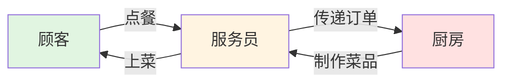
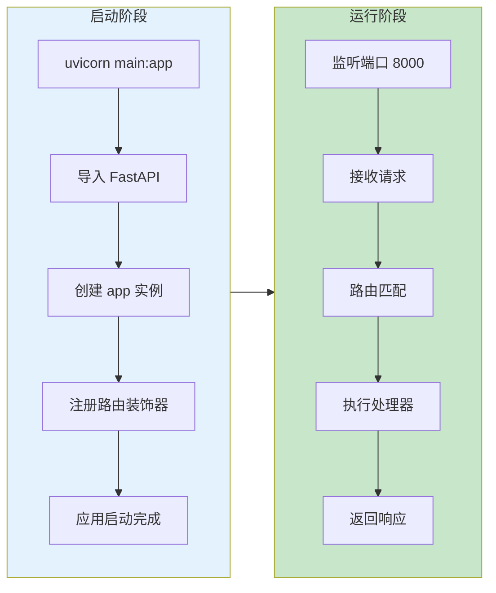
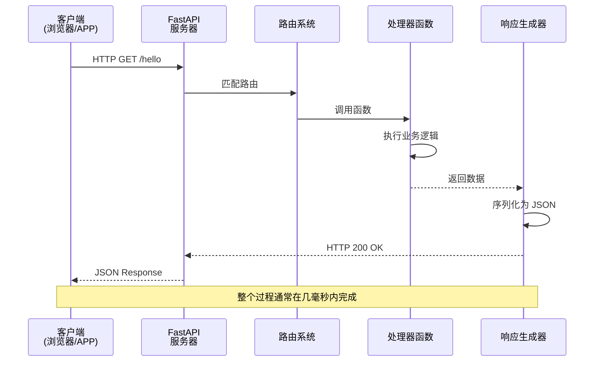
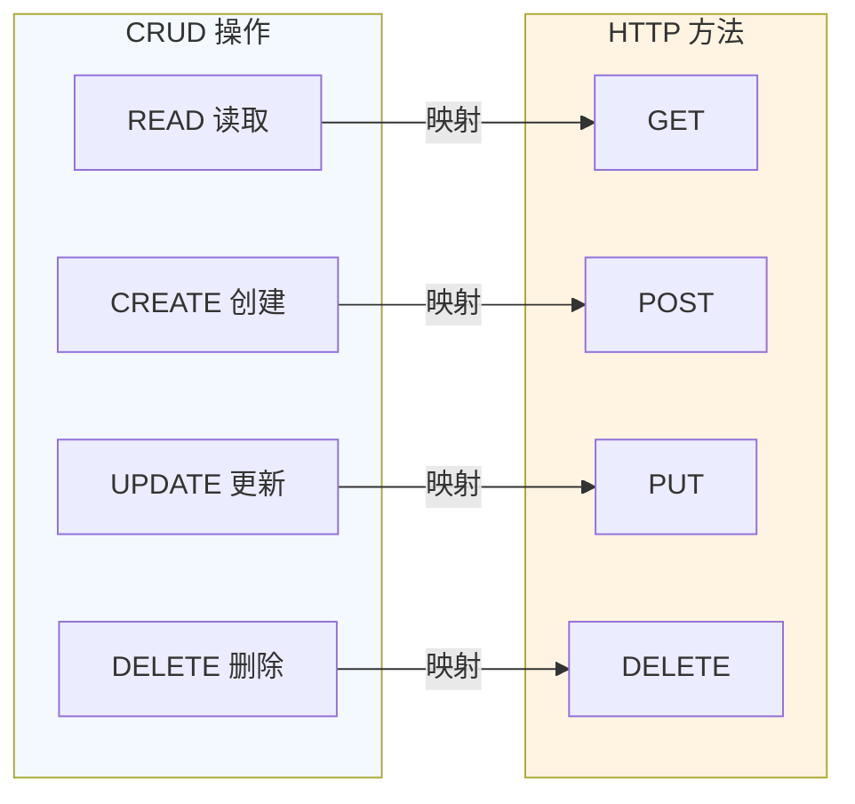
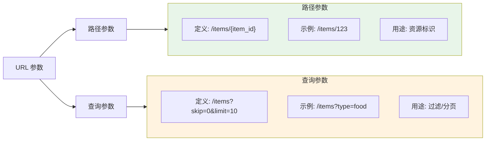
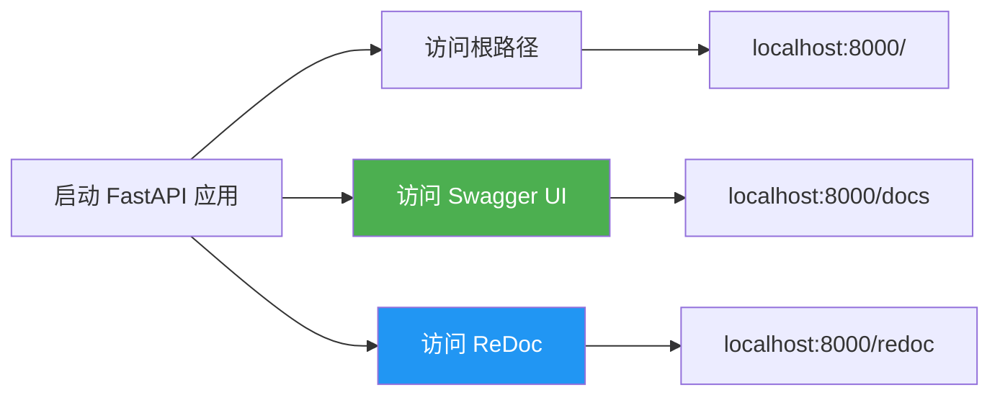
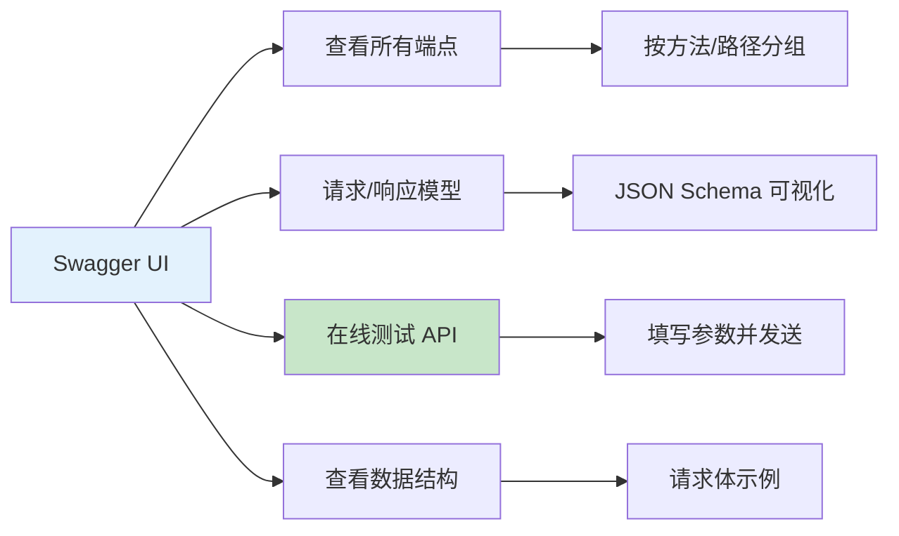
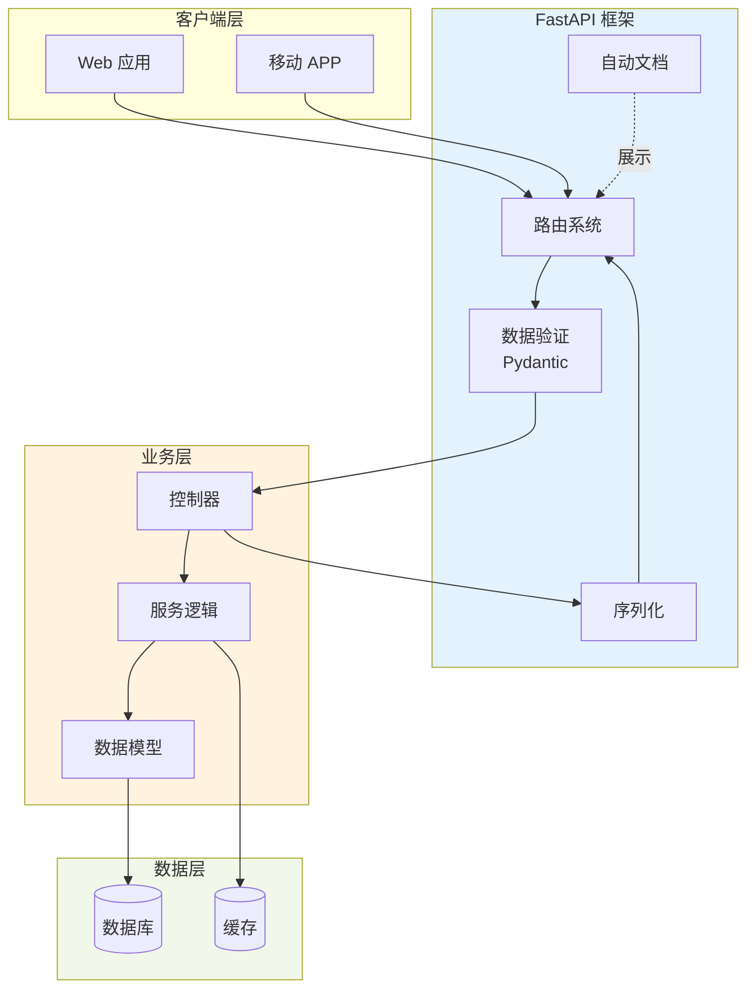
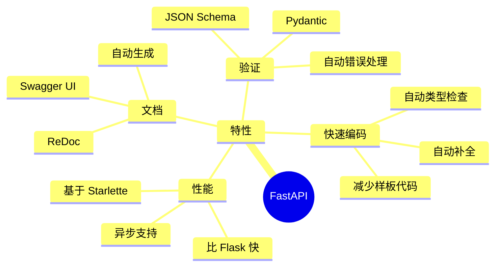
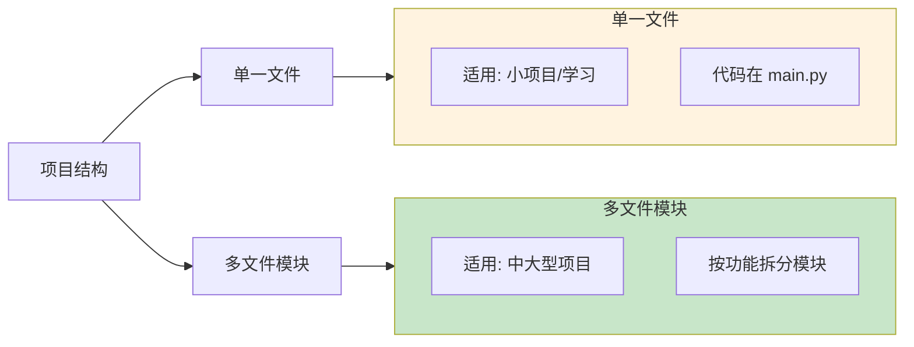

# 第一个 API 接口

> 学会如何创建一个 FastAPI 应用，理解 Web API 的基本工作流程

## 📋 本章目标

- [ ] 理解什么是 API（应用程序接口）
- [ ] 创建第一个 FastAPI 应用
- [ ] 掌握请求-响应的基本流程
- [ ] 认识 FastAPI 的自动文档功能

## 🎯 什么是 API

API（Application Programming Interface，应用程序接口）是软件系统之间通信的桥梁。在 Web 开发中，API 允许前端（网页/APP）向后端请求数据或执行操作。

### 现实生活中的类比



**在 Web API 中：**
- **顾客** = 前端应用（浏览器/手机APP）
- **服务员** = API 接口
- **厨房** = 后端服务器（数据库、业务逻辑）

## 🏗️ FastAPI 应用结构

### 最小的 FastAPI 应用

```python
# main.py
from fastapi import FastAPI

# 创建应用实例
app = FastAPI()

# 定义路由和处理器
@app.get("/")
def read_root():
    return {"message": "Hello, World!"}

# 启动命令: uvicorn main:app --reload
```

### 应用启动流程



## 🔄 请求-响应生命周期

### 完整流程图



### 代码示例：记账 API

```python
from fastapi import FastAPI
from datetime import datetime

app = FastAPI(title="记账系统 API", version="1.0.0")

# 模拟数据存储
transactions = []

@app.get("/")
def root():
    """根路径 - API 欢迎页面"""
    return {
        "app": "记账系统",
        "version": "1.0.0",
        "status": "running"
    }

@app.post("/transactions")
def create_transaction(amount: float, category: str, note: str = ""):
    """创建记账记录"""
    transaction = {
        "id": len(transactions) + 1,
        "amount": amount,
        "category": category,
        "note": note,
        "created_at": datetime.now().isoformat()
    }
    transactions.append(transaction)
    return transaction

@app.get("/transactions")
def get_transactions():
    """获取所有记账记录"""
    return {"transactions": transactions, "count": len(transactions)}

@app.get("/transactions/{transaction_id}")
def get_transaction(transaction_id: int):
    """获取单条记账记录"""
    for t in transactions:
        if t["id"] == transaction_id:
            return t
    return {"error": "未找到该记录"}, 404
```

## 🌐 HTTP 方法与 CRUD

### 常用 HTTP 方法



### 方法使用场景

| HTTP 方法 | 用途 | 示例 | 是否幂等 |
|-----------|------|------|---------|
| **GET** | 获取资源 | `GET /transactions` | ✅ 是 |
| **POST** | 创建资源 | `POST /transactions` | ❌ 否 |
| **PUT** | 更新资源（全量）| `PUT /transactions/1` | ✅ 是 |
| **PATCH** | 更新资源（部分）| `PATCH /transactions/1` | ❌ 否 |
| **DELETE** | 删除资源 | `DELETE /transactions/1` | ✅ 是 |

> **幂等性**：多次执行相同操作，结果是否相同

## 📊 路径参数与查询参数

### 参数类型对比



### 代码示例

```python
from fastapi import FastAPI
from typing import Optional

app = FastAPI()

# 路径参数 - 必需的
@app.get("/transactions/{transaction_id}")
def get_transaction(transaction_id: int):
    """transaction_id 是路径参数"""
    return {"transaction_id": transaction_id}

# 查询参数 - 可选的
@app.get("/transactions")
def list_transactions(
    skip: int = 0,          # 默认值
    limit: int = 10,        # 默认值
    category: Optional[str] = None  # 可选
):
    """skip, limit, category 是查询参数"""
    return {
        "skip": skip,
        "limit": limit,
        "category": category
    }

# 混合使用
@app.get("/transactions/{transaction_id}/comments/{comment_id}")
def get_comment(
    transaction_id: int,    # 路径参数
    comment_id: int,        # 路径参数
    verbose: bool = False   # 查询参数
):
    return {
        "transaction_id": transaction_id,
        "comment_id": comment_id,
        "verbose": verbose
    }
```

## 📖 自动 API 文档

FastAPI 自动生成交互式 API 文档，这是它的核心特性之一。

### 访问文档



### Swagger UI 特性



### 体验自动文档

1. **启动应用**：
```bash
uvicorn main:app --reload
```

2. **访问 Swagger UI**：
```
http://localhost:8000/docs
```

3. **尝试 API 调用**：
   - 点击端点展开详情
   - 点击 "Try it out"
   - 填写参数
   - 点击 "Execute"

## 🛠️ 完整示例：记账系统 API

### 项目结构

```mermaid
tree
    root[记账系统 API]
    root --> main_py["main.py<br/>(应用入口)"]
    root --> models_py["models.py<br/>(数据模型)"]
    root --> routers_py["routers.py<br/>(路由定义)"]

    style root fill:#f5f5f5
```

### 完整代码实现

```python
# main.py
from fastapi import FastAPI, HTTPException
from datetime import datetime
from typing import List, Optional
from pydantic import BaseModel

app = FastAPI(
    title="记账系统 API",
    description="一个简单的个人记账 API",
    version="1.0.0"
)

# 数据模型
class Transaction(BaseModel):
    id: Optional[int] = None
    amount: float
    category: str
    note: str = ""
    created_at: Optional[str] = None

# 模拟数据库
transactions_db = []
transaction_id_counter = 0

# 端点定义
@app.get("/", tags=["根路径"])
def root():
    return {
        "message": "欢迎使用记账系统 API",
        "docs": "/docs",
        "total_transactions": len(transactions_db)
    }

@app.post("/transactions", response_model=Transaction, tags=["记账管理"])
def create_transaction(transaction: Transaction):
    """创建新的记账记录"""
    global transaction_id_counter
    transaction_id_counter += 1

    transaction.id = transaction_id_counter
    transaction.created_at = datetime.now().isoformat()

    transactions_db.append(transaction)
    return transaction

@app.get("/transactions", response_model=List[Transaction], tags=["记账管理"])
def get_transactions(
    category: Optional[str] = None,
    min_amount: Optional[float] = None,
    skip: int = 0,
    limit: int = 10
):
    """获取记账记录列表，支持过滤和分页"""
    result = transactions_db

    # 过滤
    if category:
        result = [t for t in result if t.category == category]
    if min_amount:
        result = [t for t in result if t.amount >= min_amount]

    # 分页
    return result[skip : skip + limit]

@app.get("/transactions/{transaction_id}", response_model=Transaction, tags=["记账管理"])
def get_transaction(transaction_id: int):
    """获取单条记账记录"""
    for transaction in transactions_db:
        if transaction.id == transaction_id:
            return transaction
    raise HTTPException(status_code=404, detail="记录未找到")

@app.delete("/transactions/{transaction_id}", tags=["记账管理"])
def delete_transaction(transaction_id: int):
    """删除记账记录"""
    for i, transaction in enumerate(transactions_db):
        if transaction.id == transaction_id:
            transactions_db.pop(i)
            return {"message": "删除成功"}
    raise HTTPException(status_code=404, detail="记录未找到")
```

## 🔍 深入理解：FastAPI 工作原理

### 核心组件架构



### 关键技术特性



## 💡 最佳实践

### 1. 项目组织



### 2. 命名约定

```python
# ✅ 好的命名
@app.get("/transactions")          # 复数，资源集合
@app.get("/transactions/{id}")     # 单数路径参数
def create_transaction():          # 动词 + 名词

# ❌ 避免的命名
@app.get("/transaction")           # 应该用复数
@app.get("/getTransaction")        # 不应该在 URL 中体现动作
```

### 3. 返回适当的 HTTP 状态码

```python
from fastapi import HTTPException

# 成功
@app.post("/items")
def create_item(item: Item):
    return item, 201  # 201 Created

# 失败
@app.get("/items/{item_id}")
def get_item(item_id: int):
    if not item_exists(item_id):
        raise HTTPException(
            status_code=404,
            detail="Item not found"
        )
```

## 📝 练习任务

### 基础练习

1. **创建 Hello API**
   ```python
   # 创建一个端点，访问 /hello/{name} 返回 "Hello, {name}!"
   ```

2. **计算器 API**
   ```python
   # 创建 /add/{a}/{b} 返回 a + b
   # 创建 /multiply 端点，使用查询参数
   ```

### 进阶练习

3. **完善记账系统**
   - 添加更新记录的端点（PUT 方法）
   - 添加按金额范围查询的功能
   - 添加统计功能（总收入/总支出）

4. **添加验证**
   - 金额不能为负数
   - 分类必须是预定义的列表
   - 备注不能超过 100 字符

## ✅ 检查点

完成本章学习后，你应该能够：

- [ ] 解释什么是 API，它如何工作
- [ ] 独立创建一个 FastAPI 应用
- [ ] 区分路径参数和查询参数
- [ ] 正确使用 GET、POST、PUT、DELETE 方法
- [ ] 访问并使用 Swagger UI 文档
- [ ] 理解请求-响应的生命周期

## 🤔 常见问题

### Q1: 为什么要用 FastAPI 而不是 Flask？

**A**: FastAPI 的优势：
- ✅ **类型提示**：自动补全和类型检查
- ✅ **数据验证**：Pydantic 自动验证请求
- ✅ **文档**：零配置自动生成
- ✅ **性能**：异步支持，性能更好

Flask 更适合：
- 简单的、小型的项目
- 需要大量插件生态的场景

### Q2: 路径参数和查询参数什么时候用？

**A**:
- **路径参数**：标识具体资源，必需的
  - `/transactions/123` - 获取 ID 为 123 的记录
- **查询参数**：过滤、排序、分页，可选的
  - `/transactions?category=food&limit=10` - 筛选和分页

### Q3: `@app.get` 装饰器做了什么？

**A**:
```mermaid
flowchart LR
    A[@app.get'/path'] --> B[注册路由]
    B --> C[关联路径与函数]
    C --> D[指定 HTTP 方法]
    D --> E[生成 API 文档]

    style A fill:#e1f5e1
    style E fill:#fff9c4
```

装饰器将 URL 路径、HTTP 方法与处理函数绑定在一起。

## 📚 延伸阅读

- **FastAPI 官方文档**：[https://fastapi.tiangolo.com/](https://fastapi.tiangolo.com/)
- **HTTP 方法详解**：[MDN Web Docs](https://developer.mozilla.org/zh-CN/docs/Web/HTTP/Methods)
- **RESTful API 设计**：下一章会详细讲解

---

**下一章**：[02-路由与请求处理.md](./02-路由与请求处理.md) - 学习如何设计更复杂的 API 路由系统
