# 路由与请求处理

> 深入理解 FastAPI 的路由系统，掌握设计记账 API 的核心技能

## 📋 本章目标

- [ ] 理解路由的工作原理
- [ ] 掌握路径参数和查询参数的使用
- [ ] 学会请求体（Request Body）的处理
- [ ] 设计完整的记账系统 API 路由

## 🛣️ 路由基础概念

### 什么是路由？

路由是 URL 路径与处理函数之间的映射关系。当客户端发送请求时，FastAPI 根据路由规则找到对应的处理函数。

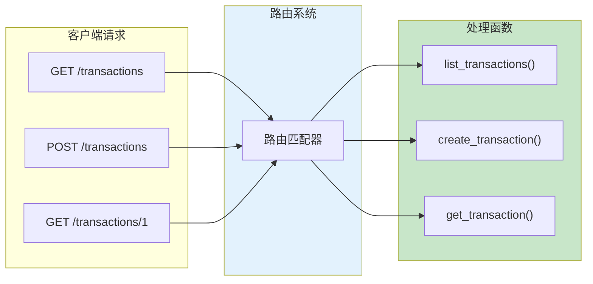

### 路由注册方式

```python
from fastapi import FastAPI

app = FastAPI()

# 方式一：装饰器（推荐）
@app.get("/path")
def handler():
    return {"message": "Hello"}

# 方式二：直接调用方法
def another_handler():
    return {"message": "World"}

app.add_api_route("/another", another_handler, methods=["GET"])
```

## 📍 路径参数（Path Parameters）

### 基本用法

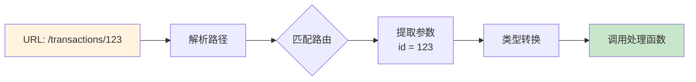

### 代码示例

```python
from fastapi import FastAPI

app = FastAPI()

# 基本路径参数
@app.get("/items/{item_id}")
def read_item(item_id: int):
    return {"item_id": item_id}

# 多个路径参数
@app.get("/users/{user_id}/items/{item_id}")
def read_user_item(user_id: int, item_id: int):
    return {"user_id": user_id, "item_id": item_id}

# 带类型的路径参数
@app.get("/transactions/{transaction_id}")
def get_transaction(transaction_id: int):  # 自动转换为 int
    return {"transaction_id": transaction_id}
```

### 路径参数类型与验证

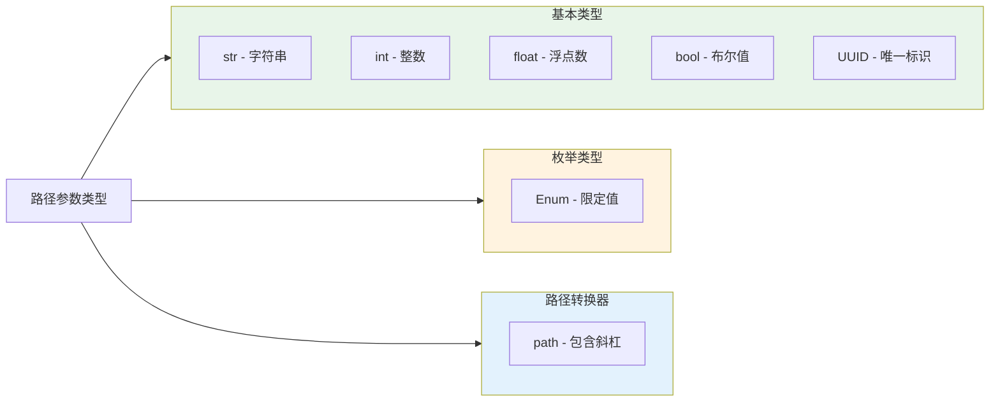

### 枚举路径参数

```python
from enum import Enum
from fastapi import FastAPI

app = FastAPI()

# 定义枚举
class TransactionType(str, Enum):
    income = "income"
    expense = "expense"

# 使用枚举限制参数值
@app.get("/transactions/type/{transaction_type}")
def get_by_type(transaction_type: TransactionType):
    if transaction_type == TransactionType.income:
        return {"type": "income", "message": "这是收入"}
    return {"type": "expense", "message": "这是支出"}
```

### 路径参数顺序规则

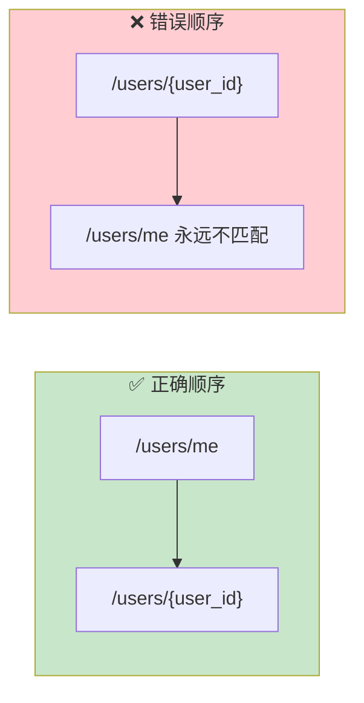

```python
# ✅ 正确：固定路径在前
@app.get("/users/me")
def get_current_user():
    return {"user": "current"}

@app.get("/users/{user_id}")
def get_user(user_id: str):
    return {"user_id": user_id}

# ❌ 错误：动态路径在前会拦截所有请求
# @app.get("/users/{user_id}")  # 这会匹配 /users/me
# def get_user(user_id: str):
#     return {"user_id": user_id}

# @app.get("/users/me")  # 永远不会被匹配
# def get_current_user():
#     return {"user": "current"}
```

## 🔍 查询参数（Query Parameters）

### 基本概念

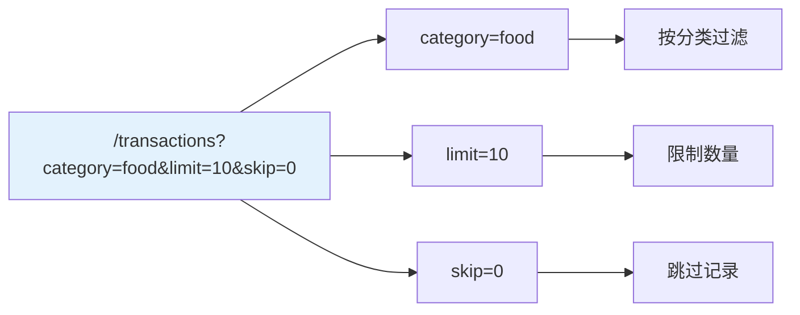

### 查询参数示例

```python
from fastapi import FastAPI
from typing import Optional

app = FastAPI()

# 模拟数据
transactions = [
    {"id": 1, "category": "food", "amount": 50.0},
    {"id": 2, "category": "transport", "amount": 30.0},
    {"id": 3, "category": "food", "amount": 100.0},
]

# 必需的查询参数
@app.get("/items")
def read_items(item_id: int):  # 没有默认值，必需
    return {"item_id": item_id}

# 可选的查询参数
@app.get("/search")
def search(keyword: Optional[str] = None):  # 有默认值，可选
    if keyword:
        return {"keyword": keyword}
    return {"message": "请输入搜索关键词"}

# 多个查询参数 + 分页
@app.get("/transactions")
def list_transactions(
    category: Optional[str] = None,  # 可选过滤
    min_amount: Optional[float] = None,  # 最小金额
    skip: int = 0,    # 默认值，分页偏移
    limit: int = 10,  # 默认值，每页数量
):
    result = transactions

    # 过滤逻辑
    if category:
        result = [t for t in result if t["category"] == category]
    if min_amount:
        result = [t for t in result if t["amount"] >= min_amount]

    # 分页
    return {
        "data": result[skip : skip + limit],
        "total": len(result),
        "skip": skip,
        "limit": limit
    }
```

### 查询参数验证

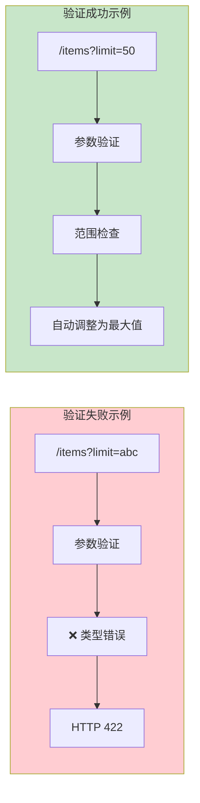

```python
from fastapi import FastAPI, Query

app = FastAPI()

@app.get("/items")
def read_items(
    # 添加验证规则
    q: Optional[str] = Query(
        None,  # 默认值
        min_length=3,     # 最小长度
        max_length=50,    # 最大长度
        title="搜索关键词",
        description="用于搜索商品的关键词，3-50个字符"
    ),
    limit: int = Query(
        10,  # 默认值
        gt=0,      # 大于 0
        le=100,    # 小于等于 100
        description="返回结果数量限制"
    ),
    skip: int = Query(0, ge=0),  # 大于等于 0
):
    return {"q": q, "limit": limit, "skip": skip}

# 必需的查询参数（使用 ... 作为默认值）
@app.get("/required-query")
def required_query(
    token: str = Query(..., min_length=10, description="认证令牌")
):
    return {"token": token}
```

### 查询参数验证规则

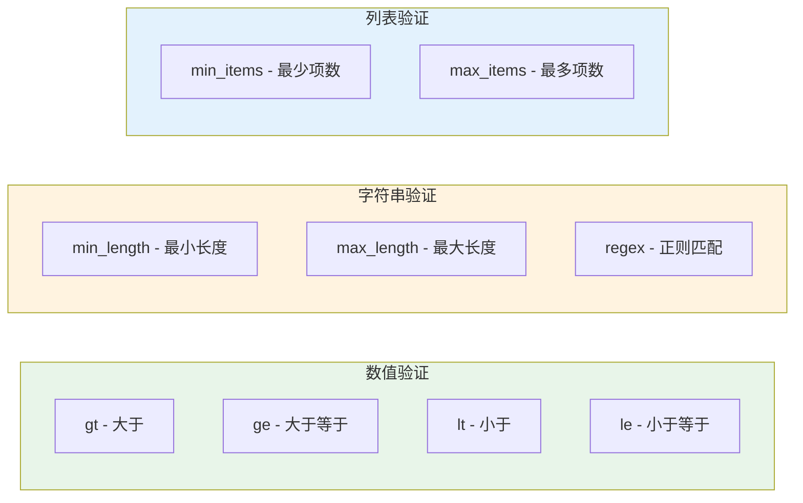

## 📦 请求体（Request Body）

### 请求体概念

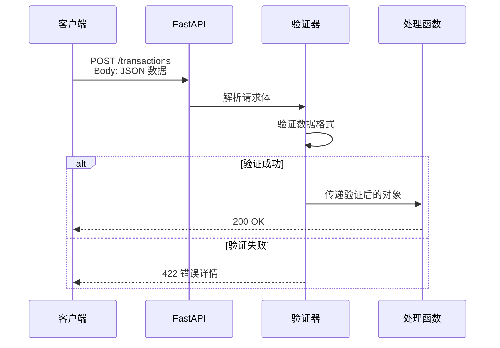

### Pydantic 模型定义

```python
from fastapi import FastAPI
from pydantic import BaseModel, Field
from datetime import datetime
from typing import Optional

app = FastAPI()

# 定义请求体模型
class TransactionCreate(BaseModel):
    amount: float = Field(..., gt=0, description="交易金额，必须大于0")
    category: str = Field(..., min_length=1, max_length=50, description="交易分类")
    note: Optional[str] = Field("", max_length=200, description="备注")
    transaction_date: Optional[datetime] = Field(
        None,
        description="交易日期，默认为当前时间"
    )

    class Config:
        # 示例数据，用于 API 文档
        json_schema_extra = {
            "example": {
                "amount": 99.9,
                "category": "餐饮",
                "note": "午餐",
                "transaction_date": "2024-01-15T12:00:00"
            }
        }

# 使用请求体
@app.post("/transactions")
def create_transaction(transaction: TransactionCreate):
    # transaction 是已验证的 Pydantic 对象
    return {
        "message": "创建成功",
        "data": transaction.model_dump()
    }
```

### 请求体 + 路径参数 + 查询参数

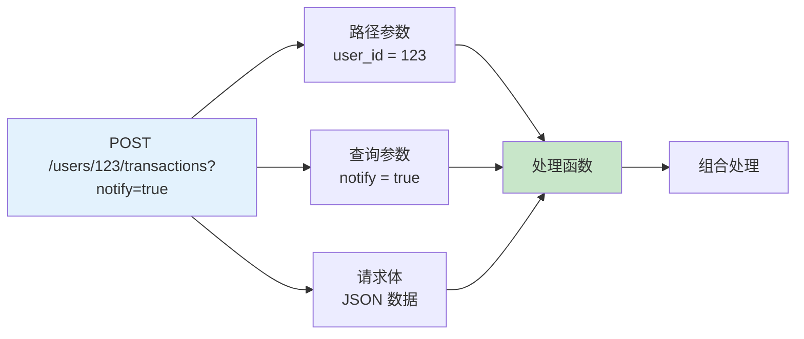

```python
from fastapi import FastAPI, Path, Query
from pydantic import BaseModel

app = FastAPI()

class Transaction(BaseModel):
    amount: float
    category: str
    note: str = ""

@app.post("/users/{user_id}/transactions")
def create_user_transaction(
    # 路径参数
    user_id: int = Path(..., gt=0, description="用户ID"),
    # 查询参数
    notify: bool = Query(False, description="是否发送通知"),
    # 请求体
    transaction: Transaction = None,
):
    return {
        "user_id": user_id,
        "notify": notify,
        "transaction": transaction
    }
```

### 多个请求体参数

```python
from fastapi import FastAPI, Body
from pydantic import BaseModel

app = FastAPI()

class User(BaseModel):
    username: str
    email: str

class Transaction(BaseModel):
    amount: float
    category: str

# 单个请求体（默认）
@app.post("/transaction")
def create_transaction(transaction: Transaction):
    return transaction

# 多个请求体（需要用 Body 嵌入）
@app.post("/user-with-transaction")
def create_user_transaction(
    user: User,
    transaction: Transaction,
    importance: int = Body(...)  # 单个值作为请求体
):
    return {
        "user": user,
        "transaction": transaction,
        "importance": importance
    }

# 请求体示例：
# {
#     "user": {"username": "john", "email": "john@example.com"},
#     "transaction": {"amount": 100, "category": "food"},
#     "importance": 5
# }
```

## 🏗️ 记账系统路由设计

### 完整路由架构

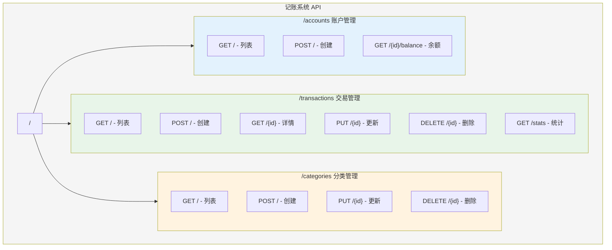

### 路由模块化

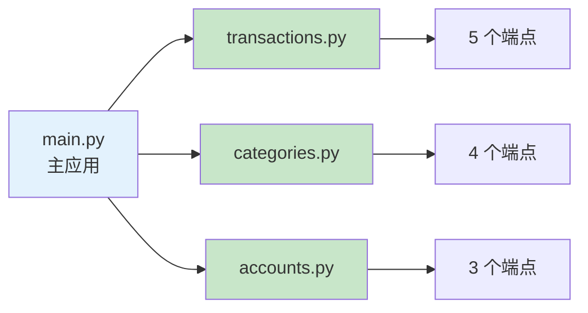

### 模块化代码实现

```python
# routers/transactions.py
from fastapi import APIRouter, Depends, HTTPException, Query
from pydantic import BaseModel
from typing import List, Optional

router = APIRouter(
    prefix="/transactions",
    tags=["交易管理"],
    responses={404: {"description": "未找到"}}
)

# 数据模型
class Transaction(BaseModel):
    id: Optional[int] = None
    amount: float
    category: str
    note: str = ""
    account_id: int

class TransactionCreate(BaseModel):
    amount: float
    category: str
    note: str = ""
    account_id: int

class TransactionUpdate(BaseModel):
    amount: Optional[float] = None
    category: Optional[str] = None
    note: Optional[str] = None

# 模拟数据库
transactions_db = []
transaction_id_counter = 0

@router.get("", response_model=List[Transaction])
def list_transactions(
    category: Optional[str] = Query(None, description="按分类筛选"),
    account_id: Optional[int] = Query(None, description="按账户筛选"),
    min_amount: Optional[float] = Query(None, ge=0, description="最小金额"),
    max_amount: Optional[float] = Query(None, ge=0, description="最大金额"),
    skip: int = Query(0, ge=0),
    limit: int = Query(10, ge=1, le=100),
):
    """
    获取交易记录列表

    - **category**: 按分类筛选
    - **account_id**: 按账户筛选
    - **min_amount/max_amount**: 金额范围
    - **skip/limit**: 分页参数
    """
    result = transactions_db

    if category:
        result = [t for t in result if t["category"] == category]
    if account_id:
        result = [t for t in result if t["account_id"] == account_id]
    if min_amount is not None:
        result = [t for t in result if t["amount"] >= min_amount]
    if max_amount is not None:
        result = [t for t in result if t["amount"] <= max_amount]

    return result[skip:skip+limit]

@router.post("", response_model=Transaction, status_code=201)
def create_transaction(transaction: TransactionCreate):
    """创建新的交易记录"""
    global transaction_id_counter
    transaction_id_counter += 1

    new_transaction = transaction.model_dump()
    new_transaction["id"] = transaction_id_counter

    transactions_db.append(new_transaction)
    return new_transaction

@router.get("/stats")
def get_statistics():
    """获取交易统计信息"""
    if not transactions_db:
        return {
            "total_count": 0,
            "total_amount": 0,
            "by_category": {}
        }

    total_amount = sum(t["amount"] for t in transactions_db)
    by_category = {}

    for t in transactions_db:
        cat = t["category"]
        by_category[cat] = by_category.get(cat, 0) + t["amount"]

    return {
        "total_count": len(transactions_db),
        "total_amount": total_amount,
        "by_category": by_category
    }

@router.get("/{transaction_id}", response_model=Transaction)
def get_transaction(transaction_id: int):
    """获取单条交易记录"""
    for t in transactions_db:
        if t["id"] == transaction_id:
            return t
    raise HTTPException(status_code=404, detail="交易记录不存在")

@router.put("/{transaction_id}", response_model=Transaction)
def update_transaction(transaction_id: int, update_data: TransactionUpdate):
    """更新交易记录"""
    for i, t in enumerate(transactions_db):
        if t["id"] == transaction_id:
            # 只更新提供的字段
            update_dict = update_data.model_dump(exclude_unset=True)
            transactions_db[i].update(update_dict)
            return transactions_db[i]
    raise HTTPException(status_code=404, detail="交易记录不存在")

@router.delete("/{transaction_id}")
def delete_transaction(transaction_id: int):
    """删除交易记录"""
    for i, t in enumerate(transactions_db):
        if t["id"] == transaction_id:
            transactions_db.pop(i)
            return {"message": "删除成功"}
    raise HTTPException(status_code=404, detail="交易记录不存在")
```

### 主应用注册路由

```python
# main.py
from fastapi import FastAPI
from routers import transactions, categories, accounts

app = FastAPI(
    title="记账系统 API",
    description="一个功能完整的个人记账系统",
    version="1.0.0"
)

# 注册路由
app.include_router(transactions.router)
app.include_router(categories.router)
app.include_router(accounts.router)

@app.get("/", tags=["根路径"])
def root():
    return {
        "message": "欢迎使用记账系统 API",
        "docs": "/docs",
        "version": "1.0.0"
    }
```

## 📊 请求处理流程

### 完整请求生命周期

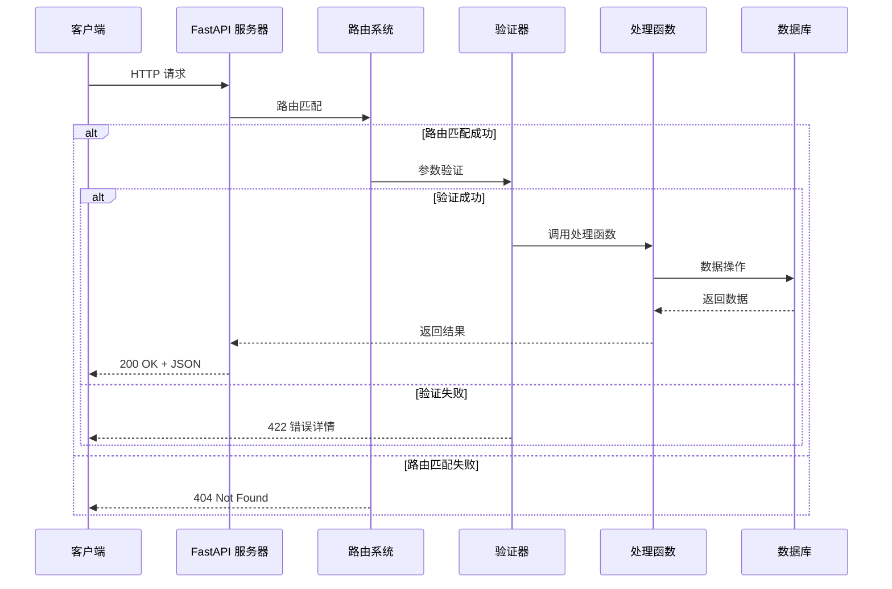

### 参数解析顺序

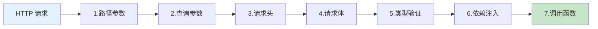

## 🔧 高级路由功能

### 路由前缀与标签

```python
from fastapi import APIRouter

# 创建带有前缀和标签的路由器
router = APIRouter(
    prefix="/api/v1/transactions",
    tags=["交易管理 - v1"],
    dependencies=[],  # 全局依赖
    responses={
        404: {"description": "未找到"},
        500: {"description": "服务器错误"}
    }
)
```

### 路由响应模型

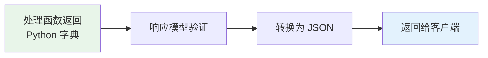

```python
from pydantic import BaseModel
from typing import List

class TransactionResponse(BaseModel):
    id: int
    amount: float
    category: str

class TransactionListResponse(BaseModel):
    data: List[TransactionResponse]
    total: int
    page: int

# 指定响应模型
@router.get("", response_model=TransactionListResponse)
def list_transactions():
    # 返回的数据会自动按 response_model 格式化
    return {
        "data": [...],
        "total": 100,
        "page": 1,
        "extra_field": "会被过滤掉"  # 不在模型中的字段会被移除
    }
```

### 路由分组与版本控制

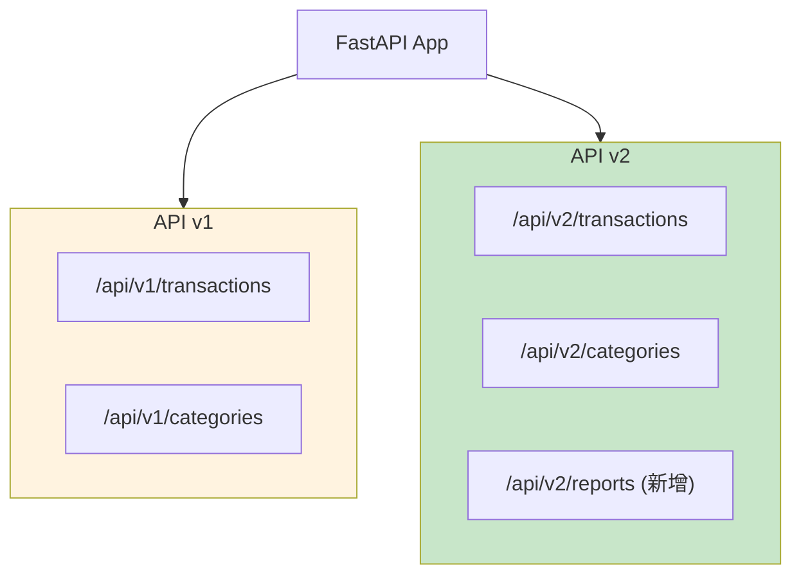

```python
from fastapi import FastAPI, APIRouter

app = FastAPI()

# v1 版本路由
v1_router = APIRouter(prefix="/api/v1")

@v1_router.get("/transactions")
def list_transactions_v1():
    return {"version": "v1", "data": []}

# v2 版本路由
v2_router = APIRouter(prefix="/api/v2")

@v2_router.get("/transactions")
def list_transactions_v2():
    return {"version": "v2", "data": [], "metadata": {}}

# 注册路由
app.include_router(v1_router)
app.include_router(v2_router)
```

## 📝 练习任务

### 基础练习

1. **创建用户 API**
   - GET /users - 列表
   - GET /users/{id} - 详情
   - POST /users - 创建
   - PUT /users/{id} - 更新
   - DELETE /users/{id} - 删除

2. **添加分页参数**
   ```python
   # 实现分页查询
   @app.get("/items")
   def list_items(page: int = 1, size: int = 10):
       # 计算 skip 和返回数据
       pass
   ```

### 进阶练习

3. **复杂查询功能**
   - 支持按日期范围查询交易
   - 支持按金额范围查询
   - 支持多条件组合查询

4. **API 版本控制**
   - 实现 v1 和 v2 两个版本
   - v2 增加统计功能
   - 保持 v1 的兼容性

## ✅ 检查点

完成本章学习后，你应该能够：

- [ ] 解释路由的作用和工作原理
- [ ] 区分路径参数、查询参数、请求体
- [ ] 正确使用参数验证
- [ ] 设计 RESTful 风格的 API 路由
- [ ] 实现模块化路由组织
- [ ] 处理复杂的请求场景

## 🤔 常见问题

### Q1: 什么时候用路径参数 vs 查询参数？

**A**:
- **路径参数**：标识资源，如 `/transactions/123`
- **查询参数**：过滤/分页，如 `/transactions?category=food&page=1`

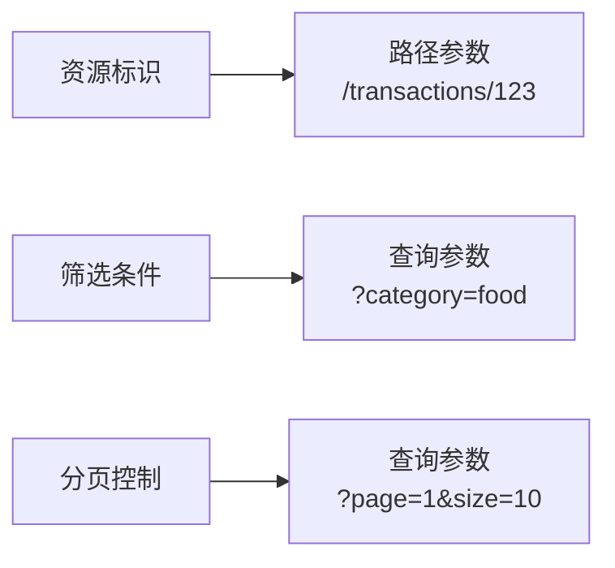

### Q2: 如何处理大量可选参数？

**A**: 使用 Pydantic 模型或依赖注入：

```python
from pydantic import BaseModel
from fastapi import Depends

class TransactionFilter(BaseModel):
    category: Optional[str] = None
    min_amount: Optional[float] = None
    max_amount: Optional[float] = None
    start_date: Optional[str] = None
    end_date: Optional[str] = None

@app.get("/transactions")
def list_transactions(filter: TransactionFilter = Depends()):
    # filter 包含所有过滤参数
    return filter.model_dump()
```

### Q3: 如何返回自定义错误信息？

**A**: 使用 HTTPException：

```python
from fastapi import HTTPException

@app.get("/transactions/{id}")
def get_transaction(id: int):
    transaction = find_transaction(id)
    if not transaction:
        raise HTTPException(
            status_code=404,
            detail={
                "error": "NOT_FOUND",
                "message": "交易记录不存在",
                "transaction_id": id
            }
        )
    return transaction
```

## 📚 延伸阅读

- **FastAPI 路由文档**：[https://fastapi.tiangolo.com/tutorial/routing/](https://fastapi.tiangolo.com/tutorial/routing/)
- **请求参数文档**：[https://fastapi.tiangolo.com/tutorial/query-params/](https://fastapi.tiangolo.com/tutorial/query-params/)
- **Bigger Applications**：[https://fastapi.tiangolo.com/tutorial/bigger-applications/](https://fastapi.tiangolo.com/tutorial/bigger-applications/)

---

**下一章**：[03-依赖注入.md](./03-依赖注入.md) - 学习如何优雅地管理资源和共享逻辑
