# Pydantic 数据验证

> 掌握 Pydantic 模型系统，构建安全可靠的数据验证层

## 📋 本章目标

- [ ] 理解 Pydantic 的核心概念
- [ ] 掌握模型定义和验证规则
- [ ] 学会自定义验证器
- [ ] 设计复杂的数据模型

## 🎯 什么是 Pydantic

### 核心概念

Pydantic 是一个使用 Python 类型注解进行数据验证的库。它能够在运行时强制执行类型提示，并在数据无效时提供友好的错误信息。

### 工作原理

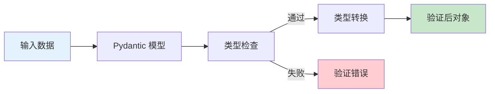

### 为什么使用 Pydantic

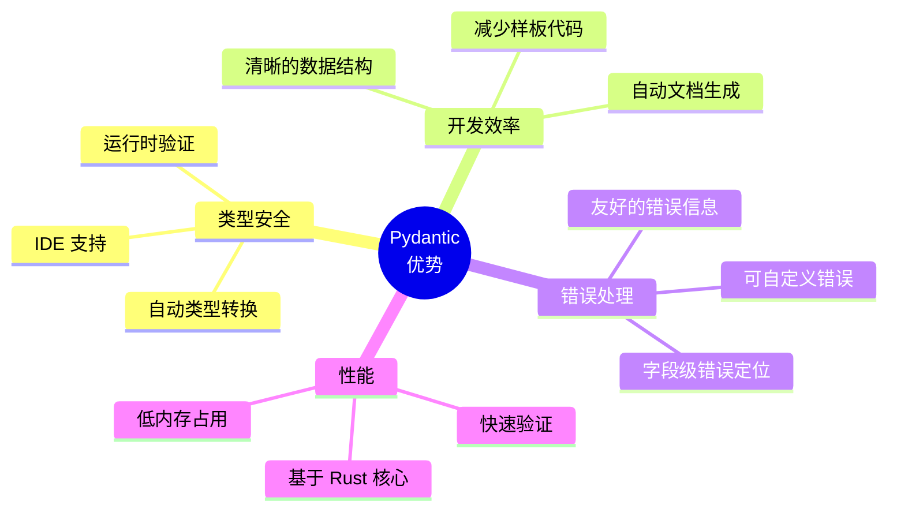

## 🏗️ 基础模型定义

### 简单模型

```python
from pydantic import BaseModel
from typing import Optional

class User(BaseModel):
    id: int
    name: str
    email: str
    age: Optional[int] = None  # 可选字段
    is_active: bool = True     # 默认值

# 创建实例
user = User(
    id=1,
    name="张三",
    email="zhangsan@example.com"
)

# 访问属性
print(user.name)   # "张三"
print(user.age)    # None
print(user.is_active)  # True

# 转换为字典
print(user.model_dump())
# {"id": 1, "name": "张三", "email": "...", "age": None, "is_active": True}

# 转换为 JSON
print(user.model_dump_json())
# '{"id": 1, "name": "张三", ...}'
```

### 类型自动转换

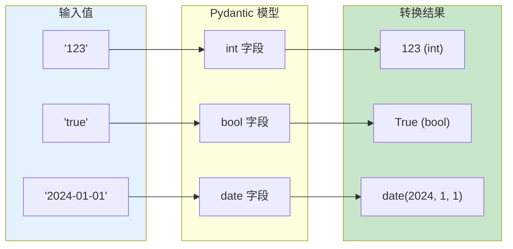

```python
from pydantic import BaseModel
from datetime import date

class Data(BaseModel):
    number: int
    flag: bool
    date_value: date

# 字符串自动转换
data = Data(
    number="123",        # 字符串 "123" -> 整数 123
    flag="true",         # 字符串 "true" -> 布尔 True
    date_value="2024-01-15"  # 字符串 -> date 对象
)

print(data.number)      # 123 (int)
print(data.flag)        # True (bool)
print(data.date_value)  # 2024-01-15 (date)
```

## 📏 字段验证规则

### Field 函数详解

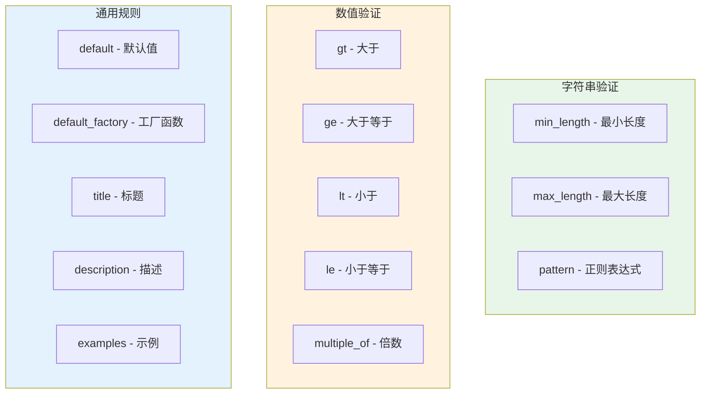

### 验证规则示例

```python
from pydantic import BaseModel, Field
from typing import Optional
import re

class Transaction(BaseModel):
    # 数值验证
    amount: float = Field(
        ...,                    # ... 表示必需字段
        gt=0,                   # 大于 0
        le=1000000,             # 小于等于 100 万
        description="交易金额（元）"
    )

    # 字符串验证
    category: str = Field(
        ...,
        min_length=1,           # 至少 1 个字符
        max_length=50,          # 最多 50 个字符
        description="交易分类"
    )

    note: Optional[str] = Field(
        default="",
        max_length=200,
        description="备注信息"
    )

    # 正则验证
    phone: str = Field(
        ...,
        pattern=r"^1[3-9]\d{9}$",  # 手机号格式
        description="手机号码"
    )

    # 枚举值
    status: str = Field(
        default="pending",
        pattern="^(pending|completed|cancelled)$"
    )

    # 日期验证
    transaction_date: str = Field(
        ...,
        pattern=r"^\d{4}-\d{2}-\d{2}$",
        description="交易日期 (YYYY-MM-DD)"
    )
```

### 完整 Field 参数表

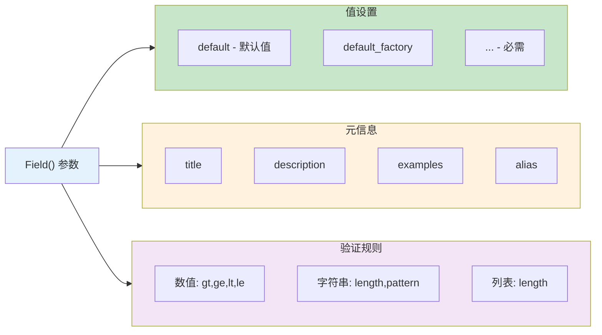

## 🔧 常用数据类型

### 基础类型

```python
from pydantic import BaseModel
from typing import Optional, List, Dict, Any
from datetime import datetime, date, time
from pathlib import Path
from uuid import UUID

class AllTypes(BaseModel):
    # 基础类型
    text: str
    number: int
    decimal: float
    flag: bool

    # 可选类型
    optional_text: Optional[str] = None

    # 集合类型
    items: List[str]
    mapping: Dict[str, int]

    # 日期时间
    created_at: datetime
    birth_date: date
    alarm_time: time

    # 特殊类型
    file_path: Path
    user_id: UUID

    # 任意类型
    extra: Any
```

### 类型验证流程

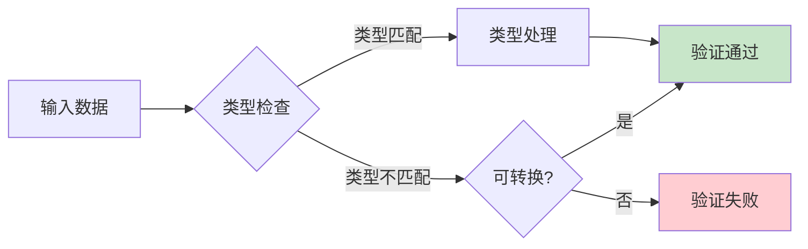

### 复杂类型示例

```python
from pydantic import BaseModel, Field
from typing import List, Dict, Optional
from datetime import datetime
from enum import Enum

# 枚举类型
class TransactionType(str, Enum):
    INCOME = "income"
    EXPENSE = "expense"

class Category(str, Enum):
    FOOD = "food"
    TRANSPORT = "transport"
    SHOPPING = "shopping"
    OTHER = "other"

# 嵌套模型
class Location(BaseModel):
    latitude: float = Field(..., ge=-90, le=90)
    longitude: float = Field(..., ge=-180, le=180)
    name: str

class Transaction(BaseModel):
    # 枚举字段
    type: TransactionType
    category: Category

    # 嵌套模型
    location: Optional[Location] = None

    # 列表类型
    tags: List[str] = Field(default_factory=list)

    # 字典类型
    metadata: Dict[str, Any] = Field(default_factory=dict)

    # 日期时间
    created_at: datetime = Field(default_factory=datetime.now)

# 使用示例
transaction = Transaction(
    type=TransactionType.EXPENSE,
    category=Category.FOOD,
    location={
        "latitude": 39.9042,
        "longitude": 116.4074,
        "name": "北京"
    },
    tags=["午餐", "外卖"],
    metadata={"source": "mobile_app"}
)
```

## 🎨 自定义验证器

### field_validator 装饰器

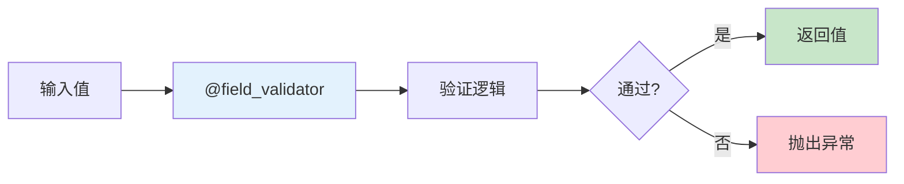

### 单字段验证器

```python
from pydantic import BaseModel, field_validator
import re

class User(BaseModel):
    username: str
    email: str
    password: str
    age: int

    @field_validator('username')
    @classmethod
    def validate_username(cls, v: str) -> str:
        """验证用户名"""
        if not re.match(r'^[a-zA-Z0-9_]+$', v):
            raise ValueError('用户名只能包含字母、数字和下划线')
        if len(v) < 3:
            raise ValueError('用户名至少 3 个字符')
        return v.lower()  # 转换为小写

    @field_validator('email')
    @classmethod
    def validate_email(cls, v: str) -> str:
        """验证邮箱格式"""
        pattern = r'^[a-zA-Z0-9._%+-]+@[a-zA-Z0-9.-]+\.[a-zA-Z]{2,}$'
        if not re.match(pattern, v):
            raise ValueError('无效的邮箱格式')
        return v.lower()

    @field_validator('password')
    @classmethod
    def validate_password(cls, v: str) -> str:
        """验证密码强度"""
        if len(v) < 8:
            raise ValueError('密码至少 8 个字符')
        if not re.search(r'[A-Z]', v):
            raise ValueError('密码必须包含大写字母')
        if not re.search(r'[a-z]', v):
            raise ValueError('密码必须包含小写字母')
        if not re.search(r'\d', v):
            raise ValueError('密码必须包含数字')
        return v

    @field_validator('age')
    @classmethod
    def validate_age(cls, v: int) -> int:
        """验证年龄"""
        if v < 0 or v > 150:
            raise ValueError('年龄必须在 0-150 之间')
        return v
```

### 多字段验证器

```python
from pydantic import BaseModel, field_validator, model_validator
from typing import Optional

class Transaction(BaseModel):
    amount: float
    type: str  # "income" or "expense"
    category: str
    discount: Optional[float] = None

    @field_validator('category')
    @classmethod
    def validate_category_by_type(cls, v: str, info) -> str:
        """根据类型验证分类"""
        # info.data 包含其他已验证的字段
        type_value = info.data.get('type')

        income_categories = ['salary', 'bonus', 'investment']
        expense_categories = ['food', 'transport', 'shopping']

        if type_value == 'income' and v not in income_categories:
            raise ValueError(f'收入类型分类必须是: {income_categories}')
        if type_value == 'expense' and v not in expense_categories:
            raise ValueError(f'支出类型分类必须是: {expense_categories}')

        return v

    @model_validator(mode='after')
    def validate_discount(self):
        """模型级别验证：折扣只能在支出时使用"""
        if self.discount is not None and self.type == 'income':
            raise ValueError('收入不能有折扣')
        if self.discount is not None and self.discount > self.amount:
            raise ValueError('折扣不能超过金额')
        return self
```

### 验证器类型对比

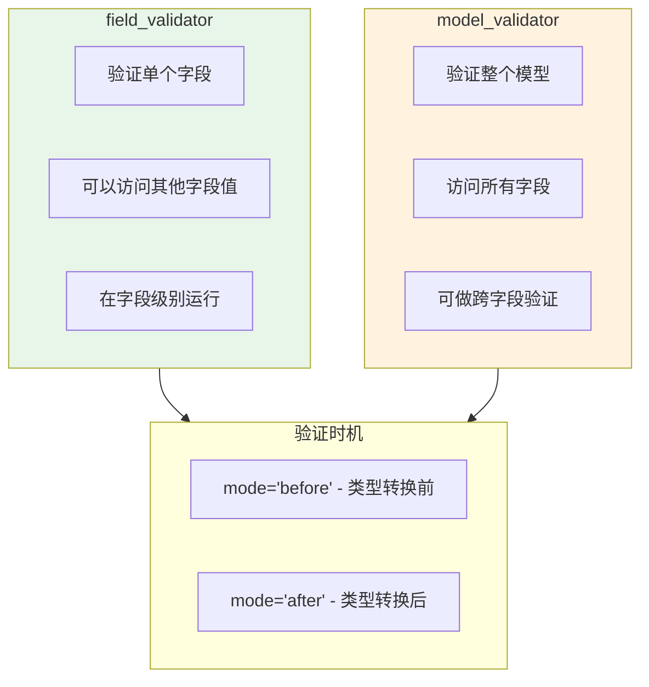

### 验证器模式

```python
from pydantic import BaseModel, field_validator, model_validator
from typing import Any

class DataProcessor(BaseModel):
    raw_data: str
    processed_data: Any = None

    @field_validator('raw_data', mode='before')
    @classmethod
    def preprocess_raw_data(cls, v):
        """在类型转换前处理"""
        if isinstance(v, bytes):
            return v.decode('utf-8')
        return v

    @field_validator('raw_data', mode='after')
    @classmethod
    def postprocess_raw_data(cls, v: str) -> str:
        """在类型转换后处理"""
        return v.strip()

    @model_validator(mode='before')
    @classmethod
    def validate_model_before(cls, data: dict):
        """模型验证前"""
        # 可以修改输入数据
        if 'raw_data' not in data:
            data['raw_data'] = ''
        return data

    @model_validator(mode='after')
    def validate_model_after(self):
        """模型验证后"""
        # 处理数据
        self.processed_data = self.raw_data.upper()
        return self
```

## 📊 模型配置

### Config 类配置

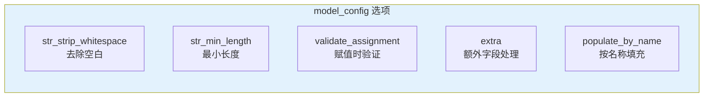

```python
from pydantic import BaseModel, ConfigDict

class User(BaseModel):
    model_config = ConfigDict(
        # 字符串处理
        str_strip_whitespace=True,     # 自动去除首尾空白
        str_min_length=1,              # 字符串最小长度

        # 验证行为
        validate_assignment=True,      # 赋值时重新验证
        validate_default=True,         # 验证默认值

        # 额外字段
        extra='forbid',                # 禁止额外字段 ('allow' 允许)
        # extra='ignore'               # 忽略额外字段

        # 字段填充
        populate_by_name=True,         # 允许按字段名填充

        # JSON Schema
        json_schema_extra={
            "examples": [
                {"name": "张三", "age": 25}
            ]
        }
    )

    name: str
    age: int

# 测试配置
user = User(name="  张三  ")  # 自动去除空白
# user.extra = "value"  # 会报错，禁止额外字段
```

### 常用配置选项

| 配置项 | 说明 | 默认值 |
|--------|------|--------|
| `str_strip_whitespace` | 去除字符串首尾空白 | `False` |
| `validate_assignment` | 赋值时验证 | `False` |
| `extra` | 额外字段处理 | `'ignore'` |
| `populate_by_name` | 按字段名填充 | `False` |
| `use_enum_values` | 使用枚举值 | `False` |
| `frozen` | 不可变模型 | `False` |

## 🔄 模型继承与组合

### 模型继承

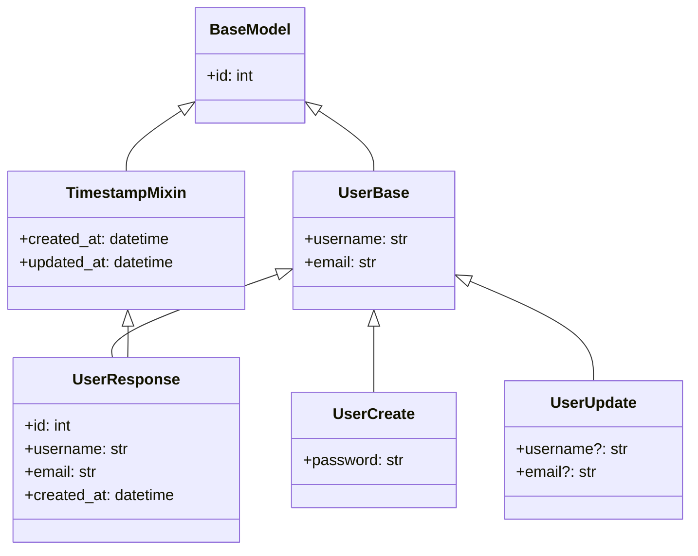

```python
from pydantic import BaseModel, ConfigDict
from typing import Optional
from datetime import datetime

# 基础模型
class UserBase(BaseModel):
    """用户基础信息"""
    username: str
    email: str

# 创建模型
class UserCreate(UserBase):
    """创建用户时的数据"""
    password: str

# 更新模型（所有字段可选）
class UserUpdate(BaseModel):
    """更新用户时的数据"""
    model_config = ConfigDict(extra='forbid')

    username: Optional[str] = None
    email: Optional[str] = None

# 响应模型（包含数据库字段）
class UserResponse(UserBase):
    """返回给客户端的数据"""
    id: int
    is_active: bool = True
    created_at: datetime
    updated_at: Optional[datetime] = None
```

### 模型组合

```python
from pydantic import BaseModel
from typing import List

# 地址模型
class Address(BaseModel):
    province: str
    city: str
    detail: str

# 联系方式模型
class Contact(BaseModel):
    phone: str
    email: str

# 组合模型
class User(BaseModel):
    name: str
    addresses: List[Address]  # 嵌套模型列表
    contact: Contact           # 嵌套单个模型

# 使用
user = User(
    name="张三",
    addresses=[
        {"province": "北京", "city": "北京", "detail": "朝阳区xxx"},
        {"province": "上海", "city": "上海", "detail": "浦东新区xxx"}
    ],
    contact={"phone": "13800138000", "email": "zhang@example.com"}
)
```

## 🎯 记账系统完整模型设计

### 模型架构

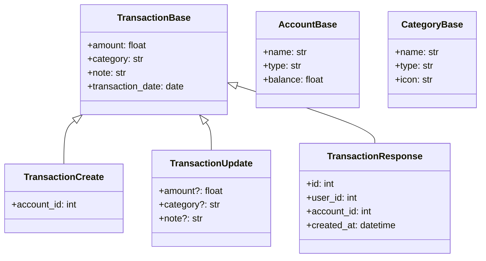

### 完整代码实现

```python
from pydantic import BaseModel, Field, field_validator, model_validator, ConfigDict
from typing import Optional, List
from datetime import datetime, date
from enum import Enum

# ========== 枚举定义 ==========
class AccountType(str, Enum):
    CASH = "cash"
    BANK = "bank"
    CREDIT_CARD = "credit_card"
    ALIPAY = "alipay"
    WECHAT = "wechat"

class TransactionType(str, Enum):
    INCOME = "income"
    EXPENSE = "expense"

# ========== 分类模型 ==========
class CategoryBase(BaseModel):
    name: str = Field(..., min_length=1, max_length=50)
    type: TransactionType
    icon: Optional[str] = Field(None, max_length=20)
    color: Optional[str] = Field(None, pattern=r'^#[0-9A-Fa-f]{6}$')

class CategoryCreate(CategoryBase):
    pass

class CategoryResponse(CategoryBase):
    id: int
    user_id: int

    model_config = ConfigDict(from_attributes=True)

# ========== 账户模型 ==========
class AccountBase(BaseModel):
    name: str = Field(..., min_length=1, max_length=50)
    type: AccountType
    initial_balance: float = Field(default=0, ge=0)
    icon: Optional[str] = None
    color: Optional[str] = None

class AccountCreate(AccountBase):
    pass

class AccountUpdate(BaseModel):
    name: Optional[str] = Field(None, min_length=1, max_length=50)
    icon: Optional[str] = None
    color: Optional[str] = None

class AccountResponse(AccountBase):
    id: int
    user_id: int
    balance: float
    created_at: datetime

    model_config = ConfigDict(from_attributes=True)

# ========== 交易模型 ==========
class TransactionBase(BaseModel):
    amount: float = Field(..., gt=0, description="交易金额，必须大于0")
    category: str = Field(..., min_length=1, max_length=50)
    note: str = Field(default="", max_length=200)
    transaction_date: date = Field(..., description="交易日期")

class TransactionCreate(TransactionBase):
    account_id: int = Field(..., gt=0)
    type: TransactionType = TransactionType.EXPENSE

    @field_validator('transaction_date')
    @classmethod
    def validate_date(cls, v: date) -> date:
        """日期不能晚于今天"""
        if v > date.today():
            raise ValueError('交易日期不能是未来日期')
        return v

class TransactionUpdate(BaseModel):
    model_config = ConfigDict(extra='forbid')

    amount: Optional[float] = Field(None, gt=0)
    category: Optional[str] = Field(None, min_length=1, max_length=50)
    note: Optional[str] = Field(None, max_length=200)
    transaction_date: Optional[date] = None

class TransactionResponse(TransactionBase):
    id: int
    user_id: int
    account_id: int
    type: TransactionType
    created_at: datetime
    updated_at: Optional[datetime] = None

    model_config = ConfigDict(from_attributes=True)

# ========== 统计模型 ==========
class TransactionStats(BaseModel):
    """交易统计"""
    total_income: float
    total_expense: float
    balance: float
    transaction_count: int
    by_category: dict
    by_date: List[dict]

# ========== 分页模型 ==========
class PaginatedResponse(BaseModel):
    """分页响应"""
    total: int
    page: int
    page_size: int
    total_pages: int
    data: List

class TransactionListResponse(PaginatedResponse):
    """交易列表响应"""
    data: List[TransactionResponse]
```

## 📝 练习任务

### 基础练习

1. **创建用户注册模型**
   ```python
   # 实现包含以下验证的 UserRegister 模型：
   # - 用户名：3-20字符，只允许字母数字下划线
   # - 邮箱：有效邮箱格式
   # - 密码：至少8位，包含大小写字母和数字
   # - 确认密码：必须与密码一致
   ```

2. **创建商品模型**
   ```python
   # 实现 Product 模型：
   # - name: 必需，1-100字符
   # - price: 必需，大于0
   # - stock: 非负整数
   # - category: 枚举值
   ```

### 进阶练习

3. **复杂嵌套模型**
   - 订单模型（包含用户、商品列表、地址）
   - 实现跨字段验证
   - 添加自定义验证器

4. **动态字段验证**
   - 根据类型动态验证字段
   - 实现条件必填字段

## ✅ 检查点

完成本章学习后，你应该能够：

- [ ] 解释 Pydantic 的工作原理
- [ ] 定义包含各种类型的数据模型
- [ ] 使用 Field 添加验证规则
- [ ] 创建自定义验证器
- [ ] 设计模型的继承和组合
- [ ] 配置模型行为

## 🤔 常见问题

### Q1: Pydantic v1 和 v2 有什么区别？

**A**: 主要区别：
| 特性 | v1 | v2 |
|------|----|----|
| 验证器装饰器 | `@validator` | `@field_validator` |
| 模型验证 | `@root_validator` | `@model_validator` |
| 配置 | `class Config` | `model_config = ConfigDict()` |
| 转字典 | `.dict()` | `.model_dump()` |
| 转JSON | `.json()` | `.model_dump_json()` |
| 性能 | 较慢 | 快 5-50 倍（Rust 核心） |

### Q2: 如何处理嵌套模型的验证？

```python
# 嵌套模型自动验证
class Item(BaseModel):
    name: str
    price: float

class Order(BaseModel):
    items: List[Item]  # 每个 Item 都会被验证
    total: float

    @model_validator(mode='after')
    def validate_total(self):
        # 验证总价是否等于各项之和
        calculated = sum(item.price for item in self.items)
        if abs(self.total - calculated) > 0.01:
            raise ValueError('总价与各项之和不符')
        return self
```

### Q3: 如何跳过某些字段的验证？

```python
from pydantic import BaseModel, Field

class User(BaseModel):
    name: str
    # 使用 default_factory 跳过验证
    data: dict = Field(default_factory=dict)

    # 或在验证器中处理
    @field_validator('*', mode='before')
    @classmethod
    def skip_none(cls, v):
        if v is None:
            raise ValueError('字段不能为空')  # 或 return 默认值
        return v
```

## 📚 延伸阅读

- **Pydantic 官方文档**：[https://docs.pydantic.dev/](https://docs.pydantic.dev/)
- **Pydantic V2 迁移指南**：[https://docs.pydantic.dev/latest/migration/](https://docs.pydantic.dev/latest/migration/)
- **字段验证 API**：[https://docs.pydantic.dev/latest/api/fields/](https://docs.pydantic.dev/latest/api/fields/)

---

**下一章**：[05-RESTful接口设计.md](./05-RESTful接口设计.md) - 学习设计规范的 API 接口
