# RESTful 接口设计

> 学习设计规范的 API 接口，构建可维护的后端服务

## 📋 本章目标

- [ ] 理解 REST 架构风格的核心原则
- [ ] 掌握 RESTful API 设计规范
- [ ] 学会正确使用 HTTP 方法和状态码
- [ ] 设计完整的记账系统 API

## 🎯 什么是 REST

### REST 架构风格

REST（Representational State Transfer，表述性状态转移）是一种软件架构风格，用于设计网络应用程序的 API。

### REST 核心原则

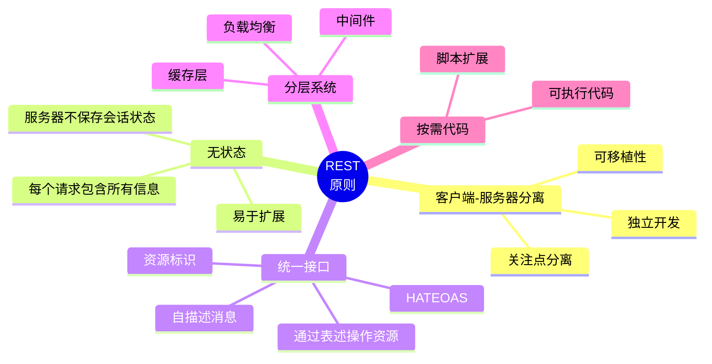

### REST vs 传统 API

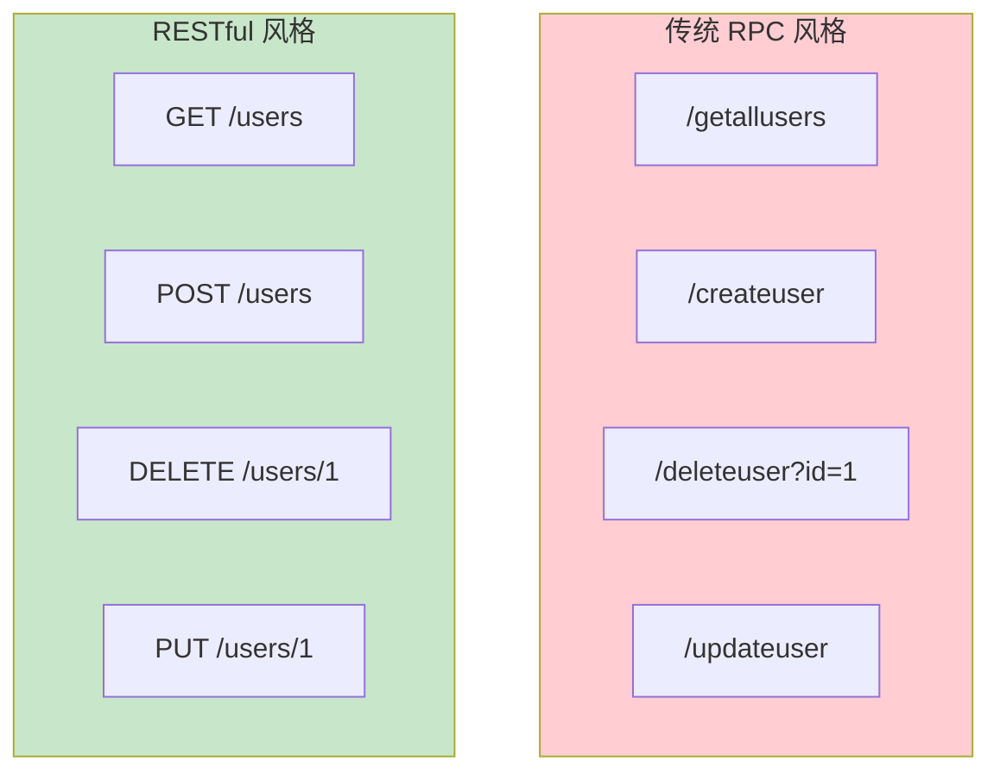

## 📚 RESTful 设计规范

### 资源命名规则

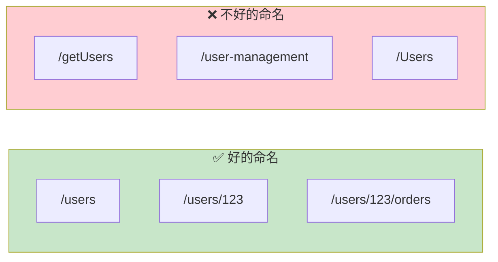

### 命名规范总结

| 规则 | 示例 | 说明 |
|------|------|------|
| 使用名词 | `/users`, `/orders` | 资源不是动作 |
| 使用复数 | `/users` 不是 `/user` | 表示资源集合 |
| 使用小写 | `/users` 不是 `/Users` | 保持一致性 |
| 用连字符 | `/user-profiles` | 多个单词时 |
| 避免深层嵌套 | `/users/123/orders` | 最多 2-3 层 |
| 版本控制 | `/v1/users` | 便于演进 |

### HTTP 方法语义

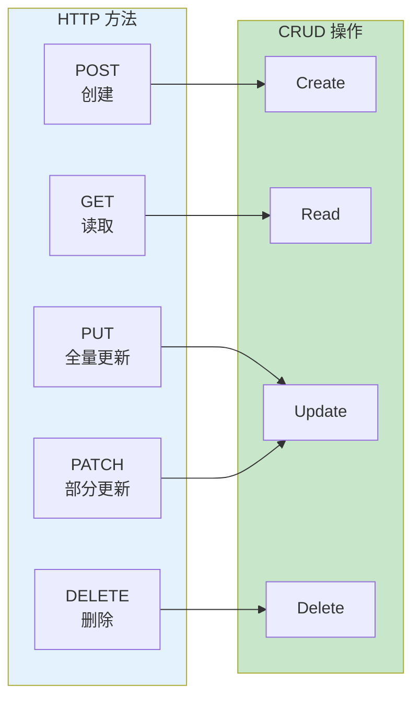

### CRUD 操作映射

```python
from fastapi import FastAPI, HTTPException
from pydantic import BaseModel
from typing import List, Optional

app = FastAPI()

# 数据模型
class User(BaseModel):
    id: Optional[int] = None
    name: str
    email: str

# 模拟数据库
users_db = {}
user_id_counter = 0

# ========== CRUD 操作 ==========

# CREATE - 创建资源
@app.post("/users", status_code=201)
def create_user(user: User):
    """创建新用户"""
    global user_id_counter
    user_id_counter += 1
    user.id = user_id_counter
    users_db[user.id] = user
    return user

# READ - 读取资源列表
@app.get("/users")
def list_users(skip: int = 0, limit: int = 10):
    """获取用户列表"""
    users = list(users_db.values())
    return {
        "data": users[skip:skip+limit],
        "total": len(users)
    }

# READ - 读取单个资源
@app.get("/users/{user_id}")
def get_user(user_id: int):
    """获取单个用户"""
    if user_id not in users_db:
        raise HTTPException(status_code=404, detail="用户不存在")
    return users_db[user_id]

# UPDATE - 全量更新
@app.put("/users/{user_id}")
def update_user(user_id: int, user: User):
    """全量更新用户"""
    if user_id not in users_db:
        raise HTTPException(status_code=404, detail="用户不存在")
    user.id = user_id
    users_db[user_id] = user
    return user

# UPDATE - 部分更新
@app.patch("/users/{user_id}")
def partial_update_user(user_id: int, user: PartialUser):
    """部分更新用户"""
    if user_id not in users_db:
        raise HTTPException(status_code=404, detail="用户不存在")
    existing = users_db[user_id]
    update_data = user.model_dump(exclude_unset=True)
    for key, value in update_data.items():
        setattr(existing, key, value)
    return existing

# DELETE - 删除资源
@app.delete("/users/{user_id}", status_code=204)
def delete_user(user_id: int):
    """删除用户"""
    if user_id not in users_db:
        raise HTTPException(status_code=404, detail="用户不存在")
    del users_db[user_id]
    return None  # 204 No Content
```

## 🔢 HTTP 状态码

### 状态码分类

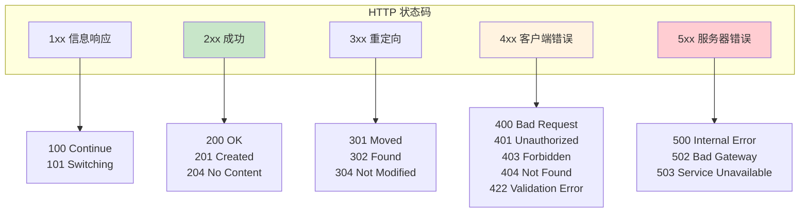

### 常用状态码详解

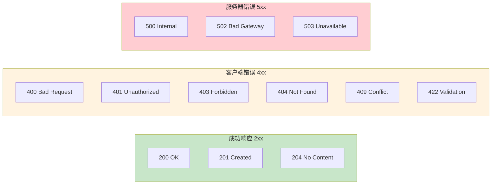

### 状态码使用场景

```python
from fastapi import FastAPI, HTTPException, status

app = FastAPI()

@app.post("/users", status_code=status.HTTP_201_CREATED)
def create_user(user: UserCreate):
    """创建用户 - 201"""
    return {"id": 1, **user.model_dump()}

@app.delete("/users/{user_id}", status_code=status.HTTP_204_NO_CONTENT)
def delete_user(user_id: int):
    """删除用户 - 204（无响应体）"""
    return None

@app.get("/users/{user_id}")
def get_user(user_id: int):
    """获取用户"""
    user = find_user(user_id)
    if not user:
        # 404 资源不存在
        raise HTTPException(
            status_code=status.HTTP_404_NOT_FOUND,
            detail="用户不存在"
        )
    return user  # 200

@app.put("/users/{user_id}")
def update_user(user_id: int, user: UserUpdate):
    existing = find_user(user_id)
    if not existing:
        raise HTTPException(status_code=404, detail="用户不存在")

    if user.email != existing.email and email_exists(user.email):
        # 409 冲突
        raise HTTPException(
            status_code=status.HTTP_409_CONFLICT,
            detail="邮箱已被使用"
        )

    return update_user_in_db(user_id, user)
```

## 📦 响应格式设计

### 统一响应结构

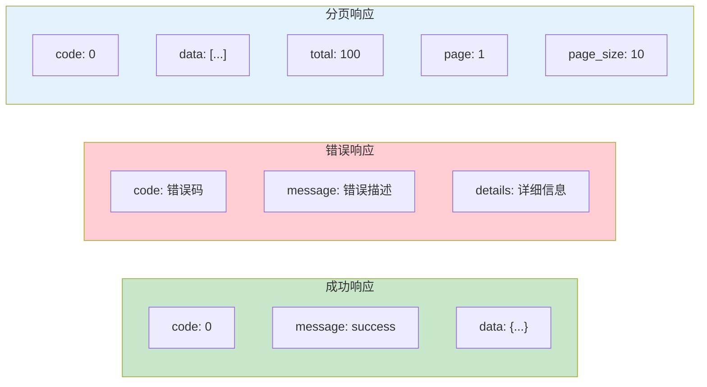

### 统一响应实现

```python
from fastapi import FastAPI, Request
from fastapi.responses import JSONResponse
from pydantic import BaseModel
from typing import Generic, TypeVar, Optional, List

app = FastAPI()

T = TypeVar('T')

# 统一响应模型
class ApiResponse(BaseModel, Generic[T]):
    code: int = 0
    message: str = "success"
    data: Optional[T] = None

# 分页响应模型
class PaginatedResponse(BaseModel, Generic[T]):
    code: int = 0
    message: str = "success"
    data: List[T]
    total: int
    page: int
    page_size: int
    total_pages: int

# 错误响应模型
class ErrorResponse(BaseModel):
    code: int
    message: str
    details: Optional[dict] = None

# 全局异常处理
@app.exception_handler(HTTPException)
async def http_exception_handler(request: Request, exc: HTTPException):
    return JSONResponse(
        status_code=exc.status_code,
        content={
            "code": exc.status_code,
            "message": str(exc.detail),
            "data": None
        }
    )

# 使用统一响应
@app.get("/users", response_model=PaginatedResponse[User])
def list_users(page: int = 1, page_size: int = 10):
    users, total = get_users_with_count(page, page_size)

    return PaginatedResponse(
        data=users,
        total=total,
        page=page,
        page_size=page_size,
        total_pages=(total + page_size - 1) // page_size
    )

@app.get("/users/{user_id}", response_model=ApiResponse[User])
def get_user(user_id: int):
    user = find_user(user_id)
    if not user:
        raise HTTPException(status_code=404, detail="用户不存在")
    return ApiResponse(data=user)
```

### 响应中间件

```python
from fastapi import FastAPI, Request
from starlette.middleware.base import BaseHTTPMiddleware

class ResponseMiddleware(BaseHTTPMiddleware):
    async def dispatch(self, request: Request, call_next):
        response = await call_next(request)

        # 包装响应（如果需要）
        return response

app = FastAPI()
app.add_middleware(ResponseMiddleware)
```

## 🛠️ 记账系统 RESTful API 设计

### 完整 API 设计图

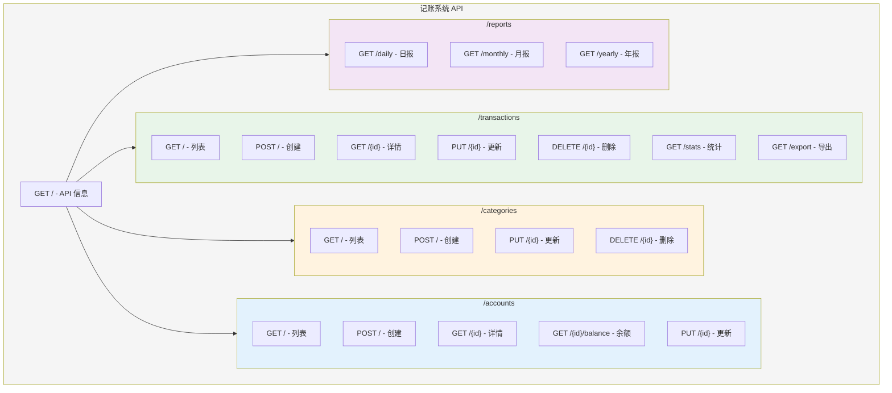

### API 端点详细设计

```python
from fastapi import FastAPI, HTTPException, Query, Depends
from pydantic import BaseModel, Field
from typing import Optional, List
from datetime import date, datetime
from enum import Enum

app = FastAPI(
    title="记账系统 API",
    description="RESTful API 设计示例",
    version="1.0.0"
)

# ========== 数据模型 ==========

class TransactionType(str, Enum):
    INCOME = "income"
    EXPENSE = "expense"

class TransactionCreate(BaseModel):
    amount: float = Field(..., gt=0)
    category_id: int
    account_id: int
    type: TransactionType
    note: str = ""
    transaction_date: date

class TransactionUpdate(BaseModel):
    amount: Optional[float] = Field(None, gt=0)
    category_id: Optional[int] = None
    note: Optional[str] = None

class TransactionResponse(BaseModel):
    id: int
    amount: float
    type: TransactionType
    category: str
    account: str
    note: str
    transaction_date: date
    created_at: datetime

# ========== 交易 API ==========

@app.get("/transactions")
def list_transactions(
    # 过滤参数
    type: Optional[TransactionType] = None,
    category_id: Optional[int] = None,
    account_id: Optional[int] = None,
    start_date: Optional[date] = None,
    end_date: Optional[date] = None,
    min_amount: Optional[float] = Query(None, ge=0),
    max_amount: Optional[float] = Query(None, ge=0),
    # 排序
    sort_by: str = Query("transaction_date", pattern="^(transaction_date|amount|created_at)$"),
    sort_order: str = Query("desc", pattern="^(asc|desc)$"),
    # 分页
    page: int = Query(1, ge=1),
    page_size: int = Query(20, ge=1, le=100),
):
    """
    获取交易列表

    - **type**: 按类型过滤
    - **category_id**: 按分类过滤
    - **start_date/end_date**: 日期范围
    - **min_amount/max_amount**: 金额范围
    - **sort_by/sort_order**: 排序
    - **page/page_size**: 分页
    """
    pass

@app.post("/transactions", status_code=201)
def create_transaction(transaction: TransactionCreate):
    """
    创建交易记录

    返回 201 Created 和 Location 头
    """
    pass

@app.get("/transactions/{transaction_id}")
def get_transaction(transaction_id: int):
    """获取单条交易详情"""
    pass

@app.put("/transactions/{transaction_id}")
def update_transaction(transaction_id: int, transaction: TransactionCreate):
    """全量更新交易"""
    pass

@app.patch("/transactions/{transaction_id}")
def partial_update_transaction(transaction_id: int, transaction: TransactionUpdate):
    """部分更新交易"""
    pass

@app.delete("/transactions/{transaction_id}", status_code=204)
def delete_transaction(transaction_id: int):
    """删除交易（无响应体）"""
    pass

# ========== 统计 API ==========

@app.get("/transactions/stats/summary")
def get_summary_stats(
    start_date: date,
    end_date: date,
    group_by: str = Query("category", pattern="^(category|account|date)$")
):
    """
    获取统计汇总

    - **start_date/end_date**: 统计日期范围（必需）
    - **group_by**: 分组维度
    """
    pass

@app.get("/transactions/stats/trend")
def get_trend(
    period: str = Query("daily", pattern="^(daily|weekly|monthly)$"),
    months: int = Query(6, ge=1, le=12)
):
    """获取趋势数据"""
    pass
```

## 📖 API 版本控制

### 版本控制策略

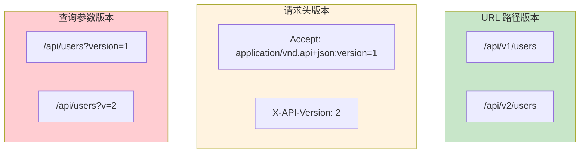

### 推荐：URL 路径版本

```python
from fastapi import FastAPI, APIRouter

app = FastAPI()

# v1 版本
v1_router = APIRouter(prefix="/api/v1", tags=["v1"])

@v1_router.get("/users")
def list_users_v1():
    return {"version": "v1", "data": []}

# v2 版本（增加了新功能）
v2_router = APIRouter(prefix="/api/v2", tags=["v2"])

@v2_router.get("/users")
def list_users_v2():
    return {"version": "v2", "data": [], "metadata": {}}

# 注册路由
app.include_router(v1_router)
app.include_router(v2_router)
```

### 版本兼容性

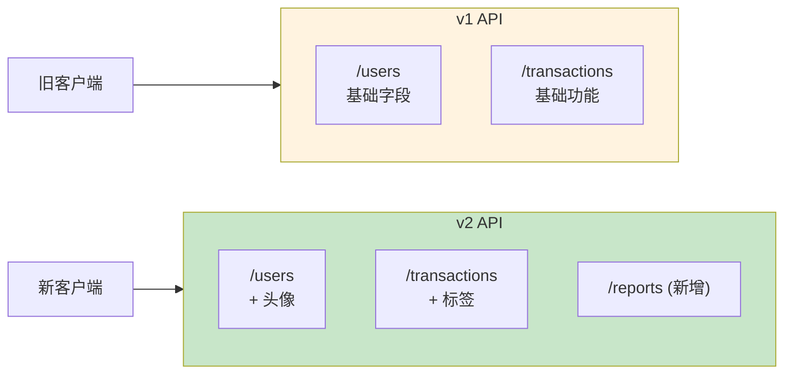

## 🔗 HATEOAS（超媒体驱动）

### HATEOAS 概念

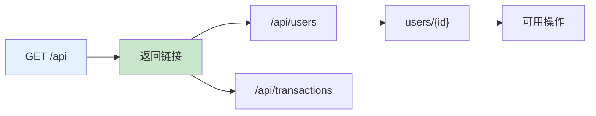

### HATEOAS 实现

```python
from fastapi import FastAPI
from pydantic import BaseModel
from typing import List, Dict

app = FastAPI()

class Link(BaseModel):
    rel: str
    href: str
    method: str = "GET"

class UserResponse(BaseModel):
    id: int
    name: str
    email: str
    links: List[Link] = []

@app.get("/api")
def api_root():
    """API 入口点"""
    return {
        "links": [
            {"rel": "users", "href": "/api/users", "method": "GET"},
            {"rel": "create_user", "href": "/api/users", "method": "POST"},
            {"rel": "transactions", "href": "/api/transactions", "method": "GET"},
        ]
    }

@app.get("/api/users/{user_id}", response_model=UserResponse)
def get_user(user_id: int):
    user = find_user(user_id)

    # 添加可用操作链接
    user.links = [
        Link(rel="self", href=f"/api/users/{user_id}"),
        Link(rel="update", href=f"/api/users/{user_id}", method="PUT"),
        Link(rel="delete", href=f"/api/users/{user_id}", method="DELETE"),
        Link(rel="orders", href=f"/api/users/{user_id}/orders"),
    ]

    return user
```

## 🛡️ 错误处理最佳实践

### 错误响应设计

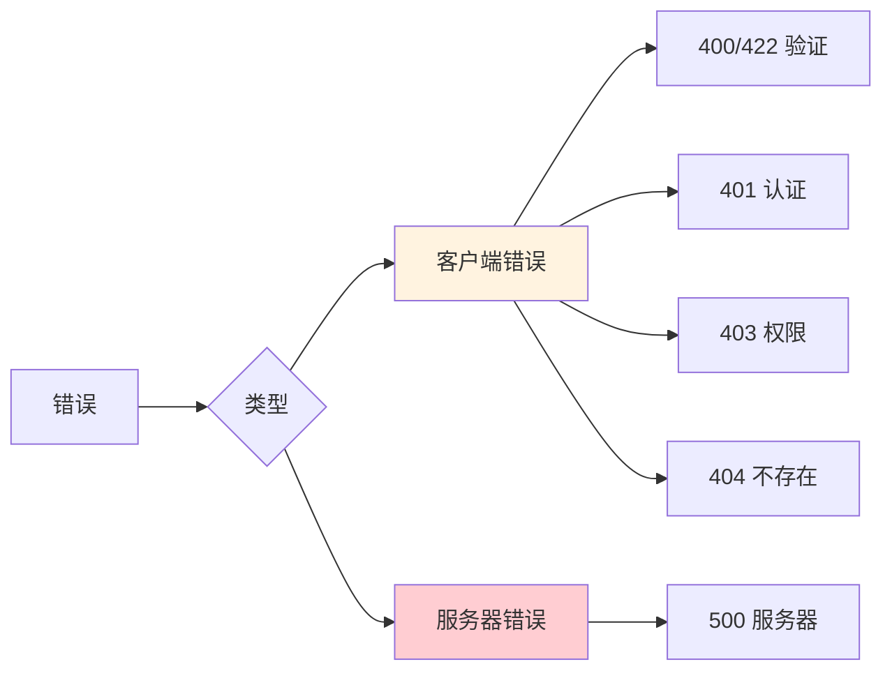

### 统一错误处理

```python
from fastapi import FastAPI, Request, HTTPException
from fastapi.responses import JSONResponse
from pydantic import ValidationError
import logging

app = FastAPI()
logger = logging.getLogger(__name__)

# 自定义异常
class BusinessException(Exception):
    def __init__(self, code: int, message: str, details: dict = None):
        self.code = code
        self.message = message
        self.details = details

# 业务错误码
class ErrorCode:
    USER_NOT_FOUND = 1001
    USER_EXISTS = 1002
    INVALID_PASSWORD = 1003
    INSUFFICIENT_BALANCE = 2001
    CATEGORY_IN_USE = 3001

# 异常处理器
@app.exception_handler(BusinessException)
async def business_exception_handler(request: Request, exc: BusinessException):
    return JSONResponse(
        status_code=400,
        content={
            "code": exc.code,
            "message": exc.message,
            "details": exc.details
        }
    )

@app.exception_handler(ValidationError)
async def validation_exception_handler(request: Request, exc: ValidationError):
    return JSONResponse(
        status_code=422,
        content={
            "code": 422,
            "message": "数据验证失败",
            "details": exc.errors()
        }
    )

@app.exception_handler(Exception)
async def global_exception_handler(request: Request, exc: Exception):
    # 记录错误
    error_id = generate_error_id()
    logger.error(f"Error {error_id}: {str(exc)}", exc_info=True)

    return JSONResponse(
        status_code=500,
        content={
            "code": 500,
            "message": "服务器内部错误",
            "error_id": error_id
        }
    )

# 使用自定义异常
@app.delete("/categories/{category_id}")
def delete_category(category_id: int):
    if is_category_in_use(category_id):
        raise BusinessException(
            code=ErrorCode.CATEGORY_IN_USE,
            message="分类正在使用中，无法删除",
            details={"category_id": category_id, "usage_count": get_usage_count(category_id)}
        )
    delete_category_by_id(category_id)
    return {"message": "删除成功"}
```

## 📊 API 设计检查清单

### 设计检查表

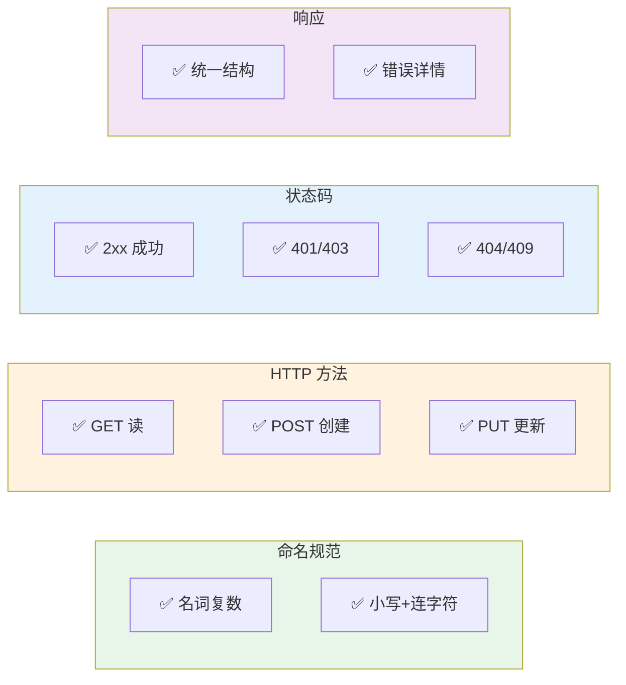
        SE1["✅ 认证保护"]
        SE2["✅ 输入验证"]
        SE3["✅ 速率限制"]
    end

    style Naming fill:#e8f5e9
    style Methods fill:#fff3e0
    style Status fill:#e3f2fd
    style Response fill:#f3e5f5
    style Security fill:#c8e6c9
```

## 📝 练习任务

### 基础练习

1. **设计用户管理 API**
   - 完整的 CRUD 端点
   - 正确的 HTTP 方法和状态码
   - 统一的响应格式

2. **设计商品管理 API**
   - 商品列表（带分页、过滤、排序）
   - 商品详情
   - 商品分类关系

### 进阶练习

3. **完善记账系统 API**
   - 实现所有端点
   - 添加 HATEOAS 链接
   - 统一错误处理

4. **API 版本迁移**
   - 设计 v2 版本
   - 保持 v1 兼容
   - 添加新功能

## ✅ 检查点

完成本章学习后，你应该能够：

- [ ] 解释 REST 架构的核心原则
- [ ] 设计符合规范的 API 路由
- [ ] 正确使用 HTTP 方法和状态码
- [ ] 设计统一的响应格式
- [ ] 实现版本控制和错误处理
- [ ] 理解 HATEOAS 的价值

## 🤔 常见问题

### Q1: PUT 和 PATCH 有什么区别？

**A**:
- **PUT**: 全量更新，需要提供所有字段
- **PATCH**: 部分更新，只提供修改的字段

```python
# PUT /users/1 - 需要所有字段
{"name": "张三", "email": "zhang@example.com", "age": 25}

# PATCH /users/1 - 只提供修改的字段
{"age": 26}
```

### Q2: 什么时候用 401 vs 403？

**A**:
- **401 Unauthorized**: 未认证，需要登录
- **403 Forbidden**: 已认证，但无权限

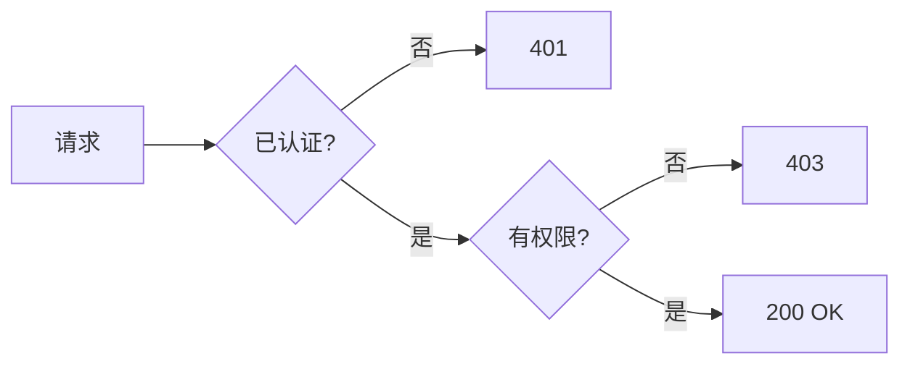

### Q3: 如何处理大量数据的分页？

**A**: 使用游标分页而非偏移分页：

```python
# 偏移分页（适合小数据）
@app.get("/items")
def list_items(skip: int = 0, limit: int = 10):
    return items[skip:skip+limit]

# 游标分页（适合大数据）
@app.get("/items")
def list_items(cursor: str = None, limit: int = 10):
    if cursor:
        # 从游标位置开始
        items = query_from_cursor(cursor, limit+1)
    else:
        items = query_first_n(limit+1)

    has_more = len(items) > limit
    next_cursor = items[-1].id if has_more else None

    return {
        "data": items[:limit],
        "next_cursor": next_cursor,
        "has_more": has_more
    }
```

## 📚 延伸阅读

- **RESTful API 设计指南**：[https://restfulapi.net/](https://restfulapi.net/)
- **HTTP 状态码**：[https://developer.mozilla.org/zh-CN/docs/Web/HTTP/Status](https://developer.mozilla.org/zh-CN/docs/Web/HTTP/Status)
- **Microsoft REST API 指南**：[https://github.com/microsoft/api-guidelines](https://github.com/microsoft/api-guidelines)
- **Google API 设计指南**：[https://cloud.google.com/apis/design](https://cloud.google.com/apis/design)

---

**下一章**：进入 [03-数据库与ORM](../03-数据库与ORM/) 学习数据库设计
