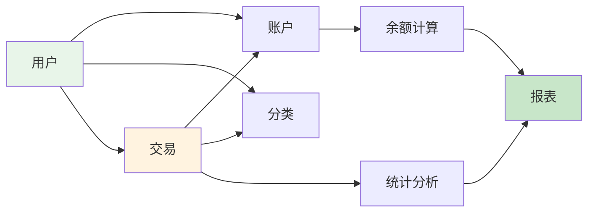
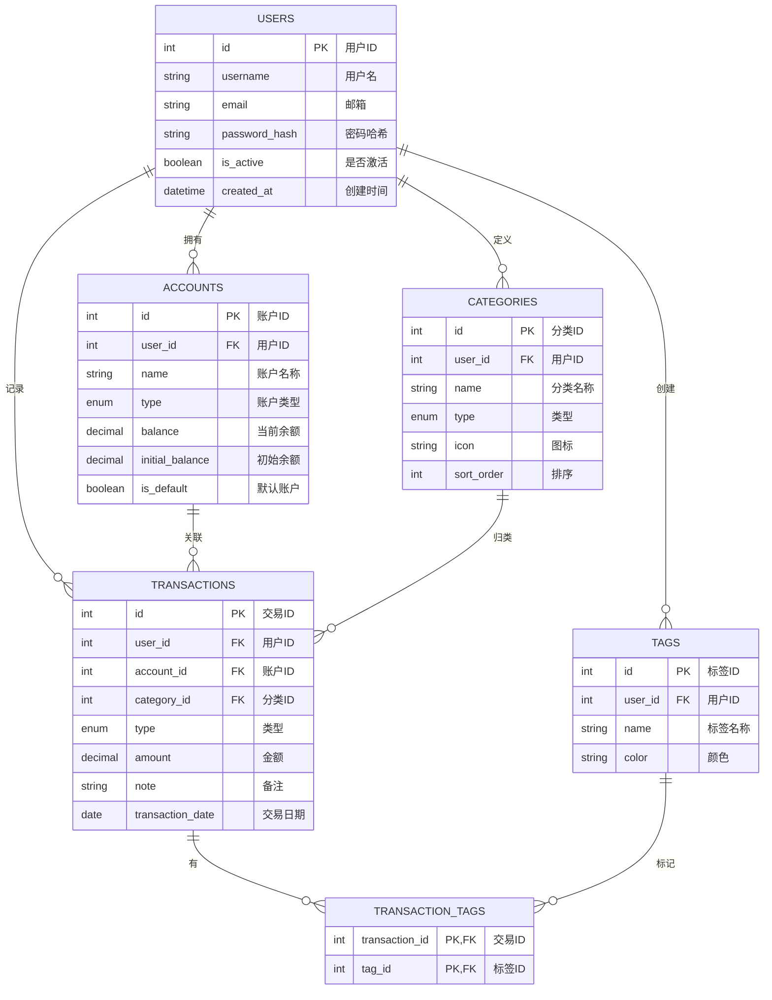
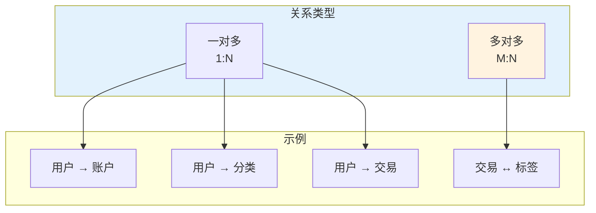

# 数据模型设计

> 为记账系统设计完整的数据模型，构建数据存储基础

## 📋 本章目标

- [ ] 掌握数据库设计原则
- [ ] 设计记账系统核心模型
- [ ] 理解表关系和约束
- [ ] 完成完整的模型实现

## 🎯 需求分析

### 记账系统功能需求


### 数据流程



## 🏗️ 实体关系设计

### ER 图



### 表关系说明



## 📊 模型定义

### 用户模型

```python
# models/user.py
from sqlalchemy import String, Boolean, Index
from sqlalchemy.orm import Mapped, mapped_column, relationship
from sqlalchemy.sql import func
from datetime import datetime
from database import Base
from typing import List, Optional

class User(Base):
    """
    用户模型

    存储用户基本信息，与账户、分类、交易等形成一对多关系
    """
    __tablename__ = "users"

    # 主键
    id: Mapped[int] = mapped_column(primary_key=True, autoincrement=True)

    # 基本信息
    username: Mapped[str] = mapped_column(
        String(50),
        nullable=False,
        unique=True,
        index=True,
        comment="用户名"
    )
    email: Mapped[str] = mapped_column(
        String(100),
        nullable=False,
        unique=True,
        index=True,
        comment="邮箱地址"
    )
    password_hash: Mapped[str] = mapped_column(
        String(255),
        nullable=False,
        comment="密码哈希值"
    )

    # 状态
    is_active: Mapped[bool] = mapped_column(
        Boolean,
        default=True,
        comment="是否激活"
    )
    is_superuser: Mapped[bool] = mapped_column(
        Boolean,
        default=False,
        comment="是否超级用户"
    )

    # 个人设置
    avatar: Mapped[Optional[str]] = mapped_column(
        String(255),
        nullable=True,
        comment="头像URL"
    )
    nickname: Mapped[Optional[str]] = mapped_column(
        String(50),
        nullable=True,
        comment="昵称"
    )

    # 时间戳
    created_at: Mapped[datetime] = mapped_column(
        default=func.now(),
        comment="创建时间"
    )
    updated_at: Mapped[datetime] = mapped_column(
        default=func.now(),
        onupdate=func.now(),
        comment="更新时间"
    )
    last_login_at: Mapped[Optional[datetime]] = mapped_column(
        nullable=True,
        comment="最后登录时间"
    )

    # 关系
    accounts: Mapped[List["Account"]] = relationship(
        back_populates="user",
        cascade="all, delete-orphan",
        order_by="Account.id"
    )
    categories: Mapped[List["Category"]] = relationship(
        back_populates="user",
        cascade="all, delete-orphan",
        order_by="Category.sort_order"
    )
    transactions: Mapped[List["Transaction"]] = relationship(
        back_populates="user",
        cascade="all, delete-orphan",
        order_by="desc(Transaction.transaction_date)"
    )
    tags: Mapped[List["Tag"]] = relationship(
        back_populates="user",
        cascade="all, delete-orphan"
    )

    # 索引
    __table_args__ = (
        Index('ix_users_email_active', 'email', 'is_active'),
    )

    def __repr__(self) -> str:
        return f"<User(id={self.id}, username='{self.username}')>"

    @property
    def display_name(self) -> str:
        """显示名称"""
        return self.nickname or self.username
```

### 账户模型

```python
# models/account.py
from sqlalchemy import String, Boolean, Numeric, Integer, ForeignKey, Enum as SQLEnum
from sqlalchemy.orm import Mapped, mapped_column, relationship
from sqlalchemy.sql import func
from datetime import datetime
from database import Base
import enum
from typing import List, TYPE_CHECKING

if TYPE_CHECKING:
    from models.transaction import Transaction

class AccountType(str, enum.Enum):
    """账户类型枚举"""
    CASH = "cash"           # 现金
    BANK = "bank"           # 银行卡
    CREDIT_CARD = "credit"  # 信用卡
    ALIPAY = "alipay"       # 支付宝
    WECHAT = "wechat"       # 微信
    OTHER = "other"         # 其他

class Account(Base):
    """
    账户模型

    代表用户的资金账户，如现金、银行卡、支付宝等
    """
    __tablename__ = "accounts"

    id: Mapped[int] = mapped_column(primary_key=True)

    # 关联用户
    user_id: Mapped[int] = mapped_column(
        ForeignKey("users.id", ondelete="CASCADE"),
        nullable=False,
        index=True,
        comment="用户ID"
    )

    # 账户信息
    name: Mapped[str] = mapped_column(
        String(50),
        nullable=False,
        comment="账户名称"
    )
    type: Mapped[AccountType] = mapped_column(
        SQLEnum(AccountType),
        nullable=False,
        default=AccountType.CASH,
        comment="账户类型"
    )

    # 金额
    balance: Mapped[float] = mapped_column(
        Numeric(12, 2),
        default=0.00,
        comment="当前余额"
    )
    initial_balance: Mapped[float] = mapped_column(
        Numeric(12, 2),
        default=0.00,
        comment="初始余额"
    )

    # 信用卡特有
    credit_limit: Mapped[float] = mapped_column(
        Numeric(12, 2),
        default=0.00,
        comment="信用额度（信用卡）"
    )
    billing_date: Mapped[int] = mapped_column(
        default=1,
        comment="账单日（信用卡）"
    )
    due_date: Mapped[int] = mapped_column(
        default=15,
        comment="还款日（信用卡）"
    )

    # 外观设置
    icon: Mapped[str] = mapped_column(
        String(20),
        default="💰",
        comment="图标"
    )
    color: Mapped[str] = mapped_column(
        String(7),
        default="#4CAF50",
        comment="颜色"
    )

    # 状态
    is_active: Mapped[bool] = mapped_column(
        Boolean,
        default=True,
        comment="是否启用"
    )
    is_default: Mapped[bool] = mapped_column(
        Boolean,
        default=False,
        comment="是否默认账户"
    )
    sort_order: Mapped[int] = mapped_column(
        default=0,
        comment="排序"
    )

    # 时间戳
    created_at: Mapped[datetime] = mapped_column(
        default=func.now(),
        comment="创建时间"
    )
    updated_at: Mapped[datetime] = mapped_column(
        default=func.now(),
        onupdate=func.now(),
        comment="更新时间"
    )

    # 关系
    user: Mapped["User"] = relationship(back_populates="accounts")
    transactions: Mapped[List["Transaction"]] = relationship(
        back_populates="account",
        cascade="all, delete-orphan"
    )

    def __repr__(self) -> str:
        return f"<Account(id={self.id}, name='{self.name}', balance={self.balance})>"

    @property
    def available_balance(self) -> float:
        """可用余额（考虑信用额度）"""
        if self.type == AccountType.CREDIT_CARD:
            return self.credit_limit + self.balance
        return self.balance
```

### 分类模型

```python
# models/category.py
from sqlalchemy import String, Integer, ForeignKey, Enum as SQLEnum
from sqlalchemy.orm import Mapped, mapped_column, relationship
from sqlalchemy.sql import func
from datetime import datetime
from database import Base
import enum
from typing import List, TYPE_CHECKING

if TYPE_CHECKING:
    from models.transaction import Transaction

class TransactionType(str, enum.Enum):
    """交易类型枚举"""
    INCOME = "income"    # 收入
    EXPENSE = "expense"  # 支出

class Category(Base):
    """
    分类模型

    用于对交易进行分类，如餐饮、交通、工资等
    """
    __tablename__ = "categories"

    id: Mapped[int] = mapped_column(primary_key=True)

    user_id: Mapped[int] = mapped_column(
        ForeignKey("users.id", ondelete="CASCADE"),
        nullable=False,
        index=True,
        comment="用户ID"
    )

    name: Mapped[str] = mapped_column(
        String(50),
        nullable=False,
        comment="分类名称"
    )
    type: Mapped[TransactionType] = mapped_column(
        SQLEnum(TransactionType),
        nullable=False,
        comment="类型：收入/支出"
    )

    # 外观
    icon: Mapped[str] = mapped_column(
        String(20),
        default="📝",
        comment="图标"
    )
    color: Mapped[str] = mapped_column(
        String(7),
        default="#607D8B",
        comment="颜色"
    )

    # 排序和预算
    sort_order: Mapped[int] = mapped_column(
        default=0,
        comment="排序"
    )
    budget: Mapped[float] = mapped_column(
        default=0.00,
        comment="预算金额"
    )

    # 父分类（支持多级分类）
    parent_id: Mapped[int] = mapped_column(
        ForeignKey("categories.id", ondelete="SET NULL"),
        nullable=True,
        comment="父分类ID"
    )

    created_at: Mapped[datetime] = mapped_column(
        default=func.now(),
        comment="创建时间"
    )

    # 关系
    user: Mapped["User"] = relationship(back_populates="categories")
    transactions: Mapped[List["Transaction"]] = relationship(
        back_populates="category"
    )
    # 自引用关系
    children: Mapped[List["Category"]] = relationship(
        "Category",
        back_populates="parent",
        remote_side="Category.id"
    )
    parent: Mapped["Category"] = relationship(
        "Category",
        back_populates="children",
        remote_side="Category.id"
    )

    def __repr__(self) -> str:
        return f"<Category(id={self.id}, name='{self.name}', type={self.type})>"
```

### 交易模型

```python
# models/transaction.py
from sqlalchemy import String, Numeric, Integer, ForeignKey, Date, Enum as SQLEnum, Text
from sqlalchemy.orm import Mapped, mapped_column, relationship
from sqlalchemy.sql import func
from datetime import datetime, date
from database import Base
import enum
from typing import List, TYPE_CHECKING

if TYPE_CHECKING:
    from models.user import User
    from models.account import Account
    from models.category import Category
    from models.tag import Tag

class TransactionType(str, enum.Enum):
    """交易类型枚举"""
    INCOME = "income"    # 收入
    EXPENSE = "expense"  # 支出
    TRANSFER = "transfer" # 转账

class Transaction(Base):
    """
    交易模型

    记录每一笔收入、支出或转账
    """
    __tablename__ = "transactions"

    id: Mapped[int] = mapped_column(primary_key=True)

    # 关联
    user_id: Mapped[int] = mapped_column(
        ForeignKey("users.id", ondelete="CASCADE"),
        nullable=False,
        index=True,
        comment="用户ID"
    )
    account_id: Mapped[int] = mapped_column(
        ForeignKey("accounts.id", ondelete="RESTRICT"),
        nullable=False,
        index=True,
        comment="账户ID"
    )
    category_id: Mapped[int] = mapped_column(
        ForeignKey("categories.id", ondelete="RESTRICT"),
        nullable=False,
        index=True,
        comment="分类ID"
    )

    # 交易信息
    type: Mapped[TransactionType] = mapped_column(
        SQLEnum(TransactionType),
        nullable=False,
        comment="交易类型"
    )
    amount: Mapped[float] = mapped_column(
        Numeric(12, 2),
        nullable=False,
        comment="金额"
    )
    note: Mapped[str] = mapped_column(
        String(200),
        default="",
        comment="备注"
    )
    transaction_date: Mapped[date] = mapped_column(
        Date,
        nullable=False,
        index=True,
        comment="交易日期"
    )

    # 转账相关
    to_account_id: Mapped[int] = mapped_column(
        ForeignKey("accounts.id", ondelete="SET NULL"),
        nullable=True,
        comment="目标账户ID（转账）"
    )

    # 附件
    receipt_url: Mapped[str] = mapped_column(
        String(255),
        nullable=True,
        comment="票据图片URL"
    )
    location: Mapped[str] = mapped_column(
        String(100),
        nullable=True,
        comment="位置"
    )

    # 时间戳
    created_at: Mapped[datetime] = mapped_column(
        default=func.now(),
        comment="创建时间"
    )
    updated_at: Mapped[datetime] = mapped_column(
        default=func.now(),
        onupdate=func.now(),
        comment="更新时间"
    )

    # 关系
    user: Mapped["User"] = relationship(back_populates="transactions")
    account: Mapped["Account"] = relationship(
        "Account",
        foreign_keys=[account_id],
        back_populates="transactions"
    )
    to_account: Mapped["Account"] = relationship(
        "Account",
        foreign_keys=[to_account_id]
    )
    category: Mapped["Category"] = relationship(back_populates="transactions")
    tags: Mapped[List["Tag"]] = relationship(
        "Tag",
        secondary="transaction_tags",
        back_populates="transactions"
    )

    def __repr__(self) -> str:
        return f"<Transaction(id={self.id}, amount={self.amount}, type={self.type})>"

    @property
    def signed_amount(self) -> float:
        """带符号的金额（收入正，支出负）"""
        if self.type == TransactionType.EXPENSE:
            return -self.amount
        return self.amount
```

### 标签模型

```python
# models/tag.py
from sqlalchemy import String, ForeignKey, Table, Column, Integer
from sqlalchemy.orm import Mapped, mapped_column, relationship
from sqlalchemy.sql import func
from datetime import datetime
from database import Base
from typing import List, TYPE_CHECKING

if TYPE_CHECKING:
    from models.transaction import Transaction

# 多对多关联表
transaction_tags = Table(
    'transaction_tags',
    Base.metadata,
    Column('transaction_id', Integer, ForeignKey('transactions.id', ondelete='CASCADE'), primary_key=True),
    Column('tag_id', Integer, ForeignKey('tags.id', ondelete='CASCADE'), primary_key=True),
    comment="交易标签关联表"
)

class Tag(Base):
    """
    标签模型

    用于给交易添加自定义标签，支持多对多关系
    """
    __tablename__ = "tags"

    id: Mapped[int] = mapped_column(primary_key=True)

    user_id: Mapped[int] = mapped_column(
        ForeignKey("users.id", ondelete="CASCADE"),
        nullable=False,
        index=True,
        comment="用户ID"
    )

    name: Mapped[str] = mapped_column(
        String(30),
        nullable=False,
        comment="标签名称"
    )
    color: Mapped[str] = mapped_column(
        String(7),
        default="#2196F3",
        comment="颜色"
    )

    created_at: Mapped[datetime] = mapped_column(
        default=func.now(),
        comment="创建时间"
    )

    # 关系
    user: Mapped["User"] = relationship(back_populates="tags")
    transactions: Mapped[List["Transaction"]] = relationship(
        "Transaction",
        secondary=transaction_tags,
        back_populates="tags"
    )

    def __repr__(self) -> str:
        return f"<Tag(id={self.id}, name='{self.name}')>"
```

## 📁 模型文件组织

```
models/
├── __init__.py          # 导出所有模型
├── user.py              # 用户模型
├── account.py           # 账户模型
├── category.py          # 分类模型
├── transaction.py       # 交易模型
├── tag.py               # 标签模型
└── base.py              # 基础模型（如有）
```

```python
# models/__init__.py
from .user import User
from .account import Account, AccountType
from .category import Category, TransactionType
from .transaction import Transaction
from .tag import Tag, transaction_tags

__all__ = [
    "User",
    "Account",
    "AccountType",
    "Category",
    "TransactionType",
    "Transaction",
    "Tag",
    "transaction_tags",
]
```

## 📝 练习任务

1. **扩展用户模型**
   - 添加手机号字段
   - 添加用户偏好设置（JSON字段）

2. **添加预算模型**
   - 创建 Budget 模型
   - 关联用户和分类
   - 设置月度预算

3. **设计审计日志**
   - 记录数据变更
   - 支持数据回溯

## ✅ 检查点

- [ ] 理解记账系统的数据需求
- [ ] 能够绘制 ER 图
- [ ] 掌握 SQLAlchemy 模型定义
- [ ] 理解一对多和多对多关系
- [ ] 能够设计合理的字段和约束

---

**下一章**：[04-完整CRUD实现.md](./04-完整CRUD实现.md) - 实现完整的数据库操作
