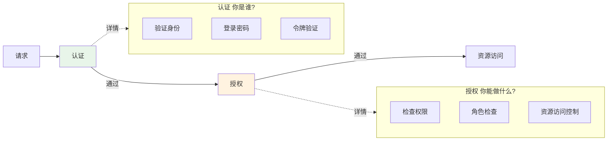
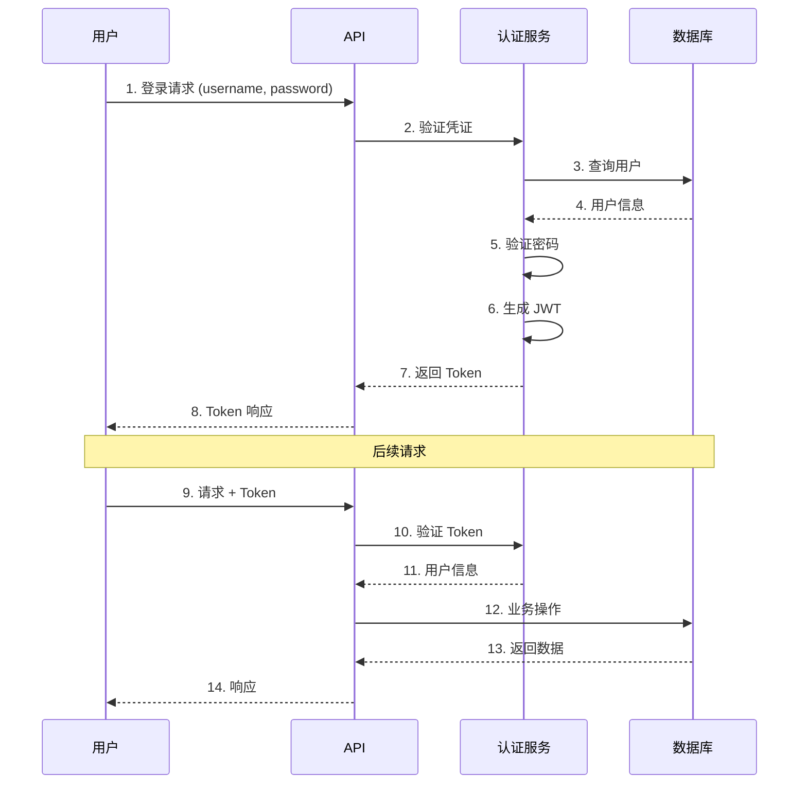
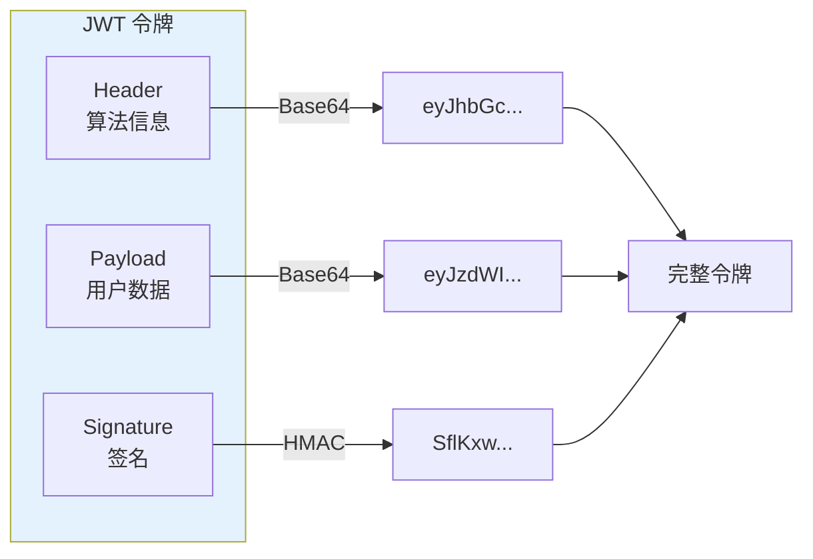
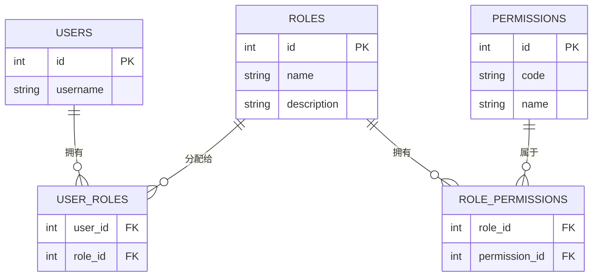
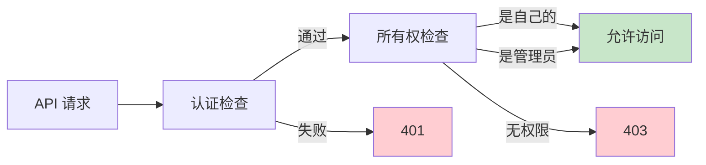

# 认证授权系统

> 保护记账数据安全，实现用户身份认证与权限控制

## 📋 本章目标

- [ ] 理解认证与授权的区别
- [ ] 实现 JWT 认证系统
- [ ] 设计基于角色的权限控制
- [ ] 保护 API 端点安全

## 🎯 认证 vs 授权

### 概念区分



### 认证流程



## 🔐 JWT 认证实现

### JWT 结构



### 配置与工具函数

```python
# core/security.py
from datetime import datetime, timedelta
from typing import Optional
from jose import jwt, JWTError
from passlib.context import CryptContext
from fastapi import Depends, HTTPException, status
from fastapi.security import OAuth2PasswordBearer
from pydantic import BaseModel

# 配置
SECRET_KEY = "your-secret-key-here"  # 生产环境应从环境变量读取
ALGORITHM = "HS256"
ACCESS_TOKEN_EXPIRE_MINUTES = 30
REFRESH_TOKEN_EXPIRE_DAYS = 7

# 密码哈希
pwd_context = CryptContext(schemes=["bcrypt"], deprecated="auto")

# OAuth2 方案
oauth2_scheme = OAuth2PasswordBearer(tokenUrl="/auth/login")

# Token 数据模型
class TokenPayload(BaseModel):
    sub: int  # user_id
    exp: datetime
    type: str  # "access" or "refresh"

class Token(BaseModel):
    access_token: str
    refresh_token: str
    token_type: str = "bearer"

# 密码处理
def verify_password(plain_password: str, hashed_password: str) -> bool:
    """验证密码"""
    return pwd_context.verify(plain_password, hashed_password)

def get_password_hash(password: str) -> str:
    """生成密码哈希"""
    return pwd_context.hash(password)

# JWT 处理
def create_access_token(user_id: int, expires_delta: Optional[timedelta] = None) -> str:
    """创建访问令牌"""
    if expires_delta:
        expire = datetime.utcnow() + expires_delta
    else:
        expire = datetime.utcnow() + timedelta(minutes=ACCESS_TOKEN_EXPIRE_MINUTES)

    payload = {
        "sub": user_id,
        "exp": expire,
        "type": "access"
    }
    return jwt.encode(payload, SECRET_KEY, algorithm=ALGORITHM)

def create_refresh_token(user_id: int) -> str:
    """创建刷新令牌"""
    expire = datetime.utcnow() + timedelta(days=REFRESH_TOKEN_EXPIRE_DAYS)
    payload = {
        "sub": user_id,
        "exp": expire,
        "type": "refresh"
    }
    return jwt.encode(payload, SECRET_KEY, algorithm=ALGORITHM)

def decode_token(token: str) -> Optional[TokenPayload]:
    """解码令牌"""
    try:
        payload = jwt.decode(token, SECRET_KEY, algorithms=[ALGORITHM])
        return TokenPayload(**payload)
    except JWTError:
        return None
```

### 认证依赖

```python
# dependencies/auth.py
from fastapi import Depends, HTTPException, status
from fastapi.security import OAuth2PasswordBearer
from sqlalchemy.orm import Session
from typing import Optional

from core.security import oauth2_scheme, decode_token
from dependencies.database import get_db
from models.user import User

async def get_current_user(
    token: str = Depends(oauth2_scheme),
    db: Session = Depends(get_db)
) -> User:
    """获取当前用户（必需认证）"""
    credentials_exception = HTTPException(
        status_code=status.HTTP_401_UNAUTHORIZED,
        detail="无法验证凭证",
        headers={"WWW-Authenticate": "Bearer"},
    )

    token_payload = decode_token(token)
    if token_payload is None:
        raise credentials_exception

    if token_payload.type != "access":
        raise credentials_exception

    user = db.get(User, token_payload.sub)
    if user is None:
        raise credentials_exception

    if not user.is_active:
        raise HTTPException(status_code=400, detail="用户已被禁用")

    return user

async def get_current_active_user(
    current_user: User = Depends(get_current_user)
) -> User:
    """获取当前活跃用户"""
    if not current_user.is_active:
        raise HTTPException(status_code=400, detail="用户未激活")
    return current_user

async def get_current_user_optional(
    token: Optional[str] = Depends(OAuth2PasswordBearer(auto_error=False)),
    db: Session = Depends(get_db)
) -> Optional[User]:
    """获取当前用户（可选认证）"""
    if token is None:
        return None

    token_payload = decode_token(token)
    if token_payload is None:
        return None

    return db.get(User, token_payload.sub)
```

### 认证路由

```python
# routers/auth.py
from fastapi import APIRouter, Depends, HTTPException, status
from sqlalchemy.orm import Session
from datetime import timedelta

from dependencies.database import get_db
from models.user import User
from schemas.user import UserCreate, UserResponse
from schemas.auth import LoginRequest, Token, RefreshTokenRequest
from core.security import (
    verify_password,
    get_password_hash,
    create_access_token,
    create_refresh_token,
    decode_token
)

router = APIRouter(prefix="/auth", tags=["认证"])

@router.post("/register", response_model=UserResponse, status_code=status.HTTP_201_CREATED)
def register(
    user_in: UserCreate,
    db: Session = Depends(get_db)
):
    """用户注册"""
    # 检查用户名是否存在
    existing = db.query(User).filter(
        (User.username == user_in.username) | (User.email == user_in.email)
    ).first()

    if existing:
        if existing.username == user_in.username:
            raise HTTPException(400, "用户名已存在")
        raise HTTPException(400, "邮箱已注册")

    # 创建用户
    user = User(
        username=user_in.username,
        email=user_in.email,
        password_hash=get_password_hash(user_in.password)
    )
    db.add(user)
    db.commit()
    db.refresh(user)

    return user

@router.post("/login", response_model=Token)
def login(
    login_data: LoginRequest,
    db: Session = Depends(get_db)
):
    """
    用户登录

    返回访问令牌和刷新令牌
    """
    # 查找用户
    user = db.query(User).filter(User.username == login_data.username).first()

    if not user or not verify_password(login_data.password, user.password_hash):
        raise HTTPException(
            status_code=status.HTTP_401_UNAUTHORIZED,
            detail="用户名或密码错误",
            headers={"WWW-Authenticate": "Bearer"},
        )

    if not user.is_active:
        raise HTTPException(400, "用户已被禁用")

    # 生成令牌
    access_token = create_access_token(user.id)
    refresh_token = create_refresh_token(user.id)

    return Token(
        access_token=access_token,
        refresh_token=refresh_token
    )

@router.post("/refresh", response_model=Token)
def refresh_token(
    refresh_data: RefreshTokenRequest,
    db: Session = Depends(get_db)
):
    """
    刷新令牌

    使用刷新令牌获取新的访问令牌
    """
    token_payload = decode_token(refresh_data.refresh_token)

    if token_payload is None or token_payload.type != "refresh":
        raise HTTPException(
            status_code=status.HTTP_401_UNAUTHORIZED,
            detail="无效的刷新令牌"
        )

    user = db.get(User, token_payload.sub)
    if not user or not user.is_active:
        raise HTTPException(
            status_code=status.HTTP_401_UNAUTHORIZED,
            detail="用户不存在或已禁用"
        )

    # 生成新令牌
    access_token = create_access_token(user.id)
    refresh_token = create_refresh_token(user.id)

    return Token(
        access_token=access_token,
        refresh_token=refresh_token
    )

@router.post("/logout")
def logout():
    """
    用户登出

    JWT 无状态，服务端不保存会话
    客户端需要删除本地存储的令牌
    """
    return {"message": "登出成功"}
```

## 🛡️ 角色权限控制

### RBAC 模型设计



### 权限检查依赖

```python
# dependencies/permission.py
from fastapi import Depends, HTTPException, status
from typing import List

from dependencies.auth import get_current_user
from models.user import User

def require_permissions(required_permissions: List[str]):
    """
    权限检查依赖工厂

    用法:
    @app.get("/admin/users", dependencies=[Depends(require_permissions(["user:read"]))])
    """
    async def permission_checker(current_user: User = Depends(get_current_user)):
        # 超级用户拥有所有权限
        if current_user.is_superuser:
            return current_user

        # 获取用户所有权限
        user_permissions = set()
        for role in current_user.roles:
            for permission in role.permissions:
                user_permissions.add(permission.code)

        # 检查是否拥有所需权限
        missing = set(required_permissions) - user_permissions
        if missing:
            raise HTTPException(
                status_code=status.HTTP_403_FORBIDDEN,
                detail=f"缺少权限: {', '.join(missing)}"
            )

        return current_user

    return permission_checker

def require_roles(required_roles: List[str]):
    """角色检查依赖工厂"""
    async def role_checker(current_user: User = Depends(get_current_user)):
        if current_user.is_superuser:
            return current_user

        user_roles = {role.code for role in current_user.roles}

        if not set(required_roles) & user_roles:
            raise HTTPException(
                status_code=status.HTTP_403_FORBIDDEN,
                detail="权限不足"
            )

        return current_user

    return role_checker
```

### 资源所有权控制



```python
# dependencies/ownership.py
from fastapi import Depends, HTTPException, status
from sqlalchemy.orm import Session

from dependencies.auth import get_current_user
from dependencies.database import get_db
from models.user import User
from models.transaction import Transaction

def verify_transaction_ownership(
    transaction_id: int,
    current_user: User = Depends(get_current_user),
    db: Session = Depends(get_db)
) -> Transaction:
    """验证交易所有权"""
    transaction = db.get(Transaction, transaction_id)

    if not transaction:
        raise HTTPException(status_code=404, detail="交易不存在")

    if transaction.user_id != current_user.id and not current_user.is_superuser:
        raise HTTPException(
            status_code=status.HTTP_403_FORBIDDEN,
            detail="无权访问此资源"
        )

    return transaction
```

## 📝 练习任务

1. **实现邮箱验证** - 注册时发送验证邮件
2. **实现密码重置** - 发送重置链接
3. **添加登录日志** - 记录登录时间、IP

## ✅ 检查点

- [ ] 理解认证与授权的区别
- [ ] 实现 JWT 认证系统
- [ ] 掌握密码加密存储
- [ ] 实现基于角色的权限控制
- [ ] 实现资源所有权检查

---

**上一章**：[03-数据库与ORM/04-完整CRUD实现.md](../03-数据库与ORM/04-完整CRUD实现.md)

**下一章**：[02-性能优化实践.md](./02-性能优化实践.md)
