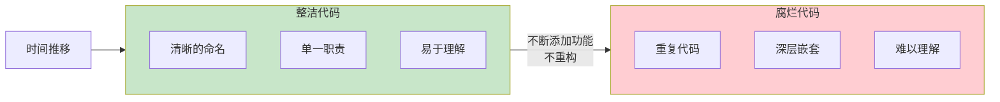
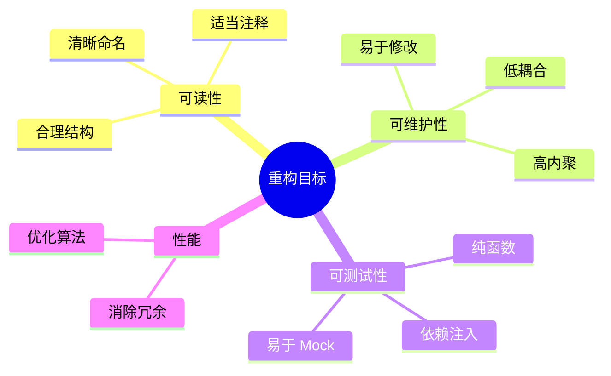
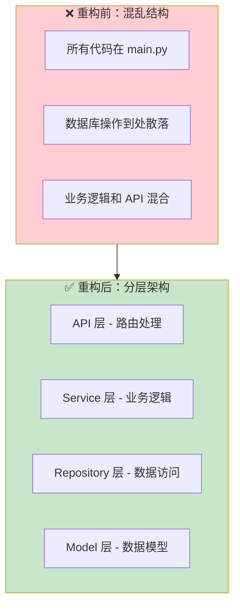
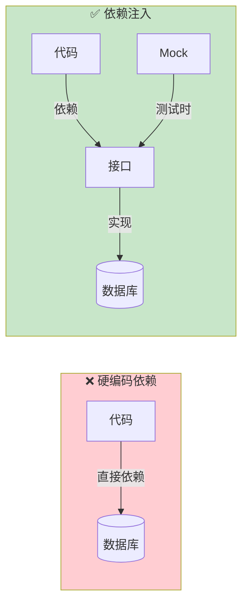

# 代码重构与可维护性

> 编写可维护的代码，让项目长期健康发展

## 📋 本章目标

- [ ] 理解代码重构的原则
- [ ] 掌握常见重构技巧
- [ ] 编写可测试的代码
- [ ] 建立代码规范

## 🎯 为什么需要重构

### 代码腐烂



### 重构目标



## 🏗️ 分层架构重构

### 从混乱到有序



### 服务层重构

```python
# ❌ 重构前：业务逻辑在路由中
@router.post("/transactions")
def create_transaction(
    transaction_in: TransactionCreate,
    db: Session = Depends(get_db),
    current_user: User = Depends(get_current_user)
):
    # 验证账户
    account = db.get(Account, transaction_in.account_id)
    if not account or account.user_id != current_user.id:
        raise HTTPException(400, "无效的账户")

    # 验证分类
    category = db.get(Category, transaction_in.category_id)
    if not category or category.user_id != current_user.id:
        raise HTTPException(400, "无效的分类")

    # 创建交易
    transaction = Transaction(
        user_id=current_user.id,
        **transaction_in.model_dump()
    )
    db.add(transaction)

    # 更新余额
    if transaction_in.type == TransactionType.INCOME:
        account.balance += transaction_in.amount
    else:
        account.balance -= transaction_in.amount

    db.commit()
    return transaction

# ✅ 重构后：业务逻辑在服务层
# services/transaction.py
class TransactionService:
    """交易服务"""

    def __init__(self, db: Session):
        self.db = db

    def create_transaction(
        self,
        user_id: int,
        transaction_data: TransactionCreate
    ) -> Transaction:
        """创建交易（包含业务逻辑）"""
        self._validate_account(user_id, transaction_data.account_id)
        self._validate_category(user_id, transaction_data.category_id)

        transaction = Transaction(
            user_id=user_id,
            **transaction_data.model_dump()
        )
        self.db.add(transaction)
        self._update_account_balance(transaction)
        self.db.commit()

        return transaction

    def _validate_account(self, user_id: int, account_id: int):
        """验证账户"""
        account = self.db.get(Account, account_id)
        if not account or account.user_id != user_id:
            raise BusinessException("无效的账户")

    def _validate_category(self, user_id: int, category_id: int):
        """验证分类"""
        category = self.db.get(Category, category_id)
        if not category or category.user_id != user_id:
            raise BusinessException("无效的分类")

    def _update_account_balance(self, transaction: Transaction):
        """更新账户余额"""
        account = self.db.get(Account, transaction.account_id)
        if transaction.type == TransactionType.INCOME:
            account.balance += transaction.amount
        else:
            account.balance -= transaction.amount

# routers/transactions.py
@router.post("/transactions")
def create_transaction(
    transaction_in: TransactionCreate,
    db: Session = Depends(get_db),
    current_user: User = Depends(get_current_user)
):
    """创建交易"""
    service = TransactionService(db)
    transaction = service.create_transaction(current_user.id, transaction_in)
    return TransactionResponse.model_validate(transaction)
```

## 🔧 常见重构技巧

### 提取方法

```python
# ❌ 重构前：一个长方法
def process_monthly_report(db: Session, user_id: int, month: str):
    # 获取用户
    user = db.get(User, user_id)
    if not user:
        raise ValueError("用户不存在")

    # 获取交易
    transactions = db.query(Transaction).filter(
        Transaction.user_id == user_id,
        Transaction.transaction_date.like(f"{month}%")
    ).all()

    # 计算总收入
    total_income = sum(t.amount for t in transactions if t.type == 'income')

    # 计算总支出
    total_expense = sum(t.amount for t in transactions if t.type == 'expense')

    # 按分类统计
    by_category = {}
    for t in transactions:
        if t.category_id not in by_category:
            by_category[t.category_id] = 0
        by_category[t.category_id] += t.amount

    # 生成报告
    report = {
        'user': user.username,
        'month': month,
        'total_income': total_income,
        'total_expense': total_expense,
        'balance': total_income - total_expense,
        'by_category': by_category
    }

    return report

# ✅ 重构后：拆分为多个小方法
class ReportService:
    """报告服务"""

    def process_monthly_report(self, user_id: int, month: str) -> dict:
        """生成月度报告"""
        user = self._get_user(user_id)
        transactions = self._get_month_transactions(user_id, month)

        return {
            'user': user.username,
            'month': month,
            **self._calculate_totals(transactions),
            'by_category': self._group_by_category(transactions)
        }

    def _get_user(self, user_id: int) -> User:
        """获取用户"""
        user = self.db.get(User, user_id)
        if not user:
            raise ValueError("用户不存在")
        return user

    def _get_month_transactions(self, user_id: int, month: str) -> list:
        """获取当月交易"""
        return self.db.query(Transaction).filter(
            Transaction.user_id == user_id,
            Transaction.transaction_date.like(f"{month}%")
        ).all()

    def _calculate_totals(self, transactions: list) -> dict:
        """计算总额"""
        total_income = sum(t.amount for t in transactions if t.type == 'income')
        total_expense = sum(t.amount for t in transactions if t.type == 'expense')

        return {
            'total_income': total_income,
            'total_expense': total_expense,
            'balance': total_income - total_expense
        }

    def _group_by_category(self, transactions: list) -> dict:
        """按分类分组"""
        by_category = {}
        for t in transactions:
            by_category.setdefault(t.category_id, 0)
            by_category[t.category_id] += t.amount
        return by_category
```

### 消除重复代码

```python
# ❌ 重构前：重复的验证逻辑
def create_account(db: Session, user_id: int, name: str, type: str):
    if not name or len(name) > 50:
        raise ValueError("账户名无效")
    if type not in ['cash', 'bank', 'credit']:
        raise ValueError("账户类型无效")
    # ...创建账户

def update_account(db: Session, account_id: int, name: str, type: str):
    if not name or len(name) > 50:
        raise ValueError("账户名无效")
    if type not in ['cash', 'bank', 'credit']:
        raise ValueError("账户类型无效")
    # ...更新账户

# ✅ 重构后：提取公共验证
class AccountValidator:
    """账户验证器"""

    VALID_TYPES = {'cash', 'bank', 'credit'}

    @classmethod
    def validate_name(cls, name: str) -> str:
        """验证账户名"""
        if not name or len(name) > 50:
            raise ValueError("账户名无效")
        return name.strip()

    @classmethod
    def validate_type(cls, account_type: str) -> str:
        """验证账户类型"""
        if account_type not in cls.VALID_TYPES:
            raise ValueError(f"账户类型无效，必须是: {cls.VALID_TYPES}")
        return account_type

def create_account(db: Session, user_id: int, name: str, type: str):
    name = AccountValidator.validate_name(name)
    type = AccountValidator.validate_type(type)
    # ...创建账户
```

## 🧪 可测试代码设计

### 依赖注入



```python
# ✅ 使用依赖注入，便于测试
class TransactionService:
    """交易服务"""

    def __init__(
        self,
        db: Session,
        cache: Optional[CacheService] = None
    ):
        self.db = db
        self.cache = cache or CacheService()

    def get_transaction(self, transaction_id: int) -> Optional[Transaction]:
        # 先查缓存
        cached = self.cache.get(f"transaction:{transaction_id}")
        if cached:
            return Transaction(**cached)

        # 查数据库
        transaction = self.db.get(Transaction, transaction_id)
        if transaction:
            self.cache.set(f"transaction:{transaction_id}", transaction.model_dump())

        return transaction

# 测试时可以注入 Mock
def test_get_transaction():
    mock_db = Mock()
    mock_cache = Mock()

    service = TransactionService(mock_db, mock_cache)

    # 配置 Mock 行为
    mock_cache.get.return_value = None
    mock_db.get.return_value = Transaction(id=1, amount=100)

    result = service.get_transaction(1)

    assert result.amount == 100
```

## 📐 代码规范

### 项目结构规范

```
app/
├── main.py                 # 应用入口
├── config.py               # 配置
├── database.py             # 数据库配置
├── models/                 # 数据模型
│   ├── __init__.py
│   ├── base.py
│   ├── user.py
│   └── transaction.py
├── schemas/                # Pydantic 模型
│   ├── __init__.py
│   ├── user.py
│   └── transaction.py
├── crud/                   # 数据访问
│   ├── __init__.py
│   ├── base.py
│   └── transaction.py
├── services/               # 业务逻辑
│   ├── __init__.py
│   ├── transaction.py
│   └── report.py
├── routers/                # API 路由
│   ├── __init__.py
│   ├── auth.py
│   └── transactions.py
├── core/                   # 核心功能
│   ├── security.py
│   └── cache.py
├── dependencies/           # 依赖项
│   ├── auth.py
│   └── database.py
└── utils/                  # 工具函数
    └── helpers.py
```

### 命名规范

| 类型 | 规范 | 示例 |
|------|------|------|
| 文件名 | 小写下划线 | `transaction_service.py` |
| 类名 | 大驼峰 | `TransactionService` |
| 函数名 | 小写下划线 | `get_transaction_by_id` |
| 常量 | 全大写下划线 | `MAX_PAGE_SIZE` |
| 变量 | 小写下划线 | `transaction_count` |

## 📝 练习任务

1. **重构旧代码** - 找出项目中的长方法，拆分重构
2. **添加单元测试** - 为服务层编写测试
3. **建立 CI 检查** - 添加代码风格检查

## ✅ 检查点

- [ ] 理解代码重构的价值
- [ ] 掌握常见的重构技巧
- [ ] 编写可测试的代码
- [ ] 建立项目代码规范

---

**下一章**：[05-部署与监控.md](./05-部署与监控.md)
