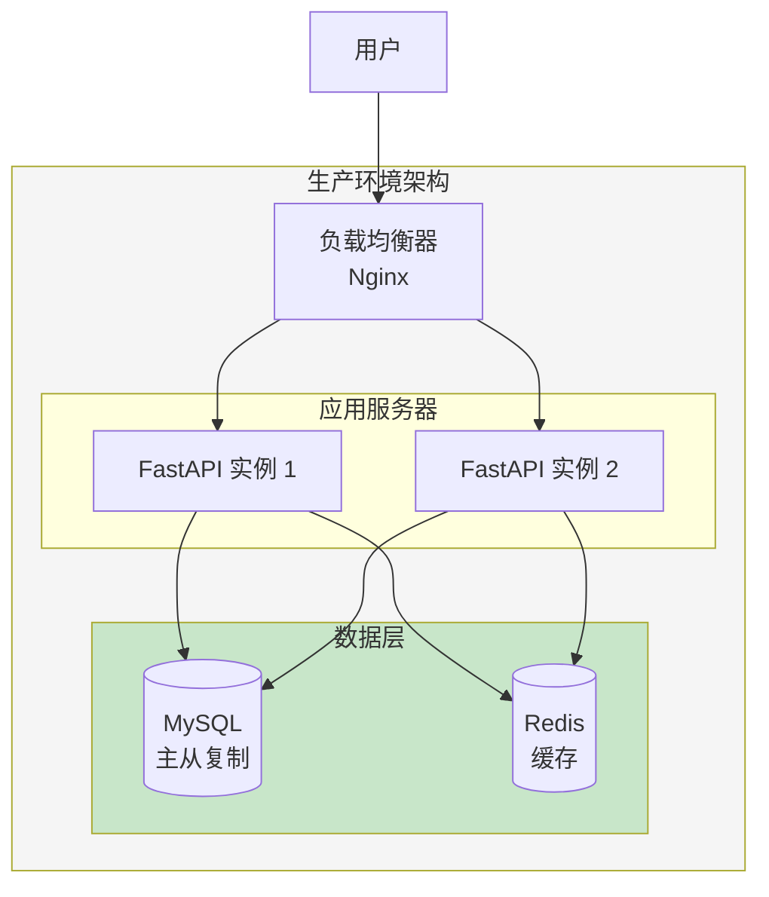

# 部署与监控

> 让记账系统稳定运行在生产环境

## 📋 本章目标

- [ ] 理解部署流程
- [ ] 掌握 Docker 容器化
- [ ] 配置日志和监控
- [ ] 实现自动化部署

## 🎯 部署架构



## 🐳 Docker 容器化

### Dockerfile

```dockerfile
# Dockerfile
FROM python:3.11-slim

# 设置工作目录
WORKDIR /app

# 安装依赖
COPY requirements.txt .
RUN pip install --no-cache-dir -r requirements.txt

# 复制代码
COPY . .

# 创建非 root 用户
RUN useradd -m appuser && chown -R appuser:appuser /app
USER appuser

# 暴露端口
EXPOSE 8000

# 启动命令
CMD ["uvicorn", "main:app", "--host", "0.0.0.0", "--port", "8000"]
```

### Docker Compose

```yaml
# docker-compose.yml
version: '3.8'

services:
  # FastAPI 应用
  api:
    build: .
    ports:
      - "8000:8000"
    environment:
      - DATABASE_URL=mysql+pymysql://root:password@db:3306/bookkeeping
      - REDIS_URL=redis://redis:6379/0
      - SECRET_KEY=${SECRET_KEY}
    depends_on:
      - db
      - redis
    volumes:
      - ./app:/app/app
    restart: unless-stopped

  # MySQL 数据库
  db:
    image: mysql:8.0
    environment:
      - MYSQL_ROOT_PASSWORD=password
      - MYSQL_DATABASE=bookkeeping
    volumes:
      - mysql_data:/var/lib/mysql
      - ./sql/init.sql:/docker-entrypoint-initdb.d/init.sql
    ports:
      - "3306:3306"
    restart: unless-stopped

  # Redis 缓存
  redis:
    image: redis:7-alpine
    volumes:
      - redis_data:/data
    ports:
      - "6379:6379"
    restart: unless-stopped

  # Nginx 反向代理
  nginx:
    image: nginx:alpine
    ports:
      - "80:80"
      - "443:443"
    volumes:
      - ./nginx.conf:/etc/nginx/nginx.conf
      - ./ssl:/etc/nginx/ssl
    depends_on:
      - api
    restart: unless-stopped

volumes:
  mysql_data:
  redis_data:
```

### Nginx 配置

```nginx
# nginx.conf
events {
    worker_connections 1024;
}

http {
    upstream api {
        server api:8000;
    }

    server {
        listen 80;
        server_name example.com;

        # 重定向到 HTTPS
        return 301 https://$server_name$request_uri;
    }

    server {
        listen 443 ssl;
        server_name example.com;

        ssl_certificate /etc/nginx/ssl/cert.pem;
        ssl_certificate_key /etc/nginx/ssl/key.pem;

        # 安全配置
        ssl_protocols TLSv1.2 TLSv1.3;
        ssl_ciphers HIGH:!aNULL:!MD5;

        # API 代理
        location /api/ {
            proxy_pass http://api/;
            proxy_set_header Host $host;
            proxy_set_header X-Real-IP $remote_addr;
            proxy_set_header X-Forwarded-For $proxy_add_x_forwarded_for;
            proxy_set_header X-Forwarded-Proto $scheme;
        }

        # 静态文件
        location /static/ {
            alias /app/static/;
            expires 30d;
        }

        # 健康检查
        location /health {
            proxy_pass http://api/health;
        }
    }
}
```

## 📊 日志系统

### 日志配置

```python
# core/logging.py
import logging
from logging.handlers import RotatingFileHandler
import sys

def setup_logging():
    """配置日志"""

    # 日志格式
    formatter = logging.Formatter(
        '%(asctime)s - %(name)s - %(levelname)s - %(message)s'
    )

    # 控制台处理器
    console_handler = logging.StreamHandler(sys.stdout)
    console_handler.setFormatter(formatter)

    # 文件处理器（自动滚动）
    file_handler = RotatingFileHandler(
        'logs/app.log',
        maxBytes=10 * 1024 * 1024,  # 10MB
        backupCount=5
    )
    file_handler.setFormatter(formatter)

    # 配置根日志
    root_logger = logging.getLogger()
    root_logger.setLevel(logging.INFO)
    root_logger.addHandler(console_handler)
    root_logger.addHandler(file_handler)

    # 配置特定模块日志级别
    logging.getLogger("uvicorn").setLevel(logging.INFO)
    logging.getLogger("sqlalchemy.engine").setLevel(logging.WARNING)

# main.py
from core.logging import setup_logging

setup_logging()
```

### 结构化日志

```python
# core/structured_logging.py
import logging
import json
from datetime import datetime

class StructuredFormatter(logging.Formatter):
    """结构化日志格式器"""

    def format(self, record):
        log_data = {
            'timestamp': datetime.utcnow().isoformat(),
            'level': record.levelname,
            'logger': record.name,
            'message': record.getMessage(),
            'module': record.module,
            'function': record.funcName,
            'line': record.lineno
        }

        # 添加额外字段
        if hasattr(record, 'user_id'):
            log_data['user_id'] = record.user_id
        if hasattr(record, 'request_id'):
            log_data['request_id'] = record.request_id

        if record.exc_info:
            log_data['exception'] = self.formatException(record.exc_info)

        return json.dumps(log_data)

# 使用
logger = logging.getLogger(__name__)

def log_with_context(user_id: int, message: str):
    """带上下文的日志"""
    logger.info(
        message,
        extra={'user_id': user_id}
    )
```

## 📈 监控系统

### 健康检查端点

```python
# routers/health.py
from fastapi import APIRouter, Response
from datetime import datetime

router = APIRouter(tags=["健康检查"])

@router.get("/health")
def health_check():
    """健康检查"""
    return {
        "status": "healthy",
        "timestamp": datetime.utcnow().isoformat()
    }

@router.get("/health/detailed")
def detailed_health_check(db: Session = Depends(get_db)):
    """详细健康检查"""
    checks = {
        "api": "healthy",
        "database": "unknown",
        "redis": "unknown"
    }

    # 检查数据库
    try:
        db.execute("SELECT 1")
        checks["database"] = "healthy"
    except Exception as e:
        checks["database"] = f"unhealthy: {str(e)}"

    # 检查 Redis
    try:
        redis_client.ping()
        checks["redis"] = "healthy"
    except Exception as e:
        checks["redis"] = f"unhealthy: {str(e)}"

    # 判断整体状态
    all_healthy = all(v == "healthy" for v in checks.values())
    status_code = 200 if all_healthy else 503

    return Response(
        content=json.dumps({
            "status": "healthy" if all_healthy else "unhealthy",
            "checks": checks,
            "timestamp": datetime.utcnow().isoformat()
        }),
        status_code=status_code,
        media_type="application/json"
    )
```

### Prometheus 指标

```python
# core/metrics.py
from prometheus_client import Counter, Histogram, Gauge
from prometheus_fastapi_instrumentator import Instrumentator

# 自定义指标
REQUEST_COUNT = Counter(
    'http_requests_total',
    'Total HTTP requests',
    ['method', 'endpoint', 'status']
)

REQUEST_LATENCY = Histogram(
    'http_request_duration_seconds',
    'HTTP request latency',
    ['method', 'endpoint']
)

ACTIVE_USERS = Gauge(
    'active_users_total',
    'Number of active users'
)

# 在 main.py 中启用
from prometheus_fastapi_instrumentator import Instrumentator

app = FastAPI()

# 启用 Prometheus 指标
Instrumentator().instrument(app).expose(app)
```

## 🚀 CI/CD 自动化

### GitHub Actions

```yaml
# .github/workflows/deploy.yml
name: Deploy

on:
  push:
    branches: [main]

jobs:
  test:
    runs-on: ubuntu-latest
    steps:
      - uses: actions/checkout@v3

      - name: Set up Python
        uses: actions/setup-python@v4
        with:
          python-version: '3.11'

      - name: Install dependencies
        run: |
          pip install -r requirements.txt
          pip install pytest pytest-cov

      - name: Run tests
        run: |
          pytest --cov=app tests/

      - name: Upload coverage
        uses: codecov/codecov-action@v3

  build:
    needs: test
    runs-on: ubuntu-latest
    steps:
      - uses: actions/checkout@v3

      - name: Build Docker image
        run: |
          docker build -t bookkeeping-api:${{ github.sha }} .

      - name: Push to registry
        run: |
          echo ${{ secrets.DOCKER_PASSWORD }} | docker login -u ${{ secrets.DOCKER_USERNAME }} --password-stdin
          docker push bookkeeping-api:${{ github.sha }}

  deploy:
    needs: build
    runs-on: ubuntu-latest
    steps:
      - name: Deploy to server
        uses: appleboy/ssh-action@master
        with:
          host: ${{ secrets.SERVER_HOST }}
          username: ${{ secrets.SERVER_USER }}
          key: ${{ secrets.SSH_KEY }}
          script: |
            cd /app/bookkeeping
            docker-compose pull
            docker-compose up -d
            docker image prune -f
```

## 📝 练习任务

1. **配置生产环境** - 搭建完整的 Docker 部署环境
2. **添加监控告警** - 配置 Prometheus + Grafana
3. **实现蓝绿部署** - 零停机部署策略

## ✅ 检查点

- [ ] 理解部署架构设计
- [ ] 掌握 Docker 容器化
- [ ] 配置日志系统
- [ ] 实现健康检查
- [ ] 搭建 CI/CD 流水线

---

## 🎓 课程总结

恭喜你完成了整个后端开发实战教程！通过这个教程，你已经：

1. **掌握了 Python 后端基础** - Python 语法、异步编程、类型系统
2. **学会了 FastAPI 框架** - 路由、依赖注入、Pydantic 验证、RESTful 设计
3. **理解了数据库操作** - SQL 基础、SQLAlchemy ORM、数据模型设计
4. **实现了完整功能** - 认证授权、性能优化、安全防护
5. **学会了工程实践** - 代码重构、部署监控

接下来，你可以：
- 继续完善记账系统的功能
- 学习更多后端技术（微服务、消息队列等）
- 贡献开源项目，积累经验

祝你成为优秀的后端工程师！🚀
